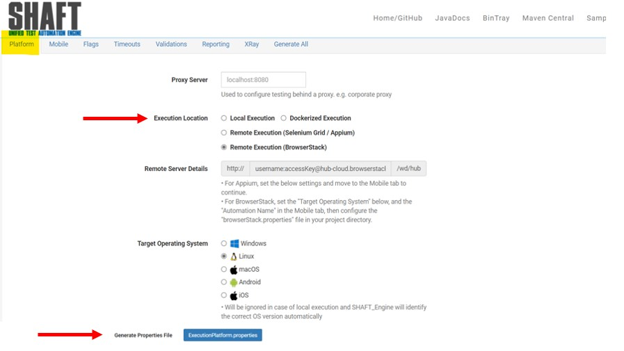
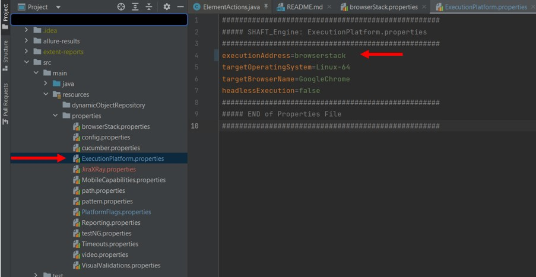
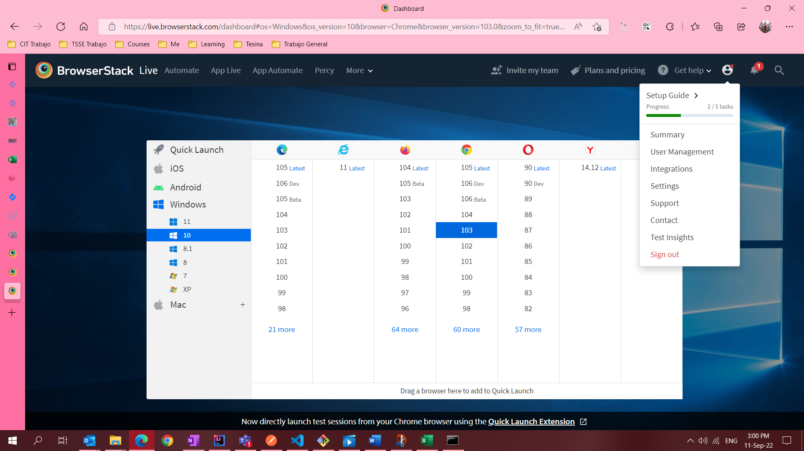
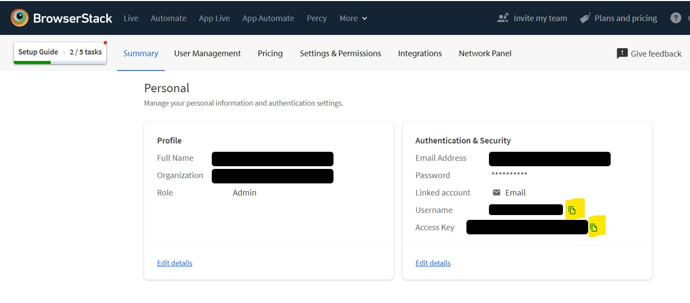
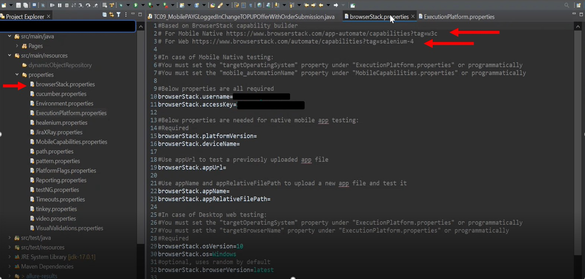
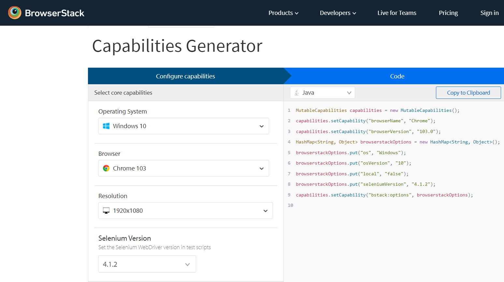
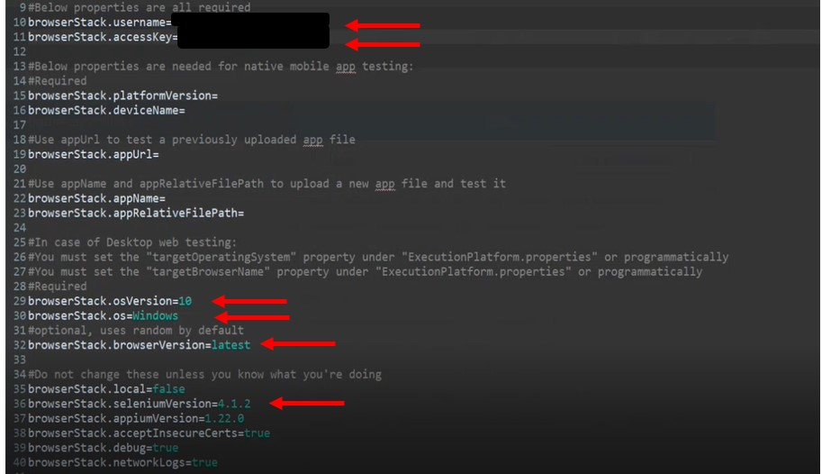
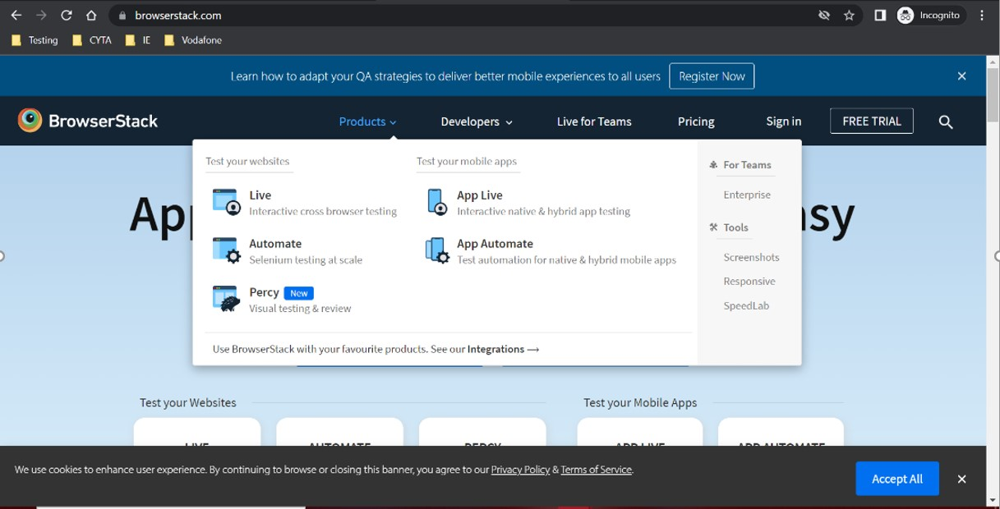
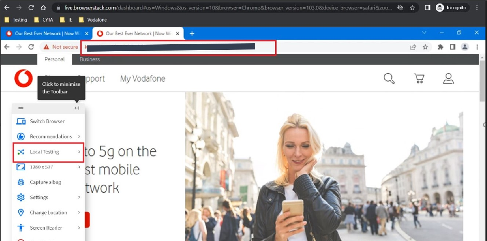
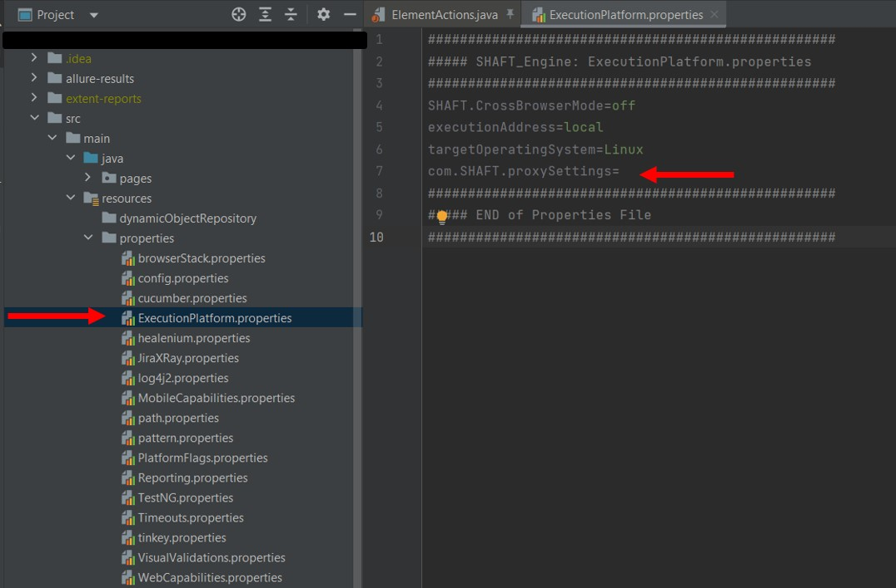

## 1. Remote Execution (BrowserStack)

We can run any script using Shaft Engine via Browser stack only by setting some configurations that we can make from different locations: 

* ### Through configuration manager:

By openeing the **_Platform_** tab on [Configuration Manager](https://shafthq.github.io/SHAFT_ENGINE/ "Configuration Manager"), you can change the excution location as explained in the image below and then save the file and replace the corresponding configuration file in your project. Please note that once you select Remote Execution (BrowserStack) from Execution Location, the value of *_Remote Server Details_* will be filled automatically. 



* ### Through properties files:

For Web scripts, by openning the **_ExecutionPlatform.properties_** file you can change the value of **_executionAddress_** to be **_browserstack_**



##### Set the username and access key:

* Go to **_https://www.browserstack.com/users/sign_in_** and put the business e-mail and password then click **_Sign Me In_**


* Go to the **_Summary_** section 



* Copy the access key value:



##### Browserstack properties:

Browser stack itself provides its own configuration manager via the configuration file **_browserStack.properties_** in which we can find the proper configuration and proper URLs to execute scripts on web or on mobile platfrom. As explained in the below image.



### 1.1. To execute in web platform:

* #### Through configuration manager:

By openeing the **_Platform_** tab on [Configuration Manager](https://shafthq.github.io/SHAFT_ENGINE/ "Configuration Manager"), after selecting the **_Remote Execution (BrowserStack)_**, select the **_Target Operating System_** then save the file and replace the corresponding configuration file in your project. 


* #### Through properties files:

For Web scripts, by openning the **_ExecutionPlatform.properties_** file you can change the value of **_targetOperatingSystem_** to be **_windows-64_**, **_linux-64_**, etc. 


##### Set the capabilities on browser stack configuration manager:

* Go the Web URL: **_https://www.browserstack.com/automate/capabilities?tag=selenium-4_** to set the username and access key that we got from the previous steps and set the main capabilities from the **_Configure capabilities_** Section on the left select the target of the **_Opertaing System_**, the **_Browser_**, the **_Resolution_** and the **_Selenium Version_**. Once these fields are filled, the **_Code_** section will be filled automatically as explained in the below image. 



* Go back to **_browserStack.properties_** file to set the Operating system and its version, the browser version and the selenium version. Please pay attention to make the correct mapping as all these fields are case sensitive.



### 1.2. To execute in mobile platform:

* #### Through configuration manager:

By openeing the **_Platform_** tab on [Configuration Manager](https://shafthq.github.io/SHAFT_ENGINE/ "Configuration Manager"), after selecting the **_Remote Execution (BrowserStack)_**, select the **_Target Operating System_** then save the file and replace the corresponding configuration file in your project. 


* #### Through properties files:

For Web scripts, by openning the **_ExecutionPlatform.properties_** file you can change the value of **_targetOperatingSystem_** to be **_Android_** or **_iOS_**. 


##### Set the capabilities on browser stack configuration manager:

* Go the Web URL: **_https://www.browserstack.com/app-automate/capabilities?tag=w3c_** to set the username and access key that we got from the previous steps and set the main capabilities from the **_Configure capabilities_** Section on the left select the target of the **_Platform Name_**, the **_Device Name_** and the **_Application (.apk /.aab)_**. Once these fields are filled, the **_Code_** section will be filled automatically as explained in the below image. 

 Note that for the **_Application (.apk /.aab)_**, we have to pass our apk path to be make a post request to browserstack to upload the apk and recieve the response that will be on the console. We have to do that only for the first time in which we execute our suite or everytime we execute our suite on different versions.


* Go back to **_browserStack.properties_** file to set the Operating system and its version, the android/ios version , the device name and the appium version. Please pay attention to make the correct mapping as all these fields are case sensitive.


##### Execute the session live:

To see the live execution, whatever you are executing on web or mobile, just you need to go to **_https://automate.browserstack.com/dashboard/v2_** and then click on **_Automate_** and then we will find our execution results and all the related info. 


## 2. Local Execution (BrowserStack):

The main idea of using browser stack local is to enable us to deal with the system environments that could not be open without VPN because it will not be available too to deal with them via remote browser stack. SobrowserStack local software is routing the connections from our own connections. So accordingly, we can open our system environments on the remote devices, machines, browsers,... that we want to execute on. 

### 2.1. To configure local execution on browser stack manually:

There are some steps that we have to follow to be able to deal with browser stack local:

1. Connect on VPN. 
1. Connect on the manual proxy and adjust the IP and port according to the settings of the machine on which we need to connect.
1. Open browser stack local: 
    * First you need to download the Zip File and extract it:
    * For Windows: https://www.browserstack.com/browserstack-local/BrowserStackLocal-win32.zip 
    * For Mac: https://www.browserstack.com/browserstack-local/BrowserStackLocal-darwin-x64.zip 
    * For Linux: (we may need these for the CI/CD server): 
        1. https://www.browserstack.com/browserstack-local/BrowserStackLocal-linux-x64.zip 
        1. https://www.browserstack.com/browserstack-local/BrowserStackLocal-linux-ia32.zip 
    * Connect to the VPN and add the required manual proxy.
    * Go to the directory of the extracted browserStack.exe file and open a CMD/Terminal, then write the following command considering theses notes:
    1. Introduce the key as we explained above in the remote execution section. 
    2. Introduce the host and proxy according to the machine on which we want to execute. 

    This line is only for windows we should add for windows
        ```
        $ BrowserStackLocal.exe --key <your key> --proxy-host 10.74.120.115 --proxy-port 8080 --verbose 3 --force-proxy --debug-utility
        ```
    And for macOS /Linux it should be
        ```
        cd to PATH-to-your-BrowserStackLocal-Directory
        ```
    Then
        ```
        ./BrowserStackLocal --key <your key> --proxy-host 10.74.120.115 --proxy-port 8080 --verbose 3 --force-proxy --debug-utility
        ```
    
     * Open a browser and go to “http://localhost:45454/” to check If Browser Stack locally opened or not and you should see the following screenshot:
    
    * Go to “https://www.browserstack.com/” and select live from products at the navigation-bar after you login with your account using the same key used before.
    
    * Now we can see a of different Operating Systems and Browsers/Devices. So we can select the target OS (Operating System) and the target device that we want as shown in the below screenshot: 
    
    * Then we can copy the URL that we want to deal with and open it. Then we need to make sure that Local Testing toggle is enabled.

       

### 2.2. Confguration of local execution on browser stack using SHAFT:

We can run any script using Shaft Engine via Browser stack locally only by setting some configurations as mentioned below

* #### Through properties files:

For Web scripts, by openning the **_ExecutionPlatform.properties_** file you can change the value of **_com.SHAFT.proxySettings_** to include **_the port and the host_**



##### Set the username and access key:

* Go to **_https://www.browserstack.com/users/sign_in_** and put the business e-mail and password then click **_Sign Me In_**


* Go to the **_Summary_** section 


* Copy the access key value:


##### Browserstack properties:

Browser stack itself provides its own configuration manager via the configuration file **_browserStack.properties_** in which we can find the proper configuration and proper URLs to execute scripts on web or on mobile platfrom. In addition we have to set the value **_browserStack.local_** to be **_true_** As explained in the below image. 


Note that local browser stack opens the URL in untrusted mood so we have to add these logs to accept the certificate: 

        ```
        browserStack.setAcceptUntrustedCertificates=true
        browserStack.setAssumeUntrustedCertificateIssuer=false
        browserStack.acceptSslCerts=true    
        ```


### 2.2.1. To execute in web platform:

* #### Through configuration manager:

By openeing the **_Platform_** tab on [Configuration Manager](https://shafthq.github.io/SHAFT_ENGINE/ "Configuration Manager"), after selecting the **_Remote Execution (BrowserStack)_**, select the **_Target Operating System_** then save the file and replace the corresponding configuration file in your project. 


* #### Through properties files:

For Web scripts, by openning the **_ExecutionPlatform.properties_** file you can change the value of **_targetOperatingSystem_** to be **_windows-64_**, **_linux-64_**, etc. 


##### Set the capabilities on browser stack configuration manager:

* Go the Web URL: **_https://www.browserstack.com/automate/capabilities?tag=selenium-4_** to set the username and access key that we got from the previous steps and set the main capabilities from the **_Configure capabilities_** Section on the left select the target of the **_Opertaing System_**, the **_Browser_**, the **_Resolution_** and the **_Selenium Version_**. Once these fields are filled, the **_Code_** section will be filled automatically as explained in the below image. 


* Go back to **_browserStack.properties_** file to set the Operating system and its version, the browser version and the selenium version. Please pay attention to make the correct mapping as all these fields are case sensitive.


### 2.2.2. To execute in mobile platform:

* #### Through configuration manager:

By openeing the **_Platform_** tab on [Configuration Manager](https://shafthq.github.io/SHAFT_ENGINE/ "Configuration Manager"), after selecting the **_Remote Execution (BrowserStack)_**, select the **_Target Operating System_** then save the file and replace the corresponding configuration file in your project. 


* #### Through properties files:

For Web scripts, by openning the **_ExecutionPlatform.properties_** file you can change the value of **_targetOperatingSystem_** to be **_Android_** or **_iOS_**. 


##### Set the capabilities on browser stack configuration manager:

* Go the Web URL: **_https://www.browserstack.com/app-automate/capabilities?tag=w3c_** to set the username and access key that we got from the previous steps and set the main capabilities from the **_Configure capabilities_** Section on the left select the target of the **_Platform Name_**, the **_Device Name_** and the **_Application (.apk /.aab)_**. Once these fields are filled, the **_Code_** section will be filled automatically as explained in the below image. 

 Note that for the **_Application (.apk /.aab)_**, we have to pass our apk path to be make a post request to browserstack to upload the apk and recieve the response that will be on the console. We have to do that only for the first time in which we execute our suite or everytime we execute our suite on different versions.


* Go back to **_browserStack.properties_** file to set the Operating system and its version, the android/ios version , the device name and the appium version. Please pay attention to make the correct mapping as all these fields are case sensitive.


##### Execute the session live:

To see the live execution, whatever you are executing on web or mobile, just you need to go to **_https://automate.browserstack.com/dashboard/v2_** and then click on **_Automate_** and then we will find our execution results and all the related info. 


