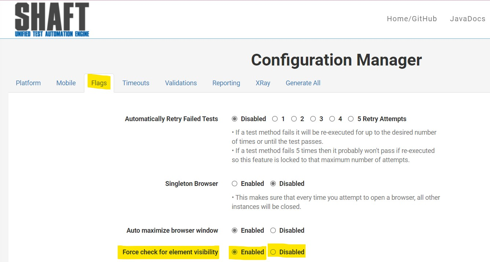
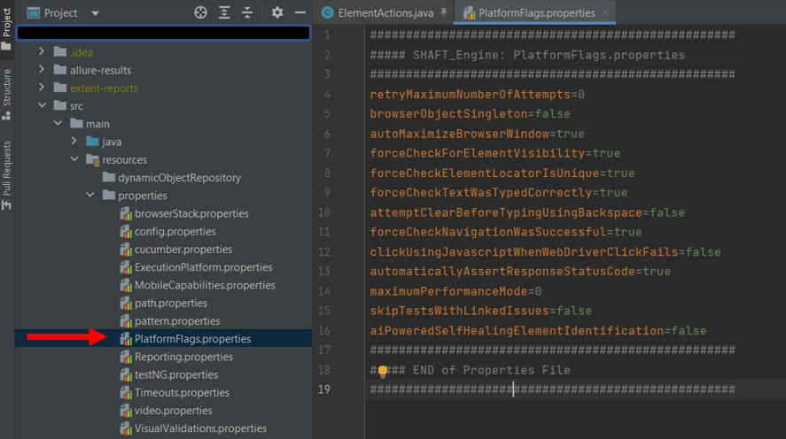
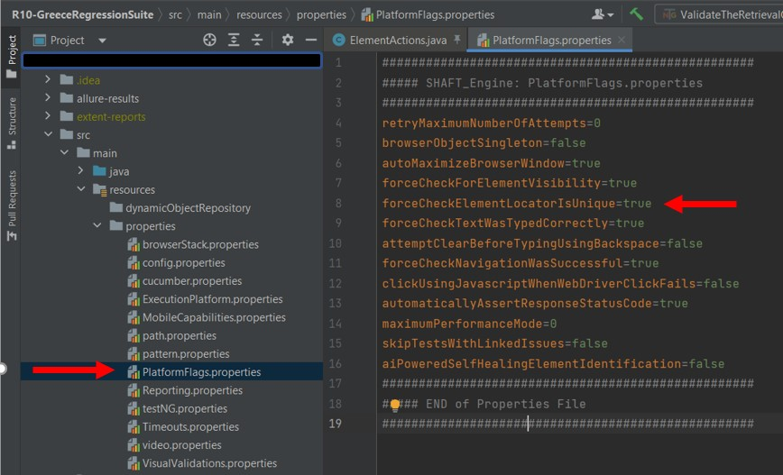
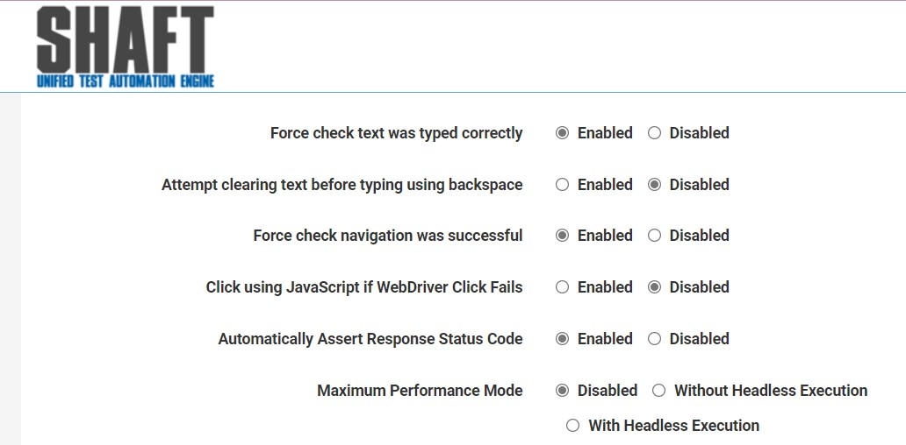
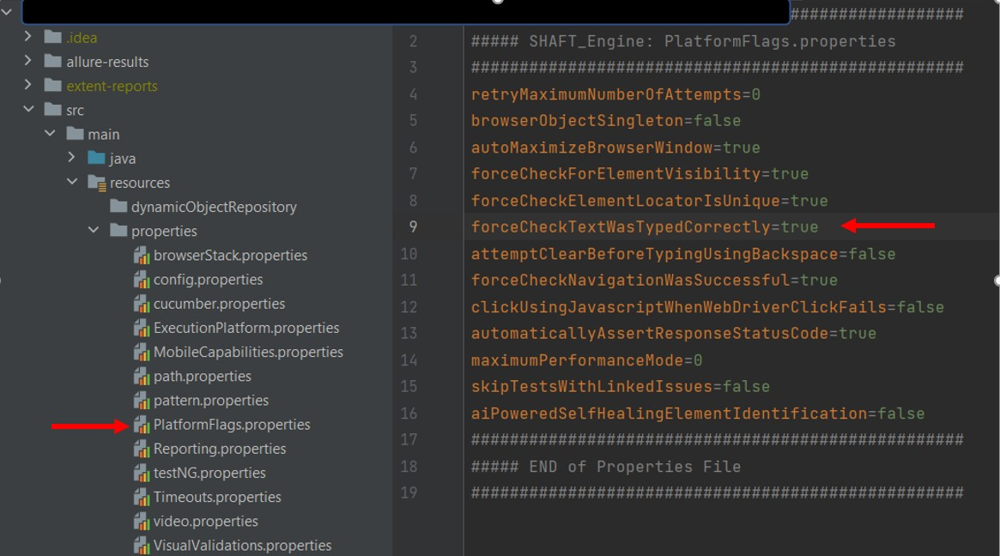

### Force check for element visibility

By default SHAFT engine is running some checks in all the elements; one of theses checks is to check if the element is visible or not before dealing with it. By default this feature is enabled. 

You can change this default feature from 2 locations:

* #### Through configuration manager:

By openeing the **_ Flags _** tab on the [Configuration Manager](https://shafthq.github.io/SHAFT_ENGINE/ "Configuration Manager"), you can change the default configuration of **_Force check for element visibility_** by checking on the radio button on **Enabled** or **Disabled** and then save the file and replace the corresponding config file in your project.

* #### Through properties files

By openning the **_PlatformFlags.properties_** file you can change the value of **_forceCheckForElementVisibility_** to be **ture** or **false**.

### Force check element locator is unique
By default SHAFT engine is checking that if the location of any element is uniquely existing. Otherwise, the test will fail informing us that the locator is not unique. 

You can change this default feature from 2 locations:

* #### Through configuration manager:

By openeing the **_ Flags _** tab on the [Configuration Manager](https://shafthq.github.io/SHAFT_ENGINE/ "Configuration Manager"), you can change the default configuration **_Force check element locator is unique_** by checking on the radio button on **Enabled** or **Disabled** and then save the file and replace the corresponding config file in your project.

* #### Through properties files

By openning the **_PlatformFlags.properties_** file you can change the value of **forceCheckElementLocatorIsUnique** to be **ture** or **false**.

### Force check text was typed correctly

By default SHAFT engine is checking that if any written  text is correctly typed or not. This feature is applicable in all text types except for the hidden texts in CSS files. This feature is enabled by default. In the case of having hidden texts and we have this feature enabled, the test will fail due to this error _The expected is "xyz" but ended up with "empty string"_. So it is highly recommended to _disable_ this feature when having hidden texts to avoid having failures in the execution of your tests. 

You can change this default feature from 2 locations:

* #### Through configuration manager:

By openeing the **_ Flags _** tab on the [Configuration Manager](https://shafthq.github.io/SHAFT_ENGINE/ "Configuration Manager"), you can change the default configuration **_Force check text was typed correctly_** by checking on the radio button on **Enabled** or **Disabled** and then save the file and replace the corresponding config file in your project.

* #### Through properties files

By openning the **_PlatformFlags.properties_** file you can change the value of **forceCheckTextWasTypedCorrectly** to be **ture** or **false**.

### Attempt clearing text before typing using backspace

This feature is created mainly for the hidden texts. By default Shaft is clearing the text box before typing a new text. But in case of having hidden text, the normal clear function will not be able to clear the hidden text. So this feature is created to be able to deal with the hidden text trying to get the size of the all the hidden text characters and clear all of them. So it is highly recommended to _disbale_ this feature in case of dealing with normal text to avoid the slow execution. In case of having hidden text is highly recommended to _enable_ this feature and _disable_ the _Force check text was typed correctly_ feature. 

You can change this default feature from 2 locations:

* #### Through configuration manager:

By openeing the **_ Flags _** tab on the [Configuration Manager](https://shafthq.github.io/SHAFT_ENGINE/ "Configuration Manager"), you can change the default configuration **_Attempt clearing text before typing using backspace_** by checking on the radio button on **Enabled** or **Disabled** and then save the file and replace the corresponding config file in your project.

* #### Through properties files

By openning the **_PlatformFlags.properties_** file you can change the value of **Attempt clearing text before typing using backspace** to be **ture** or **false**.

### Force check navigation was successful

Mainly, this feature is to check the navigation has been done successfully and correctly. In addition, is to consider the navigation timeout. So this feature enables us to wait untill the navigation is done correctly and to compare the current URL against the introduced URL. So this feature implicitly consider the other selenium waits so we can avoid get the failure of _failed to find the element_ while the real error is _failed to navigate_ due to navigation timeout.

You can change this default feature from 2 locations:

* #### Through configuration manager:

By openeing the **_ Flags _** tab on the [Configuration Manager](https://shafthq.github.io/SHAFT_ENGINE/ "Configuration Manager"), you can change the default configuration **_Force check navigation was successful_** by checking on the radio button on **Enabled** or **Disabled** and then save the file and replace the corresponding config file in your project.

* #### Through properties files

By openning the **_PlatformFlags.properties_** file you can change the value of **forceCheckNavigationWasSuccessful** to be **ture** or **false**.

### Click using JavaScript if WebDriver Click Fails

### Implicit Wait

### Implicit Wait Timeout

### Wait for Lazy Loading

### Lazy Loading Timeout

### Navigation Timeout

### Page Load Timeout

### Script Execution Timeout

### Element Identification Timeout

### Force check for element visibility

