### Integration: 

This feature allows us to report our test execution results and bugs. By default, SHAFT engine recommend keeping this feature disabled while creating/maintaining the automation scripts, to avoid reporting misleading results. Please note that if the integration property is disabled, the rest of XRay options will be disabled accordingly, regardless if they are enabled or disabled. 
Please note that the execution reporting feature is not linked to the bug reporting, So you can disable one of them or enable them both.

To enable this integration you can change that default property from 2 locations:

* #### Through configuration manager:

From the **_ XRay _** tab on the [Configuration Manager](https://shafthq.github.io/SHAFT_ENGINE/ "Configuration Manager"), you can change the default configuration of **_Integration_** by checking on the radio button on **Enabled** or **Disabled** and the other mandatory data then save the file and replace the corresponding config file in your project.

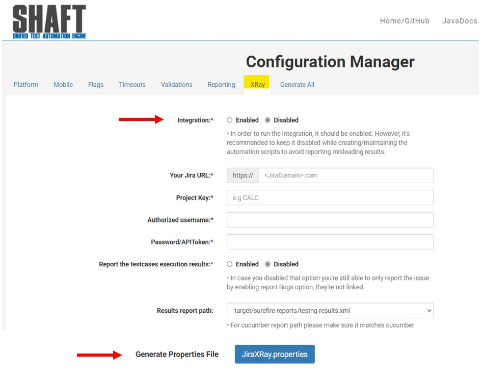

* #### Through properties files

By opening the **_JiraXRay.properties_** file you can change the value of **_jiraInteraction_** to be **ture** or **false**.

### Your Jira URL: 

Just we have to type our Jira URL. 

You can type the URL from 2 locations:

* #### Through configuration manager:

By opening the **_ XRay _** tab on the [Configuration Manager](https://shafthq.github.io/SHAFT_ENGINE/ "Configuration Manager"), you can change the default configuration of **_Your Jira URL_** by typing your Jira URL and the other mandatory data then save the file and replace the corresponding config file in your project.

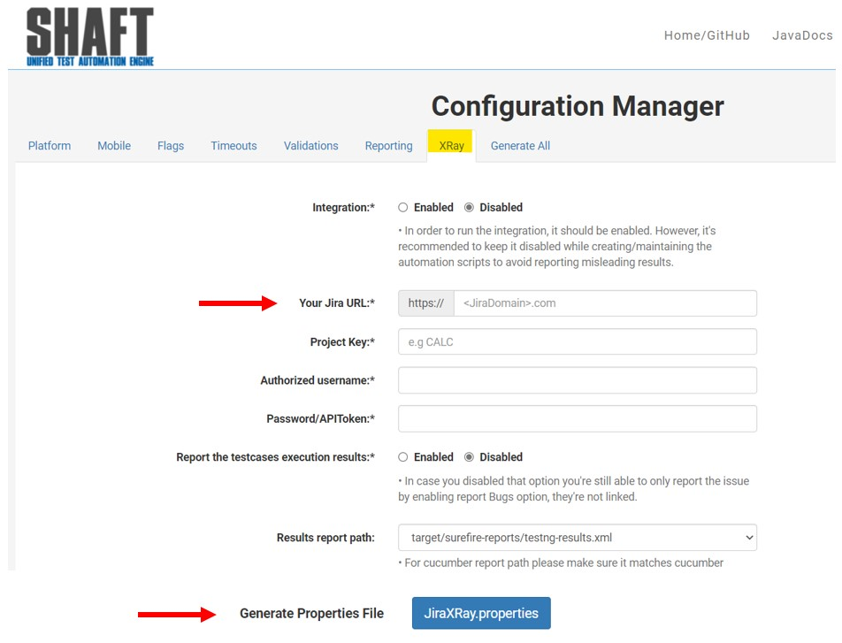

* #### Through properties files

By opening the **_JiraXRay.properties_** file you can type your Jira URL in the key of **_jiraUrl_** 

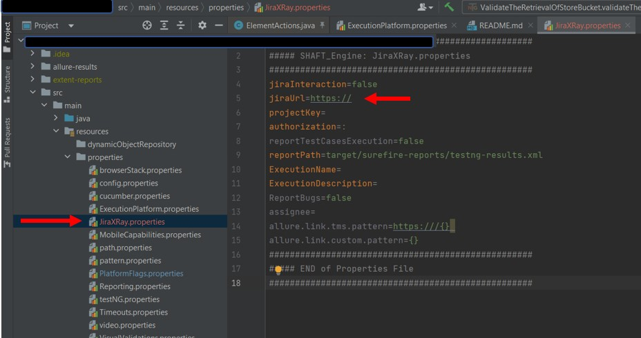

### Project Key: 

Just we have to type our Project Key _(Project Key is the prefix of any ticket number)_. 

You can type the Project Key from 2 locations:

* #### Through configuration manager:

By opening the **_ XRay _** tab on the [Configuration Manager](https://shafthq.github.io/SHAFT_ENGINE/ "Configuration Manager"), you can change the default configuration of **_Project Key_** by typing your Project Key Value and the other mandatory data then save the file and replace the corresponding config file in your project.

* #### Through properties files

By opening the **_JiraXRay.properties_** file you can type your Project Key Value in the key of **_projectKey_** 

### Authorized username: 

Just we have to type the username of your Jira/XRay account. 

You can type the authorized username from 2 locations:

* #### Through configuration manager:

By opening the **_ XRay _** tab on the [Configuration Manager](https://shafthq.github.io/SHAFT_ENGINE/ "Configuration Manager"), you can change the default configuration of **_Authorized username_** by typing your JIRA/XRay account username and the other mandatory data then save the file and replace the corresponding config file in your project.

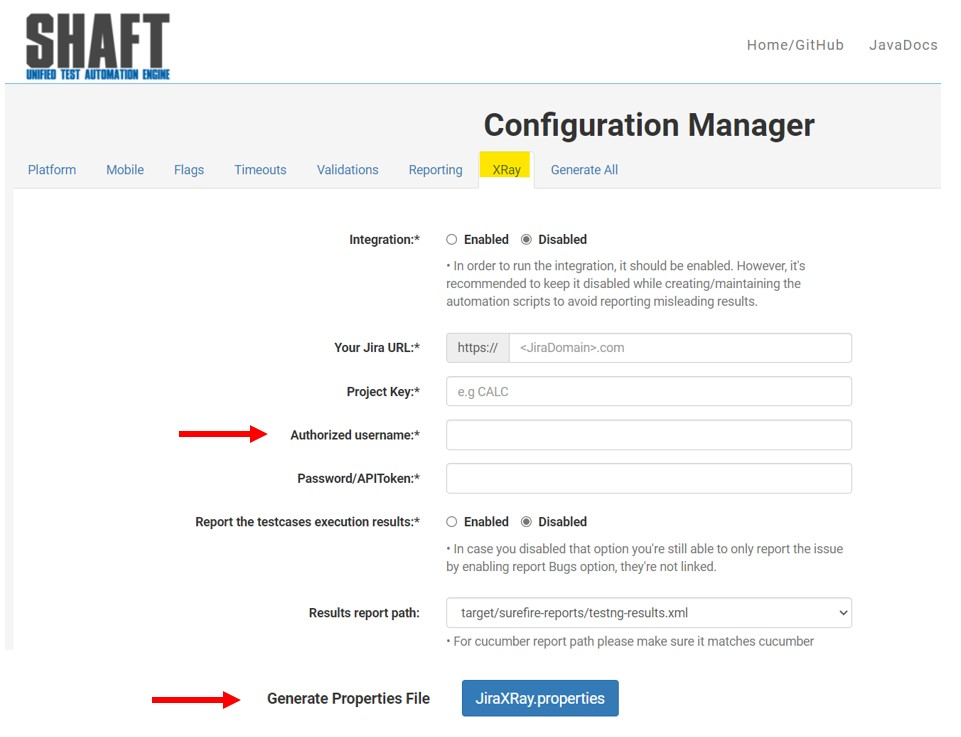

* #### Through properties files

By opening the **_JiraXRay.properties_** file you can type your JIRA/XRay account username value in the key of **_authorization_** before the colon.

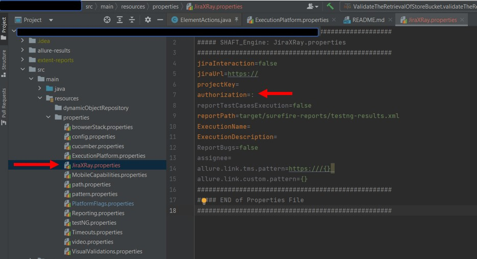

### Password/APIToken:

Just we have to type the password of jira account username. 

You can type the password from 2 locations:

* #### Through configuration manager:

By opening the **_ XRay _** tab on the [Configuration Manager](https://shafthq.github.io/SHAFT_ENGINE/ "Configuration Manager"), you can change the default configuration of **_Password/APIToken_** by typing the password or api-token of your JIRA/XRay account and the other mandatory data then save the file and replace the corresponding config file in your project.

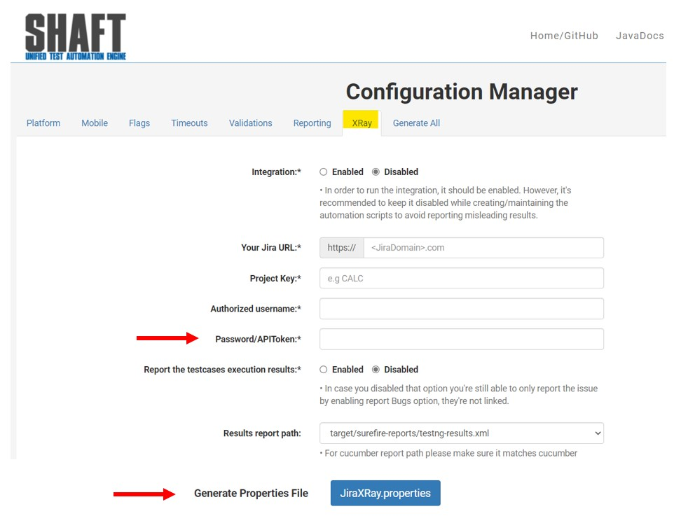

* #### Through properties files

By opening the **_JiraXRay.properties_** file you can type the password or api-token of your JIRA/XRay account in the key of **_authorization_** after the colon.

### Report the testcases execution results: 

This feature allows us to report automatically the results of the test execution.  

You can change this default feature from 2 locations:

* #### Through configuration manager:

By opening the **_ XRay _** tab on the [Configuration Manager](https://shafthq.github.io/SHAFT_ENGINE/ "Configuration Manager"), you can change the default configuration of **_Report the testcases execution results_** by checking on the radio button on **Enabled** or **Disabled** and the other mandatory data then save the file and replace the corresponding config file in your project.

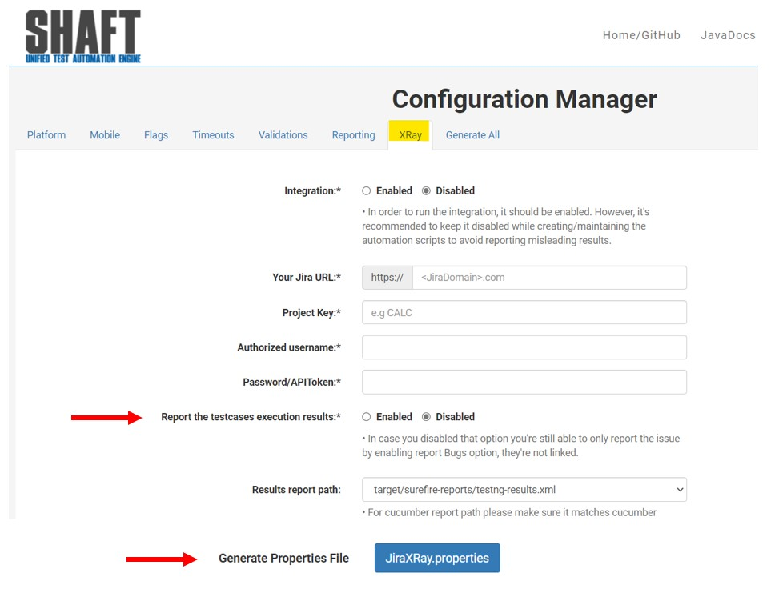

* #### Through properties files

By opening the **_JiraXRay.properties_** file you can change the value of **_reportTestCasesExecution_** to be **ture** or **false**.

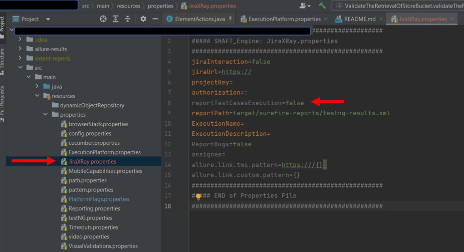

### Results report path: 

This key-value is for determining the execution report results path. It's mandatory if reporting execution feature is enabled. The generated report should be either **testng-results.xml** or **cucumber.json**.

You can change this default feature from 2 locations:

* #### Through configuration manager:

By opening the **_ XRay _** tab on the [Configuration Manager](https://shafthq.github.io/SHAFT_ENGINE/ "Configuration Manager"), in **_Results report path_** you can select from the dropdown menu your configured and generated result reporting path and the other mandatory data then save the file and replace the corresponding config file in your project.
Please note that the **_Configuration Manager_** is only providing the default path for both of the reports, but feel free to update the value with your reports' path using the properties file _(Steps mentioned below)_.

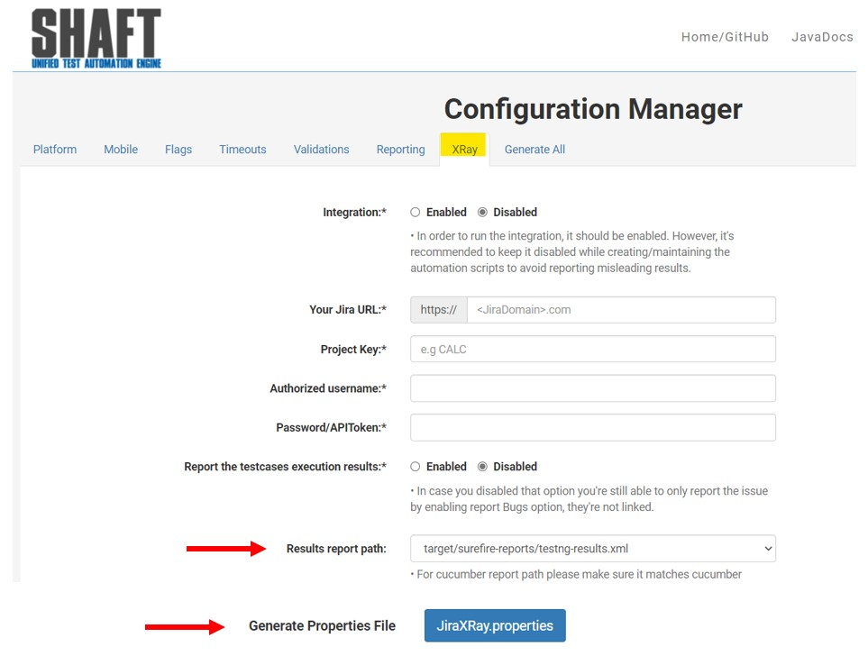

* #### Through properties files

By opening the **_JiraXRay.properties_** file you can type the path of **_reportPath_**.

### Execution suite name: 

This is an optional feature that allows us to give a name for your execution suite. Just we have to type the name that you want. 

You can type the execution suite name from 2 locations:

* #### Through configuration manager:

By opening the **_ XRay _** tab on the [Configuration Manager](https://shafthq.github.io/SHAFT_ENGINE/ "Configuration Manager"), you can change the default configuration of **_Execution suite name_** by typing the execution suite name save the file and replace the corresponding config file in your project.

* #### Through properties files

By opening the **_JiraXRay.properties_** file you can type your test execution name value in the key of **_ExecutionName_** before the colon.

### Execution description: 

This is an optional feature that allows us to give a description for your execution suite. Just we have to type the description that you want. 

You can type the execution suite description from 2 locations:

* #### Through configuration manager:

By opening the **_ XRay _** tab on the [Configuration Manager](https://shafthq.github.io/SHAFT_ENGINE/ "Configuration Manager"), you can change the default configuration of **_Execution description_** by typing the execution suite description and the other mandatory data then save the file and replace the corresponding config file in your project.

* #### Through properties files

By opening the **_JiraXRay.properties_** file you can type your test execution name value in the key of **_ExecutionDescription_** before the colon.

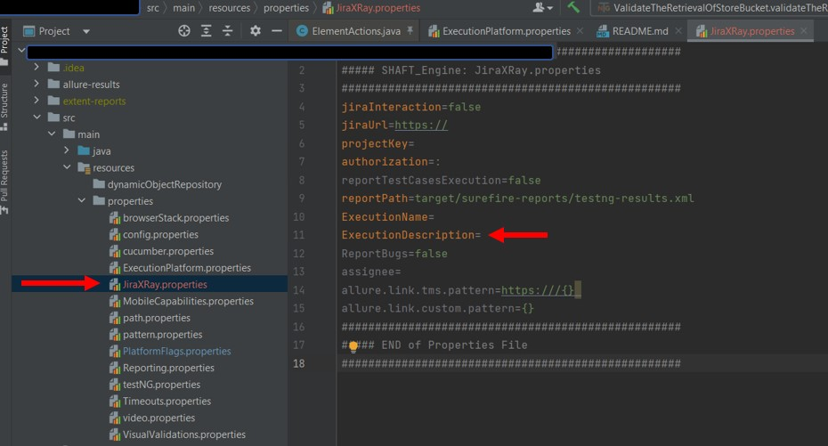

### Reporting Bugs: 

This feature allows us to report the detected issues from our execution. By default, SHAFT engine recommend keeping this feature disabled while creating/maintaining the automation scripts to avoid reporting misleading results. That is because enabling this option while tests are under maintenance might spam your jira board. the reporting will be done after each testcase run and bug will be created contains the execution attachments and log.

You can change this default feature from 2 locations:

* #### Through configuration manager:

By opening the **_ XRay _** tab on the [Configuration Manager](https://shafthq.github.io/SHAFT_ENGINE/ "Configuration Manager"), you can change the default configuration of **_Reporting Bugs_** by checking on the radio button on **Enabled** or **Disabled** and the other mandatory data then save the file and replace the corresponding config file in your project.

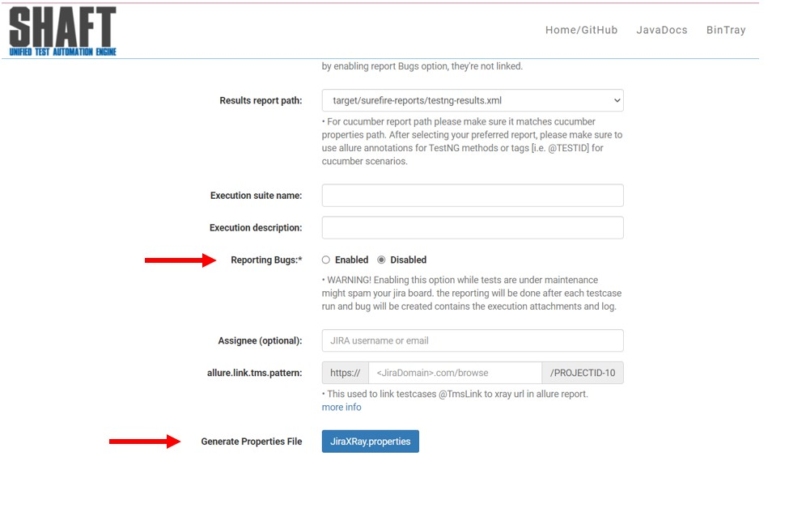

* #### Through properties files

By opening the **_JiraXRay.properties_** file you can change the value of **_ReportBugs_** to be **ture** or **false**.

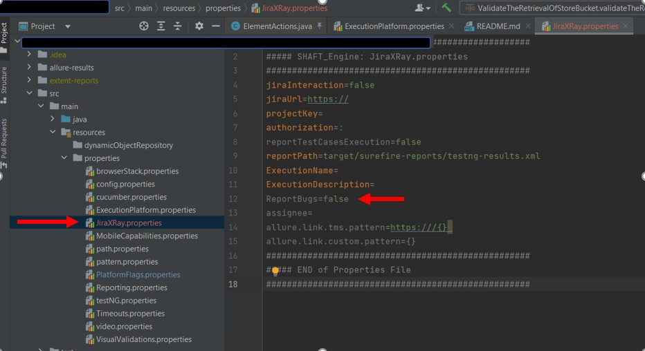

### Assignee:

This an optional feature that enables you to set the assignee for the created tickets [execution or bugs]. 

You can type the assignee account from 2 locations:

* #### Through configuration manager:

By opening the **_ XRay _** tab on the [Configuration Manager](https://shafthq.github.io/SHAFT_ENGINE/ "Configuration Manager"), you can change the default configuration of **_Assignee_** by typing the Jira user account to whom we want to assign the created tickets and the other mandatory data then save the file and replace the corresponding config file in your project.

* #### Through properties files

By opening the **_JiraXRay.properties_** file you can type the Jira user account to whom we want to assign the created tickets in the key of **_assignee_**.

### Allure.link.tms.pattern:

This feature enables you to autolink your Jira ticket, test case, user story or epic's link to the generated allure report. So we need to use tms annotation _@tms_ and to determine the pattern that allure must follow in order to build the ticket's link. Simply the pattern is the structure of your jira tickets before the /ProjectKey-TicketNumber.  

You can enable the allure.link.tms.pattern account from 2 locations:

* #### Through configuration manager:

By opening the **_ XRay _** tab on the [Configuration Manager](https://shafthq.github.io/SHAFT_ENGINE/ "Configuration Manager"), you can change the default configuration of **_allure.link.tms.pattern_** by typing the type the pattern to be able to generate the autolink and the other mandatory data then save the file and replace the corresponding config file in your project.

* #### Through properties files

By opening the **_JiraXRay.properties_** file you can type the pattern to be able to generate the autolink in the key of **_allure.link.tms.pattern_**.

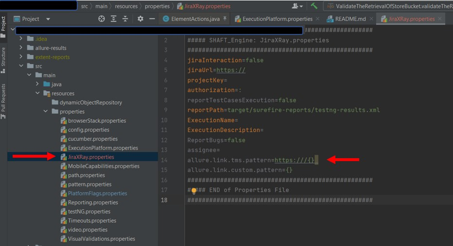

### Skip Tests With Linked Issues: 