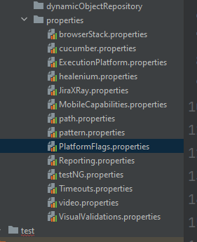
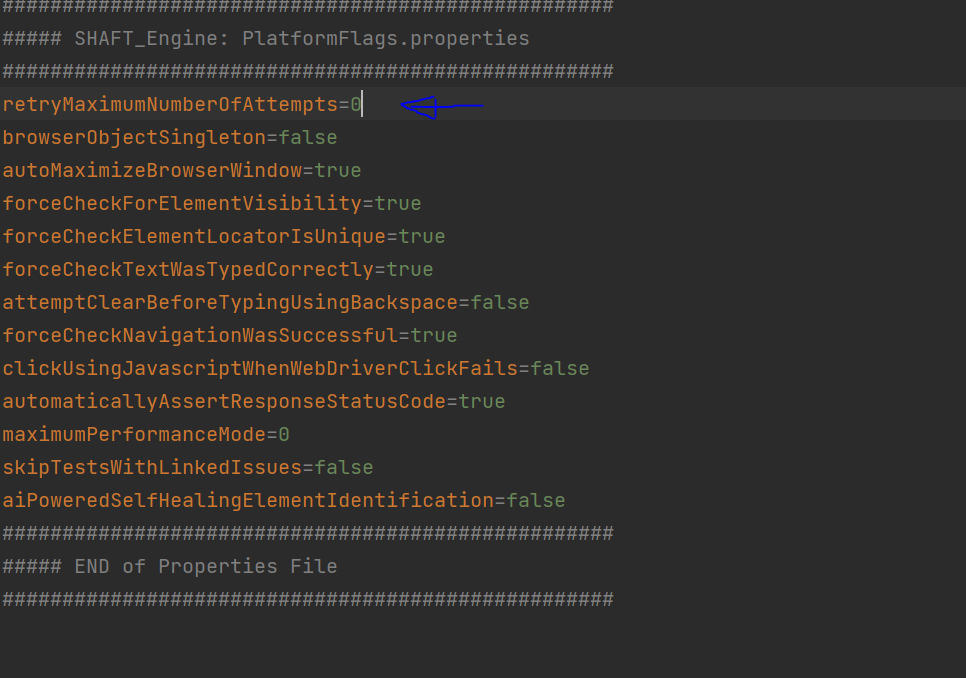

## Objective

If a test method fails it will be re-executed for up to the desired number of times or until the test passes.
 
<b>NOTE</b> : although you can configure the number of retries, it is recommended that the max number of retries is kept at 5.

## Implementaion

you can enable this feature one of two ways :

### through the configuration manager

by openeing the flags tab on the [Configuration Manager] you can enable the option <b>Automatically Retry Failed Tests</b> then save the propirity file and replace the existing one in the poject folder.

### through properties files

by openning the PlatformFlags.properties file in your project you can edit the property <b>retryMaximumNumberOfAttempts</b> with the maximun number of retries you would like.

[configuration manager]: https://mohabmohie.github.io/SHAFT_ENGINE/
