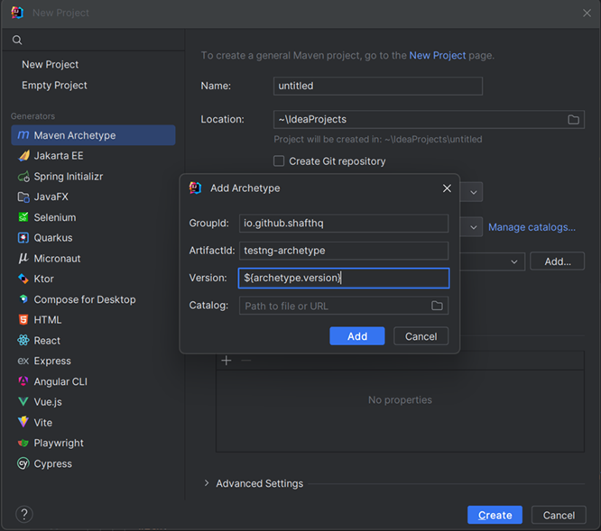

Now that you're hooked, the fastest way to set up a new sandbox and start experiencing SHAFT is using our TestNG Maven Archetype.
- You can do that by following this lovely **[IntelliJ IDEA guide]**.
  - Before you press `Create` you'll need to add the archetype first by using this data
  ```text
  GroupId: io.github.shafthq
  ArtifactId: testng-archetype
  Version: ${archetype.version}
  ```
  :::info[**Replace**]
  `${archetype.version}` with **[the latest SHAFT_Engine: TestNG Archetype version](https://github.com/ShaftHQ/testng-archetype/releases/latest)**.
  :::
  - It should look something like this
    


- Or you can do it manually by following these steps:
  1. [Download the latest version of mvn](https://maven.apache.org/download.cgi)
  2. [Add it to your PATH variable](https://maven.apache.org/install.html)
  3. Create a new directory for the project, and navigate to it.
  4. Open a Terminal window in the target directory and execute the below command.
    ```shell title="Generate a new SHAFT project"
    mvn archetype:generate "-DarchetypeGroupId=io.github.shafthq" "-DarchetypeArtifactId=testng-archetype" "-DarchetypeVersion=${archetype.version}" "-DinteractiveMode=false" "-DgroupId=io.github.shafthq" "-DartifactId=using_SHAFT_Engine"
    ```
:::info[**Replace**]
`${archetype.version}` with **[the latest SHAFT_Engine: TestNG Archetype version](https://github.com/ShaftHQ/testng-archetype/releases/latest)**.
:::
:::info[**Customize**]
`"-DgroupId=io.github.shafthq"` and `"-DartifactId=using_SHAFT_Engine"` with the groupId and artifactId that you want to use for the new project.
:::

[IntelliJ IDEA guide]: <https://www.jetbrains.com/help/idea/maven-support.html#maven_archetype>