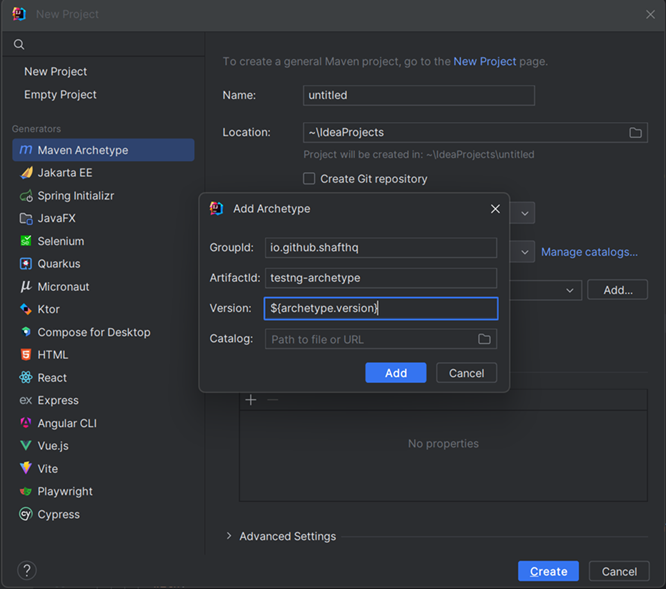

Now that you're hooked, here are two ways to set up a new sandbox and start experiencing SHAFT:

## Option 1: Interactive Project Generator (Recommended)

The easiest and most interactive way to create a new SHAFT project is using our **Project Generator**. This tool guides you through the project setup with a user-friendly interface.

The generator will help you:
- Choose your project type and testing framework
- Select dependencies and features
- Configure your project settings
- Generate a ready-to-use project structure

<iframe
  src="https://shafthq.github.io/SHAFT_ENGINE/resources/"
  width="100%"
  height="800px"
  style={{border: '1px solid #ccc', borderRadius: '8px'}}
  title="SHAFT Project Generator"
></iframe>

:::tip
If the generator doesn't load above, you can [open it in a new tab](https://shafthq.github.io/SHAFT_ENGINE/resources/).
:::

---

## Option 2: Maven Archetype

You can also set up a new SHAFT project using our TestNG Maven Archetype.
- You can do that by following this lovely **[IntelliJ IDEA guide]**.
  - Before you press `Create` you'll need to add the archetype first by using this data
  ```text
  GroupId: io.github.shafthq
  ArtifactId: testng-archetype
  Version: ${archetype.version}
  ```
  :::info[**Replace**]
  `${archetype.version}` with **[the latest SHAFT_Engine: TestNG Archetype version](https://github.com/ShaftHQ/testng-archetype/releases/latest)**.
  :::
  - It should look something like this
    


- Or you can do it manually by following these steps:
  1. [Download the latest version of mvn](https://maven.apache.org/download.cgi)
  2. [Add it to your PATH variable](https://maven.apache.org/install.html)
  3. Create a new directory for the project, and navigate to it.
  4. Open a Terminal window in the target directory and execute the below command.
    ```shell title="Generate a new SHAFT project"
    mvn archetype:generate "-DarchetypeGroupId=io.github.shafthq" "-DarchetypeArtifactId=testng-archetype" "-DarchetypeVersion=${archetype.version}" "-DinteractiveMode=false" "-DgroupId=io.github.shafthq" "-DartifactId=using_SHAFT_Engine"
    ```
:::info[**Replace**]
`${archetype.version}` with **[the latest SHAFT_Engine: TestNG Archetype version](https://github.com/ShaftHQ/testng-archetype/releases/latest)**.
:::
:::info[**Customize**]
`"-DgroupId=io.github.shafthq"` and `"-DartifactId=using_SHAFT_Engine"` with the groupId and artifactId that you want to use for the new project.
:::

[IntelliJ IDEA guide]: <https://www.jetbrains.com/help/idea/maven-support.html#maven_archetype>
---

## What's Next?

Now that you know how to create a project, choose your automation type:

- 🌐 [Set up a Web Project](./setup_web) - Browser automation with Selenium
- 📱 [Set up a Mobile Project](./setup_mobile) - Mobile app automation with Appium
- 🔌 [Set up an API Project](./setup_api) - REST API testing

---

[← Previous: Prerequisites](./first_steps_4) | [Next: Existing Projects →](./first_steps_6)
