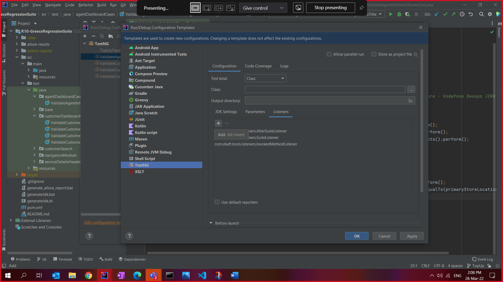
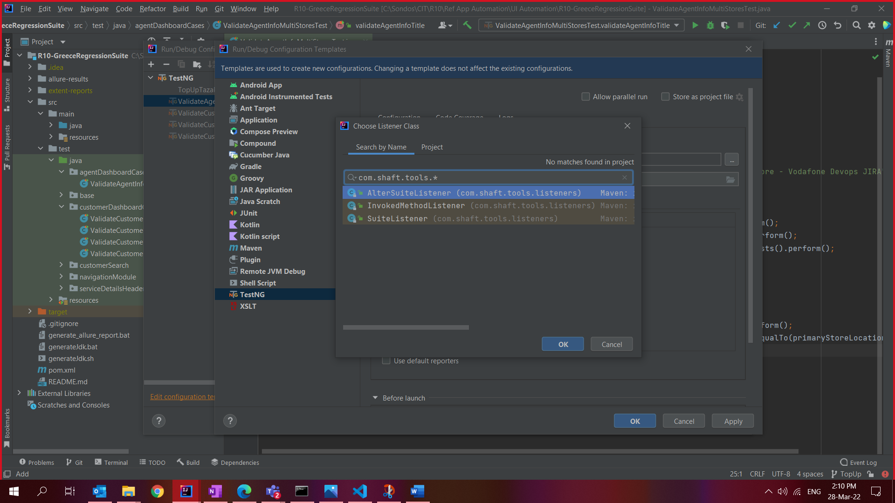

## IntelliJ

### Project Creation and configuring POM file

In order to use SHAFT ENGINE, after creating the project using the recommended JDK version. Please follow those steps : 
1 - Open the [using shaft engine repo](https://github.com/MohabMohie/using_SHAFT_ENGINE) 
2 - Open the POM.xml file and copy values from line 12 `<properties>` to the end of the file 
3 - Edit your project POM.xml file replacing the values starting from the same line `<properties>` to the end of the file. 
4- after the project indexes the new POM values add Shaft Listeners to your project  

### Adding SHAFT listeners

##### Follow these steps:

1. Click on **Run** dorpdown menu and then select **Edit Configuration**

2. Click on **Edit Configuration** button

3. Click on **TestNG** button

4. Click on the **+** icon

5. In the search box we have to type **com.shaft.tools.\*** then click on search icon. We have to add each of the following listeners by selecting each one of then and then click on **Ok** button

6. Click on **Apply** button and then on **Ok** button

### Debug issue

IntelliJ IDEA version 2021.3.1 and beyond might give exception error if you try to run in debug mode .In order to solve this issue go to this option windows : File -> Settings -> Build, Execution, Deployment -> Debugger -> Async Stack Traces and uncheck Instrumenting agent option.

## Eclipse

-   SHAFT uses [TestNG] for test management, thus you will need to install TestNG plugin.
-   TestNG plugin comes pre-installed with IntelliJ but needs to be installed if you are using Eclipse.

### TestNG Plugin Installation

-   Step #1: Once Eclipse is launched, click on Help and then Eclipse Marketplace. 
    

-   Step #2: A new window would open up, type “TestNG” in the Find text box and click on the Go button. 
    

-   Step #3: You will now see the search results with TestNG for Eclipse at the top. All you need to do now is click on the Install button next to it. 
    

-   Step #4: Resolving of features might take up a few minutes after which you need to verify that the checkbox for TestNG is checked and click on the Confirm button. 
    

-   Step #5: Accept the license and click on the Finish button. 
    

-   Notes:
    -   Eclipse might show a warning regarding the installation of unsigned software, choose install anyway. 
    -   For the change to be effective, Eclipse will prompt for a re-start, choose re-start now.

### Project Creation

[testng]: https://testng.org/doc/
