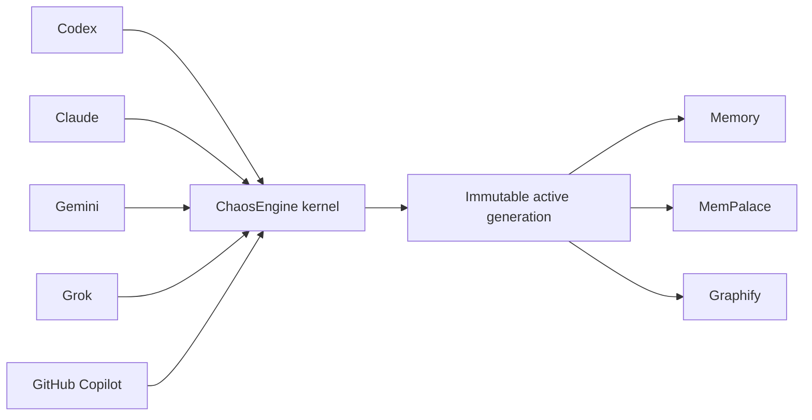

import {ChaosEngineOperatorCommands, ReflectionReceiptCommand} from '@site/src/components/DocSnippets';

# Install and operate ChaosEngine

ChaosEngine is SHAFT's project-local agent harness. It makes one canonical
skill the entrypoint for supported coding agents, installs the matching host
adapters, and provisions its tracked local tools without relying on a global
machine setup.

## Install from a terminal

Run the command for your operating system from the project root. The installer
prints its logo, current operation, completed and remaining work, elapsed time,
estimated remaining time, and every download to standard error. Its final
machine-readable JSON result remains the only standard-output record, so you
can redirect or parse it without stripping progress messages.

On macOS or Linux, run the default non-interactive install:

```bash
curl -fsSL https://raw.githubusercontent.com/ShaftHQ/SHAFT_ENGINE/main/chaos-engine/install.sh | bash -s -- https://raw.githubusercontent.com/ShaftHQ/SHAFT_ENGINE/main/chaos-engine/install.sh
```

Add `--interactive` to approve each bootstrap, source, runtime, package, Maven
Tools, and activation operation before it starts:

```bash
curl -fsSL https://raw.githubusercontent.com/ShaftHQ/SHAFT_ENGINE/main/chaos-engine/install.sh | bash -s -- https://raw.githubusercontent.com/ShaftHQ/SHAFT_ENGINE/main/chaos-engine/install.sh --interactive
```

On Windows PowerShell, run the default pipeline install:

```powershell
irm https://raw.githubusercontent.com/ShaftHQ/SHAFT_ENGINE/main/chaos-engine/install.ps1 | iex
```

For an interactive pipeline install, set the opt-in environment variable for
that command:

```powershell
$env:CHAOS_ENGINE_INTERACTIVE = "1"; irm https://raw.githubusercontent.com/ShaftHQ/SHAFT_ENGINE/main/chaos-engine/install.ps1 | iex; Remove-Item Env:CHAOS_ENGINE_INTERACTIVE
```

If you downloaded the script first, use its native switch instead:

```powershell
./install.ps1 -Interactive
```

Interactive mode accepts only `y` or `yes`, ignoring letter case. Any other
answer cancels before the named operation. If no controlling terminal is
available, the installer fails before its first network download. A cancelled
or failed operation never replaces the last verified installation.

When standard error is a terminal, the current status refreshes in place. In
CI or a redirected stream, every transition is a durable newline with no ANSI
animation.


## Give the install command to your agent

Open the SHAFT project that should receive the harness and give this command to
Codex, Claude, Grok, Gemini, or another coding agent:

```text
Install or upgrade ChaosEngine in this project from the latest commit of ShaftHQ/SHAFT_ENGINE main. Fetch and inspect https://raw.githubusercontent.com/ShaftHQ/SHAFT_ENGINE/main/chaos-engine/bootstrap.py, run it with Python 3, --project ., --repository ShaftHQ/SHAFT_ENGINE, and --branch main; then run Python 3 with .chaos-engine/install.py status --project . Do not stop until status reports the resolved 40-character commit and healthy core, host adapters, and local tools. Treat the installed ChaosEngine skill as the canonical harness and route existing agent guidance through it without deleting unrelated user content.
```

The agent chooses the available Python 3 command on Windows, macOS, or Linux.
It must inspect the bootstrap before running it and report any network or
permission boundary instead of bypassing it.

## Verify and upgrade

Run the operator commands from the project root. `status --json` and
`explain <event> --json` emit deterministic, secret-free schema v1 objects.
Use `explain` to inspect one normalized host event without executing it.

<ChaosEngineOperatorCommands />

Re-run the same agent install command to upgrade. The bootstrap resolves
`main` to an immutable commit, validates the downloaded archive, and records
its repository, branch, and commit provenance. If resolution, download,
validation, or tool setup fails, ChaosEngine preserves the last verified
installation.

The project may be a SHAFT Git checkout, another Git checkout, or a non-Git
folder. The bootstrap uses the configured SHAFT upstream and never infers it
from the consumer project's Git remote.

## Read health and ownership

Both `status` and `doctor` report each component's health with four capability
fields:

| Field | Values | Meaning |
|---|---|---|
| `owner` | `installer`, `project`, `user` | Who may change or remove the component |
| `scope` | `project`, `repository`, `user` | Where the component is shared |
| `lifecycle` | `receipt-owned`, `persistent-data`, `derived-single-writer`, `user-managed-cache` | How the component is maintained |
| `taskImpact` | `required`, `advisory`, `optional` | Whether its health affects ordinary task work |

Memory, MemPalace, and Graphify have advisory task impact. An ordinary task can
continue when any of them is missing, stale, corrupt, timed out, or
inaccessible. Use one scoped query only when it answers a concrete question,
verify any returned path against live files, and use targeted repository search
before deciding impact. Do not retry, repair, refresh, poll, or watch a store as
part of task completion.

Installation, upgrade, explicit maintenance, `status`, and `doctor` remain
strict. An unhealthy selected component makes requested `status` or `doctor`
health `recovery-required`. Advisory task impact does not weaken those operator
checks.

## Understand startup and retrieval

Session startup loads compact tracked locators, not full companion skill bodies.
Each SessionStart payload stays at or below 4 KiB, while aggregate always-loaded
guidance stays at or below 16 KiB. Startup never calls Memory, MemPalace, or
Graphify synchronously.

For ordinary work, ask Memory, MemPalace, or Graphify one bounded question only
when it can shorten the task. Verify every useful result against current files.
A missing, stale, timed-out, or inaccessible store becomes a non-blocking
degraded result; do not repair, refresh, poll, or retry it during the task.

## Follow the installed topology

All five host adapters normalize their native lifecycle events into one
provider-neutral kernel. Codex, Claude, Gemini, Grok, and GitHub Copilot keep
their native configuration shapes and preserve foreign handlers. Copilot CLI
hooks run live; Copilot cloud and IDE configuration receive static validation.



The installer provisions missing Memory, MemPalace, Graphify, uv, and managed
Python dependencies automatically. It repairs a damaged managed runtime by
building and verifying a complete candidate generation before switching the
active pointer. The prior verified generation remains available for rollback.
Foreign files and foreign host handlers stay outside installer ownership.

## Use the final-batch lifecycle

Complete implementation as one coherent batch. Do not run tests, reviews,
commits, or hooks after every edit. After the final scope commit, clear CI
failures, annotations, bot findings, and review comments in batches, then run
no more than two selected terminal adversarial reviews and consolidated tests.

Do not run final holistic acceptance until the exact pull request head is fully
green and no bot finding, comment, annotation, or review thread remains
unresolved. Map that acceptance to the approved plan and every closing ticket,
then arm merge-commit auto-merge immediately. A changed head or new remote
feedback makes the acceptance stale; unchanged state never triggers another
acceptance run.

## Respond to reflection checkpoints

ChaosEngine pauses implementation mutation after two attempted failures in one
task. Different failure fingerprints require task-level reflection; the same
fingerprint twice requires deep reflection. Read-only diagnosis, tracker
updates, and a changed diagnostic check remain available, but an unchanged
retry or third speculative fix does not.

Copy each hash after `Sanitized fingerprints:` in the checkpoint message. Use
the session token printed by the lifecycle hook to append the bounded receipt:

<ReflectionReceiptCommand />

On Windows, use `py -3` instead of `python3` and quote the JSON for your shell.
The receipt accepts bounded conclusions, not raw logs, prompts, credentials, or
host paths. Knowledge stores and GitHub remain optional for this local control
flow.

After more than one hour, finish implementation and delivery first. Then record
the terminal receipt and use these exact labels in the final summary:

- `elapsed estimate`
- `main time consumer`
- `repeated failures or corrections`
- `changed assumption or approach`
- `successful proof`
- `remaining risk or follow-up`
- `learning loop disposition`

Later work or failure invalidates an earlier terminal receipt.

## What gets installed

ChaosEngine installs and owns these project-local surfaces:

- the verified core and canonical skill under `.chaos-engine/`;
- native discovery adapters for Codex, Claude, Gemini, Copilot, and compatible
  agents;
- a private dependency runtime for the tracked Memory, MemPalace, Graphify,
  and supporting tools;
- receipts and transaction state used by status, repair, rollback, and
  uninstall.

It preserves unrelated project instructions, skills, configuration, and tool
entries. Its self-learning flow queues only privacy-screened, confirmed
lessons and contributes them upstream as reviewable GitHub issues, never as an
automatic pull request.

The optional Maven Tools MCP uses an immutable user-managed cache. Multiple
projects can reuse one verified JAR and receipt, and uninstalling ChaosEngine
from a project never removes that cache. See the [agent tooling cache
runbook](/docs/maintainers/agent-tooling#maven-tools-mcp-cache) for status,
purge, and manual population commands.

## Related

- [Install SHAFT agent skills](/docs/agentic/skills)
- [Agentic testing overview](/docs/agentic/overview)
- [Connect SHAFT MCP](/docs/agentic/mcp)
- [SHAFT CLI](/docs/agentic/cli)
