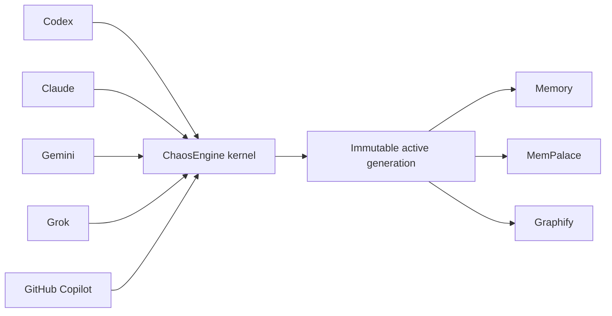

import {ChaosEngineOperatorCommands, ReflectionReceiptCommand} from '@site/src/components/DocSnippets';

# Install and operate ChaosEngine

ChaosEngine is SHAFT's project-local agent harness. It makes one canonical
skill the entrypoint for supported coding agents, installs the matching host
adapters, and provisions its tracked local tools without relying on a global
machine setup.

## Install from a terminal

Run the command for your operating system from the project root. `curl | bash`
does not change directory; it installs into the shell's current working
directory and prints that absolute install root. The Python reporter owns the
brand and live checklist so the wrapper cannot double-paint them. Standard
error carries progress. The final machine-readable JSON result remains the
only standard-output record.

On macOS or Linux, run the default non-interactive install:

```bash
curl -fsSL https://raw.githubusercontent.com/ShaftHQ/SHAFT_ENGINE/main/chaos-engine/install.sh | bash -s -- https://raw.githubusercontent.com/ShaftHQ/SHAFT_ENGINE/main/chaos-engine/install.sh
```

Add `--interactive` to approve each bootstrap, source, runtime, package, Maven
Tools, and activation operation before it starts:

```bash
curl -fsSL https://raw.githubusercontent.com/ShaftHQ/SHAFT_ENGINE/main/chaos-engine/install.sh | bash -s -- https://raw.githubusercontent.com/ShaftHQ/SHAFT_ENGINE/main/chaos-engine/install.sh --interactive
```

On Windows PowerShell, run the default unattended pipeline install:

```powershell
irm https://raw.githubusercontent.com/ShaftHQ/SHAFT_ENGINE/main/chaos-engine/install.ps1 | iex
```

To approve each operation in PowerShell, invoke the downloaded script with its
explicit switch:

```powershell
irm https://raw.githubusercontent.com/ShaftHQ/SHAFT_ENGINE/main/chaos-engine/install.ps1 -OutFile install.ps1
./install.ps1 -Interactive
```

The `CHAOS_ENGINE_INTERACTIVE` environment variable does not enable prompts.
Only `--interactive` or `-Interactive` opts in.

Interactive mode accepts only `y` or `yes`, ignoring letter case. Any other
answer, or Ctrl+C, cancels before the named operation. If no controlling
terminal is available, the installer fails before its first network download.
A cancelled or failed operation never replaces the last verified installation.

The header is the Quantum Mandate mark: an open C, three gates, an offset
spine, and a cybernetic-red core (`#FF3B4D`). The wordmark is `ChaosEngine`.
When `COLUMNS` is below 28, the reporter prints the narrow fallback `/C|*|E/`.

When standard error is a terminal, the checklist refreshes once per second on
a dedicated ticker thread. Completed stages are green, the running stage is
cyan, and the metrics line uses the same cyan style for elapsed time, download
speed when bytes are moving, and remaining time **only** during a sized
download. There is no phase ETA. A bounded Trace list records retries, byte
counts, and doctor reasons. Set `NO_COLOR` to any value to disable colors.
`TERM=dumb`, an incompatible encoding, or unavailable Windows virtual-terminal
support selects a safe plain-text fallback.

A root `pom.xml` installs Maven Tools MCP automatically (Java 17+ on
`PATH`/`JAVA_HOME`/`CHAOSENGINE_JAVA`, otherwise pinned Temurin 25).
`--skip-tools` still skips it.

In CI or a redirected stream, each `START` and `DONE` transition is a durable
newline. Redirected output has no cursor movement, animation, or timer spam.
The reporter stops its ticker on success, cancellation, rollback, and errors.


## Installer errors

Installer failures exit with status `1`. After the reporter closes and a blank
line, the installer prints a stable `CE-*` code, a Help URL to this section,
and the `status` and `doctor` commands **only when** `.chaos-engine/install.py`
is on disk. First-install verify failures keep that generation so those
commands exist. Unexpected failures use `CE-INSTALL-FAILED` and an explicit
"click this link" GitHub issue form URL that prefills
`chaos-engine-installer.yml`. The installer prints a traceback only when
`CHAOS_ENGINE_DEBUG=1`. Use the code to choose the next action:

| Code | Meaning | Action |
|---|---|---|
| `CE-CLAUDE-MARKETPLACE-CONFLICT` | An existing Claude plugin uses a ChaosEngine, Caveman, or Ponytail name with a different source or identity. | Inspect `.claude-plugin/marketplace.json`. Rename or remove only the conflicting entry, then run the installer again. |
| `CE-INTERACTIVE-TERMINAL` | Explicit interactive mode cannot open a controlling terminal. | Run from a terminal, or omit the interactive flag for unattended installation. |
| `CE-INSTALL-CANCELLED` | Ctrl+C or a declined interactive confirm. | The last verified generation is kept. Rerun the same install command. |
| `CE-INSTALL-CHECKSUM` | An artifact checksum failed. | The last verified generation is kept. Rerun the same install command. |
| `CE-INSTALL-UNSUPPORTED-PLATFORM` | The OS or architecture is not in the supported matrix (Windows, Linux, and macOS on x64 or arm64). | Run on a supported OS and architecture. |
| `CE-INSTALL-PROBE-FAILED` | A dependency entrypoint probe failed. | Run `status` and `doctor`. Memory probes dispatch owned Node plus package JavaScript (`dist/cli/main.js`, `dist/mcp/server.js`), never npm's extensionless POSIX `.bin` shim. |
| `CE-INSTALL-FAILED` | Another install, download, validation, or activation step failed. | Read the original detail, click the printed GitHub issue form link if the cause is unexpected, run status and doctor when those files exist, then retry after fixing that cause. |

An example cancelled install record:

```text
CE-INSTALL-CANCELLED: installation interrupted
Last verified generation was kept.
Rerun the same install command to continue.

Help: https://shafthq.github.io/docs/agentic/chaos-engine#installer-errors
Status: python3 .chaos-engine/install.py status
Doctor: python3 .chaos-engine/install.py doctor
```

Set `CHAOS_ENGINE_DEBUG=1` before the install command to print a traceback
after that record:

```bash
CHAOS_ENGINE_DEBUG=1 curl -fsSL https://raw.githubusercontent.com/ShaftHQ/SHAFT_ENGINE/main/chaos-engine/install.sh | bash -s -- https://raw.githubusercontent.com/ShaftHQ/SHAFT_ENGINE/main/chaos-engine/install.sh
```

On Windows PowerShell:

```powershell
$env:CHAOS_ENGINE_DEBUG=1
irm https://raw.githubusercontent.com/ShaftHQ/SHAFT_ENGINE/main/chaos-engine/install.ps1 | iex
```

ChaosEngine appends only its missing entries to any valid Claude marketplace.
It preserves the marketplace name, owner, description, custom fields, plugin
order, and unrelated plugins. Uninstall restores the original marketplace
bytes. Malformed JSON or a same-name ownership conflict fails before mutation.
If Claude is absent, installation still writes portable project configuration
and skips Claude activation without failing.

Check health and recovery state from the project root:

```shell
python3 .chaos-engine/install.py status --project . --json
python3 .chaos-engine/install.py doctor --project . --json
python3 .chaos-engine/install.py rollback --project .
```

On Windows, replace `python3` with `py -3`. Installer and doctor Memory probes
dispatch the owned `node.exe` against
`npm/node_modules/@aictx/memory/dist/cli/main.js` and `dist/mcp/server.js`.
They never run the extensionless `node_modules/.bin` POSIX shim as a Node
script. Retry installation after `status` or `doctor` identifies the repaired
prerequisite.

## Give the install command to your agent

Open the SHAFT project that should receive the harness and give this command to
Codex, Claude, Grok, Gemini, or another coding agent:

```text
Install or upgrade ChaosEngine in this project from the latest commit of ShaftHQ/SHAFT_ENGINE main. Fetch and inspect https://raw.githubusercontent.com/ShaftHQ/SHAFT_ENGINE/main/chaos-engine/bootstrap.py, run it with Python 3, --project ., --repository ShaftHQ/SHAFT_ENGINE, and --branch main; then run Python 3 with .chaos-engine/install.py status --project . Do not stop until status reports the resolved 40-character commit and healthy core, host adapters, and local tools. Treat the installed ChaosEngine skill as the canonical harness and route existing agent guidance through it without deleting unrelated user content.
```

The agent chooses the available Python 3 command on Windows, macOS, or Linux.
It must inspect the bootstrap before running it and report any network or
permission boundary instead of bypassing it.

## Verify and upgrade

Run the operator commands from the project root. `status --json` and
`explain <event> --json` emit deterministic, secret-free schema v1 objects.
Use `explain` to inspect one normalized host event without executing it.

<ChaosEngineOperatorCommands />

Re-run the same agent install command to upgrade. The bootstrap resolves
`main` to an immutable commit, validates the downloaded archive, and records
its repository, branch, and commit provenance. If resolution, download,
validation, or tool setup fails, ChaosEngine preserves the last verified
installation.

The project may be a SHAFT Git checkout, another Git checkout, or a non-Git
folder. The bootstrap uses the configured SHAFT upstream and never infers it
from the consumer project's Git remote.

## Read health and ownership

Both `status` and `doctor` report each component's health with four capability
fields:

| Field | Values | Meaning |
|---|---|---|
| `owner` | `installer`, `project`, `user` | Who may change or remove the component |
| `scope` | `project`, `repository`, `user` | Where the component is shared |
| `lifecycle` | `receipt-owned`, `persistent-data`, `derived-single-writer`, `user-managed-cache` | How the component is maintained |
| `taskImpact` | `required`, `advisory`, `optional` | Whether its health affects ordinary task work |

Memory, MemPalace, and Graphify have advisory task impact. An ordinary task can
continue when any of them is missing, stale, corrupt, timed out, or
inaccessible. Use one scoped query only when it answers a concrete question,
verify any returned path against live files, and use targeted repository search
before deciding impact. Do not retry, repair, refresh, poll, or watch a store as
part of task completion.

Installation, upgrade, explicit maintenance, `status`, and `doctor` remain
strict. An unhealthy selected component makes requested `status` or `doctor`
health `recovery-required`. Advisory task impact does not weaken those operator
checks.

## Understand startup and retrieval

Session startup loads compact tracked locators, not full companion skill bodies.
Each SessionStart payload stays at or below 4 KiB, while aggregate always-loaded
guidance stays at or below 16 KiB. Startup never calls Memory, MemPalace, or
Graphify synchronously.

For ordinary work, ask Memory, MemPalace, or Graphify one bounded question only
when it can shorten the task. Verify every useful result against current files.
A missing, stale, timed-out, or inaccessible store becomes a non-blocking
degraded result; do not repair, refresh, poll, or retry it during the task.

## Follow the installed topology

All five host adapters normalize their native lifecycle events into one
provider-neutral kernel. Codex, Claude, Gemini, Grok, and GitHub Copilot keep
their native configuration shapes and preserve foreign handlers. Copilot CLI
hooks run live; Copilot cloud and IDE configuration receive static validation.



The installer provisions missing Memory, MemPalace, Graphify, uv, and managed
Python dependencies automatically. It repairs a damaged managed runtime by
building and verifying a complete candidate generation before switching the
active pointer. The prior verified generation remains available for rollback.
Foreign files and foreign host handlers stay outside installer ownership.

## Use the final-batch lifecycle

Complete implementation as one coherent batch. Do not run tests, reviews,
commits, or hooks after every edit. After the final scope commit, clear CI
failures, annotations, bot findings, and review comments in batches, then run
no more than two selected terminal adversarial reviews and consolidated tests.

Do not run final holistic acceptance until the exact pull request head is fully
green and no bot finding, comment, annotation, or review thread remains
unresolved. Map that acceptance to the approved plan and every closing ticket,
then arm merge-commit auto-merge immediately. A changed head or new remote
feedback makes the acceptance stale; unchanged state never triggers another
acceptance run.

## Respond to reflection checkpoints

ChaosEngine pauses implementation mutation after two attempted failures in one
task. Different failure fingerprints require task-level reflection; the same
fingerprint twice requires deep reflection. Read-only diagnosis, tracker
updates, and a changed diagnostic check remain available, but an unchanged
retry or third speculative fix does not.

Copy each hash after `Sanitized fingerprints:` in the checkpoint message. Use
the session token printed by the lifecycle hook to append the bounded receipt:

<ReflectionReceiptCommand />

On Windows, use `py -3` instead of `python3` and quote the JSON for your shell.
The receipt accepts bounded conclusions, not raw logs, prompts, credentials, or
host paths. Knowledge stores and GitHub remain optional for this local control
flow.

After more than one hour, finish implementation and delivery first. Then record
the terminal receipt and use these exact labels in the final summary:

- `elapsed estimate`
- `main time consumer`
- `repeated failures or corrections`
- `changed assumption or approach`
- `successful proof`
- `remaining risk or follow-up`
- `learning loop disposition`

Later work or failure invalidates an earlier terminal receipt.

## What gets installed

ChaosEngine installs and owns these project-local surfaces:

- the verified core and canonical skill under `.chaos-engine/`;
- native discovery adapters for Codex, Claude, Gemini, Copilot, and compatible
  agents;
- a private dependency runtime for the tracked Memory, MemPalace, Graphify,
  and supporting tools;
- receipts and transaction state used by status, repair, rollback, and
  uninstall.

It preserves unrelated project instructions, skills, configuration, and tool
entries. Its self-learning flow queues only privacy-screened, confirmed
lessons and contributes them upstream as reviewable GitHub issues, never as an
automatic pull request.

Maven Tools MCP installs automatically when the project has a root `pom.xml`.
It uses an immutable user-managed cache. Multiple projects can reuse one
verified JAR and receipt, and uninstalling ChaosEngine from a project never
removes that cache. See the [agent tooling cache
runbook](/docs/maintainers/agent-tooling#maven-tools-mcp-cache) for status,
purge, and manual population commands.

## Related

- [Install SHAFT agent skills](/docs/agentic/skills)
- [Agentic testing overview](/docs/agentic/overview)
- [Connect SHAFT MCP](/docs/agentic/mcp)
- [SHAFT CLI](/docs/agentic/cli)
