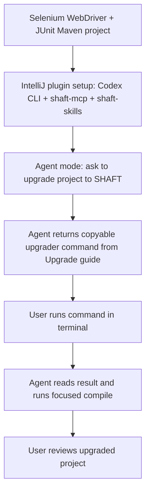
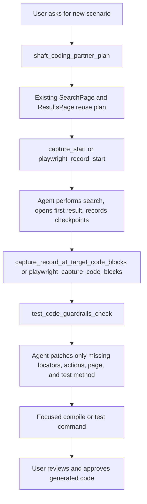
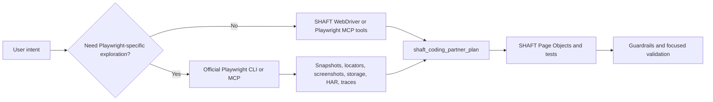
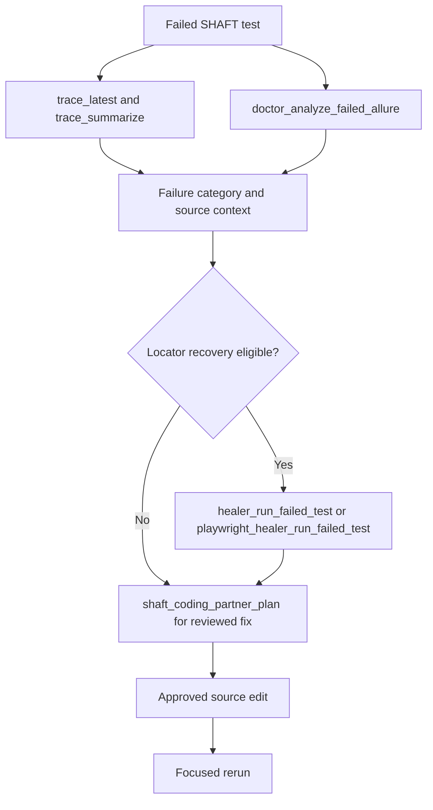

# IntelliJ IDEA plugin

The SHAFT IntelliJ IDEA plugin is the cohesive coding-partner front door for
Java test projects. Use it to ask questions, plan repository-aware changes,
record browser or mobile flows, refactor Selenium/Appium code toward SHAFT,
reuse existing Page Objects, locators, and actions, diagnose failures, and
prepare reviewable repairs from the same tool window.

The plugin is a thin IDE shell over `shaft-mcp`: SHAFT engine behavior, local
CLI agent routing, direct provider adapters, Doctor, Healer, Capture, and
Inspector logic stay in the engine modules.

Install the plugin from JetBrains Marketplace when it is published, then open
**Tools | SHAFT | Open SHAFT**. If you install a plugin ZIP from disk, restart
IntelliJ IDEA when the IDE prompts for restart so the SHAFT tool window and
actions are fully registered. The core Assistant tool window can load without
IntelliJ's Java plugin; Java-specific actions are registered only when Java
support is available. First run shows a six-step setup inside the tool window:

0. **Prerequisites** detects the tools the setup flow depends on — Python 3,
   Java, Maven, Node.js (only when the selected agent CLI is missing and needs
   npm), and the selected agent CLI itself. Every missing tool gets a
   **Copy install command** button with a simple per-OS terminal command
   (winget, Homebrew, or apt) so a fresh machine can be provisioned entirely
   from this screen; **Recheck** re-detects after you install something. A
   **Copy SHAFT Engine warm-up command** button copies a Maven command that
   pre-downloads SHAFT Engine and its dependencies into the local Maven
   repository so future projects skip re-downloading them; the command pins
   the latest released engine version (resolved live from Maven Central, with
   the plugin's own release as the offline fallback) rather than a Maven
   meta-version. Java and Maven are
   advisory: the SHAFT MCP installer bootstraps its own Java when none is
   found.
1. **Upgrade project** runs a real check: the plugin reads the open project's
   `pom.xml`, finds its SHAFT version, and compares it against the latest
   released engine version. A project already on the latest release — or on a
   newer local development build — shows **Done** immediately with nothing to
   do. Otherwise the step explains exactly what it found (current vs. latest
   version, or that the project has no SHAFT dependency yet), **Copy command**
   copies the upgrade command *and opens an IntelliJ terminal with it
   pre-typed* so you only press Enter, and **Check** re-runs the comparison
   after the upgrade finishes. See the [Upgrade guide](/docs/start/upgrade)
   for what that command does.
2. **Pick agent** defaults to Codex CLI. Local Codex, Claude, and GitHub
   Copilot families are joined by **Gemini**, a cloud route configured with a
   Google AI Studio API key instead of a local runtime. The step shows
   **Done** only when the selected agent is actually detected on this machine
   (or, for Gemini, when a key is stored).
3. **Install SHAFT MCP** copies the right installer command for the selected
   agent and opens an IntelliJ terminal with the command pre-typed — press
   Enter there to run it. The step shows **Done** only when an installed
   `shaft-mcp` is really found on disk, never just because a button was
   clicked.
4. **Check setup** finds the installed SHAFT MCP command automatically,
   verifies the selected local agent and workspace, and additionally asks the
   selected agent CLI itself whether it can access `shaft-mcp` (for example
   via `claude mcp get shaft-mcp` or `codex mcp get shaft-mcp`), so after a
   plugin update plus a `shaft-mcp` reinstall you get a real "your CLI can now
   use shaft-mcp" verdict. When the CLI sees `shaft-mcp` but cannot connect —
   typical when a CLI session that predates the reinstall is still running — a
   **Copy restart command** button copies a terminal command that stops stale
   CLI processes and re-verifies access. Success reveals **Start chatting**.

Setup readiness has two lanes. The recorder, codegen, Doctor, and Healer only
need the verified SHAFT MCP — no agent at all — so when the MCP check passes
but the selected agent is missing or unreachable, setup still completes with a
**Start without an agent** button and honest copy ("Recorder, codegen, and
doctor are ready now — connecting an agent adds chat and is optional"), while
the agent diagnostics and restart recovery stay visible for the optional
second lane. The wizard is also project-aware: the Upgrade step distinguishes
"already on the latest SHAFT" (green), "SHAFT upgrade available", "Maven
project without SHAFT" (adopt via the upgrade command), and "no `pom.xml` at
all" (scaffold a project first), so an empty folder is never told to upgrade.

After setup, the main view header keeps a persistent **MCP health chip**
("MCP: verified / failed / not checked") with a one-click **Recheck** that
runs a live connection probe, so a broken MCP never fails silently mid-session.

The Marketplace plugin does not download or execute installer scripts at
runtime. It only helps you choose the agent, copy the terminal installer
command, find the installed `shaft-mcp.args` automatically, then stores and
starts that local command. Installer commands always fetch
`scripts/mcp/install-shaft-mcp` from the `main` branch so copied commands use
the latest published setup script.
After a command has passed setup, opening SHAFT shows the Assistant view.
Without a verified MCP command, the landing view keeps the click-through setup
visible. Unverified settings stay behind the same setup gate until **Check setup**
passes.


Setup opens with a **Connect SHAFT Assistant** summary and a simple vertical
stepper with visible state chips, only showing the buttons relevant to the
current step, so the path reads as
**Prerequisites -> Upgrade project -> Pick agent -> Install SHAFT MCP -> Check setup -> Start chatting**.
Every state chip reflects a real verification of what is on the machine or in
the project — never a "you clicked the button" heuristic — and a check that
ran and did not pass shows an explicit red **Failed** chip with recovery
guidance instead of silently staying neutral.
The whole setup flow scrolls vertically when it outgrows the tool window (the
scrollbar appears only when needed, and content re-wraps instead of scrolling
sideways), so the bottom of the page always stays reachable.
The setup summary shows the `main` installer source, selected target, selected
runtime, and detected recommended CLI agent. The stdio command stays managed by
SHAFT and is not shown as a setup input. Test failures stay inline with
categorized troubleshooting, client-specific next steps, copyable diagnostic
output, copyable SHAFT MCP docs link, and the retry action remains enabled.

Selecting the **Gemini** family swaps the runtime selector for a
**Gemini API key** field. Paste a Google AI Studio API key; **Check setup**
stores it in IntelliJ Password Safe, saves the Cloud/Gemini Assistant route
with a default model, and enables passing the stored key to the SHAFT MCP
process. The installer target switches to `intellij-plugin` because Gemini
prompts run through SHAFT MCP provider chat instead of an external agent CLI.
If no key is stored, **Check setup** fails inline with a reminder to paste the
key and check again.


Troubleshooting details distinguish the failure type when the plugin can infer
it:

- **Java/runtime**: install or select a Java runtime that can run `shaft-mcp`,
  then retry.
- **Maven artifact resolution**: check Maven Central or proxy access for
  `io.github.shafthq:shaft-mcp`, then retry.
- **Client configuration**: confirm the selected client can write and read its
  MCP configuration file.
- **Client runtime**: install the selected client CLI or add it to `PATH`, then
  retry.
- **MCP command**: rerun the terminal installer, then click **Check setup** so
  SHAFT can find the installed command automatically.
- **MCP probe**: rerun the installer command, then click **Check setup** once it
  finishes.

The setup pane includes one-click actions for copying the SHAFT upgrade
command, copying the installer command, opening the IntelliJ terminal for
either, checking setup, and copying diagnostic output.
Codex users should verify `codex mcp list`, Claude users should
verify `claude mcp list` or restart Claude Desktop after desktop config changes,
GitHub Copilot users should check the Copilot MCP configuration and
organization MCP policy, and SHAFT IntelliJ plugin users should run the
`intellij-plugin` target before checking setup.

After the test succeeds, setup shows the verified runtime/workspace, **Ready**,
and **Start chatting** action without showing the managed stdio command or
probe logs. The plugin starts the configured stdio command on the first tool
invocation and keeps that MCP server process alive across tool calls, so
session-based tools (a running Capture recording, an initialized live
driver) keep running between commands; the process is restarted transparently
when it dies or the configured command changes. The plugin does not embed the
SHAFT engine or manage provider model traffic itself.

## Tool window

Open **Tools | SHAFT | Open SHAFT** to show the tool window. The plugin opens on
the **Assistant** — the only view regular users see — and the Assistant
understands what you need in plain language. There are no commands to learn:
describe the outcome, and the Assistant routes the request to the right SHAFT
workflow.

- "Record my browser actions on https://your-app.example" starts a privacy-safe
  web recording session.
- "Record my mobile actions on the Android emulator" starts a mobile recording
  with an attached emulator session.
- "Generate a SHAFT test from recordings/checkout.json" converts a saved
  recording directly into compile-validated SHAFT code — no live session
  needed. Describing the journey in plain words instead ("Generate a SHAFT test
  that signs in and verifies the welcome banner") makes the agent open a fresh
  recording session, perform the described actions, and generate code from the
  persisted recording.
- "Diagnose my last failed test run" triages the most recent Allure evidence in
  the project automatically — no report path required.
- "Upgrade this project to the latest SHAFT" has the agent preview, apply, and
  verify the upgrade (with Agent mode and source edits approved).

An empty chat keeps the surface uncluttered: the composer placeholder invites a
plain-language request (record, generate a test, diagnose failures, upgrade)
and wraps to the panel width so it is always fully readable. The Assistant
opens in **Agent** mode with **Allow source edits** checked, so a first request
like "generate a test" can actually land code in the project; uncheck it for
suggestion-only runs. Recording requests such as "Record my browser actions on
https://..." always run on the plugin's own long-lived SHAFT MCP session -- a
recording must never belong to a one-shot local agent turn, whose MCP process
(and with it the recording browser) ends seconds after the reply.

Enabling **Settings | SHAFT | Enable advanced workflows and provider options**
(Expert mode, also available as a checkbox on the setup view) reveals the
**Workflow** selector with every specialist surface: **Guided**, **Recorder**,
**Inspector**, **Triage**, **Evidence**, **Projects**, and **Advanced**. These
panels expose raw MCP requests and are aimed at users who already know the tool
catalog; everything they do is reachable through plain Assistant requests. The
Guided tab's **Try SHAFT on a sample page** button extracts a bundled local
bookstore page (nothing leaves your machine) and walks a complete
record-review-insert loop in about 90 seconds.

Use the plugin as the default front door when you are already in IntelliJ:

- Record web journeys, then review WebDriver or Playwright code blocks before
  inserting them into the existing test structure.
- Record mobile/Appium flows, then reuse generated locator and action blocks in
  the existing mobile Page Objects.
- Ask for a Selenium-to-SHAFT conversion (pasting native Selenium into the
  composer also offers a one-click conversion) so the plan searches existing
  Page Objects, locator fields, and action methods before suggesting new code.
- For generated GUI code, reuse existing project code first. If a needed action
  or locator is missing, record the complete flow, then insert only the missing
  locators/actions into the planned source anchor. Use Smart Locators and the
  SHAFT locator builder before native `By.xpath(...)`; do not use
  `SHAFT.GUI.Locator.xpath(...)`.
- Ask to diagnose or heal failed runs; proposed fixes stay review-only until you
  apply and verify them.
- Keep WebDriver as the default backend unless the project already uses
  `SHAFT.GUI.Playwright` or the prompt explicitly asks for Playwright.

## Agentic E2E workflows

Use these flows as chat contracts. The plugin is the front door, `shaft-mcp`
does repository-aware planning and evidence capture, and the selected local
agent applies source edits only after you enable **Allow source edits** for that
request.

### Upgrade a Selenium Maven project

In Agent mode, ask the assistant to inspect the current Selenium/JUnit Maven
project and return the upgrader command first. The command should be in its own
fenced block, and the agent should wait for you to run it before source edits.
Use the [Upgrade guide](/docs/start/upgrade) as the canonical source for the
copyable command; this page documents the IDE workflow around that command.
The setup wizard's **Upgrade project** step (see above) offers the same
command as a one-click copy before you ever open the Assistant chat; this
chat-driven flow and the **Projects** workflow's upgrade template are
alternatives for triggering it later, mid-session, with repository-aware
framing.



Use `basic` when you only want the POM updated, `session` when the agent should
also migrate supported Selenium session setup, and `full` only after reviewing
the higher-risk action rewrites.

### Record a new scenario into existing Page Objects

For the DuckDuckGo example, ask in Agent mode with **Allow source edits**:

```text
Write a scenario where the user searches for shaft_engine, opens the first result,
and asserts the page title of the first result. Reuse the existing DuckDuckGo
search and results page objects, add only missing locators/actions, create a
first-result page object only if none exists, and use SHAFT assertion builders.
```



Checkpoint notes are review intent only. Generated assertions must be real SHAFT
builder calls such as `driver.assertThat().browser()...` or
`driver.element().assertThat(...)`, not raw JUnit/TestNG assertions.

### Delegate browser exploration to Playwright

When a task needs token-efficient snapshots, console output, tracing, video,
PDF, or official Playwright Test Agent planning, let the local agent use
official Playwright CLI or Playwright MCP as a sidecar. The final Java change
still returns through SHAFT planning and guardrails. Storage-state save/load
and observed-network inspection no longer need a sidecar for the common case:
use `browser_storage_state_save`/`browser_storage_state_load` (or the
`playwright_*` equivalents) and `browser_network_requests`/
`browser_network_request` directly.



Do not paste Playwright TypeScript output into a Java project. Treat Playwright
CLI/MCP output as evidence, then translate the proven behavior into
`SHAFT.GUI.WebDriver` or `SHAFT.GUI.Playwright` syntax based on the project
backend.

### Diagnose and heal a failed test



## Assistant

The **Assistant** workflow is a chat-style view with Ask, Plan, and Agent modes
in the bottom composer. Local CLI prompts call the MCP
`autobot_local_agent_run` tool, which delegates to the engine-side local agent
service in `shaft-pilot-core`. Cloud Ask and Plan prompts call
`autobot_provider_chat` with the selected provider and model.

Supported local routes are:

| Client | Default local command | API key required by SHAFT |
| --- | --- | --- |
| Codex CLI | `codex exec --sandbox read-only -` for Ask/Plan and no-source Agent; workspace-write only with `Allow source edits` | No |
| Claude Code | `claude --print`; Plan uses `--permission-mode plan`; no-source Agent asks per tool call via a local approval bridge (see [Tool approval](#tool-approval)); source-edit Agent uses `acceptEdits` for file edits and keeps the same approval bridge for shell and third-party MCP tool calls, which `acceptEdits` alone would silently deny in `--print` mode; SHAFT's own MCP tools are pre-approved via `--allowedTools mcp__shaft-mcp` in both Agent variants | No |
| Copilot CLI | `copilot ask`, `copilot plan`; source-edit Agent uses `copilot agent` | No |

The composer shows a **model** selector and a reasoning **effort** selector for
the active route in both the basic and advanced UI. Local routes list the
models reported by the connected agent CLI (`codex models`,
`claude config list-models`, `copilot models`) and fall back to a curated
catalog per family; cloud routes list a curated catalog per provider, for
example `gemini-3.5-flash`/`gemini-2.5-flash` for Gemini and
`claude-fable-5`/`claude-opus-4-8`/`claude-sonnet-5` for Anthropic. Both
selectors are editable so newer model names can be typed in. The selected
model is passed as `--model` to the local CLIs and as the `model` argument to
`autobot_provider_chat`. Effort levels are Default, Low, Medium, and High:
Codex receives the level as its `model_reasoning_effort` config flag, while
Claude, Copilot, and cloud providers receive a one-line reasoning-effort
preference at the top of the prompt.

Cloud providers are OpenAI, Anthropic, Gemini, and GitHub Models. Their keys
are stored in IntelliJ Password Safe; only the selected cloud provider key is
passed to the MCP process. Cloud `AGENT` mode is disabled because direct
provider chat cannot mutate the local workspace. A cloud route selected during
first-run setup (such as Gemini) stays active in the basic UI; switching
providers ad hoc remains an advanced-mode control.

Use `Ctrl+Enter` or `Command+Enter` to send a prompt. Newly sent prompts scroll
into view immediately, so the chat shows visible feedback before a long-running
response finishes. Press `Escape` to cancel a running request. The selected
local agent appears as compact text such as `Codex CLI`; hover it for the full
route, for example `Agent: Local / Codex / CLI`.
Compact Assistant controls keep JetBrains-style glyphs, including Copy all,
Clear, and Rerun transcript actions. All controls retain accessible names,
status metadata, and tooltips. Code blocks use a light editor-style palette in
light mode and a distinct dark surface in dark mode.
While a prompt runs, the submit icon becomes an animated spinner;
hovering it changes the same square control into cancel. If you cancel, the
request ends with a dedicated final transcript entry and no capture-generated
output is finalized.
A **Verbose** checkbox, available on every route, forwards the unfiltered
picture into the chat as it happens instead of only showing the final result.
For local agent CLI runs that means the agent's own stream:
extended-thinking/reasoning blocks, each tool call (with a short
summary of its input when one is available), and each tool call's result or
failure once it completes. For direct SHAFT MCP tool runs (for example
recording code generation), Verbose echoes the exact tool request being sent and the
raw tool response alongside the formatted answer. Toggling Verbose mid-run is
safe in either direction -- the transcript never ends up showing a stale
in-progress bubble or losing an unrelated message. With Verbose off, a brief
"running" bubble still appears while the agent works and is replaced by the
final answer.
Local Agent mode is blocked from
source mutation until the user explicitly approves it for that request. For
browser-only tasks, leave `Allow source edits` off; enable it when the request
requires applying code or source edits. If an Agent-mode continuation such as
"try again" follows an earlier source-edit request, the Assistant still requires
`Allow source edits` before launching the local agent. A custom local agent
command can be supplied for non-standard CLI installations; broad Ask, Plan,
and Agent prompts keep using the selected local route.

Assistant chats are persisted per IntelliJ project. Use the chat selector to
reopen recent contexts, the New chat icon to start a separate context, and the
Clear icon to clear only the active chat. Active chat messages are included as
bounded context for local and cloud Assistant prompts until you click Clear;
New chat starts a separate context. Persisted chats keep rendered messages
only; raw MCP payloads and common token/key values are not stored.

The Assistant understands feature intent directly from the chat box: "start
mobile recording" maps to `mobile_record_start`, "record my browser actions on
https://..." starts a web capture session, and "diagnose my last failed test
run" triages the most recent Allure results in the project. Browser control
defaults to WebDriver; say `playwright` in the prompt when that backend is
required.

Asking for a test generated from a Capture recording (for example "Generate a
SHAFT test from recordings/checkout.json") generates the SHAFT test, compiles
it, and **re-executes the recording** (`capture_generate_replay`), so the
returned code blocks are verified against the live flow rather than only
statically generated — and it works from the persisted recording file alone,
with no live capture session required. Before the run starts, the Assistant
explains the three phases (generate, compile, replay) and warns that a browser
window may open for the replay (it starts on `about:blank` before the test
navigates). The result is a step-by-step story — which file was generated
where, whether it compiled, whether the replay passed with per-step failure
diagnostics when it did not, the report/review artifact paths, and the
generated code with next-step guidance — never a bare confirmation. When only
the replay step fails, the generated and compiling code blocks are still
returned together with the replay diagnostics, so a replay hiccup never turns
into an empty "no code" response. Repeating the request regenerates the
deterministic output in place instead of failing because the class already
exists. Playwright and mobile recordings keep their generate-only code-block
tools. Describing the journey in plain words with no recording makes the agent
open a fresh recording session, perform the described actions, and generate
from the persisted result.

"Upgrade this project to the latest SHAFT" in **Agent** mode with
**Allow source edits** enabled performs the project upgrade itself: the agent
states the project's current SHAFT setup, previews the change with the
`shaft_project_upgrade` dry run, runs the official upgrader non-interactively,
verifies the project still compiles (repairing upgrade-induced breakage with
SHAFT syntax when needed), and reports the old and new versions plus every
file it touched and why. Outside Agent mode — or on cloud/non-CLI routes that
cannot edit local files — the Assistant explains exactly how to authorize the
agent-run upgrade and still offers the manual copy-paste command.

Use `review recording` or `review recording recordings/<name>.json` to generate
the same reviewed Capture code blocks from chat.
After capture approval, the local Agent run shows completion feedback in the
final transcript so you can confirm generation status, outputs, and next
workflow step before continuing. When the run created no files (for example
because its tool calls were denied), the reviewed Capture code blocks stay
available so you can approve again or copy the generated class manually, and
the transcript says so explicitly instead of ending on a bare confirmation.

For local agent CLI runs, the **Verbose** toggle streams everything the
wrapped CLI reports while it works: recognized events are shown as
human-readable progress lines (thinking, tool calls, tool results), and any
event with no human-readable mapping is shared as-is in its native format
(raw JSON) instead of being hidden. CLIs with no structured stream forward
their raw output after a one-time notice. With Verbose off, only the parsed
final response is shown. Independent of the toggle, every Agent-mode answer
ends with a factual **Local agent activity** footer whenever the run created
or edited files or lost tool calls to permission denials, listing the touched
paths and the denied tools with per-tool counts.

The run timeline and action controls stay hidden
until the current prompt, selected tool, running, approval, completion,
cancellation, or failure state makes them useful. Type `@` for workflow
starters (plain-language prefills such as "Record my browser actions on
https://") and `#` for the current file or known project artifacts; the
dropdown filters live as you keep typing. The former "+" context button was
removed in favor of these typed triggers.

Pasting raw Selenium/Appium Java into the composer proactively offers a
one-click **"Selenium detected — convert to SHAFT + guardrails"** action that
wraps the code in a convert-to-SHAFT request and runs the guardrail check on
the converted result.

After a recording stops and its review is generated, the review bar offers the
whole Record → Review → Insert loop in one place: **Create test class** writes
the reviewed class into `src/test/java` (never overwriting) and opens it,
**Insert into open class** regenerates the steps anchored to the file open in
the editor (`capture_record_at_target_code_blocks`), **Open review file**
jumps to the generated review artifact, **Evidence pack** returns a shareable
manifest of source/report/review artifacts with validation commands, and
**Compare backends** generates the same recording as both WebDriver and
Playwright SHAFT code side by side. The generation report's readiness
findings (flaky steps, unsupported events, required inputs, fallback
locators) also surface as file-level IDE annotations directly on the
generated class.


The Assistant routes plain-language intent to the right MCP tools:

| Intent | Say something like | Primary MCP tools |
| --- | --- | --- |
| Browser control and inspection | "open https://example.com and sign in" | `driver_initialize`, `browser_open_intent`, `browser_get_page_dom`, `browser_take_screenshot`, `browser_aria_snapshot`, `browser_accessibility_audit`, `playwright_initialize`, `playwright_browser_navigate`, `playwright_browser_get_page_dom`, `playwright_browser_take_screenshot` |
| Web recording and codegen | "Record my browser actions on https://example.com", "Generate a SHAFT test from recordings/checkout.json" | `capture_start`, `capture_start_codegen`, `capture_codegen_features`, `capture_stop`, `capture_status`, `capture_code_blocks`, `capture_generate_replay`, `capture_target_candidates`, `capture_record_at_target_code_blocks`, `capture_backend_comparison`, `capture_evidence_pack`, `playwright_record_start`, `playwright_record_status`, `playwright_record_stop`, `playwright_recording_code_blocks`, `playwright_replay_recording`, `playwright_capture_generate_replay`, `playwright_capture_code_blocks` |
| Mobile control and inspection | "check the Android toolchain", "inspect the current mobile screen" | `mobile_toolchain_status`, `mobile_initialize_native`, `mobile_initialize_web_emulation`, `mobile_get_accessibility_tree`, `mobile_take_screenshot` |
| Mobile recording and codegen | "Record my mobile actions on the Android emulator", "generate mobile code from recordings/mobile.json" | `mobile_record_start`, `mobile_record_stop`, `mobile_recording_code_blocks`, `mobile_record_at_target_code_blocks`, `mobile_replay_recording`, `mobile_inspector_record_prepare` |
| Failure analysis and healing | "Diagnose my last failed test run", "analyze target/allure-results" | `doctor_analyze_failed_allure`, `playwright_doctor_analyze_failed_allure`, `doctor_suggest_fix`, `doctor_analyze_trace` |
| Reuse planning and guide search | "plan a login test that reuses our page objects", "how do SHAFT locators work?" | `shaft_coding_partner_plan`, `shaft_guide_search`, `test_automation_scenarios`, `test_code_guardrails_check` |
| Project upgrade | "Upgrade this project to the latest SHAFT" | `shaft_project_upgrade` preview + agent-performed upgrade |

If MCP is not configured, the Assistant shows the SHAFT MCP setup prompt before
it runs a feature request. Natural-language Ask/Plan prompts that need MCP tool
access tell you to switch to Agent mode instead of launching a local agent from
the wrong mode. Project creation from chat returns a review instruction; run
**Create SHAFT Project** from the expert-mode Projects or Guided workflow so
the confirmed workflow gate is used before files are written. When a
diagnosis request names no report path, the most recent populated
`allure-results` directory in the project is analyzed automatically.

Legacy slash commands typed directly (for example `/doctor`) still route for
backward compatibility, but the UI no longer teaches or advertises them.

Responses render as Markdown. Known SHAFT responses, including local agent runs,
provider chat, local client discovery, MCP `content[].text` envelopes, JSON
payloads, and Java snippets, are parsed into readable sections, tables, or
fenced code blocks. When a browser or mobile recording stops successfully, the
Assistant shows the next code-generation request (`Generate a SHAFT test from
recordings/....json`) in its own fenced block, ready to send.
Unknown structured responses are formatted through the selected Assistant route
when possible; if no formatter is available, the plugin falls back to a local
Markdown-safe JSON/code rendering. Use the copy actions for rendered Markdown,
raw support diagnostics, or the full transcript plus current-session tool
evidence when exporting for issue review.

## Onboarding recording notes

Use this preferred launch path for the recording workflow from a clean, disposable
IntelliJ sandbox/profile so onboarding state stays isolated:

`gradle -p shaft-intellij runIde --args C:/Users/Mohab/IdeaProjects/SHAFT_ENGINE`

On Windows JDK21 onboarding, SHAFT now ensures `%JAVA_HOME%\Packages` exists
before instrumentation starts. The flow shows explicit diagnostics for missing,
invalid, or unwritable `JAVA_HOME` values instead of opaque startup failures.

Use the same onboarding MCP flow: CODEX + CLI, Route = LOCAL, and Mode = AGENT.
Ask/Plan browser-control prompts should be resent in Agent mode when MCP tools
are required. `Allow source edits` stays off for DuckDuckGo/browser flow and is
enabled when the run must change source files. If the step is expressed as
"open the first result," use the scoped 1-indexed XPath
(`(//article[@data-testid='result'])[1]//a[@data-testid='result-title-a']`) for
the first result.
For deterministic verification, finish with a final page title and page-specific
text check after opening that result before approving generated capture output.
Use `discard recording` or `re-record` when a focus or click mistake pollutes
the capture; the Assistant stops the current Capture session with
`discard=true` before restarting.

For recordings, dismiss sandbox-only low-memory or script-launcher warning balloons
without suppressing normal production IDE warnings. IntelliJ Trust Project may
preselect Windows Defender exclusions; leave them unchecked unless exclusions are
explicitly required for that environment.

## Workflows

The workflow selector exposes curated MCP requests for common automation jobs:

- Recorder: Capture start, status, checkpoints, stop, reviewed code blocks,
  target discovery, record-at-target patch previews, backend comparison,
  evidence packs, Playwright recording controls, and replay code generation.
- Inspector: browser and Playwright DOM snapshots, screenshots, mobile
  toolchain status, wrapped Appium Inspector recording, mobile screenshots, and
  accessibility trees.
- Evidence: failed Allure analysis, trace discovery, trace analysis, trace
  summarization, report remediation, guarded reruns, and review-only locator
  proposals.
- Projects: create new SHAFT example projects and preview or apply the modular
  SHAFT upgrader against the open Java project (the setup wizard's **Upgrade
  project** step offers the same upgrade as a first-run, one-click copy).
- Guided: a Coding Partner section for planning repository-aware work from intent,
  current Java source, selected text, and evidence paths; starter templates for
  recording a browser flow and generating Page Object code, starting a mobile
  web-emulation session for recording, analyzing failed Allure results,
  converting Selenium snippets to SHAFT syntax, creating a new SHAFT project,
  and inspecting current page locators. The recorder **Backend** selector
  routes the recording controls to WebDriver, Playwright, or Mobile (web
  emulation) recording tools, and fields the selected backend's start request
  does not read gray out with explanatory tooltips. A **Headless browser**
  toggle (off by default so you can interact with the recorded browser)
  controls whether recording sessions launch a visible window — check it for
  agent-driven or CI recordings; the preference persists across sessions and is
  also honored by the assistant web and mobile recording flows. The
  **Intent** field flows into `capture_start` as `sessionGoal`, so generated
  tests are named after the journey ("Log in as a valid user" yields
  `logInAsAValidUser()`). A live **Status** strip polls the recorder after
  Start recording and shows the session state, event/action counts (including
  pending debounced input), and current URL, so headless recordings stay
  observable in-panel. On the Mobile backend, Start recording chains
  `mobile_initialize_web_emulation` and `mobile_record_start` as one action,
  gating the recorder start on the emulated session succeeding. The guided
  recorder action says **Review code** because it prepares reviewed SHAFT code
  blocks, setup notes, assertion suggestions, locator alternatives, and
  control-flow review output. Templates prefill MCP arguments only; apart from
  the chained mobile recorder start, they do not run tools or write source by
  themselves. When a test run fails and Allure evidence exists, the plugin
  raises a "Diagnose with SHAFT Doctor" notification that prefills the
  deterministic failed-Allure analysis in one click.
- Advanced Tools: WebDriver, Playwright, and mobile playback flows, scenario
  catalog prompts, generated-code guardrail checks, local Assistant client
  discovery, recorder evidence manifests, backend comparison, and official
  SHAFT guide search.

Each category provides editable JSON arguments and calls the matching MCP tool.
This keeps generated code and source edits reviewable in the IDE instead of
hidden inside plugin code.


```json
{"tool": "shaft_project_upgrade", "arguments": {"projectRoot": ".", "upgradeType": "basic", "dryRun": true, "approve": false}}
```

## Record in Java code

Use **Tools | SHAFT | Record SHAFT Flow Here** from a Java file to prepare a
`capture_record_at_target_code_blocks` request for the caret's package, class,
method, and source path. The action defaults the session path to
`recordings/intellij-capture.json`, matching the Assistant's normal browser
recording path. Change it only when you recorded to a different file. After
review approval, keep the same capture session path so generation preserves the
reviewed browser journey instead of rerunning capture.
The generated MCP response includes focused locator/action blocks plus a
preview-only patch block; apply changes only after reviewing that preview and
running the relevant verification command.
This action is available only in IDE installations with Java support enabled.

## Coding partner plan

Use **Guided | Coding Partner | Plan coding partner** or ask the Assistant to plan reuse before
asking the plugin or an agent to create or refactor code. The action prepares
`shaft_coding_partner_plan` with the
repository path, intent, selected backend, current source path, selected text,
optional evidence paths, and `maxResults=10`.

The MCP response is preview-only. It returns a working-set summary, ranked
reuse matches with existing locators/actions, a structured `stepPlan`,
`recommendedTargetSourcePath`, `recommendedInsertionAnchor`, missing code items,
suggested MCP proof calls, a focused verification command, evidence paths, and
approval warnings. Apply source edits only after reviewing the plan, using the
record-at-target patch preview when codegen is involved, and running the
returned verification command. Record-at-target previews reuse existing locator
fields, skip exact duplicate action lines, and show an apply order before any
agent patch is accepted.

For Selenium-to-SHAFT work, select the legacy snippet or test first and describe
the intended behavior. The plan should preserve working Page Object boundaries
and reuse existing locators/actions before adding new SHAFT code.

## Settings and configuration

Use **Settings | SHAFT** to configure the plugin's connection, execution,
advanced features, and cloud provider credentials. Settings are organized into
four sections:

- **Connection**: Paste or edit the MCP stdio command, test the MCP connection
  against the currently open project, and view the current agent/workspace
  configuration.
- **Execution**: Choose the local Assistant route (Codex, Claude, or Copilot),
  select the default AI model and reasoning effort, and enable Expert mode to
  reveal advanced commands in the Assistant composer.
- **Advanced**: Configure cloud provider selection for MCP tools and enable
  advanced workflows.
- **Credentials**: Store OpenAI, Anthropic, Gemini, and GitHub API keys in
  IntelliJ Password Safe for use by MCP tools that request provider assistance.

### Expert mode

When you enable **Settings | SHAFT | Enable advanced workflows and provider
options**, the Expert-mode toggle activates on the post-setup settings screen.
Expert mode reveals the specialist workflow views (**Guided**, **Recorder**,
**Inspector**, **Triage**, **Evidence**, **Projects**, **Advanced**) and the
ad-hoc provider/route controls in the Assistant composer. Regular users never
need it: every workflow is reachable by describing the outcome in the
Assistant.

### SHAFT project detection

The Assistant detects whether the open project actually depends on SHAFT (a
`shaft-engine`/`shaft-bom`/`io.github.shafthq` reference in the root or a
direct child module's `pom.xml`/`build.gradle`/`build.gradle.kts`). In a
project that does not depend on SHAFT yet, mutating or SHAFT-reporting-only
tools -- project upgrade, focused verification, and Doctor/Heal triage -- are
not dispatched; the Assistant instead replies with a message pointing you at
**Create SHAFT Project** or **Upgrade project** in the Projects workflow.
Read-only tools such as guide search and coding-partner planning are not
gated, since they are useful while you are still adopting SHAFT. The MCP
connection heartbeat also stays idle in a non-SHAFT project instead of
polling in the background.

### Tool approval

SHAFT MCP tool calls made through the Assistant are gated behind an
interactive approval bubble rendered inline in the chat transcript. When a
recording or code-generation request (or any Assistant feature that calls a
SHAFT MCP tool) is about to dispatch a tool you have not approved yet, the
Assistant shows the tool name and its arguments with a button per approval
scope:

- **Approve once** — allow just this one tool call.
- **Approve tool always** — remember approval for every future call to this
  tool.
- **Approve all tools** — approve every SHAFT MCP tool from now on.
- **Deny** — reject the call; the Assistant reports the denial instead of
  running the tool.

Remembered approvals are stored per project and survive restarts, so approving
a tool (or **Approve all SHAFT tools**) in one project never authorizes it in
another project open in the same IDE session; **Reset everything** clears
approvals for every currently open project. Each distinct tool is prompted at
most once per run, so a workflow that calls the same tool repeatedly never
prompt-storms you.

When the selected Assistant route is Claude Code and Agent mode runs
without `Allow source edits`, SHAFT hosts a small local approval server for
that run and points the CLI at it (`--permission-prompt-tool`), instead of
limiting the CLI to only proposing a plan. Claude's own built-in safety
classifier still auto-allows obviously safe, read-only actions without
prompting -- matching what you would see running the CLI yourself -- but a
genuinely mutating tool call (writing a file, running a command) pauses and
renders the same approval bubble described above. Existing grants answer
silently; a new request renders the bubble and your decision is sent back to
the still-running CLI over that local approval server. These decisions are
scoped separately from SHAFT MCP tool approvals, so approving (or denying) a
local Claude Code tool call can never silently approve or deny an unrelated
SHAFT MCP tool, and vice versa. Codex and GitHub Copilot CLI have no
interactive approval protocol, so their tool permissions stay baked into the
launch command instead (see the source-edit approval notes above).

SHAFT's own MCP tools (`mcp__shaft-mcp__*`) never prompt during local Agent
runs: they are first-party capabilities of the Assistant, so Claude Code Agent
commands pre-approve the whole `shaft-mcp` server with `--allowedTools`
(mirroring the Codex launch-time `default_tools_approval_mode="approve"`
flag), and any SHAFT tool request that still reaches the approval bridge is
auto-allowed with an `Auto-approved SHAFT tool` timeline entry. Shell commands
and third-party MCP servers keep the interactive approval bubble.

### Reset everything

Once initial setup is complete, returning to the settings screen shows the
**Enable expert mode** toggle and a **Reset everything** button. Reset
everything asks for confirmation, then factory-resets every plugin-local data
store:

- SHAFT settings return to factory defaults, so the fresh-install setup view
  renders again.
- Saved provider API keys are removed from IntelliJ Password Safe.
- Tool approvals are cleared for every open project: the approve-all flag,
  remembered per-tool approvals, and any pending single-use grants.
- Assistant chat history is deleted for every open project.
- Every open SHAFT tool window re-renders back to the setup view.

**User code is never touched.** Reset everything only deletes plugin-local
data; your Java source, test files, Page Objects, locators, and project
settings remain unchanged.

### Reset and reinstall

The **Reset / reinstall** button appears once setup is complete or when the
details pane is expanded. Clicking it:

- Clears the stored MCP command configuration.
- Clears transient plugin state so setup prompts appear again on next use
  (chat history is preserved; project settings are not affected).
- Copies the installer command to the clipboard for manual reinstallation.

**User code is never touched.** Reset only affects the SHAFT plugin
configuration and MCP connection; your Java source, test files, Page Objects,
locators, and project settings remain unchanged.

Configure Codex, Claude, GitHub Copilot, and other MCP clients outside the
plugin from the [SHAFT MCP guide](/docs/agentic/mcp).

Optional OpenAI, Anthropic, Gemini, and GitHub tokens are stored in IntelliJ
Password Safe and can be passed as MCP process environment variables for the
selected provider. Settings also lets you select the configured SHAFT AI
provider and model used by MCP tools that explicitly request provider
assistance. Direct provider calls remain controlled by `shaft-ai` and the
[provider controls](/docs/agentic/providers); the plugin only selects and
passes the provider configuration.

Settings show whether each provider key is stored, provide explicit clear
controls, and keep a test action for validating the current stdio command before
using the Assistant or workflows.

## Publishing

The engine repository publishes stable builds through the `Publish IntelliJ
Plugin` GitHub Actions workflow after the Maven Central release workflow,
or manually by maintainers. The workflow signs the plugin, verifies it with the
IntelliJ Plugin Verifier, and publishes to the JetBrains Marketplace Stable
channel.

## Related

- [MCP](/docs/agentic/mcp)
- [Pilot](/docs/agentic/pilot)
- [Providers](/docs/agentic/providers)
