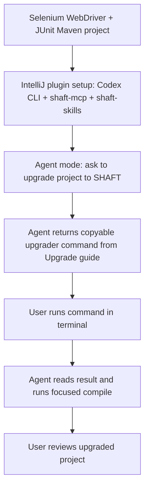
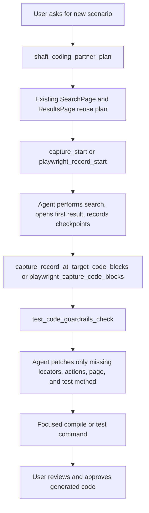
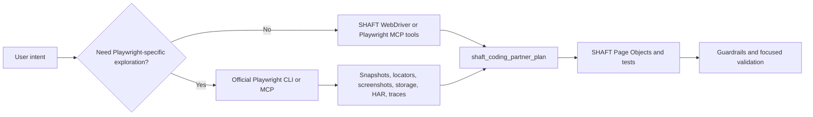
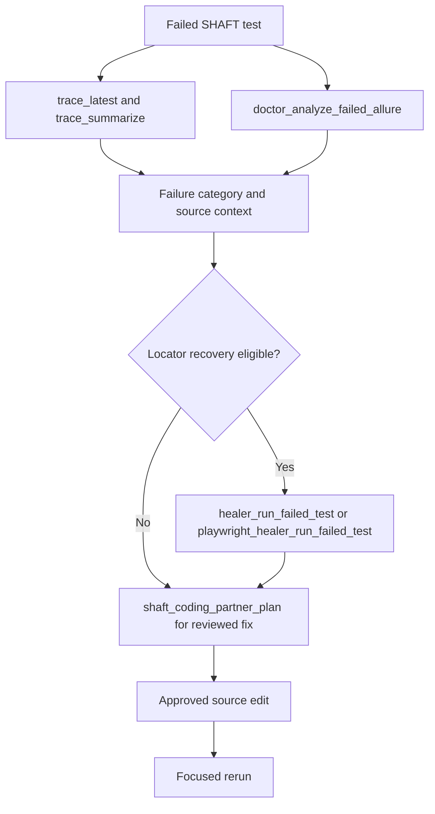

# IntelliJ IDEA plugin

The SHAFT IntelliJ IDEA plugin is the cohesive coding-partner front door for
Java test projects. Use it to ask questions, plan repository-aware changes,
record browser or mobile flows, refactor Selenium/Appium code toward SHAFT,
reuse existing Page Objects, locators, and actions, diagnose failures, and
prepare reviewable repairs from the same tool window.

The plugin is a thin IDE shell over `shaft-mcp`: SHAFT engine behavior, local
CLI agent routing, direct provider adapters, Doctor, Healer, Capture, and
Inspector logic stay in the engine modules.

Install the plugin from JetBrains Marketplace when it is published, then open
**Tools | SHAFT | Open SHAFT**. If you install a plugin ZIP from disk, restart
IntelliJ IDEA when the IDE prompts for restart so the SHAFT tool window and
actions are fully registered. The core Assistant tool window can load without
IntelliJ's Java plugin; Java-specific actions are registered only when Java
support is available. First run shows a four-step setup inside the tool window:

1. **Pick agent** defaults to Codex CLI. Local Codex, Claude, and GitHub
   Copilot families are joined by **Gemini**, a cloud route configured with a
   Google AI Studio API key instead of a local runtime.
2. **Copy command** copies the right installer command for the selected agent
   and shows a short clipboard toast.
3. **Run in terminal** opens the IntelliJ terminal after copying the command.
4. **Check setup** finds the installed SHAFT MCP command automatically,
   verifies the selected local agent and workspace, and reveals
   **Start chatting**.

The Marketplace plugin does not download or execute installer scripts at
runtime. It only helps you choose the agent, copy the terminal installer
command, find the installed `shaft-mcp.args` automatically, then stores and
starts that local command. Installer commands always fetch
`scripts/mcp/install-shaft-mcp` from the `main` branch so copied commands use
the latest published setup script.
After a command has passed setup, opening SHAFT shows the Assistant view.
Without a verified MCP command, the landing view keeps the click-through setup
visible. Unverified settings stay behind the same setup gate until **Check setup**
passes.


Setup opens with a **Connect SHAFT Assistant** summary and a simple vertical
stepper with visible state chips. Only the current useful button is active, so
the path reads as
**Pick agent -> Copy command -> Run in terminal -> Check setup -> Start chatting**.
The setup summary shows the `main` installer source, selected target, selected
runtime, and detected recommended CLI agent. The stdio command stays managed by
SHAFT and is not shown as a setup input. Test failures stay inline with
categorized troubleshooting, client-specific next steps, copyable diagnostic
output, copyable SHAFT MCP docs link, and the retry action remains enabled.

Selecting the **Gemini** family swaps the runtime selector for a
**Gemini API key** field. Paste a Google AI Studio API key; **Check setup**
stores it in IntelliJ Password Safe, saves the Cloud/Gemini Assistant route
with a default model, and enables passing the stored key to the SHAFT MCP
process. The installer target switches to `intellij-plugin` because Gemini
prompts run through SHAFT MCP provider chat instead of an external agent CLI.
If no key is stored, **Check setup** fails inline with a reminder to paste the
key and check again.


Troubleshooting details distinguish the failure type when the plugin can infer
it:

- **Java/runtime**: install or select a Java runtime that can run `shaft-mcp`,
  then retry.
- **Maven artifact resolution**: check Maven Central or proxy access for
  `io.github.shafthq:shaft-mcp`, then retry.
- **Client configuration**: confirm the selected client can write and read its
  MCP configuration file.
- **Client runtime**: install the selected client CLI or add it to `PATH`, then
  retry.
- **MCP command**: rerun the terminal installer, then click **Check setup** so
  SHAFT can find the installed command automatically.
- **MCP probe**: rerun the installer command, then click **Check setup** once it
  finishes.

The setup pane includes one-click actions for copying the installer command,
opening the IntelliJ terminal, checking setup, and copying diagnostic output.
Codex users should verify `codex mcp list`, Claude users should
verify `claude mcp list` or restart Claude Desktop after desktop config changes,
GitHub Copilot users should check the Copilot MCP configuration and
organization MCP policy, and SHAFT IntelliJ plugin users should run the
`intellij-plugin` target before checking setup.

After the test succeeds, setup shows the verified runtime/workspace, **Ready**,
and **Start chatting** action without showing the managed stdio command or
probe logs. The plugin starts the configured stdio command on the first tool
invocation and keeps that MCP server process alive across tool calls, so
session-based tools (a `/record-web` Capture recording, an initialized live
driver) keep running between commands; the process is restarted transparently
when it dies or the configured command changes. The plugin does not embed the
SHAFT engine or manage provider model traffic itself.

## Tool window

Open **Tools | SHAFT | Open SHAFT** to show the tool window. The plugin opens on
the **Assistant** workflow. By default, use Assistant slash commands such as
`/partner`, `/record-web`, `/record-mobile`, `/doctor`, and `/guide`.

If you enable **Settings | SHAFT | Enable advanced workflows and provider
options**, the **Workflow** selector appears at the top of the tool window and
can switch between **Guided**, **Recorder**, **Inspector**, **Triage**,
**Evidence**, **Projects**, and **Advanced**. The selector is used instead of a
crowded tab strip so the controls stay readable in the narrow right-side
IntelliJ tool window. MCP-backed workflow panels use the same verified setup
state as the Assistant; a command must pass setup before feature tools run.

This setting also enables **Expert mode**, which reveals advanced slash commands
in the Assistant composer (e.g., `/mcp`, `/scenarios`, `/guardrails`,
`/browser`, `/mobile`). Basic mode shows only the most-common commands
(`/partner`, `/record-web`, `/record-mobile`, `/doctor`, `/guide`, `/codegen`);
hover the command-help icon to see the full command family without entering
Expert mode.

Use the plugin as the default front door when you are already in IntelliJ:

- Record web journeys with `/record-web` or Recorder, then review WebDriver or
  Playwright code blocks before inserting them into the existing test structure.
- Record mobile/Appium flows with `/record-mobile` or the mobile workflows, then
  reuse generated locator and action blocks in the existing mobile Page Objects.
- Convert Selenium snippets or tests with `/partner` or Guided Coding Partner so
  the plan searches existing Page Objects, locator fields, and action methods
  before suggesting new code.
- For generated GUI code, reuse existing project code first. If a needed action
  or locator is missing, record the complete flow, then insert only the missing
  locators/actions into the planned source anchor. Use Smart Locators and the
  SHAFT locator builder before native `By.xpath(...)`; do not use
  `SHAFT.GUI.Locator.xpath(...)`.
- Start Doctor or Healer workflows with `/doctor` or Triage from failed Allure
  evidence; proposed fixes stay review-only until you apply and verify them.
- Keep WebDriver as the default backend unless the project already uses
  `SHAFT.GUI.Playwright` or the prompt/command explicitly asks for Playwright.

## Agentic E2E workflows

Use these flows as chat contracts. The plugin is the front door, `shaft-mcp`
does repository-aware planning and evidence capture, and the selected local
agent applies source edits only after you enable **Allow source edits** for that
request.

### Upgrade a Selenium Maven project

In Agent mode, ask the assistant to inspect the current Selenium/JUnit Maven
project and return the upgrader command first. The command should be in its own
fenced block, and the agent should wait for you to run it before source edits.
Use the [Upgrade guide](/docs/start/upgrade) as the canonical source for the
copyable command; this page documents the IDE workflow around that command.



Use `basic` when you only want the POM updated, `session` when the agent should
also migrate supported Selenium session setup, and `full` only after reviewing
the higher-risk action rewrites.

### Record a new scenario into existing Page Objects

For the DuckDuckGo example, ask in Agent mode with **Allow source edits**:

```text
Write a scenario where the user searches for shaft_engine, opens the first result,
and asserts the page title of the first result. Reuse the existing DuckDuckGo
search and results page objects, add only missing locators/actions, create a
first-result page object only if none exists, and use SHAFT assertion builders.
```



Checkpoint notes are review intent only. Generated assertions must be real SHAFT
builder calls such as `driver.assertThat().browser()...` or
`driver.element().assertThat(...)`, not raw JUnit/TestNG assertions.

### Delegate browser exploration to Playwright

When a task needs token-efficient snapshots, storage state, network inspection,
console output, tracing, video, PDF, or official Playwright Test Agent planning,
let the local agent use official Playwright CLI or Playwright MCP as a sidecar.
The final Java change still returns through SHAFT planning and guardrails.



Do not paste Playwright TypeScript output into a Java project. Treat Playwright
CLI/MCP output as evidence, then translate the proven behavior into
`SHAFT.GUI.WebDriver` or `SHAFT.GUI.Playwright` syntax based on the project
backend.

### Diagnose and heal a failed test



## Assistant

The **Assistant** workflow is a chat-style view with Ask, Plan, and Agent modes
in the bottom composer. Local CLI prompts call the MCP
`autobot_local_agent_run` tool, which delegates to the engine-side local agent
service in `shaft-pilot-core`. Cloud Ask and Plan prompts call
`autobot_provider_chat` with the selected provider and model.

Supported local routes are:

| Client | Default local command | API key required by SHAFT |
| --- | --- | --- |
| Codex CLI | `codex exec --sandbox read-only -` for Ask/Plan and no-source Agent; workspace-write only with `Allow source edits` | No |
| Claude Code | `claude --print`; Plan and no-source Agent use `--permission-mode plan`; source-edit Agent uses `acceptEdits` | No |
| Copilot CLI | `copilot ask`, `copilot plan`; source-edit Agent uses `copilot agent` | No |

The composer shows a **model** selector and a reasoning **effort** selector for
the active route in both the basic and advanced UI. Local routes list the
models reported by the connected agent CLI (`codex models`,
`claude config list-models`, `copilot models`) and fall back to a curated
catalog per family; cloud routes list a curated catalog per provider, for
example `gemini-3.5-flash`/`gemini-2.5-flash` for Gemini and
`claude-fable-5`/`claude-opus-4-8`/`claude-sonnet-5` for Anthropic. Both
selectors are editable so newer model names can be typed in. The selected
model is passed as `--model` to the local CLIs and as the `model` argument to
`autobot_provider_chat`. Effort levels are Default, Low, Medium, and High:
Codex receives the level as its `model_reasoning_effort` config flag, while
Claude, Copilot, and cloud providers receive a one-line reasoning-effort
preference at the top of the prompt.

Cloud providers are OpenAI, Anthropic, Gemini, and GitHub Models. Their keys
are stored in IntelliJ Password Safe; only the selected cloud provider key is
passed to the MCP process. Cloud `AGENT` mode is disabled because direct
provider chat cannot mutate the local workspace. A cloud route selected during
first-run setup (such as Gemini) stays active in the basic UI; switching
providers ad hoc remains an advanced-mode control.

Use `Ctrl+Enter` or `Command+Enter` to send a prompt. Newly sent prompts scroll
into view immediately, so the chat shows visible feedback before a long-running
response finishes. Press `Escape` to cancel a running request. The selected
local agent appears as compact text such as `Codex CLI`; hover it for the full
route, for example `Agent: Local / Codex / CLI`.
Compact Assistant controls keep JetBrains-style glyphs, including Copy all,
Clear, and Rerun transcript actions. All controls retain accessible names,
status metadata, and tooltips. Code blocks use a light editor-style palette in
light mode and a distinct dark surface in dark mode.
While a prompt runs, the submit icon becomes an animated spinner;
hovering it changes the same square control into cancel. If you cancel, the
request ends with a dedicated final transcript entry and no capture-generated
output is finalized.
Local Agent mode is blocked from
source mutation until the user explicitly approves it for that request. For
browser-only tasks, leave `Allow source edits` off; enable it when the request
requires applying code or source edits. If an Agent-mode continuation such as
"try again" follows an earlier source-edit request, the Assistant still requires
`Allow source edits` before launching the local agent. A custom local agent
command can be supplied for non-standard CLI installations; broad Ask, Plan,
and Agent prompts keep using the selected local route.

Assistant chats are persisted per IntelliJ project. Use the chat selector to
reopen recent contexts, the New chat icon to start a separate context, and the
Clear icon to clear only the active chat. Active chat messages are included as
bounded context for local and cloud Assistant prompts until you click Clear;
New chat starts a separate context. Persisted chats keep rendered messages
only; raw MCP payloads and common token/key values are not stored.

The Assistant understands explicit feature intent and direct commands from the
same chat box. For example, "start mobile recording" maps to
`mobile_record_start`, while `/mobile-record start recordings/mobile.json` runs
the same feature deterministically. Browser control defaults to WebDriver; use
`playwright` in the prompt or command when that backend is required.

Use `/record <url>` to start browser recording at an explicit target URL with
an interactive confirmation prompt. Similarly, `/codegen <path-to-recording.json>`
shows an explicit confirmation before generating Java test code from a saved
recording. These prompts help you verify the correct session and target before
committing to capture or code generation.

Use `review recording` or `review recording recordings/<name>.json` to generate
the same reviewed Capture code blocks without remembering `/codegen`.
After capture approval, the local Agent run shows completion feedback in the
final transcript so you can confirm generation status, outputs, and next
workflow step before continuing.

An empty transcript stays focused on the larger composer instead of adding
starter text below the chat. The run timeline and action controls stay hidden
until the current prompt, selected tool, running, approval, completion,
cancellation, or failure state makes them useful. Type `@` in the prompt, or
use the context icon, to insert supported workflow/tool starters. Type `#` when
the current file or known project artifacts are available.

A single JetBrains-style command-help icon appears in the composer. Hover it to
view the tested command families without filling the chat with command
documentation. The command picker also shows each command summary and example.
Command-help output renders each example on its own line as a fenced command
block, so the IDE copy button can copy one runnable command at a time.
The visible palette includes `/codegen`, `/partner`, `/record-web`,
`/record-mobile`, `/doctor`, `/guide`, `/guardrails`, `/browser`, `/mobile`,
and `/project`.


| Feature | Canonical command | Synonyms | Primary MCP tools |
| --- | --- | --- | --- |
| Command help | `/commands` | `/help`, `/mcp-help`, `/shaft-help` | Local help |
| Assistant routing | `/assistant` | `/agent`, `/ask`, `/plan`, `/clients` | `autobot_local_agent_run`, `autobot_provider_chat`, `autobot_local_agent_clients` |
| Coding partner plan | `/partner` | `/coding-partner`, `/reuse` | `shaft_coding_partner_plan` |
| Browser control | `/browser` | `/web`, `/browse`, `/page`, `/inspect`, `/locator` | `driver_initialize`, `browser_open_intent`, `browser_get_page_dom`, `browser_take_screenshot`, `playwright_initialize`, `playwright_browser_navigate`, `playwright_browser_get_page_dom`, `playwright_browser_take_screenshot` |
| Browser recording and codegen | `/record` | `/rec`, `/capture`, `/codegen`, `/generate`, `/gen`, `/generateTest` | `capture_start`, `capture_start_codegen`, `capture_codegen_features`, `capture_stop`, `shaft_coding_partner_plan`, `capture_code_blocks`, `capture_target_candidates`, `capture_record_at_target_code_blocks`, `capture_backend_comparison`, `capture_evidence_pack`, `playwright_record_start`, `playwright_record_status`, `playwright_record_stop`, `playwright_recording_code_blocks`, `playwright_replay_recording`, `playwright_capture_generate_replay`, `playwright_capture_code_blocks` |
| Mobile control and inspection | `/mobile` | `/appium`, `/device`, `/phone`, `/emulator` | `mobile_toolchain_status`, `mobile_initialize_native`, `mobile_initialize_web_emulation`, `mobile_get_accessibility_tree`, `mobile_take_screenshot` |
| Mobile recording and codegen | `/mobile-record` | `/app-record`, `/inspector-record`, `/mobile-codegen`, `/app-codegen`, `/mobile-replay` | `mobile_record_start`, `mobile_record_stop`, `mobile_recording_code_blocks`, `mobile_record_at_target_code_blocks`, `mobile_replay_recording`, `mobile_inspector_record_prepare` |
| Failure analysis | `/doctor` | `/allure`, `/triage`, `/fixTestFailure`, `/failure`, `/fix` | `doctor_analyze_failed_allure`, `playwright_doctor_analyze_failed_allure`, `doctor_suggest_fix`, `doctor_analyze_trace` |
| Productivity and raw MCP | `/mcp` | `/tool`, `/call`, `/guide`, `/docs`, `/scenarios`, `/guardrails`, `/project`, `/upgrade` | `shaft_guide_search`, `shaft_coding_partner_plan`, `test_automation_scenarios`, `test_code_guardrails_check`, `shaft_project_upgrade` preview, explicit raw tool calls |

`/assistant` and its aliases (`/agent`, `/ask`, `/plan`, `/clients`) discover
Assistant routes and local clients. Broad local and cloud prompts stay on the
selected Assistant route. Direct feature commands such as `/guide`, `/browser`,
`/record`, `/doctor`, `/project upgrade`, and `/mcp` are MCP-backed; if MCP is
not configured, the Assistant shows the SHAFT MCP setup prompt before it runs
that feature command. Natural-language Ask/Plan prompts that need MCP tool
access tell you to switch to Agent mode instead of launching a local agent from
the wrong mode. Project creation from chat returns a review instruction; run
**Create SHAFT Project** from Projects or Guided so the confirmed workflow gate
is used before files are written.

Common examples:

```text
/browser open https://example.com sign in
/browser playwright open https://example.com
/record https://example.com
/partner log in then verify account menu
/codegen recordings/intellij-capture.json
review recording recordings/intellij-capture.json
/mobile status Android
/mobile native Android emulator-5554
/mobile-record inspector Android recordings/inspector.json
/mobile-codegen recordings/mobile.json
/doctor target/allure-results
/doctor fix target/shaft-doctor/doctor-report.json
/mcp browser_get_title {}
```

Responses render as Markdown. Known SHAFT responses, including local agent runs,
provider chat, local client discovery, MCP `content[].text` envelopes, JSON
payloads, and Java snippets, are parsed into readable sections, tables, or
fenced code blocks. When a browser or mobile recording stops successfully, the
Assistant shows the next `/codegen ...` command in its own fenced block.
Unknown structured responses are formatted through the selected Assistant route
when possible; if no formatter is available, the plugin falls back to a local
Markdown-safe JSON/code rendering. Use the copy actions for rendered Markdown,
raw support diagnostics, or the full transcript plus current-session tool
evidence when exporting for issue review.

## Onboarding recording notes

Use this preferred launch path for the recording workflow from a clean, disposable
IntelliJ sandbox/profile so onboarding state stays isolated:

`gradle -p shaft-intellij runIde --args C:/Users/Mohab/IdeaProjects/SHAFT_ENGINE`

On Windows JDK21 onboarding, SHAFT now ensures `%JAVA_HOME%\Packages` exists
before instrumentation starts. The flow shows explicit diagnostics for missing,
invalid, or unwritable `JAVA_HOME` values instead of opaque startup failures.

Use the same onboarding MCP flow: CODEX + CLI, Route = LOCAL, and Mode = AGENT.
Ask/Plan browser-control prompts should be resent in Agent mode when MCP tools
are required. `Allow source edits` stays off for DuckDuckGo/browser flow and is
enabled when the run must change source files. If the step is expressed as
"open the first result," use the scoped 1-indexed XPath
(`(//article[@data-testid='result'])[1]//a[@data-testid='result-title-a']`) for
the first result.
For deterministic verification, finish with a final page title and page-specific
text check after opening that result before approving generated capture output.
Use `discard recording` or `re-record` when a focus or click mistake pollutes
the capture; the Assistant stops the current Capture session with
`discard=true` before restarting.

For recordings, dismiss sandbox-only low-memory or script-launcher warning balloons
without suppressing normal production IDE warnings. IntelliJ Trust Project may
preselect Windows Defender exclusions; leave them unchecked unless exclusions are
explicitly required for that environment.

## Workflows

The workflow selector exposes curated MCP requests for common automation jobs:

- Recorder: Capture start, status, checkpoints, stop, reviewed code blocks,
  target discovery, record-at-target patch previews, backend comparison,
  evidence packs, Playwright recording controls, and replay code generation.
- Inspector: browser and Playwright DOM snapshots, screenshots, mobile
  toolchain status, wrapped Appium Inspector recording, mobile screenshots, and
  accessibility trees.
- Evidence: failed Allure analysis, trace discovery, trace analysis, trace
  summarization, report remediation, guarded reruns, and review-only locator
  proposals.
- Projects: create new SHAFT example projects and preview or apply the modular
  SHAFT upgrader against the open Java project.
- Guided: a Coding Partner section for planning repository-aware work from intent,
  current Java source, selected text, and evidence paths; starter templates for
  recording a browser flow and generating Page Object code, analyzing failed
  Allure results, converting Selenium snippets to SHAFT syntax, creating a new
  SHAFT project, and inspecting current page locators. The guided recorder
  action says **Review code** because it prepares reviewed SHAFT code blocks,
  setup notes, assertion suggestions, locator alternatives, and control-flow
  review output. Templates prefill MCP arguments only; they do not run tools or
  write source by themselves.
- Advanced Tools: WebDriver, Playwright, and mobile playback flows, scenario
  catalog prompts, generated-code guardrail checks, local Assistant client
  discovery, recorder evidence manifests, backend comparison, and official
  SHAFT guide search.

Each category provides editable JSON arguments and calls the matching MCP tool.
This keeps generated code and source edits reviewable in the IDE instead of
hidden inside plugin code.


```json
{"tool": "shaft_project_upgrade", "arguments": {"projectRoot": ".", "upgradeType": "basic", "dryRun": true, "approve": false}}
```

## Record in Java code

Use **Tools | SHAFT | Record SHAFT Flow Here** from a Java file to prepare a
`capture_record_at_target_code_blocks` request for the caret's package, class,
method, and source path. The action defaults the session path to
`recordings/intellij-capture.json`, matching the Assistant's normal browser
recording path. Change it only when you recorded to a different file. After
review approval, keep the same capture session path so generation preserves the
reviewed browser journey instead of rerunning capture.
The generated MCP response includes focused locator/action blocks plus a
preview-only patch block; apply changes only after reviewing that preview and
running the relevant verification command.
This action is available only in IDE installations with Java support enabled.

## Coding partner plan

Use **Guided | Coding Partner | Plan coding partner** or `/partner` before
asking the plugin or an agent to create or refactor code. The action prepares
`shaft_coding_partner_plan` with the
repository path, intent, selected backend, current source path, selected text,
optional evidence paths, and `maxResults=10`.

The MCP response is preview-only. It returns a working-set summary, ranked
reuse matches with existing locators/actions, a structured `stepPlan`,
`recommendedTargetSourcePath`, `recommendedInsertionAnchor`, missing code items,
suggested MCP proof calls, a focused verification command, evidence paths, and
approval warnings. Apply source edits only after reviewing the plan, using the
record-at-target patch preview when codegen is involved, and running the
returned verification command. Record-at-target previews reuse existing locator
fields, skip exact duplicate action lines, and show an apply order before any
agent patch is accepted.

For Selenium-to-SHAFT work, select the legacy snippet or test first and describe
the intended behavior. The plan should preserve working Page Object boundaries
and reuse existing locators/actions before adding new SHAFT code.

## Settings and configuration

Use **Settings | SHAFT** to configure the plugin's connection, execution,
advanced features, and cloud provider credentials. Settings are organized into
four sections:

- **Connection**: Paste or edit the MCP stdio command, test the MCP connection,
  and view the current agent/workspace configuration.
- **Execution**: Choose the local Assistant route (Codex, Claude, or Copilot),
  select the default AI model and reasoning effort, and enable Expert mode to
  reveal advanced commands in the Assistant composer.
- **Advanced**: Configure cloud provider selection for MCP tools and enable
  advanced workflows.
- **Credentials**: Store OpenAI, Anthropic, Gemini, and GitHub API keys in
  IntelliJ Password Safe for use by MCP tools that request provider assistance.

### Expert mode

When you enable **Settings | SHAFT | Enable advanced workflows and provider
options**, the Expert-mode toggle activates on the post-setup settings screen.
Expert mode reveals advanced slash commands in the Assistant composer that are
hidden by default, such as `/mcp`, `/scenarios`, `/guardrails`, `/browser`,
and `/mobile`. Hover the command-help icon in the Assistant to view all
available commands without enabling Expert mode.

### Tool approval

SHAFT MCP tool calls made through the Assistant are gated behind an
interactive approval bubble rendered inline in the chat transcript. When a
command such as `/record` or `/codegen` (or any Assistant feature that calls a
SHAFT MCP tool) is about to dispatch a tool you have not approved yet, the
Assistant shows the tool name and its arguments with a button per approval
scope:

- **Approve once** — allow just this one tool call.
- **Approve tool always** — remember approval for every future call to this
  tool.
- **Approve all tools** — approve every SHAFT MCP tool from now on.
- **Deny** — reject the call; the Assistant reports the denial instead of
  running the tool.

Remembered approvals are stored at the IDE level and survive restarts; **Reset
everything** clears them. Each distinct tool is prompted at most once per run,
so a workflow that calls the same tool repeatedly never prompt-storms you.

When the selected Assistant route is Claude Code, an **Approve all SHAFT
tools** checkbox also appears among the Assistant controls, and approval
requests the Claude Code CLI raises mid-run are forwarded into the same chat
approval flow: existing grants answer silently, anything else renders the
approval bubble, and your decision is written back to the still-running CLI.
Codex and GitHub Copilot CLI have no interactive approval protocol, so the
checkbox and approve buttons are hidden for them; their tool permissions are
baked into the launch command instead (see the source-edit approval notes
above).

### Reset everything

Once initial setup is complete, returning to the settings screen shows the
**Enable expert mode** toggle and a **Reset everything** button. Reset
everything asks for confirmation, then factory-resets every plugin-local data
store:

- SHAFT settings return to factory defaults, so the fresh-install setup view
  renders again.
- Saved provider API keys are removed from IntelliJ Password Safe.
- Tool approvals are cleared: the approve-all flag, remembered per-tool
  approvals, and any pending single-use grants.
- Assistant chat history is deleted for every open project.
- Every open SHAFT tool window re-renders back to the setup view.

**User code is never touched.** Reset everything only deletes plugin-local
data; your Java source, test files, Page Objects, locators, and project
settings remain unchanged.

### Reset and reinstall

The **Reset / reinstall** button appears once setup is complete or when the
details pane is expanded. Clicking it:

- Clears the stored MCP command configuration.
- Clears transient plugin state so setup prompts appear again on next use
  (chat history is preserved; project settings are not affected).
- Copies the installer command to the clipboard for manual reinstallation.

**User code is never touched.** Reset only affects the SHAFT plugin
configuration and MCP connection; your Java source, test files, Page Objects,
locators, and project settings remain unchanged.

Configure Codex, Claude, GitHub Copilot, and other MCP clients outside the
plugin from the [SHAFT MCP guide](/docs/agentic/mcp).

Optional OpenAI, Anthropic, Gemini, and GitHub tokens are stored in IntelliJ
Password Safe and can be passed as MCP process environment variables for the
selected provider. Settings also lets you select the configured SHAFT AI
provider and model used by MCP tools that explicitly request provider
assistance. Direct provider calls remain controlled by `shaft-ai` and the
[provider controls](/docs/agentic/providers); the plugin only selects and
passes the provider configuration.

Settings show whether each provider key is stored, provide explicit clear
controls, and keep a test action for validating the current stdio command before
using the Assistant or workflows.

## Publishing

The engine repository publishes stable builds through the `Publish IntelliJ
Plugin` GitHub Actions workflow after the Maven Central release workflow,
or manually by maintainers. The workflow signs the plugin, verifies it with the
IntelliJ Plugin Verifier, and publishes to the JetBrains Marketplace Stable
channel.

## Related

- [MCP](/docs/agentic/mcp)
- [Pilot](/docs/agentic/pilot)
- [Providers](/docs/agentic/providers)
