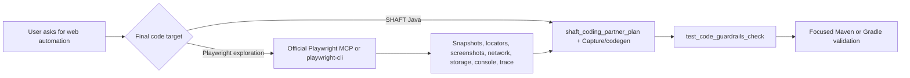

import {McpApplications} from '@site/src/components/DocSnippets';

# Connect shaft-mcp

`shaft-mcp` is the Model Context Protocol server for SHAFT browser,
mobile, Capture, coding-partner planning, Doctor, and healer automation. Web
GUI tools default to SHAFT WebDriver; pass `engine=playwright` to
`driver_initialize` when the project already uses `SHAFT.GUI.Playwright` or the
user explicitly asks for Playwright code, and the same unified `element_*`,
`browser_*`, `capture_*`, `doctor_*`, and `healer_*` tool names keep dispatching
to whichever engine (WebDriver, Playwright, or mobile) is active in the session
instead of requiring separate `playwright_*` tool names. The local Capture/Doctor
CLI commands are listed below. It is
published to Maven Central as the thin `io.github.shafthq:shaft-mcp` JAR, built
in the SHAFT reactor, and depends on the canonical `shaft-engine` module. It
does not add any dependency to ordinary `shaft-engine` consumers.

:::warning Breaking change: 89-tool surface (was 164)
The tool architecture sweep
([ShaftHQ/SHAFT_ENGINE#3866](https://github.com/ShaftHQ/SHAFT_ENGINE/issues/3866))
trimmed `shaft-mcp` from 164 to **89 tools**, with no back-compat shim or
deprecation warning: calling a deleted tool name now fails immediately.

- `natural_act` and `mobile_natural_act` are deleted outright. The
  deterministic `SHAFT.GUI.WebDriver.act(...)` Java API these tools wrapped is
  unaffected; see
  [Natural Language Actions](/docs/reference/actions/GUI/Natural_Language_Actions).
- Every `playwright_*` tool name is removed. `driver_initialize` now takes an
  optional `engine` (`web` default | `playwright` | `mobile_native` |
  `mobile_web`), and unified tools such as `element_click`, `element_type`,
  `browser_get_page_dom`, `capture_start`, `doctor_analyze_failed_allure`, and
  `healer_run_failed_test` dispatch to whichever engine is active
  (`doctor_*`/`healer_*` also take an explicit `backend` parameter).
- Granular mobile tools are absorbed the same way: `element_click`,
  `element_type`, and `element_clear` dispatch to an active mobile session
  (replacing `mobile_tap`, `mobile_type`, `mobile_clear`, `mobile_double_tap`,
  `mobile_long_tap`); `mobile_swipe` replaces the four
  offset/coordinate/element/text swipe tools; `capture_start`/`capture_stop`/
  `capture_status`/`capture_code_blocks`/`capture_record_at_target_code_blocks`
  now dispatch mobile and Playwright recording (replacing
  `mobile_record_start`/`mobile_record_stop`/`mobile_record_status`/
  `mobile_recording_code_blocks`/`mobile_record_at_target_code_blocks`/
  `mobile_replay_recording` and their `playwright_*` twins); `capture_api_start`
  absorbs the standalone mobile API proxy from `mobile_api_record_start`;
  `mobile_inspector_record_start` absorbs `mobile_inspector_record_prepare`, and
  `mobile_inspector_record_status` absorbs `mobile_inspector_record_control`.
  `browser_delete_cookies` absorbs `browser_delete_cookie`/
  `browser_delete_all_cookies`, and `element_upload_file` absorbs
  `element_drop_file_to_upload`.
- New: `capture_step_delete`/`capture_step_reorder` edit a recorded step by its
  stable `stepId` on the active Playwright or mobile recording.
  `driver_initialize` gained an optional nested `mobileOptions` request
  carrying every former `mobile_initialize_native`/
  `mobile_initialize_web_emulation` parameter, and `capture_start`'s optional
  `codegenOptions` absorbs the former `capture_start_codegen` tool.

<details>
<summary>Full list of removed tool names</summary>

`natural_act`, `mobile_natural_act`, `element_click_js`, `element_double_click`,
`element_click_and_hold`, `element_append_text`, `element_set_value_js`,
`element_drag_and_drop_by_offset`, `element_drop_file_to_upload`,
`browser_maximize_window`, `browser_fullscreen_window`,
`browser_delete_all_cookies`, `browser_delete_cookie`, `browser_network_request`,
`capture_start_codegen`, `mobile_clear`, `mobile_tap`, `mobile_type`,
`mobile_double_tap`, `mobile_long_tap`, `mobile_swipe_by_offset`,
`mobile_swipe_coordinates`, `mobile_swipe_element_into_view`,
`mobile_swipe_text_into_view`, `mobile_initialize_native`,
`mobile_initialize_web_emulation`, `mobile_record_start`, `mobile_record_stop`,
`mobile_record_status`, `mobile_recording_code_blocks`,
`mobile_record_at_target_code_blocks`, `mobile_replay_recording`,
`mobile_api_record_start`, `mobile_api_record_status`, `mobile_api_record_stop`,
`mobile_api_record_transactions`, `mobile_inspector_record_prepare`,
`mobile_inspector_record_control`, `mobile_step_delete`, `mobile_step_reorder`,
and all 34 `playwright_*` tools (`playwright_initialize`, `playwright_quit`,
`playwright_browser_navigate`, `playwright_browser_navigate_back`,
`playwright_browser_navigate_forward`, `playwright_browser_new_window`,
`playwright_browser_refresh`, `playwright_browser_set_window_size`,
`playwright_browser_get_current_url`, `playwright_browser_get_title`,
`playwright_browser_get_page_dom`, `playwright_browser_take_screenshot`,
`playwright_browser_storage_state_save`, `playwright_browser_storage_state_load`,
`playwright_element_click`, `playwright_element_click_js`,
`playwright_element_double_click`, `playwright_element_type`,
`playwright_element_clear`, `playwright_element_append_text`,
`playwright_element_set_value_js`, `playwright_element_hover`,
`playwright_element_drag_and_drop`, `playwright_element_upload_file`,
`playwright_element_is_displayed`, `playwright_element_is_enabled`,
`playwright_record_start`, `playwright_record_stop`, `playwright_record_status`,
`playwright_recording_code_blocks`, `playwright_replay_recording`,
`playwright_capture_code_blocks`, `playwright_capture_generate_replay`,
`playwright_doctor_analyze_failed_allure`, `playwright_doctor_suggest_fix`, and
`playwright_healer_run_failed_test`.
</details>
:::

## Applications

Choose your MCP client and copy its command. The page detects your operating
system after it loads and hides desktop applications that are unavailable
there.

<McpApplications />

The command downloads a repository-hosted bootstrap script. The bootstrapper
uses Python 3.9+ when available, or installs a checksum-verified portable Python
runtime in the per-user SHAFT cache when Python is missing. The shared Python
installer prints the SHAFT MCP banner, shows the selected client, resolves
`io.github.shafthq:shaft-mcp:LATEST` from Maven Central without requiring a
local project, verifies checksums, shows progress for long downloads, downloads
the thin JAR to versioned per-user application data, resolves its runtime
dependencies into the **local Maven repository** (`~/.m2/repository`, honoring
a `localRepository` configured in `~/.m2/settings.xml` or a
`SHAFT_MCP_MAVEN_LOCAL_REPOSITORY` override) so future SHAFT projects reuse
the same artifacts, writes a Java argfile, verifies it over stdio, and updates
the selected user configuration without creating a second `shaft-mcp` entry.
Everything already present with a matching checksum is skipped and reported —
a reinstall only downloads what is actually new (Java, the JAR, and each
dependency log their skips, and a summary reports how many dependencies were
downloaded versus already up to date). Run the same command later to install a
newer release. If you run the script without a
target, it prompts you to choose a supported client.

After the MCP setup succeeds, attended installs ask whether to install the
SHAFT agent skills into the current directory and show that directory before
you answer. Press Enter or answer `y` to install `shaft-skills/`; answer `n` to
skip them. Unattended installs, including the IntelliJ IDEA plugin target,
install the skills by default. Use `--install-shaft-skills` to force skill
installation or `--skip-shaft-skills` to disable it.

Installing the skills also installs a generated
[tool catalog](https://github.com/ShaftHQ/SHAFT_ENGINE/blob/main/shaft-skills/references/shaft-mcp-tools.md)
at `shaft-skills/references/shaft-mcp-tools.md`, listing every `shaft-mcp`
tool name and a one-line description. Agents should read this cached catalog
for exact tool names instead of listing tools at runtime, which cuts
consumer-agent token usage. On clients that defer tool schemas until
requested, such as Claude Code's `ToolSearch`, batch-load every tool a task
needs in one lookup instead of one call per tool. A companion
[shaft-cli command reference](https://github.com/ShaftHQ/SHAFT_ENGINE/blob/main/shaft-skills/references/shaft-cli-commands.md)
at `shaft-skills/references/shaft-cli-commands.md` tells agents to prefer the
installed [shaft-cli](/docs/agentic/cli) over raw MCP tool calls, with MCP as
the fallback.

The resulting local stdio process lets SHAFT launch the browser on your desktop
so you can see and interact with the automation session. Do not use the Docker
image for interactive local browser work: its browser runs inside the container
and is not displayed on your desktop.

Then ask your client:

> Use SHAFT to open `https://example.com`, verify the page title, and summarize
> the generated test evidence.

The model provider remains owned by the client. `shaft-mcp` does not request,
store, or proxy the client's model credentials.

For an IDE-native experience in Java projects, start with the
[IntelliJ IDEA plugin](/docs/agentic/intellij). The plugin is the cohesive
front door for Assistant, Coding Partner, Recorder, Doctor, Healer, Inspector,
Projects, and Guide search, while still calling the same MCP tools and keeping
engine, local agent, and provider behavior outside plugin code. It does not run
installer scripts inside the IDE; its first-run setup lets you choose the
target agent or SHAFT IntelliJ plugin, copy the matching installer command, run
it in the IntelliJ terminal, then checks the installation and stores the local
stdio command automatically.

## Runtime workspace

`shaft-mcp` scopes every path a tool reads or writes to one workspace root, and
that root is your project whenever the client can say so:

1. An explicit `-Dshaft.mcp.workspaceRoot=<project>` JVM property or a
   `SHAFT_MCP_WORKSPACE_ROOT` environment variable always wins. The SHAFT
   IntelliJ IDEA plugin sets this per project automatically.
2. Otherwise the directory the MCP client launched the server from becomes the
   workspace. Agent clients such as Claude Code, Codex, and Copilot CLI launch
   stdio servers from the open project, so recordings, generated tests, and
   Doctor analyses land in the project you are working on.
3. The launch directory is skipped when it cannot be a real project: protected
   system locations, unwritable directories, and the bare user home. There the
   installer-provided `-Dshaft.mcp.fallbackWorkspaceRoot` (or the computed
   per-user application-data directory) takes over:

- Windows: `%LOCALAPPDATA%\ShaftHQ\shaft-mcp\work`
- macOS: `~/Library/Application Support/ShaftHQ/shaft-mcp/work`
- Linux: `${XDG_DATA_HOME:-~/.local/share}/shafthq/shaft-mcp/work`

During MCP runs, relative SHAFT artifact paths are resolved under the runtime
root. This includes generated Allure results and reports, downloaded
properties, downloads, videos, services files, dynamic object repository files,
test data, Extent reports, execution summaries, and performance reports.
Explicit absolute path overrides remain absolute.

Use `element_click` and `element_type` with a locator strategy and locator
value; these same tool names dispatch to whichever engine (WebDriver,
Playwright, or mobile) is active in the session -- there is no separate
`playwright_element_click`/`playwright_element_type` family. Type tools keep
generated recording snippets redacted unless the recording flow explicitly
includes sensitive values.

## Guide search for agents

Use `shaft_guide_search` before asking an agent to write or repair SHAFT code.
The tool searches the live official SHAFT guide index and returns cited guide
sections, short excerpts, nearby Java examples, and rules the agent must follow
while generating code.

Good queries are direct and task-shaped:

- `page object model locators SHAFT.GUI.Locator`
- `API request builder response validation`
- `CLI terminal actions files`
- `mobile Appium native locators`
- `Allure failed test troubleshooting`

The guide search covers public docs for GUI, API, CLI, mobile, reporting,
configuration, locators, Page Object Model, Capture, Doctor, Heal, and
troubleshooting. Agents should use the returned URLs as source citations, copy
SHAFT method names only from the guide examples, prefer `SHAFT.GUI.WebDriver`
and `SHAFT.GUI.Locator.*` factory methods for GUI code, use
`driver.element()` or `driver.browser()` scopes for generated web snippets,
and say when the guide does not contain enough evidence for an answer.

## Project creation and upgrade

Use `shaft_project_create` to create a new SHAFT Maven project from the same
example templates, runner/platform choices, optional module rules, GitHub Actions
workflow templates, and Dependabot template used by the guide project generator.

`shaft_project_create` now accepts optional `shaftVersion`. Non-blank values
override the generated `<shaft.version>` directly. Blank or null values default to
the latest published stable `shaft-engine` from Maven Central. Bundled examples
inside the SHAFT repository remain reactor-versioned; generated project POMs are
rewritten during creation.

```json
{"tool": "shaft_project_create", "arguments": {"outputDirectory": "demo-web", "runner": "TestNG", "platform": "web", "shaftVersion": "10.3.0"}}
```

```json
{"tool": "shaft_project_create", "arguments": {"outputDirectory": "demo-web", "runner": "TestNG", "platform": "web", "shaftVersion": ""}}
```

Use `shaft_project_upgrade` on an existing Java/Maven project to run the
modular SHAFT upgrader script. Start with `dryRun: true`; applying changes
requires `dryRun: false` and `approve: true`.

Use `shaft_project_init_agents` to scaffold SHAFT agent/skill bridges into an
existing test repository for a coding-agent loop. Pass `loop: "claude"` to
generate a `.claude/skills/<skill>/SKILL.md` bridge file for every bundled
SHAFT skill plus a root `SHAFT-AGENTS.md` guidance file, or `loop: "codex"`
for the same layout under `.codex/skills/`. Every bridge is generated at call
time from the bundled `shaft-skills/<skill>/SKILL.md` sources shipped inside
the `shaft-mcp` jar, so the generated set always tracks the shaft-mcp build
instead of a hand-duplicated copy. Existing files are left untouched unless
`overwrite: true`; a skipped file is reported as a warning instead of failing
the call, since `targetDirectory` is expected to be an existing repository
that may already carry its own agent configuration. `opencode` uses the same
layout under `.opencode/skills/`, and `vscode` writes
`.github/instructions/<skill>.instructions.md` files instead. Skills marked
`distribution: full` in their frontmatter (such as the `act-as-shaft-dev`
methodology skill) are scaffolded as their complete SKILL.md text rather than
a thin bridge, so a project with no prior agent instructions gets the full
ways-of-working document.

```json
{"tool": "shaft_project_init_agents", "arguments": {"loop": "claude", "targetDirectory": ".", "overwrite": false}}
```

## Planning test coverage

Use `test_plan_explore` to discover testable flows before recording or
writing test code. It breadth-first crawls same-origin pages from an active
SHAFT browser session starting at `targetUrl` (`maxDepth` clamped to 1..3,
`maxPages` clamped to 1..50, default 10), inspects forms, primary navigation
actions, and links with no AI calls, then writes one deterministic Markdown
test plan per discovered flow into `specs/` inside the MCP workspace. Each
plan lists numbered steps, candidate SHAFT locators ranked by the same
pipeline `browser_open_intent` uses, seed data, and a verify section. An
optional `goal` only orders the written plans by relevance and is never sent
to a model provider.

```json
{"tool": "test_plan_explore", "arguments": {"targetUrl": "https://example.test", "goal": "checkout happy path", "maxDepth": 2, "maxPages": 10}}
```

Or from the command line once a `shaft-cli` session is running:

```bash
shaft-cli call test_plan_explore targetUrl=https://example.test goal="checkout happy path" maxDepth=2
```

`test_plan_explore` needs an active session started with `driver_initialize`.
Review the generated `specs/` files with the user before recording or
generating code — the `planning-shaft-tests` skill documents the full
explore, review, codegen, and verify chain (`capture_start` with
`codegenOptions` for UI flows, `capture_api_start`/`capture_api_generate` for
API flows, or
`shaft_coding_partner_plan`/`shaft_coding_partner_diff` to insert into an
existing repository), finishing with a scoped `verify_run_focused` run.

## Test automation scenario catalog

Use `test_automation_scenarios` when the user asks an agent to create,
refactor, or troubleshoot a SHAFT test suite and the agent needs a concrete
flow to follow. The tool returns scenario ids, sample prompts, the MCP tools to
call, the repository pattern to use, guardrails, and completion criteria.

Common catalog entries include:

| Scenario | Agent action | Flow concludes when |
|---|---|---|
| `api-openapi-contract-suite` | Read the Swagger/OpenAPI contract, group operations by tag/resource, write reusable request builders and response validators under `src/main/java`, then write TestNG scenarios under `src/test/java`. | Focused API tests compile, run, and validate against the configured OpenAPI contract. |
| `web-pom-fluent-test` | Inspect the page with browser DOM/screenshot tools, create or extend Page Object classes, and write fluent SHAFT actions and assertions. | The headless GUI test passes and page object methods are reusable. |
| `web-locator-refactor` | Replace brittle locators with SHAFT smart locators, ARIA locators, or stable `SHAFT.GUI.Locator.*` locators. | Affected tests pass without `@FindBy`, PageFactory, or absolute XPath. |
| `web-capture-to-pom` | Record with Capture, generate WebDriver or Playwright replay snippets, then use the returned deterministic POM guidance to move stable locators and actions into existing page objects. | Replay-derived code is integrated instead of pasted as a generic generated class. |
| `web-playwright-pom-fluent-test` | Initialize `driver_initialize` with `engine=playwright`, use the same `browser_*`/`element_*` tools to inspect the page, then write fluent `SHAFT.GUI.Playwright` page objects and tests. | The Playwright test compiles and follows the existing project backend. |
| `web-playwright-record-replay` | Record Playwright MCP actions, generate replay snippets, review the returned Capture report/review metadata, and move stable actions into Playwright page methods. | The replay code is reviewed, guarded, and inserted into Playwright classes. |
| `mobile-native-appium` | Inspect contexts and accessibility trees, prefer accessibility ids through `SHAFT.GUI.Locator.*`, and create mobile page objects plus TestNG tests. | The native mobile test compiles; any unavailable device/cloud run is reported. |
| `mobile-record-replay` | Record mobile actions through MCP, generate replay, ranked locator inventory, Page Object draft, and record-at-target blocks, then move them into mobile page methods. | The replay code is reviewed, guarded, and inserted into the right classes. |
| `failure-trace-first-analysis` | Read `target/shaft-traces` with `trace_latest`, summarize the failed structured action, and use `doctor_analyze_trace` before opening raw Allure evidence. | The failed action, locator, exception, source context, and next MCP tool or code-change category are reported. |
| `failure-doctor-analysis` | Analyze Allure results with Doctor and separate product defects, test defects, and infrastructure issues. | The first actionable failure and next validation step are reported. |
| `failure-healer-loop` | Rerun a guarded failing Selenium or Playwright test, analyze fresh evidence, and propose review-only fixes. | The failure is fixed by validation or reported as blocked/product behavior. |
| `report-generate-and-summarize` | Generate the report and summarize SHAFT/Allure evidence. | The report path and high-signal pass/fail summary are returned. |
| `ci-local-validation` | Load validation gotchas, run affected checks first, then escalate only when needed. | The agent reports exact commands, results, and remaining risk. |

Before finalizing generated Java, call `test_code_guardrails_check`. It is a
lexical check, so agents still need compile or runtime validation afterwards.
The tool fails code that contains `Thread.sleep(...)`, absolute XPath such as
`By.xpath("/html/body/...")`, or obvious hard-coded secrets in headers, tokens,
passwords, and API keys. It warns on Selenium implicit waits, direct
`driver.findElement`/`findElements` calls, hard-coded headed browser setup,
direct `System.getProperty()`, and PageFactory usage. Prefer SHAFT
waits/actions/assertions and the locator order from the catalog: smart/semantic
locators, ARIA locators, the `SHAFT.GUI.Locator` builder, then native
`By.xpath(...)` only when nothing better exists. Generated code should not use
`SHAFT.GUI.Locator.xpath(...)`.

## Playwright MCP and CLI coverage

SHAFT can work beside official Playwright MCP and `playwright-cli`; it does not
need to replace them. Use SHAFT tools when the final output is a Java SHAFT
project, Page Object, Capture session, Doctor report, or Heal proposal. Use
official Playwright as a sidecar when the agent needs Playwright-native browser
exploration, then bring the evidence back into SHAFT.



| Official Playwright capability | SHAFT coverage path |
|---|---|
| MCP accessibility snapshots and browser actions | `browser_get_page_dom`, `browser_open_intent`, `browser_aria_snapshot` (whole-page or single-element YAML aria snapshot), `browser_accessibility_audit` (non-asserting axe-core WCAG audit), and `element_*` click/type tools -- the same tool names dispatch to a Playwright session once `driver_initialize` was called with `engine=playwright`. |
| Screenshots, navigation, tabs, uploads, drag, hover, and form input | The unified `browser_*`/`element_*` tool family, engine-dispatched, plus Capture action recording and replay. |
| Codegen options for test id, viewport, device, color scheme, geolocation, language, timezone, storage state, proxy, HAR, user agent, and user data directory | `capture_start`'s optional `codegenOptions`, `capture_codegen_features`, `capture_code_blocks`, and `capture generate --backend playwright`. `codegenOptions` also accepts `saveHarGlob` (URL glob filter) and `saveHarContent=full` (complete redacted request/response bodies instead of truncated previews). |
| Storage-state save/load, network request inspection, and mock routes | `browser_storage_state_save`/`browser_storage_state_load` (same JSON on WebDriver or Playwright sessions); `browser_network_requests` for observed traffic, with an optional `id` narrowing to one transaction's full detail (not supported on the Playwright engine); `browser_route`/`browser_unroute` for mock responses. |
| Playwright CLI console, trace, video, PDF, and named-session commands | Use official `playwright-cli` as delegated evidence gathering; attach paths or summaries to `shaft_coding_partner_plan`, Doctor, Capture, or the final PR evidence. |
| Playwright Test Agents planner/generator/healer | Use `npx playwright init-agents --loop=codex` for Playwright Test projects; for SHAFT Java projects, map the planner output into `test_automation_scenarios`, Capture, Doctor, Heal, and reviewed Java source edits. |

Do not paste Playwright TypeScript generated tests into a Java Maven project.
Treat `browser_run_code_unsafe`, `playwright-cli run-code`, and `eval` as
trusted-client-only steps; report the command and evidence path instead of
embedding arbitrary code in SHAFT source.

## Coding partner plan

Use `shaft_coding_partner_plan` before generating or repairing repository code.
It is a read-only planning tool for IntelliJ, Codex, Claude, Copilot, and other
MCP clients that have SHAFT skills installed.

```json
{
  "tool": "shaft_coding_partner_plan",
  "arguments": {
    "repositoryPath": ".",
    "intent": "Add a login scenario and reuse the existing LoginPage",
    "backend": "WebDriver",
    "currentSourcePath": "src/test/java/pages/LoginPage.java",
    "selectedText": "",
    "artifactPaths": ["target/shaft-traces/latest"],
    "maxResults": 10
  }
}
```

The schema `1.1` response includes a working-set summary, ranked
`reuseMatches`, existing locator/action summaries, a deterministic `stepPlan`,
`recommendedTargetSourcePath`, `recommendedInsertionAnchor`, `missingCodeItems`,
suggested MCP proof calls, a focused verification command, evidence paths, and
approval warnings. The tool does not edit source. After review, use Capture
record-at-target tools or the calling agent's normal patch workflow to apply
only the missing code.

## Recording web API traffic

Use the API capture tools to record HTTP request and response traffic during
browser-based test execution. These tools extend the standard Capture lifecycle
with automatic API event collection, body externalization, and sensitive header
redaction.

### `capture_api_start`

Start a managed Chrome or Edge browser session and begin recording API traffic
alongside browser interactions. This tool requires browser support for Chrome
DevTools Protocol (CDP); Firefox and Safari are not supported.

**Parameters:**
- `targetUrl` (string, required): Initial http, https, or file URL for the managed browser
- `browser` (string, optional): Chrome or Edge; blank selects Chrome
- `headless` (string, optional): Whether to launch without a visible window; blank selects repo policy (headless)
- `recordNetworkActivity` (boolean, required): Whether to capture network transactions
- `excludeAssetTypes` (string, optional): Comma-separated asset types to exclude
- `includeOnlyDomains` (string, optional): Comma-separated domains to include; empty includes all
- `excludePatterns` (string, optional): Comma-separated URL patterns to exclude
- `sanitizeHeaders` (boolean, required): Whether to redact sensitive header values

**Returns:**
- Safe recorder status with network transaction count
- Session state (`ACTIVE`, `COMPLETED`, `INCOMPLETE`)
- Event count and network metrics

### `capture_api_status`

Query the status of the current active API capture recording. No parameters required.

**Returns:**
- `state`: Recording state (`ACTIVE`, `COMPLETED`, `INCOMPLETE`)
- `eventCount`: Number of captured browser interactions and API events
- `readiness`: Recording readiness state
- `warnings`: List of deterministic warnings (unsupported interactions, network errors, etc.)
- `outputPath`: Absolute path to the active capture session file

### `capture_api_stop`

Stop the active API capture recording.

**Parameters:**
- `stop` (boolean, required): Must be `true` for safety confirmation
- `discard` (boolean, optional): Whether to delete capture artifacts after shutdown

**Returns:**
- Final recorder status with network transaction counts
- Session file path

### `capture_api_transactions`

Query and retrieve the list of captured API transactions (HTTP request/response pairs)
from the active recording. Returns a structured list of all network events recorded
so far, including request details, response metadata, and capture timestamps.

**Parameters:**
- `limit` (integer, required): Maximum transactions to return (0 = all)
- `includeAssets` (boolean, required): Whether to include asset requests (images, fonts, stylesheets)

**Returns:**
- Ordered list of network transaction summaries, each containing:
  - `transactionId`: Unique transaction identifier
  - `method`: HTTP method (GET, POST, PUT, DELETE, etc.)
  - `sanitizedUrl`: Redacted URL without credentials or sensitive query params
  - `statusCode`: HTTP response status code (0 if failed/blocked)
  - `resourceKind`: Inferred resource type (document, xhr, fetch, stylesheet, image, font, other)
  - `durationMs`: Transaction duration in milliseconds
  - `requestSizeBytes`: Request body size in bytes (0 if no body)
  - `responseSizeBytes`: Response body size in bytes (0 if unavailable)
  - `failureReason`: Network or security error reason (empty if successful)
  - `responseHeaders`: Redacted response headers (excludes sensitive values)
  - `correlatedUiSequence`: List of correlated UI event IDs if any
  - `bodyRefId`: Safe reference to stored body content if present
  - `timestamp`: When the transaction started

## API capture privacy and safety

- **No secrets in session (by default):** When `capture.api.storeSecretsLocally=false` (default), authorization headers and sensitive data are stored via `bodyRefId` reference instead of inline values, and the SHAFT privacy classifier prevents typed secrets and credentials from entering the persistent session JSON
- **Body externalization and reference handling:** Request/response bodies are stored via `bodyRefId` references in captured transactions for privacy preservation; the real body content is stored separately and referenced safely
- **Secret storage control:** Set `capture.api.storeSecretsLocally=true` to store authorization headers inline for testing purposes (not recommended for production)
- **Request/response body handling:** Bodies captured during recording are limited by `capture.api.maxBodyBytes=1048576` (1 MB default); bodies exceeding this limit are truncated
- **First-party filtering:** Use `capture.api.firstPartyOnly=true` (default) to record only API calls from the primary domain, or set to false to include all cross-origin requests
- **Asset filtering:** Set `capture.api.includeAssets=false` (default) to exclude image, CSS, font, and other static assets, or set to true to include them in the capture
- **Safe review:** The generated workbench HTML and capture review summary omit secrets and report only counts and rule names, never exposed values

## Trace-first failure workflow

When a SHAFT WebDriver run writes persisted trace artifacts under
`target/shaft-traces`, agents can diagnose the latest failure without manually
opening Allure attachments:

```json
{"tool": "trace_latest", "arguments": {"maxResults": 3}}
{"tool": "trace_summarize", "arguments": {"tracePath": "target/shaft-traces/CheckoutTest.pay/index.json"}}
{"tool": "doctor_analyze_trace", "arguments": {"tracePath": "target/shaft-traces/CheckoutTest.pay/index.json", "backend": "webdriver"}}
```

Use `trace_read` only when the summary is not enough. Its output is redacted,
bounded by `maxCharacters`, and reports whether truncation occurred:

```json
{"tool": "trace_read", "arguments": {"tracePath": "target/shaft-traces/CheckoutTest.pay/index.json", "maxCharacters": 12000}}
```

If you see an `AccessDeniedException` under `C:\Windows\system32`, the MCP host
launched from a protected Windows directory. Upgrade to a release with the
app-data fallback, or set `SHAFT_MCP_WORKSPACE_ROOT` to a writable directory.

## Build from source

Run from the repository root:

```bash
mvn -pl shaft-mcp -am test
mvn -pl shaft-mcp -am install -DskipTests -Dgpg.skip
mvn -pl shaft-mcp dependency:copy-dependencies -DincludeScope=runtime \
  '-DoutputDirectory=${maven.multiModuleProjectDirectory}/shaft-mcp/target/dependency' \
  -DskipTests -Dgpg.skip
python3 scripts/ci/validate_shaft_mcp_transports.py
```

The packaged server supports:

- stdio by default, with protocol messages only on stdout and logs on stderr;
- Streamable HTTP with `--spring.profiles.active=http`, at `/mcp`;
- managed recording through `capture_start`, `capture_status`, and
  `capture_stop`, with no AI provider required;
- web API traffic capture through `capture_api_start`, `capture_api_status`,
  `capture_api_stop`, and `capture_api_transactions` for recordings that include HTTP
  request/response events, with automatic secret-reference handling, size limiting,
  first-party/asset filtering, and privacy enforcement; Chrome/Edge browsers with
  DevTools Protocol support only;
- deterministic WebDriver TestNG generation through `capture_generate_replay`,
  `capture_code_blocks`, and `capture_record_at_target_code_blocks`, with
  compile, optional replay, local
  deterministic code-review warnings, existing-suite target candidates, focused
  source-anchor insertion snippets, preview-only patch blocks,
  setup/assertion/control-flow review blocks, locator-confidence queues,
  validation back-links, selected and alternative locator expressions,
  intent-derived default names, generated review headers, compact fallback
  locator helpers, the `capture-page-object-draft` block, backend comparison
  summaries through `capture_backend_comparison`, local review manifests through
  `capture_evidence_pack`, and review-only AI enrichment phases;
- deterministic Playwright TestNG generation through the same
  `capture_generate_replay` and `capture_code_blocks` tools (optional `backend`
  parameter, defaulting to the active engine; absorbs the former
  `playwright_capture_generate_replay`/`playwright_capture_code_blocks`/
  `playwright_replay_recording`) when the target repository uses
  `SHAFT.GUI.Playwright`, plus local Capture CLI generation through
  `capture generate --backend playwright`;
- explicit Playwright browser, element, screenshot, DOM, action recording,
  playback, and copy-paste replay through the same unified `browser_*`,
  `element_*`, and `capture_*` tool names used for WebDriver -- there is no
  separate `playwright_*` tool family. `capture_code_blocks` returns
  Capture-compatible `captureSessionPath`, generated `sourcePath`,
  `testDataPath`, `reportPath`, `reviewPath`, and report metadata when the
  recorded actions map to the Capture schema;
- deterministic diagnosis through `doctor_analyze_failed_allure`, with an
  optional `backend` (web|playwright, defaults to web) selecting the
  generated remediation snippets' engine (absorbs the former
  `playwright_doctor_analyze_failed_allure`), restricted to explicit input
  paths and allowed roots, with an optional separately identified provider
  advisory when Pilot AI is explicitly enabled;
- persisted trace discovery and deterministic trace analysis through
  `trace_latest`, `trace_read`, `trace_summarize`, and `doctor_analyze_trace`,
  restricted to the MCP workspace and bounded for raw trace reads;
- guarded test healing through `healer_run_failed_test`, with an optional
  `backend` (web|playwright, defaults to web) selecting the generated
  snippets' engine (absorbs the former `playwright_healer_run_failed_test`),
  which reruns tokenized Maven validation commands, analyzes fresh Allure
  evidence through Doctor, and returns review-only fixes plus an agent replay
  handoff;
- explicit browser element actions through `element_click` and `element_type`,
  using locator strategy and locator value arguments, dispatching to whichever
  engine (WebDriver, Playwright, or mobile) is active in the session;
- storage-state save/load through `browser_storage_state_save`/
  `browser_storage_state_load`, writing and reading the same JSON schema
  regardless of the active engine, so a file saved from one backend loads on
  the other;
- observed network transaction listing and detail through
  `browser_network_requests` (method, URL, status, sizes, and a truncated
  redacted body preview; full bodies require a Capture session with
  `saveHarContent=full`), whose optional `id` parameter narrows to one
  transaction's full detail (absorbs the former `browser_network_request`
  tool; not supported on the Playwright engine), plus mock network routes
  through `browser_route` and `browser_unroute`;
- official guide search through `shaft_guide_search`, so agents can retrieve
  cited SHAFT best practices, API/GUI/CLI examples, locators, Page Object Model
  guidance, and troubleshooting steps before writing code;
- structured test automation playbooks through `test_automation_scenarios`,
  repository-aware coding partner plans through `shaft_coding_partner_plan`,
  plus generated-code guardrail checks through `test_code_guardrails_check`;
- deterministic, no-AI-call test planning through `test_plan_explore`, which
  crawls the active session and drafts Markdown flow plans into `specs/`, and
  agent/skill scaffolding for existing test repositories through
  `shaft_project_init_agents`;
- mobile web emulation and native Android/iOS execution through the same
  `driver_initialize` tool, passing `engine=mobile_web`/`mobile_native` plus a
  nested `mobileOptions` request carrying every former
  `mobile_initialize_web_emulation`/`mobile_initialize_native` parameter;
  web-emulation results include a `deviceProfile` object with resolved
  viewport, user agent, device scale factor, and touch/mobile flags when SHAFT
  can determine them;
- mobile inspection through `mobile_take_screenshot`,
  `mobile_get_accessibility_tree`, context switching, and the same
  `element_click`/`element_type`/`element_clear` and `mobile_swipe` action
  tools used for locator-based tapping, typing, and swiping, plus rotation,
  keyboard, backgrounding, app activation, recording, playback, and
  copy-pasteable Java action blocks through `capture_start`/`capture_stop`/
  `capture_code_blocks`;
- wrapped Appium Inspector mobile recording through
  `mobile_toolchain_status`, `mobile_inspector_record_start` (absorbs the
  former `mobile_inspector_record_prepare`), `mobile_inspector_record_status`
  (absorbs the former `mobile_inspector_record_control`), and
  `mobile_inspector_record_stop`. `mobile_toolchain_status` returns structured
  dependency diagnostics with availability, detected path or version, failure
  cause, and repair guidance. `mobile_inspector_record_start` reports
  `adb devices -l`, cached Android AVDs, relevant diagnostic warnings,
  suggested capabilities, and any Android emulator creation proposal before
  the user confirms startup. Recorded Inspector gestures are matched against
  the current accessibility tree/source and converted to locator actions
  where possible; coordinate actions are kept only as warned fallbacks;
- editing a recorded step by its stable `stepId` on the active Playwright or
  mobile recording through `capture_step_delete`/`capture_step_reorder`;
- legacy SSE endpoint properties as configuration aliases during migration.

The intent-based `natural_act`/`mobile_natural_act` tools were deleted outright
(no deprecation shim): trust-gated natural-language execution through MCP is
gone, though the underlying deterministic `SHAFT.GUI.WebDriver.act(...)` Java
API is unaffected -- see
[Natural Language Actions](/docs/reference/actions/GUI/Natural_Language_Actions).

The HTTP port defaults to `8081` and can be overridden with `PORT` or
`--server.port`.

## MCP command reference

The same main class also provides local SHAFT Capture and Doctor CLIs. Use `;`
instead of `:` in `MCP_CP` on Windows. The `capture generate` subcommand shown
below is a separate, local-only CLI command, distinct from the MCP tool
`capture_generate_replay` described above:

```bash
MCP_CP="shaft-mcp/target/shaft-mcp-<version>.jar:shaft-mcp/target/dependency/*"
MCP_MAIN="com.shaft.mcp.ShaftMcpApplication"

java -cp "$MCP_CP" "$MCP_MAIN" capture start \
  --url https://example.test --browser chrome --output recordings/example.json \
  --session-goal "record checkout happy path"
java -cp "$MCP_CP" "$MCP_MAIN" capture start \
  --url https://example.test --browser chrome --output recordings/mobile.json \
  --device "Pixel 7" --geolocation "30.0444,31.2357" \
  --timezone Africa/Cairo --color-scheme dark --save-har target/capture.har
java -cp "$MCP_CP" "$MCP_MAIN" capture status
java -cp "$MCP_CP" "$MCP_MAIN" capture checkpoint \
  --kind FLOW_START --description "login as admin"
java -cp "$MCP_CP" "$MCP_MAIN" capture checkpoint \
  --kind FLOW_END --description "login as admin"
java -cp "$MCP_CP" "$MCP_MAIN" capture stop
java -cp "$MCP_CP" "$MCP_MAIN" capture generate \
  --session recordings/example.json --output-dir generated-tests \
  --enable-fallback-locators
java -cp "$MCP_CP" "$MCP_MAIN" capture generate \
  --session recordings/example.json --backend playwright \
  --output-dir generated-playwright
java -cp "$MCP_CP" "$MCP_MAIN" capture generate \
  --session recordings/example.json --output-dir generated-tests \
  --control-flow-preview
java -cp "$MCP_CP" "$MCP_MAIN" capture generate \
  --session recordings/example.json --output-dir generated-tests \
  --apply-control-flow-preview generated-tests/target/shaft-capture/control-flow-preview.json
java -cp "$MCP_CP" "$MCP_MAIN" capture generate \
  --session recordings/example.json --output-dir generated-tests \
  --target-source src/test/java/com/acme/CheckoutTest.java \
  --insert-after replayCheckout
java -cp "$MCP_CP" "$MCP_MAIN" doctor analyze \
  --input allure-results --allowed-root "$PWD" \
  --output-dir target/shaft-doctor
java -cp "$MCP_CP" "$MCP_MAIN" doctor propose-fix \
  --repository "$PWD" \
  --base-sha <full-approved-sha> \
  --diagnosis target/shaft-doctor/doctor-report.json \
  --evidence-bundle target/shaft-doctor/doctor-evidence.json \
  --issue <issue-or-session> \
  --allowed-path src/test/java/example/CheckoutTest.java \
  --repair-input repair-input.json \
  --output-dir target/shaft-doctor/repairs
java -cp "$MCP_CP" "$MCP_MAIN" doctor publish-draft-pr \
  --manifest target/shaft-doctor/repairs/repair-proposal-<id>.json \
  --approval-token <token-from-reviewed-proposal> \
  --approve
```

See [SHAFT Capture](/docs/agentic/capture) for checkpoint, runtime-directory,
privacy, generation, replay, enrichment approval, browser-support, and
recovery details.

See [SHAFT Doctor](/docs/agentic/doctor) for evidence categories, allowlisted path
handling, deterministic rules, redaction, offline bundle analysis, optional
provider advisories, and safe fallback behavior.

## Healing failed Selenium or Playwright tests

`healer_run_failed_test` is the Selenium/SHAFT counterpart to test-agent
healer loops: it reruns the failing test, inspects the fresh SHAFT Allure
evidence, asks Doctor for the latest diagnosis, and stops when the guarded run
passes or when guardrails block more attempts. If the target repository has no
SHAFT dependency at all, the guardrail stops before running any Maven build,
since such a repository can never produce SHAFT Allure evidence.

Pass `backend=playwright` for tests built around `SHAFT.GUI.Playwright`. It
uses the same guardrails and evidence handling, but returns Playwright-oriented
remediation snippets and directs the agent to the same `element_*`/`browser_*`
replay and inspection tools (dispatched to the active Playwright engine).

The tool accepts a repository root, a tokenized Maven command, an output
directory, optional source-path allowlists, and explicit approvals for
screenshots, page snapshots, network validation, and configured SHAFT provider
advisories. Test-running commands are forced headless and run offline by
default. Shell syntax, release/deploy goals, external Maven settings, and
worktree-escape paths are rejected.

When the healer returns a failed diagnosis, the calling MCP agent may use its
own LLM and the matching SHAFT MCP browser, DOM, screenshot, element, and
replay tools to inspect the current UI. The same tool names cover Selenium and
Playwright tests, dispatching to whichever engine the session's
`driver_initialize` call selected. This agent-side reasoning does not require a
SHAFT provider API key.

The healer never edits source or publishes a change by itself. Locator, wait,
test-data, assertion, and product-bug recommendations remain review-only until
the user confirms the fix. If Doctor classifies the failure as product
behavior, the result is reported as a suspected product bug instead of a test
patch.

See [Mobile and Flutter testing](/docs/testing/mobile) for Appium setup,
mobile web emulation, native device configuration, MCP screenshots, accessibility
trees, and record/playback usage.

See [Natural Language Actions](/docs/reference/actions/GUI/Natural_Language_Actions)
for deterministic `driver.act(...)` patterns, trust thresholds, allowed-action
filters, and optional planner fallback behavior.

See [SHAFT Pilot](/docs/agentic/pilot) for installation, provider configuration,
Capture and Doctor examples, privacy defaults, and client-specific MCP setup.
Maintainers should use the [SHAFT Pilot release runbook](/docs/maintainers/pilot-release)
for the deterministic release gate and standalone-repository archival order.

## Authentication boundary

`shaft-mcp` does not require or store OpenAI, Anthropic, Google, Microsoft, or
Ollama credentials. The MCP client authenticates its own model/provider
session. Configure only browser/Grid settings required by the SHAFT tools, such
as `REMOTE_DRIVER_ADDRESS`.

Browser, filesystem, and GitHub mutations should remain approval-gated in the
client. Start with a tool allowlist when the client supports one.

The `natural_act`/`mobile_natural_act` tools that used to temporarily enable
natural-language execution for a call were deleted outright in the tool
architecture sweep, with no replacement tool. Argument values are still never
written to SHAFT logs for any MCP tool call.

## What the installer configures

The bootstrap script uses Python 3.9+ when available. If Python is missing, it
installs a checksum-verified portable Python runtime under the per-user SHAFT
cache. The shared Python installer then uses the local Java 25 when available.
If Java 25 is missing, it installs a per-user cached Java 25 runtime during the
same command. It downloads the released thin `shaft-mcp` JAR and runtime
dependencies directly from Maven Central, verifies checksums, shows progress
for large downloads, writes a Java argfile, probes the server over stdio, and
writes the selected client configuration itself.

The script creates a local stdio server named `shaft-mcp`. It records the
absolute Java 25 executable and the absolute versioned argfile path so GUI
clients do not depend on their inherited `PATH`. The argfile carries only
`-Dshaft.mcp.fallbackWorkspaceRoot=<per-user work directory>`: the directory
your agent launches the server from stays the workspace (so tools operate on
your open project), and the fallback applies only when that launch directory is
a protected system location or the bare user home.

`claude` configures Claude Code. `claude-desktop` configures Claude Desktop on
Windows or macOS and requires restarting Claude Desktop. GitHub Copilot for
IntelliJ IDEA uses the JetBrains Copilot `mcp.json` configuration and may need
the IDE to reload after the file changes.

Configuration is per-user only. If the current project already defines a
`shaft-mcp` server that would override the user entry, the installer stops
without editing the project. Every user configuration mutation is backed up,
verified, and rolled back on failure.

At the end of a successful install, the script prints the installed
`shaft-mcp` version, the configured client, the restart or new-session action,
the SHAFT skills install path or skip decision, and this user guide link.

The MCP client remains responsible for tool approvals and model
authentication.

## Manual configuration

Use manual configuration when the IntelliJ IDEA plugin cannot infer an installed
stdio command, or when the installer cannot update your chosen target. You need
Java 25, the selected client or plugin target, the thin `shaft-mcp` JAR, its
runtime dependencies, a writable runtime workspace, and absolute paths for both
the Java executable and an argfile.

Create `/absolute/path/to/shaft-mcp.args`:

```text
"-Dshaft.mcp.fallbackWorkspaceRoot=/absolute/path/to/shaft-mcp-work"
-cp
"/absolute/path/to/shaft-mcp.jar:/absolute/path/to/lib/*"
com.shaft.mcp.ShaftMcpApplication
```

To pin the workspace to one project regardless of the launch directory, add
`"-Dshaft.mcp.workspaceRoot=/absolute/path/to/your-project"` as the first
argfile line (or set `SHAFT_MCP_WORKSPACE_ROOT` in the server environment).

Use `;` instead of `:` in the classpath on Windows. The JVM property paths may
use forward slashes on every operating system.

Connect Codex to shaft-mcp with this local stdio configuration:

Follow the [official Codex MCP documentation](https://developers.openai.com/codex/mcp)
for client-specific settings and approval policy.

```toml
[mcp_servers.shaft-mcp]
command = "/absolute/path/to/java"
args = ["@/absolute/path/to/shaft-mcp.args"]
```

Claude Code user-scope configuration:

```bash
claude mcp remove shaft-mcp -s user
claude mcp add -s user shaft-mcp -- "/absolute/path/to/java" "@/absolute/path/to/shaft-mcp.args"
```

Claude Desktop configuration:

```json
{
  "mcpServers": {
    "shaft-mcp": {
      "command": "/absolute/path/to/java",
      "args": ["@/absolute/path/to/shaft-mcp.args"]
    }
  }
}
```

GitHub Copilot local configuration:

```json
{
  "mcpServers": {
    "shaft-mcp": {
      "type": "local",
      "command": "/absolute/path/to/java",
      "args": ["@/absolute/path/to/shaft-mcp.args"],
      "tools": ["*"]
    }
  }
}
```

Codex also supports direct Streamable HTTP:

```toml
[mcp_servers.shaft-mcp]
url = "https://your-shaft-mcp.example/mcp"
default_tools_approval_mode = "prompt"
```

## Remote clients

Containers and Streamable HTTP are intended for remote, shared, or headless
deployments where a visible desktop browser is not required.

Start the server locally for testing:

```bash
java -cp "$MCP_CP" "$MCP_MAIN" --spring.profiles.active=http
```

Use the HTTPS `/mcp` URL for ChatGPT developer mode/apps, the Claude API MCP
connector, Copilot cloud agents, Codex, and other Streamable HTTP clients.
ChatGPT and cloud-agent clients require a reachable HTTPS deployment; they
cannot launch a JAR on the user's workstation.

Current client references:

- [Codex MCP](https://developers.openai.com/codex/mcp)
- [Connect an MCP server to ChatGPT](https://developers.openai.com/apps-sdk/deploy/connect-chatgpt)
- [Claude MCP](https://docs.anthropic.com/en/docs/claude-code/mcp)
- [Gemini CLI MCP](https://github.com/google-gemini/gemini-cli/blob/main/docs/tools/mcp-server.md)
- [GitHub Copilot MCP](https://docs.github.com/copilot/how-tos/copilot-on-github/customize-copilot/configure-mcp-servers)

[Doctor invocations](/examples/shaft-pilot/mcp/doctor-analyze-invocations.json)
cover ChatGPT, Codex, Claude, Gemini, and GitHub Copilot calls to the same
`doctor_analyze_failed_allure` tool. Client authentication remains outside SHAFT; Copilot is
not treated as a direct generic API-key provider.

## Distribution identity

The distribution uses:

- Maven Central: `io.github.shafthq:shaft-mcp`
- MCP server name: `shaft-mcp`
- Canonical OCI image: `ghcr.io/shafthq/shaft-engine-mcp`
- MCP registry name: `io.github.ShaftHQ/shaft-mcp`
- Java package and existing tool names

`shaft-mcp/server.json` is a release template. The publication workflow
replaces `@project.version@` from the root reactor version before registry
validation and publication.

## Related

- [Overview](/docs/agentic/overview)
- [Pilot](/docs/agentic/pilot)
- [Doctor](/docs/agentic/doctor)
- [Providers](/docs/agentic/providers)
