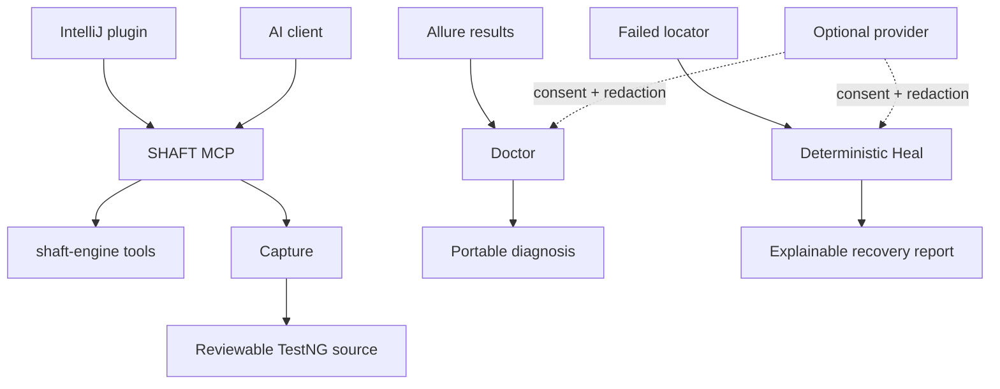

# Agentic testing without hidden automation

SHAFT separates deterministic automation from optional model-provider advice.
MCP, Capture, Doctor, and Heal remain useful without provider credentials.



| Capability | Default behavior | Start here |
|---|---|---|
| IntelliJ plugin | IDE front door for Assistant, Coding Partner, Recorder, Doctor, Healer, Inspector, Projects, and Guide search | [IntelliJ IDEA plugin](/docs/agentic/intellij) |
| MCP | Local stdio tools; no model credentials stored | [Connect MCP](/docs/agentic/mcp) |
| Planning | Deterministic same-origin crawl drafts Markdown test plans into `specs/`; no AI calls | [Planning test coverage](/docs/agentic/mcp#planning-test-coverage) |
| Capture | Record and generate deterministic test code | [Capture](/docs/agentic/capture) |
| Doctor | Analyze allowlisted evidence offline | [Doctor](/docs/agentic/doctor) |
| Heal | Recover eligible web locators with an explainable policy | [Heal](/docs/agentic/heal) |
| Pilot providers | Disabled until explicitly configured and approved | [Provider controls](/docs/agentic/providers) |

## Why SHAFT?

Compared with plain recorder/codegen tools and raw agent-written Selenium,
SHAFT's agentic loop differs on four load-bearing points:

- **Privacy-safe recording.** Typed values are externalized to test-data
  files, secrets are redacted at capture time, and a checked-in team policy
  (`.shaft/recorder-policy.json`) pins recording behavior for the whole
  repository — recordings are safe to commit and share.
- **Compile-validated codegen.** Generated tests are compiled against SHAFT
  and optionally replayed end-to-end before you ever see them; a replay
  failure returns the code *plus* the failing step's diagnostics, never a
  silent broken file.
- **Repo-aware generation.** The Coding Partner plans against your existing
  page objects, locator fields, and action methods before proposing new code,
  so generation extends your suite instead of forking it.
- **A maintenance loop, not just a generator.** Doctor triages failed runs
  from Allure evidence and Heal recovers eligible locators with an
  explainable policy — the same tools that created the test keep it alive.

The same workflows run on every agent — Codex, Claude Code, GitHub Copilot,
and Gemini — because they are MCP tools, not agent-specific plugins; and the
No-AI lane (Recorder, codegen, Doctor, Healer) works with no agent or model
credentials at all.

Use the [MCP command reference](/docs/agentic/mcp#mcp-command-reference) for
Capture and Doctor CLI examples.

```text
MCP commands live on /docs/agentic/mcp#mcp-command-reference
```

## Related

- [MCP](/docs/agentic/mcp)
- [Pilot](/docs/agentic/pilot)
- [Doctor](/docs/agentic/doctor)
- [Providers](/docs/agentic/providers)
