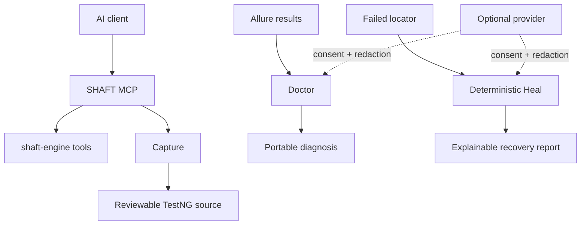

# Agentic testing without hidden automation

SHAFT separates deterministic automation from optional model-provider advice.
MCP, Capture, Doctor, and Heal remain useful without provider credentials.

| Capability | Default behavior | Start here |
|---|---|---|
| MCP | Local stdio tools; no model credentials stored | [Connect MCP](/docs/agentic/mcp) |
| Capture | Record and generate deterministic test code | [Capture](/docs/agentic/capture) |
| Doctor | Analyze allowlisted evidence offline | [Doctor](/docs/agentic/doctor) |
| Heal | Recover eligible web locators with an explainable policy | [Heal](/docs/agentic/heal) |
| Pilot providers | Disabled until explicitly configured and approved | [Provider controls](/docs/agentic/providers) |
