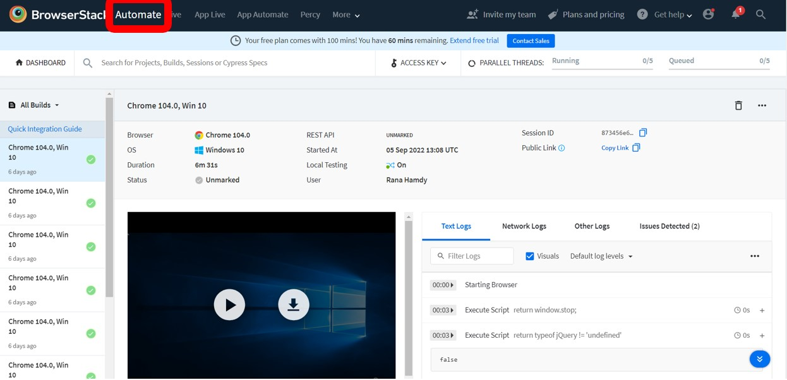

### Proxy:

### Execution Location:
We can execute our scripts in different locations, local, dockerized or remote execution. 

### 1. Local Execution:

### 2. Dockerized Execution:

### 3. Remote Execution (Selenium Grid / Appium):

### 4. Remote Execution (BrowserStack):

We can run any script using Shaft Engine via Browser stack only by setting some configurations that we can make from different locations: 

* #### Through configuration manager:

By openeing the **_Platform_** tab on [Configuration Manager](https://shafthq.github.io/SHAFT_ENGINE/ "Configuration Manager"), you can change the excution location as explained in the image below and then save the file and replace the corresponding configuration file in your project. Please note that once you select Remote Execution (BrowserStack) from Execution Location, the value of *_Remote Server Details_* will be filled automatically. 

* #### Through properties files:

For Web scripts, by openning the **_ExecutionPlatform.properties_** file you can change the value of **_executionAddress_** to be **_browserstack_**

##### Set the username and access key:

* Go to **_https://www.browserstack.com/users/sign_in_** and put the business e-mail and password then click **_Sign Me In_**

* Go to the **_Summary_** section 

* Copy the access key value:

##### Browserstack properties:

Browser stack itself provides its own configuration manager via the configuration file **_browserStack.properties_** in which we can find the proper configuration and proper URLs to execute scripts on web or on mobile platfrom. As explained in the below image.

### 4.1. To execute in web platform:

##### Set the capabilities on browser stack configuration manager:

* Go the Web URL: **_https://www.browserstack.com/automate/capabilities?tag=selenium-4_** to set the username and access key that we got from the previous steps and set the main capabilities from the **_Configure capabilities_** Section on the left select the target of the **_Opertaing System_**, the **_Browser_**, the **_Resolution_** and the **_Selenium Version_**. Once these fields are filled, the **_Code_** section will be filled automatically as explained in the below image. 

* Go back to **_browserStack.properties_** file to set the Operating system and its version, the browser version and the selenium version.

##### Execute the session live:

To see the live execution, go to **_Automate_** and then we will find our executions results and all the related info. 

### 4.2. To execute in mobile platform:

### Target Operating System:

### Maximum Performance Mode:

### AI Powered Self Healing:

