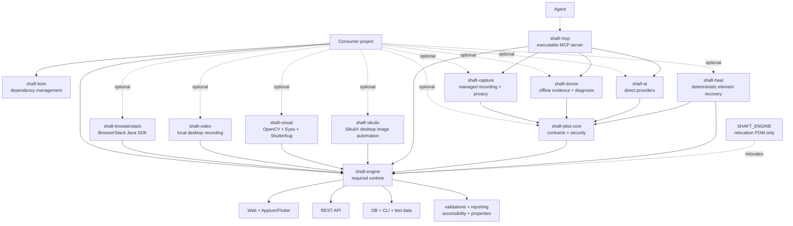
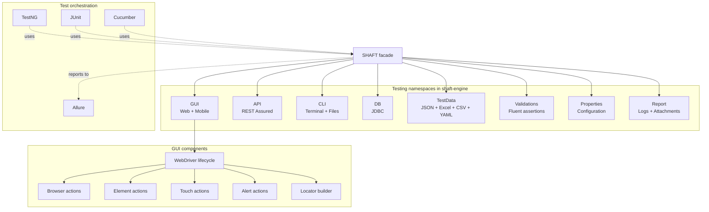

# Architecture

SHAFT has two kinds of modularity:

1. Maven artifacts control dependency weight.
2. The `SHAFT` facade exposes testing namespaces such as GUI, API, CLI, and DB.

These are related, but they are not one artifact per facade namespace. Most
functionality remains in the required `shaft-engine` JAR.

## Where SHAFT fits in a test automation stack

A test automation architecture separates concerns into layers — your test
scripts, page objects/models, the engine, core libraries, and drivers/protocols
that talk to the application under test. SHAFT Engine sits in the **engine**
layer: it wraps and enhances industry-standard libraries (Selenium WebDriver,
Appium, REST Assured, TestNG/JUnit, Allure) with smart element handling,
a unified API across web/mobile/API/CLI/database testing, built-in reporting,
and property-based configuration.

| Capability | Without SHAFT | With SHAFT |
|---|---|---|
| Wait strategy | Manual `WebDriverWait` configuration | Automatic smart waits |
| Element not found handling | Custom retry logic | Built-in retry with configurable attempts |
| Screenshot capture | Manual `TakesScreenshot` code | Automatic at validation points |
| Reporting | Manual Allure setup and step annotations | Automatic step logging and report generation |
| Cross-browser | Manual driver management | Automatic driver management |

SHAFT is an **engine**, not a framework: it does not dictate how you structure
your tests — Page Object Model, fluent design, or any pattern you prefer all
work — it provides the building blocks and you decide how to assemble them.
This means SHAFT works with your team's existing conventions and can be
adopted gradually, one test at a time, without rewriting your suite.

## Published Maven artifacts



| Artifact             | Packaging      | Consumer purpose                                                                                                         |
|----------------------|----------------|--------------------------------------------------------------------------------------------------------------------------|
| `shaft-engine`       | JAR            | Required facade and core web, mobile, API, database, CLI, reporting, and accessibility implementation.                   |
| `shaft-pilot-core`   | JAR            | Provider-neutral Pilot contracts, consent, redaction, budgets, audit metadata, and deterministic fallback.               |
| `shaft-capture`      | JAR            | Managed Chrome/Edge recording, deterministic privacy classification, versioned schema, and atomic JSON persistence.       |
| `shaft-doctor`       | JAR            | Portable redacted evidence, deterministic diagnosis, optional advisory, and approval-gated isolated repair proposals.       |
| `shaft-ai`           | JAR            | Optional direct OpenAI, Anthropic, Gemini, GitHub Models, and Ollama HTTP adapters discovered through `ServiceLoader`.                  |
| `shaft-heal`         | JAR            | Deterministic, explainable, action-scoped web element recovery with bounded local history and optional reranking.         |
| `shaft-browserstack` | JAR            | BrowserStack SDK interception and `browserstack.yml` orchestration. Direct BrowserStack sessions stay in `shaft-engine`. |
| `shaft-video`        | JAR            | Local non-headless desktop recording. Appium-native recording stays in `shaft-engine`.                                   |
| `shaft-visual`       | JAR            | Reference-image assertions and image-based lookup through OpenCV, Eyes, and Shutterbug.                                  |
| `shaft-sikulix`      | JAR            | SikuliX image matching for desktop workflows that cannot be reached through DOM or Appium locators.                      |
| `shaft-mcp`          | thin JAR | Optional MCP server and CLI exposing browser automation, managed capture, Doctor analysis, and packaged direct adapters.  |
| `shaft-bom`          | POM            | Aligns all SHAFT artifact versions; adds no runtime classes.                                                             |
| `SHAFT_ENGINE`       | relocation POM | Temporary legacy-coordinate bridge to `shaft-engine`; adds no optional providers.                                        |

See the [upgrade guide](/docs/start/upgrade) for method-level
dependency boundaries.

```xml title="pom.xml"
<dependencyManagement>
  <dependencies>
    <dependency>
      <groupId>io.github.shafthq</groupId>
      <artifactId>shaft-bom</artifactId>
      <version>${shaft.version}</version>
      <type>pom</type>
      <scope>import</scope>
    </dependency>
  </dependencies>
</dependencyManagement>

<dependencies>
  <dependency>
    <groupId>io.github.shafthq</groupId>
    <artifactId>shaft-engine</artifactId>
  </dependency>
</dependencies>
```

## Facade architecture



## Optional provider discovery

`shaft-heal`, `shaft-visual`, and `shaft-video` implement SHAFT-owned provider
interfaces and register them through Java `ServiceLoader`. The facade and
orchestration remain in `shaft-engine`, which means users add a provider JAR
without changing test method calls.

`shaft-browserstack` is a runtime integration rather than a SHAFT provider. It
adds `browserstack-java-sdk`; SHAFT's core BrowserStack driver path also
generates `browserstack.yml`, which the SDK consumes when the optional module is
present.

`shaft-sikulix` is a runtime action module. It adds the SikuliX API and a small
desktop-image action facade without shadowing `shaft-engine` classes.

## Module guides

- [Upgrade and module selection](/docs/start/upgrade)
- [SHAFT Heal](/docs/agentic/heal)
- [BrowserStack SDK module](/docs/integrations/browserstack)
- [Visual processing module](/docs/integrations/visual)
- [Desktop and video](/docs/integrations/desktop-and-video)
- [SHAFT Pilot](/docs/agentic/pilot)
- [SHAFT Pilot release runbook](/docs/maintainers/pilot-release)
- [SHAFT MCP](/docs/agentic/mcp)
- [Optional AI providers](/docs/agentic/providers)
- [SHAFT Capture](/docs/agentic/capture)
- [Maven reactor layout](/docs/maintainers/reactor)

## Related

- [Overview](/docs/start/overview)
- [Quick start](/docs/start/quick-start)
- [Modules](/docs/features/modules)
- [Reporting](/docs/features/reporting)
- [Underlying technology](/docs/features/modules#technology)
- [Browserstack](/docs/integrations/browserstack)
