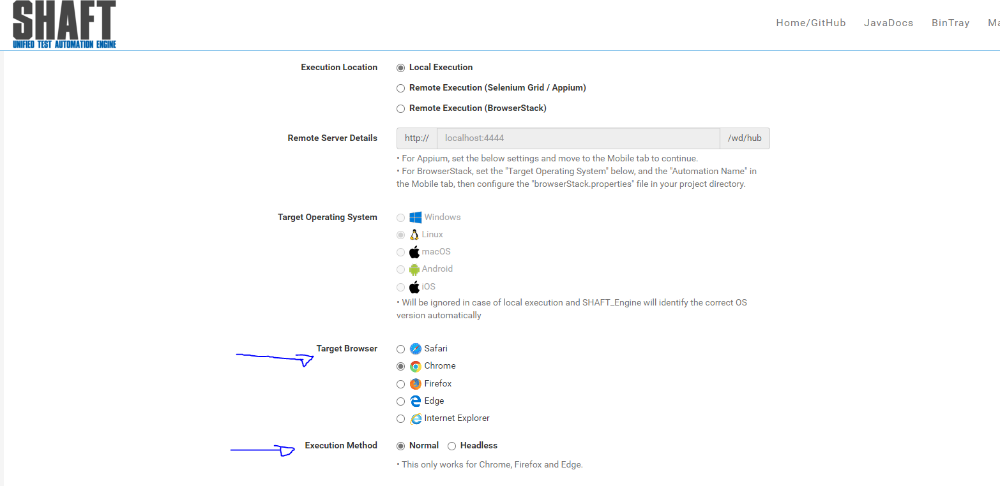
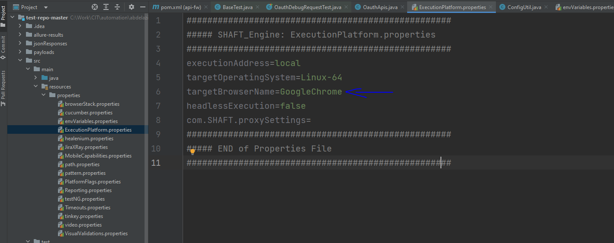

### Change browser and headless excution:

By default SHAFT engine runs locally on chrome browser using the library "Webdriver Manager" to manage the latest driver installation.
 
you can change this default browser from 2 locations:

* #### Through configuration manager:

By openeing the **_ Platform _** tab on the [Configuration Manager] you can change the excution browser as explained in the image below and then save the file and replace the corresponding config file in your project.

* #### Through properties files:

By openning the **_ExecutionPlatform.properties_** file you can change the value of **_targetBrowserNam_** with the value of one of the supported browsers.
 
NOTE : supported browsers of SHAFT engine are => chrome, firefox, edge and safari.

### Headless excution:

Likewise from the **_ Platform _** tab or configuration file you can choose weather to **enable** or **disable** the headless excution.

### Auto maximize browser window:

[configuration manager]: https://mohabmohie.github.io/SHAFT_ENGINE/

