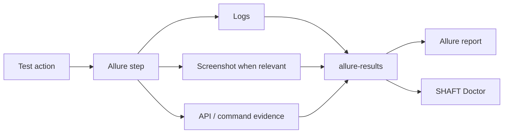

# Reporting and evidence

SHAFT records test actions as structured Allure steps and attaches the evidence
needed to understand failures.

Use [reporting configuration](/docs/reference/reporting) and
[custom report messages](/docs/reference/reporting/Custom_Report_Messages) for
detailed controls.
