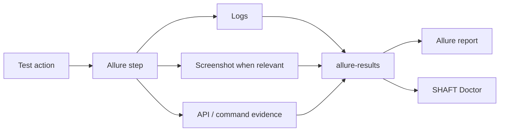

# Reporting and evidence

SHAFT records test actions as structured Allure steps and attaches the evidence
needed to understand failures.

Generated element assertions keep the Allure step text concise: the locator is
reported once as a step parameter, while internal element reads used to evaluate
the assertion are kept in the debug execution log instead of repeated child
steps.

Text-entry and dropdown element actions keep the Allure timeline readable by
showing the value being typed or selected in the step title. Long or multiline
values are capped in the title. The step metadata keeps the normalized locator,
including Smart Locator labels, and includes the resolved element name only when
the engine captures one. Secure typing stays masked.



Use [reporting configuration](/docs/reference/reporting) and
[custom report messages](/docs/reference/reporting#custom-report-messages) for
detailed controls.

```properties title="src/main/resources/properties/custom.properties"
evidenceLevel=CUSTOM
screenshotParams_whenToTakeAScreenshot=ValidationPointsOnly
attachFullLog=true
createAnimatedGif=false
```

## Execution logs

SHAFT writes the engine execution log through asynchronous Log4j2 appenders so
normal test actions do not wait on file I/O. The console shows the concise
INFO-level story, while diagnostic entries and engine internals are written at
DEBUG level to the log file.

Set `evidenceLevel=CUSTOM` before granular evidence controls such as
`attachFullLog=true` when you want the control to override the default
`FAILURE_ONLY` profile. The full-log attachment is streamed from a temporary
deduplicated snapshot so the live `target/logs/log4j.log` file remains
available for retry diagnostics, local investigation, and CI artifact
collection.

## Failure diagnostics bundle

Failed and broken tests attach `shaft-diagnostics.zip` to Allure by default.
The ZIP contains `diagnostics.json`, a sanitized handoff file for humans,
SHAFT Doctor, and MCP clients. It includes stable test metadata, failure type,
message, stacktrace, root-cause chain, the top project stack frame, bounded
logs, referenced artifacts such as videos, GIFs, and the trace viewer archive,
selected runtime/configuration metadata, redaction rules applied, size limits,
and suggested Doctor/MCP commands.

The single trace archive includes `shaft-trace.json`,
`shaft-network.har`, and `SHAFT Trace Report.html`. The JSON `actions` array
records ordered Selenium browser, element, touch, and validation events with
status, duration, locator, URL, exception summary, attachment summaries, and
redacted metadata. When enabled, the trace JSON also includes `network`,
`console`, and `browserObservability` sections for browser HTTP exchanges,
console messages, and unsupported-capability warnings. SHAFT also writes the
archive under `target/shaft-traces/<safe-test-id>/` with an `index.json` for
local tooling.

The bundle references existing artifacts instead of copying every raw file.
Secrets in common headers, cookies, token/password assignments, and sensitive
URL query values are masked before the JSON is attached. Disable the bundle
with `shaft.diagnostics.enabled=false` or lower the ZIP entry cap with
`shaft.diagnostics.maxArtifactMb`.

## Failure briefs and attachment manifest

Failed and broken tests also attach a compact failure brief beside the
diagnostics bundle:

- `SHAFT Failure Brief.html` opens first in the Allure report and summarizes the
  failure category, message, top project stack frame, and the first artifacts to
  inspect.
- `shaft-failure-brief.json` exposes the same triage data for CI bots and
  local tooling.
- `shaft-attachments-manifest.json` lists SHAFT-owned evidence such as
  screenshots, videos, traces, page snapshots, API request/response artifacts,
  accessibility reports, performance reports, and logs.

The brief uses the same redaction rules as the diagnostics bundle, so common
headers, cookies, token/password assignments, and sensitive URL query values are
masked before the JSON and HTML are attached. API request labels omit query
strings and include the method, path, status code, and response time when
available.

Allure 3 runs also receive a `categories.json` file in `allure-results/` with
SHAFT's default failure groups for assertion, stale element, timeout, locator,
API, accessibility, visual, and infrastructure failures. These categories are
plain Allure metadata and do not require a custom Allure plugin.

The attachment manifest is built from SHAFT's common attachment path and API
filter. Specialized Allure-native attachments, such as visual comparison diffs,
can still appear directly in the Allure report before they are routed through
the central manifest path.

## Locator health reports

Enable locator health reporting when you want a run-level view of slow or flaky
web locators without changing test code.

```properties title="src/main/resources/properties/custom.properties"
shaft.locatorHealth.enabled=true
shaft.locatorHealth.warnBelowScore=70
shaft.locatorHealth.attachDashboard=true
shaft.locatorHealth.failBelowScore=-1
slowLocatorThresholdMillis=750
```

When enabled, SHAFT records lookup counts, unique/no-match/multi-match/stale
rates, average and p95 lookup time, polling attempts, timeouts, slow lookups,
SHAFT Heal attempts, accepted recoveries, confidence, and selected replacement
locators when available. It scores each locator, flags selector smells such as
absolute XPath, index-heavy XPath, generated IDs, text-only selectors, and deep
CSS chains, then adds plain-language recommendations.

At the end of the run it writes HTML and JSON reports under
`execution-summary/locator-health/` and attaches the JSON export to Allure. The
HTML dashboard is attached when `shaft.locatorHealth.attachDashboard=true`. Keep
`shaft.locatorHealth.failBelowScore=-1` while introducing the report; set it to
a score threshold only after the suite has a stable baseline. The older
`locatorHealthReportEnabled=true` key remains supported. When the failure trace
viewer is enabled, failed-test trace JSON also includes the current locator
health snapshot.

## Flake and auto-wait profiler

Enable the flake profiler when you need action-level timing in Allure without
turning every wait into custom test code.

```properties title="src/main/resources/properties/custom.properties"
shaft.flakeProfiler.enabled=true
shaft.flakeProfiler.attachPerTest=true
shaft.flakeProfiler.failOnSevereFlakeRisk=false
shaft.flakeProfiler.slowActionThresholdMs=2000
```

When enabled, SHAFT attaches `flake-profile.json` and `Flake Profile` HTML to
Allure for tests that produce profiler signals. The profile records element
actions, assertions, verifications, retry attempts, locator lookup counts,
match counts, wait polling loops, stale/healing signals, and slow or wait-heavy
actions. Screenshot capture, page snapshots, and report attachment time are
tracked as evidence costs so element action duration is not inflated by report
generation.

Keep `shaft.flakeProfiler.failOnSevereFlakeRisk=false` while establishing a
baseline. Turn it on only after the suite has known thresholds for slow,
wait-heavy, stale, healed, or failing actions.

## Related

- [Architecture](/docs/features/architecture)
- [Modules](/docs/features/modules)
- [Underlying technology](/docs/features/modules#technology)
- [BrowserStack](/docs/integrations/browserstack)
