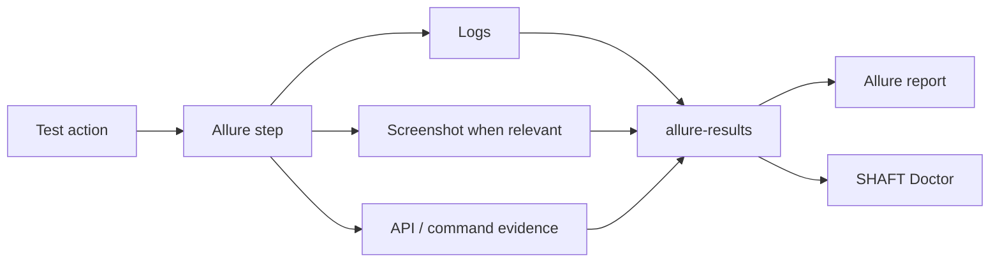

# Reporting and evidence

SHAFT records test actions as structured Allure steps and attaches the evidence
needed to understand failures.

Generated element assertions keep the Allure step text concise: the locator is
reported once as a step parameter, while internal element reads used to evaluate
the assertion are kept in the debug execution log instead of repeated child
steps.

Text-entry and dropdown element actions keep the Allure timeline readable by
showing the value being typed or selected in the step title. Long or multiline
values are capped in the title. The step metadata keeps the normalized locator,
including Smart Locator labels, and includes the resolved element name only when
the engine captures one. Secure typing stays masked.



Use [reporting configuration](/docs/reference/reporting) and
[custom report messages](/docs/reference/reporting/Custom_Report_Messages) for
detailed controls.

```properties title="src/main/resources/properties/custom.properties"
screenshotParams_whenToTakeAScreenshot=ValidationPointsOnly
reporting.attachFullLog=true
createAnimatedGif=false
```

## Execution logs

SHAFT writes the engine execution log through asynchronous Log4j2 appenders so
normal test actions do not wait on file I/O. The console shows the concise
INFO-level story, while diagnostic entries and engine internals are written at
DEBUG level to the log file.

Set `reporting.attachFullLog=true` when you want the full engine log attached to
the Allure report after execution. The attachment is streamed from a temporary
deduplicated snapshot so the live `target/logs/log4j.log` file remains available
for retry diagnostics, local investigation, and CI artifact collection.

## Locator health reports

Enable locator health reporting when you want a run-level view of slow or flaky
web locators without changing test code.

```properties title="src/main/resources/properties/custom.properties"
locatorHealthReportEnabled=true
slowLocatorThresholdMillis=750
failOnLocatorHealthWarnings=false
```

When enabled, SHAFT records lookup counts, average and p95 lookup time, polling
attempts, timeouts, stale-element retries, multiple matches, slow lookups, and
SHAFT Heal recovery attempts. At the end of the run it writes HTML and JSON
reports under `execution-summary/locator-health/` and attaches them to Allure.
Set `failOnLocatorHealthWarnings=true` only when locator health warnings should
fail the build.

## Related

- [Architecture](/docs/features/architecture)
- [Modules](/docs/features/modules)
- [Technology](/docs/features/technology)
- [Browserstack](/docs/integrations/browserstack)
