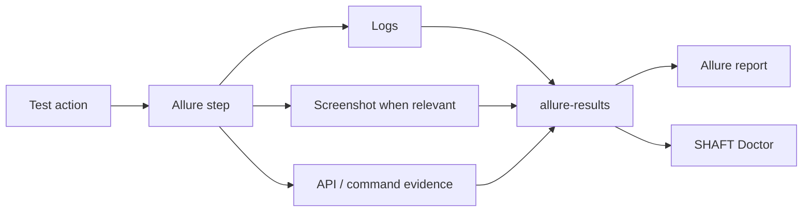

# Reporting and evidence

SHAFT records test actions as structured Allure steps and attaches the evidence
needed to understand failures.

Use [reporting configuration](/docs/reference/reporting) and
[custom report messages](/docs/reference/reporting/Custom_Report_Messages) for
detailed controls.

## Execution logs

SHAFT writes the engine execution log through asynchronous Log4j2 appenders so
normal test actions do not wait on file I/O. The console shows the concise
INFO-level story, while diagnostic entries and engine internals are written at
DEBUG level to the log file.

Set `reporting.attachFullLog=true` when you want the full engine log attached to
the Allure report after execution. The attachment is streamed from a temporary
deduplicated snapshot so the live `target/logs/log4j.log` file remains available
for retry diagnostics, local investigation, and CI artifact collection.
