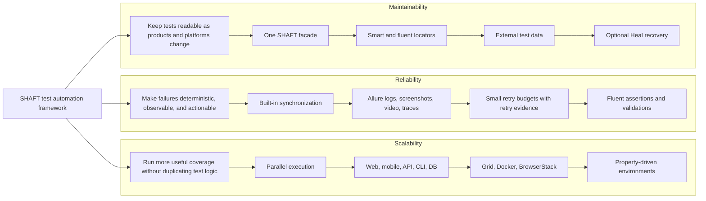

# Pillars of successful test automation

The **Pillars of successful test automation** are **Scalability**,
**Reliability**, and **Maintainability**. SHAFT supports them by keeping test
intent in the test code and moving browser, mobile, API, evidence,
configuration, and recovery mechanics into one engine.



## Scalability

Scalability means the framework can add browsers, devices, environments, and
test volume without forcing every test class to fork. SHAFT does this by
putting execution choice behind configuration and keeping the test body on the
same facade.

| SHAFT support | What it enables |
| --- | --- |
| WebDriver and Playwright backends | Choose Selenium/Appium WebDriver or Playwright per test setup while keeping SHAFT GUI actions. |
| Web, mobile, API, CLI, database, and test data namespaces | Keep different test surfaces in one framework instead of separate helper stacks. |
| TestNG, JUnit, and Cucumber integration | Use the runner that fits the project and CI pipeline. |
| TestNG parallel settings and ThreadLocal driver pattern | Run independent test methods, classes, suites, or data providers in parallel without sharing a driver instance. |
| `SHAFT.CrossBrowserMode` | Run the same browser test class against Chrome, Firefox, and Safari sequentially or in parallel when Docker is available. |
| `executionAddress` | Move the same test code from local execution to Docker, Selenium Grid, BrowserStack, Appium, or another remote WebDriver endpoint. |
| `headlessExecution` and `maximumPerformanceMode` | Reduce desktop browser overhead when the suite needs faster CI feedback. |
| `shaft-bom` and optional modules | Add heavy capabilities such as Visual, Video, SikuliX, Heal, BrowserStack SDK, Capture, Doctor, MCP, or AI providers only when the project needs them. |

```properties title="src/main/resources/properties/custom.properties"
executionAddress=localhost:4444
targetOperatingSystem=Linux
targetBrowserName=chrome
headlessExecution=true
SHAFT.CrossBrowserMode=parallelized
```

## Reliability

Reliability means a passing test represents a real pass and a failing test
carries enough evidence to explain the failure. SHAFT reduces accidental
flakiness by centralizing waits, retries, reports, and validation behavior.

| SHAFT support | What it protects |
| --- | --- |
| Element lookup timeout and fluent waits | Element actions retry until the element is available instead of relying on sleeps in every test. |
| Browser lazy-loading waits | Browser actions can wait for document readiness, network quiet time, jQuery, and Angular signals when the page exposes them. |
| Explicit condition waits | Tests can wait for business states such as a status value, count, URL, title, or spinner state. |
| Fluent assertions and verifications | UI, API, file, number, object, and schema checks use one reporting path. |
| Retry analyzer and JUnit extension | Retries are opt-in and bounded by `retryMaximumNumberOfAttempts`. |
| Retry evidence capture | `forceCaptureSupportingEvidenceOnRetry=true` enables richer evidence on retry attempts. |
| Allure report integration | Actions, logs, screenshots, request/command evidence, and attachments are grouped with the test result. |
| SHAFT Doctor | Failed-run evidence can be packaged and diagnosed without relying on a live provider by default. |

```properties title="src/main/resources/properties/custom.properties"
defaultElementIdentificationTimeout=10
waitForUiStateTimeout=600
retryMaximumNumberOfAttempts=1
forceCaptureSupportingEvidenceOnRetry=true
evidenceLevel=CUSTOM
screenshotParams_whenToTakeAScreenshot=ValidationPointsOnly
attachFullLog=true
```

Use explicit waits for application states that the browser cannot infer:

```java title="ReliableStateWait.java"
driver.browser().navigateToURL("https://example.test/orders");
driver.element().click("Refresh orders");
driver.element().waitUntilElementTextToBe(By.id("sync-status"), "Complete");
driver.assertThat(By.id("order-count")).text().isEqualTo("25");
```

## Maintainability

Maintainability means product changes require small, obvious test updates.
SHAFT helps by making tests describe user intent, keeping configuration outside
test logic, and supporting common automation design patterns.

| SHAFT support | What it keeps maintainable |
| --- | --- |
| `SHAFT` facade | Test code uses one entry point for GUI, API, CLI, DB, test data, properties, reporting, and validations. |
| Fluent action chains | Tests and page objects read as workflows instead of low-level WebDriver calls. |
| Page Object Model and thin base-class patterns | Locators, page actions, and lifecycle setup stay in predictable places. |
| Smart Locators | `inputField(...)` and `clickableField(...)` target user-facing labels, text, placeholders, and ARIA signals. |
| Locator Builder | Complex locators can be composed fluently instead of handwritten XPath strings. |
| Native WebDriver access | Teams can drop to Selenium/Appium APIs only when a specialized case needs it. |
| External test data | JSON, CSV, Excel, YAML, and properties files keep data and environment values out of test methods. |
| Programmatic and file-based properties | Environment changes can be made through properties or Maven `-D` overrides. |
| Optional SHAFT Heal | Web locator recovery is explicit, trust-gated, reported, and kept separate from normal test code. |

```java title="MaintainableLoginTest.java"
public class LoginTest {
    private SHAFT.GUI.WebDriver driver;
    private SHAFT.TestData.JSON users;

    @BeforeMethod
    public void setUp() {
        driver = new SHAFT.GUI.WebDriver();
        users = new SHAFT.TestData.JSON("testData/users.json");
    }

    @Test
    public void userCanLogIn() {
        driver.browser().navigateToURL("/login");
        driver.element()
                .type(SHAFT.GUI.Locator.inputField("Email"), users.getTestData("valid.email"))
                .type(SHAFT.GUI.Locator.inputField("Password"), users.getTestData("valid.password"))
                .click(SHAFT.GUI.Locator.clickableField("Log in"));
        driver.assertThat().browser().url().contains("/dashboard");
    }

    @AfterMethod(alwaysRun = true)
    public void tearDown() {
        driver.quit();
    }
}
```

## Choosing Features By Pillar

| If the team needs... | Start with... |
| --- | --- |
| Faster CI feedback | TestNG/JUnit parallel execution, ThreadLocal drivers, headless execution, and remote Grid capacity. |
| Wider platform coverage | `executionAddress`, `targetOperatingSystem`, `targetBrowserName`, BrowserStack, Appium, and CrossBrowserMode. |
| Less UI timing noise | Built-in synchronization, explicit waits, and a low retry budget with retry evidence. |
| Better failure triage | Allure evidence, screenshots, full logs, retry artifacts, Doctor, video, and Playwright tracing where used. |
| Lower selector churn | Smart Locators, ARIA locators, Locator Builder, Page Objects, and optional SHAFT Heal. |
| Cleaner test data changes | `SHAFT.TestData` with JSON, CSV, Excel, YAML, or properties files. |
| Smaller dependency footprint | `shaft-engine` plus only the optional SHAFT modules the project actually uses. |

## Related

- [Architecture](/docs/features/architecture)
- [Features and modules](/docs/features/modules)
- [Web testing](/docs/testing/web)
- [How SHAFT reduces flakiness](/docs/testing/flakiness)
- [Parallel Execution](/docs/reference/configuration/parallelExecution)
- [Solution Design](/docs/reference/guides/Solution_Design)
- [Smart Locators](/docs/reference/actions/GUI/Locators_And_Self_Healing#smart-locators)
- [Reporting and evidence](/docs/features/reporting)
- [SHAFT Heal](/docs/agentic/heal)
