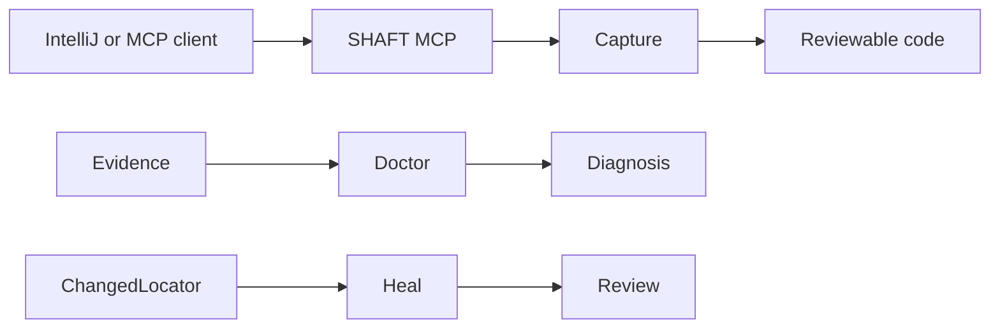
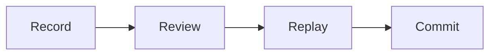
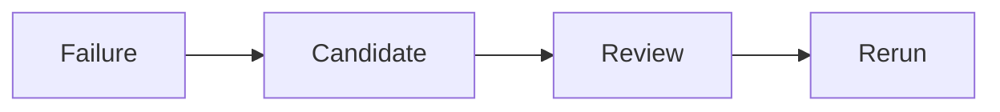

# Agentic updates



## Catalog

### SHAFT Pilot

Pilot provides provider-neutral contracts and local orchestration through `shaft-pilot-core`.

Why use it: keep optional model access behind SHAFT's provider controls.

How to start: add `shaft-pilot-core` when an integration needs Pilot contracts.

Full docs: [SHAFT Pilot](/docs/agentic/pilot)

### Capture

Capture records browser and API flows, then produces reviewable replay code through `shaft-capture`.

Why use it: turn an observed journey into code that the team can inspect and maintain.

How to start: install `shaft-capture`, then use IntelliJ `/record` or `/codegen`; deterministic Capture works with `pilot.ai.enabled=false`.

Full docs: [Capture](/docs/agentic/capture)



### SHAFT Doctor

Doctor analyzes allowlisted Allure evidence and failure traces through `shaft-doctor`.

Why use it: triage a failed run from its artifacts without sending evidence to a provider.

How to start: add `shaft-doctor` and point it at the failed run's evidence.

Full docs: [SHAFT Doctor](/docs/agentic/doctor)

### SHAFT Heal

Heal proposes deterministic, explainable recovery for eligible changed web locators through `shaft-heal`.

Why use it: review a targeted locator recovery instead of guessing at a replacement.

How to start: add `shaft-heal` and run the documented healer workflow.

Full docs: [SHAFT Heal](/docs/agentic/heal)



### SHAFT MCP

SHAFT MCP exposes local stdio tools for browser actions, Capture, Doctor, Heal, and guide search.

Why use it: connect a coding agent without storing model credentials in MCP.

How to start: install the `shaft-mcp` route from the agentic tools installer.

Full docs: [Connect MCP](/docs/agentic/mcp)

### shaft-cli

`shaft-cli` gives scripts and CI repeatable one-shot access to the SHAFT tool catalog.

Why use it: use the same local tools without configuring an MCP client.

How to start: run the documented installer with `--install-shaft-cli`.

Full docs: [SHAFT CLI](/docs/agentic/cli)

### IntelliJ coding partner

The IntelliJ plugin brings Assistant, Coding Partner, Recorder, Doctor, Healer, Inspector, Projects, and guide search into the IDE.

Why use it: keep recording, diagnosis, and reviewed changes beside the Java project.

How to start: install the SHAFT IntelliJ plugin and follow its setup guide.

Full docs: [IntelliJ IDEA plugin](/docs/agentic/intellij)

### SHAFT agent skills

SHAFT agent skills provide task-specific instructions without requiring an MCP client.

Why use it: give supported coding agents a shared project workflow.

How to start: use the installation route in the skills guide.

Full docs: [SHAFT agent skills](/docs/agentic/skills)

### ChaosEngine harness

ChaosEngine installs a project-local agent harness with verified host adapters and local tooling.

Why use it: give agents one repeatable workspace workflow.

How to start: follow the project-local installation guide.

Full docs: [ChaosEngine harness](/docs/agentic/chaos-engine)

### Optional AI providers

Provider adapters are optional and remain disabled until explicitly configured and approved.

Why use it: add provider advice only when the project accepts that integration.

How to enable: configure a provider through the documented controls; Copilot can connect through MCP.

Full docs: [Provider controls](/docs/agentic/providers)

### Planning test coverage

MCP can crawl same-origin content deterministically and draft Markdown test plans into `specs/`.

Why use it: start coverage discussion from a repeatable crawl rather than an untracked prompt.

How to start: run the planning workflow from MCP.

Full docs: [Planning test coverage](/docs/agentic/mcp#planning-test-coverage)

### Trust-gated natural-language actions

Natural-language GUI actions are a separate, trust-gated surface and are disabled by default.

Why use it: opt into intent-based actions only with the project controls you want.

How to enable: configure the trust-gated action workflow from its reference.

Full docs: [Natural-language actions](/docs/reference/actions/GUI/Natural_Language_Actions)

```text
Install agentic tools with the commands in the linked guide.
```

## Related

- [Agentic testing](/docs/agentic/overview)
- [What's new since modularization](/docs/features/whats-new)
