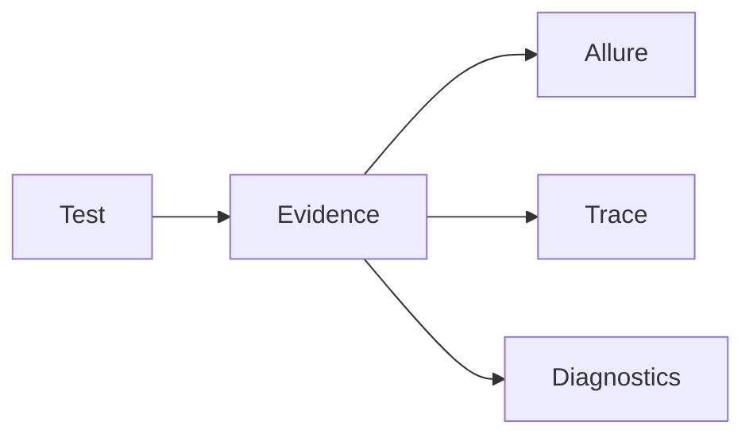
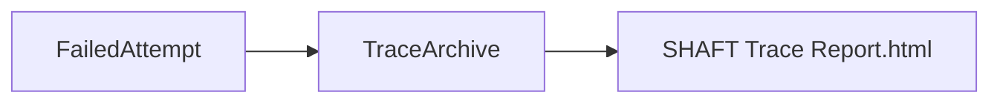
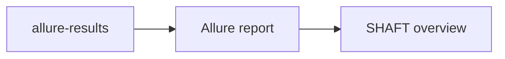

# Evidence updates



## Catalog

### Failure Trace Viewer (on by default)

A self-contained trace viewer attaches to failed-test evidence with actions, DOM snapshots, network, console, and locator health where available.

Why use it: inspect a failure without rerunning it; `SHAFT Trace Report.html` opens without sibling files.

How to enable: it is already on with `shaft.trace.enabled=true` and `shaft.trace.mode=auto`; failed attempts are retained with `shaft.trace.retainFailedAttempts=true`.

Full docs: [Reporting and evidence](/docs/features/reporting)



### Failure diagnostics bundle (on by default)

Failed and broken tests attach `shaft-diagnostics.zip`, including sanitized metadata, bounded logs, and referenced artifacts.

Why use it: hand one portable evidence bundle to a human, Doctor, or MCP client.

How to enable: it is already on; set `shaft.diagnostics.enabled=false` only to disable it.

Full docs: [Failure diagnostics bundle](/docs/features/reporting#failure-diagnostics-bundle)

### Failure brief and attachment manifest (on by default)

Failure evidence includes `SHAFT Failure Brief.html` and `shaft-attachments-manifest.json`; Allure 3 runs also receive `categories.json`.

Why use it: see a concise failure summary and find every attached artifact.

How to enable: run the test normally and open the generated report artifacts.

Full docs: [Failure briefs and attachment manifest](/docs/features/reporting#failure-briefs-and-attachment-manifest)

### Locator health reports (opt-in)

Locator health records score and stability information for the locators a run uses.

Why use it: find fragile locators before they become recurrent failures.

How to enable: set `shaft.locatorHealth.enabled=true`.

Full docs: [Reporting reference](/docs/reference/reporting)

### Flake and auto-wait profiler (opt-in)

The profiler records flake risk and auto-wait behavior for investigation.

Why use it: distinguish unstable behavior from a one-off failed run.

How to enable: set `shaft.flakeProfiler.enabled=true`; leave `shaft.flakeProfiler.failOnSevereFlakeRisk=false` until thresholds exist.

Full docs: [Reporting reference](/docs/reference/reporting)

### Allure SHAFT overview panel

SHAFT adds its overview surface to the generated Allure report.

Why use it: begin report review with SHAFT-specific run and evidence context.

How to start: generate and open the Allure report after a test run.

Full docs: [Reporting and evidence](/docs/features/reporting)



### Native Playwright traces

Playwright runs retain their native trace ZIP alongside SHAFT evidence.

Why use it: open native Playwright timing and browser evidence when a retry produces it.

How to enable: leave tracing off by default. With retry evidence capture and `playwright.tracing.onRetryOnly=true` (default), retry ZIPs attach automatically; set `playwright.tracing.enabled=true` only for a full-session trace.

Full docs: [Playwright backend](/docs/reference/actions/GUI/Playwright_Backend)

```properties
playwright.tracing.enabled=false
playwright.tracing.onRetryOnly=true
```

## Related

- [Reporting and evidence](/docs/features/reporting)
- [What's new since modularization](/docs/features/whats-new)
