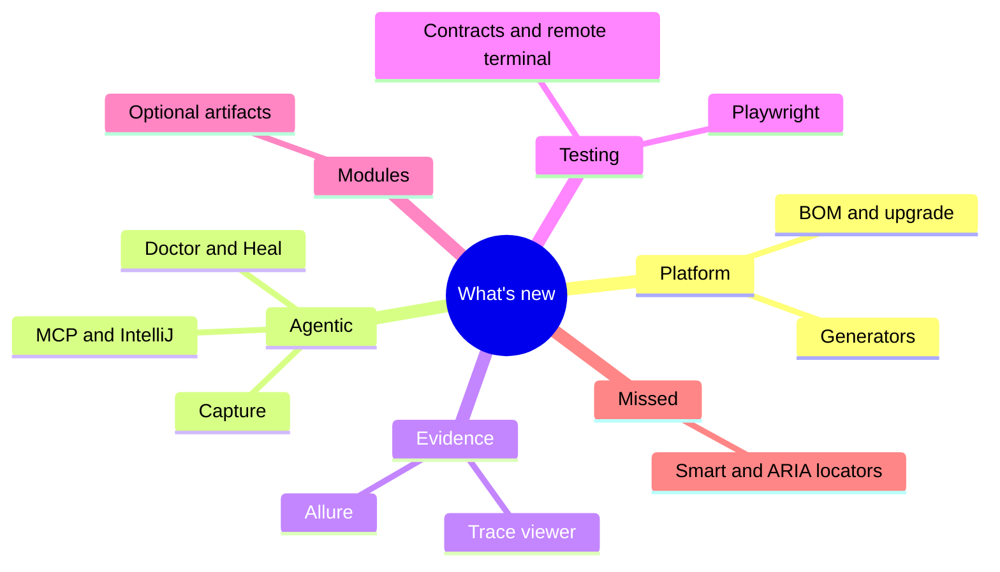

# What's new since modularization

Use this catalog to find user-facing capabilities added since `10.2.20260610`
(2026-06-10). Keep the deeper configuration and API details in the linked
canonical guides.

:::note
When a user-facing feature ships, add or refresh its short entry here in the
same documentation PR as its deep guide.
:::



## Browse by group

- [Platform](/docs/features/whats-new/platform): modular dependencies, upgrading, and generators.
- [Agentic](/docs/features/whats-new/agentic): deterministic tools and optional providers.
- [Evidence](/docs/features/whats-new/evidence): failure evidence and reporting surfaces.
- [Testing](/docs/features/whats-new/testing): newer testing and audit surfaces.
- [Modules](/docs/features/whats-new/modules): optional artifacts and preview work.
- [Features you might have missed](/docs/features/whats-new/missed): older, useful capabilities.


Import the BOM before combining published modules:

```xml title="pom.xml"
<dependencyManagement><dependencies><dependency>
  <groupId>io.github.shafthq</groupId><artifactId>shaft-bom</artifactId>
  <version>${shaft.version}</version><type>pom</type><scope>import</scope>
</dependency></dependencies></dependencyManagement>
```

## Related

- [Upgrade](/docs/start/upgrade)
- [Features and modules](/docs/features/modules)
