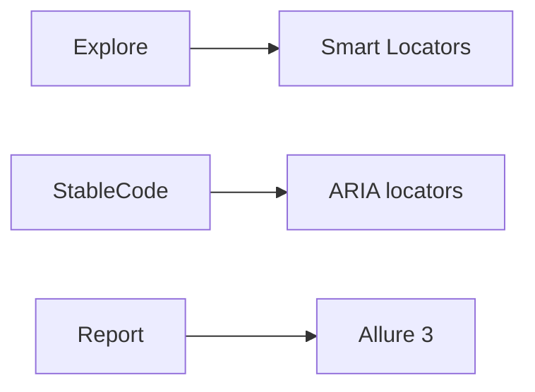

# Features you might have missed



## Catalog

### Smart Locators

`inputField(...)` and `clickableField(...)` help a human explore a page when a stable locator is not yet known.

Why use it: move quickly during throwaway exploration before you write a durable locator.

How to start: use a Smart Locator only while exploring, then replace it with a stable locator in repository code.

Full docs: [Locators and self-healing](/docs/reference/actions/GUI/Locators_And_Self_Healing#smart-locators)

### ARIA role locators

`SHAFT.GUI.Locator.hasRole(...)` builds locators from an element's accessible role and normalized text.

Why use it: express the user-facing control semantics in a stable, readable locator.

How to start: build a role locator and use it in the page object.

Full docs: [Element identification](/docs/reference/actions/GUI/Element_Identification)

### Allure 3 compatibility mode

SHAFT can generate Allure 3 reports while retaining explicit compatibility behavior for Allure 2.

Why use it: use managed Allure 3 resolution or retain PATH-first behavior while teams migrate report tooling.

How to enable: keep `allure.forceConfiguredCliVersion=true` for managed Allure 3; set it to `false` to let a PATH 2.x CLI activate compatibility mode.

Full docs: [Reporting reference](/docs/reference/reporting)

```java
By loginButton = SHAFT.GUI.Locator.hasRole(Role.BUTTON).hasNormalizedText("Log in").build();
```

## Related

- [Pillars of successful test automation](/docs/features/test-automation-pillars)
- [What's new since modularization](/docs/features/whats-new)
