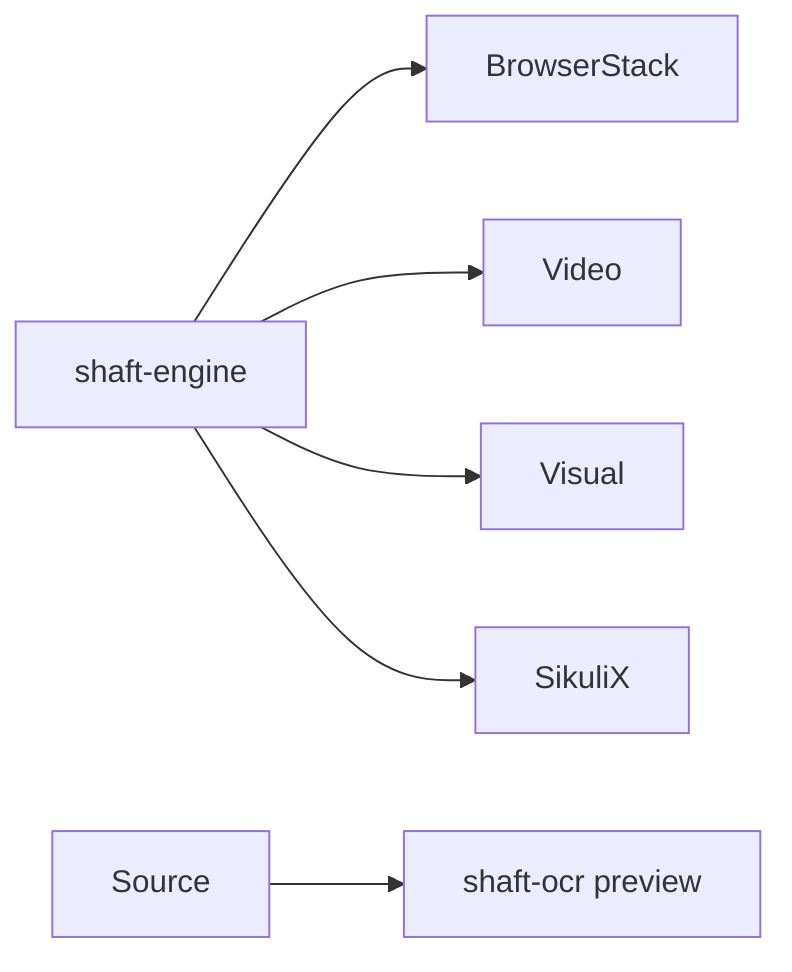

# Module updates



## Catalog

### Optional artifacts

`shaft-browserstack`, `shaft-video`, `shaft-visual`, and `shaft-sikulix` add focused integration capabilities to the core engine.

Why use it: keep specialized dependencies out of projects that do not use them.

How to start: add the artifact that owns the needed capability, with the BOM managing versions.

Full docs: [Features and modules](/docs/features/modules)

### shaft-ocr preview

`shaft-ocr` exists in engine source as an unreleased preview and is not a published BOM artifact.

Why use it: track the visible-text and OCR direction without treating preview code as a supported dependency.

How to start: wait for a containing published release before adding it to a project.

Full docs: [Features and modules](/docs/features/modules)

```xml
<artifactId>shaft-visual</artifactId>
```

## Related

- [Integrations](/docs/integrations/visual)
- [What's new since modularization](/docs/features/whats-new)
