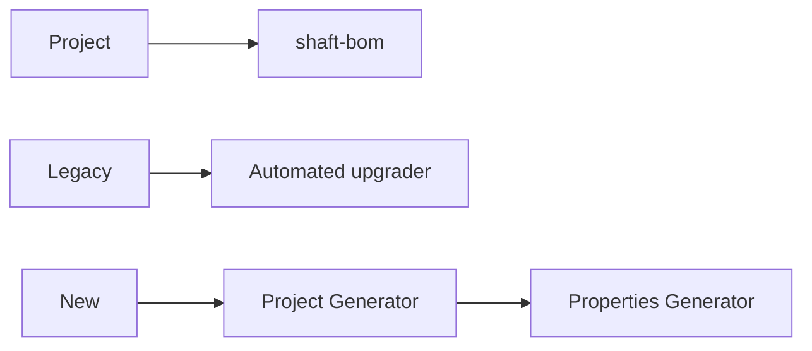

# Platform updates



## Catalog

### Modular artifacts and BOM

Published capabilities are split into `shaft-engine` and optional artifacts, with `shaft-bom` aligning their versions.

Why use it: add only the dependencies a project needs while keeping versions aligned.

How to start: import `shaft-bom` in dependency management.

Full docs: [Features and modules](/docs/features/modules)

### Automated upgrade tool

The upgrader moves supported Selenium, Appium, REST Assured, and older SHAFT projects to current APIs and coordinates.

Why use it: make the migration reviewable instead of changing every dependency and call by hand.

How to start: run the documented command from the project root.

Full docs: [Automated upgrade tool](/docs/start/upgrade)

### Project Generator

The Project Generator creates a ready-to-run Maven project after you choose the runner and test surfaces.

Why use it: begin from a configured sample instead of assembling a POM manually.

How to start: open the generator from the installation guide.

Full docs: [Project Generator](/docs/start/installation)


### Properties Generator

The Properties Generator helps create a custom properties file from the supported configuration catalog.

Why use it: make configuration choices visible and copy a focused file into the project.

How to start: open the generator and select only the properties you need.

Full docs: [Properties Generator](/docs/reference/properties/custom-properties-generator)


```bash
mvn test
```

## Related

- [What's new since modularization](/docs/features/whats-new)
- [Installation](/docs/start/installation)
