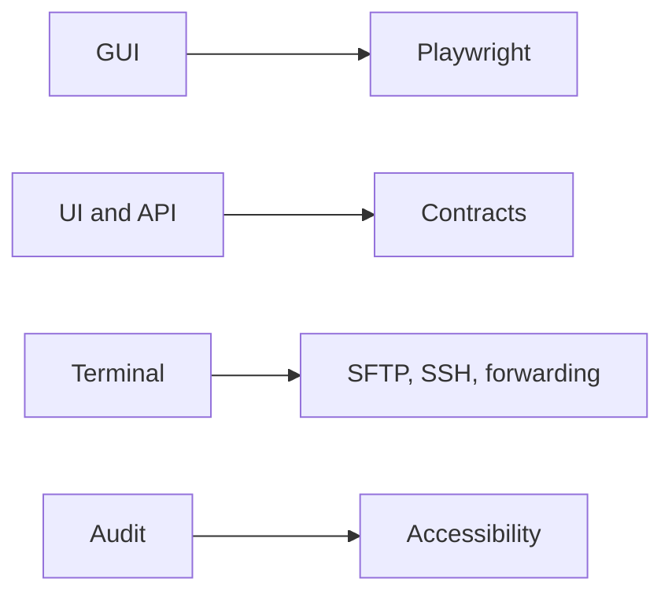

# Testing updates



## Catalog

### Playwright GUI backend

`SHAFT.GUI.Playwright` runs SHAFT GUI actions through Microsoft Playwright.

Why use it: choose a Playwright session while keeping the SHAFT GUI API.

How to start: create `new SHAFT.GUI.Playwright()` in the supported test setup.

Full docs: [Playwright backend](/docs/reference/actions/GUI/Playwright_Backend)

### UI and API contract replay

Contract replay records and checks UI and API interactions against reviewable contracts.

Why use it: detect behavior drift without relying only on a full end-to-end assertion.

How to start: follow the contract capture and replay workflow.

Full docs: [Contract testing](/docs/testing/contracts)

### Remote terminal SFTP, SSH, and port forwarding

CLI actions support remote SFTP and SSH operations, including port forwarding.

Why use it: include remote-system setup and verification in the test workflow.

How to start: configure a remote terminal session from the reference guide.

Full docs: [SSH terminal actions](/docs/reference/actions/CLI/SSH_Terminal)

### Accessibility reports and audit

SHAFT exposes accessibility audit and report surfaces through its web and MCP workflows.

Why use it: collect actionable audit output alongside the test evidence.

How to start: use the accessibility workflow documented for the active test surface.

Full docs: [Web testing](/docs/testing/web)

```java
SHAFT.GUI.WebDriver driver = new SHAFT.GUI.WebDriver();
```

## Related

- [Testing guides](/docs/testing/web)
- [What's new since modularization](/docs/features/whats-new)
