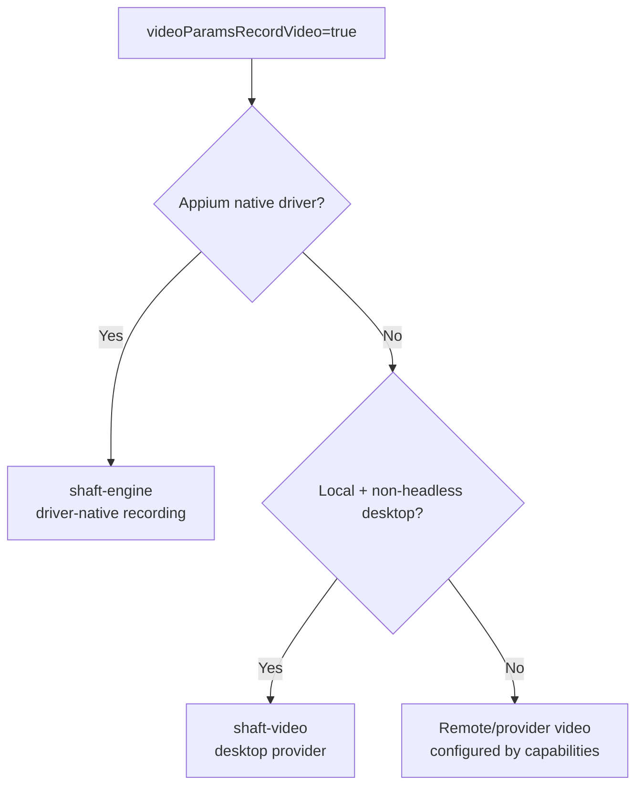

Two optional modules extend SHAFT to the local desktop: `shaft-video` records the session, and `shaft-sikulix` drives desktop apps that have no DOM or Appium locators.

## Video recording {/* #video-recording */}

`io.github.shafthq:shaft-video` supplies SHAFT's optional local desktop recording
provider, including Automation Remarks and the platform-specific JAVE/FFmpeg
payload.



Add the module only for local, non-headless desktop recording:

```xml
<dependency>
    <groupId>io.github.shafthq</groupId>
    <artifactId>shaft-video</artifactId>
</dependency>
```

`RecordManager.startVideoRecording()` requires the desktop provider when those
conditions are met. `RecordManager.startVideoRecording(WebDriver)` keeps Appium
Android/iOS recording in `shaft-engine` through driver-native
`startRecordingScreen()`/`stopRecordingScreen()` calls.

Remote BrowserStack, LambdaTest, Selenium Grid, Selenoid, or Moon video options
are capabilities of those remote providers and do not require `shaft-video`.

## SikuliX desktop automation {/* #sikulix */}

`io.github.shafthq:shaft-sikulix` adds optional SikuliX image matching for
desktop workflows that cannot be reached through DOM or Appium locators.

```xml
<dependencyManagement>
    <dependencies>
        <dependency>
            <groupId>io.github.shafthq</groupId>
            <artifactId>shaft-bom</artifactId>
            <version>${shaft.version}</version>
            <type>pom</type>
            <scope>import</scope>
        </dependency>
    </dependencies>
</dependencyManagement>

<dependencies>
    <dependency>
        <groupId>io.github.shafthq</groupId>
        <artifactId>shaft-engine</artifactId>
    </dependency>
    <dependency>
        <groupId>io.github.shafthq</groupId>
        <artifactId>shaft-sikulix</artifactId>
    </dependency>
</dependencies>
```

```java title="SikuliXActions.java"
new SHAFT.GUI.SikuliX().element()
        .click("src/test/resources/images/save-button.png")
        .type("src/test/resources/images/name-field.png", "SHAFT");
```

Attach actions to an already open application window when the match should be
scoped to that desktop app:

```java title="SikuliXScopedToWindow.java"
SHAFT.GUI.SikuliX calculator = SHAFT.GUI.SikuliX.getInstance("Calculator");
calculator.element()
        .click("src/test/resources/images/one.png")
        .click("src/test/resources/images/plus.png");
calculator.quit();
```

If `shaft-sikulix` is missing, `SHAFT.GUI.SikuliX` reports the missing optional
dependency and tells you to add it instead of surfacing a generic class loading
error.

:::tip
Use `shaft-engine` alone for Appium-backed Windows desktop sessions. Add `shaft-sikulix` only for image matching.
:::

## Related

- [Modules](/docs/features/modules)
- [Mobile and Appium testing](/docs/testing/mobile)
- [Visual testing](/docs/integrations/visual)
- [Upgrade](/docs/start/upgrade)
- [BrowserStack](/docs/integrations/browserstack)
