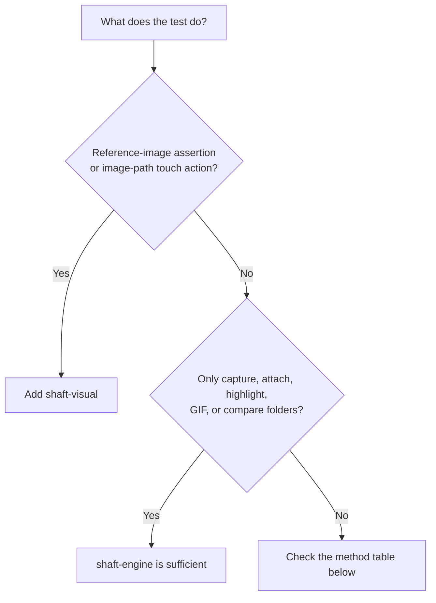

# Visual testing

`io.github.shafthq:shaft-visual` supplies the optional
`VisualProcessingProvider` implementation and its OpenCV, Applitools Eyes, and
Selenium Shutterbug dependencies.

## Add the module

```xml
<dependencyManagement>
    <dependencies>
        <dependency>
            <groupId>io.github.shafthq</groupId>
            <artifactId>shaft-bom</artifactId>
            <version>${shaft.version}</version>
            <type>pom</type>
            <scope>import</scope>
        </dependency>
    </dependencies>
</dependencyManagement>

<dependencies>
    <dependency>
        <groupId>io.github.shafthq</groupId>
        <artifactId>shaft-engine</artifactId>
    </dependency>
    <dependency>
        <groupId>io.github.shafthq</groupId>
        <artifactId>shaft-visual</artifactId>
    </dependency>
</dependencies>
```

No initialization call is required. Java `ServiceLoader` discovers the provider.

## Dependency decision



## Requires `shaft-visual`

| API                                                            | Functionality                                                |
|----------------------------------------------------------------|--------------------------------------------------------------|
| `matchesReferenceImage()`                                      | Reference-image comparison. WebDriver/Appium default to Shutterbug; Playwright uses OpenCV screenshot-byte comparison. |
| `matchesReferenceImage(VisualValidationEngine)`                | OpenCV, Shutterbug, or Eyes comparison selected by the enum. Playwright routes `Locator.screenshot()` bytes through the provider; Shutterbug requests fall back to OpenCV because Shutterbug is Selenium-backed. |
| `doesNotMatchReferenceImage()` and its overload                | Negative OpenCV/visual-engine comparison.                    |
| `TouchActions.tap(String)`                                     | Finds and taps an image inside the current screen.           |
| `TouchActions.type(String, ...)`                               | Finds an image, taps it, then types into the active field.   |
| `TouchActions.waitUntilElementIsVisible(String)`               | Waits for an image match.                                    |
| `TouchActions.waitUntilElementIsNotVisible(String)`            | Waits until an image match disappears from the screen.       |
| `TouchActions.swipeElementIntoView(String, ...)`               | Swipes until the reference image is found.                   |
| `ImageProcessingActions.findImageWithinCurrentPage(...)`       | Direct OpenCV-backed image lookup.                           |
| `ImageProcessingActions.compareAgainstBaseline(...)`           | Direct baseline comparison.                                  |
| `ImageProcessingActions.loadOpenCV()`                          | Explicit provider/native-library loading.                    |
| Built-in Cucumber OpenCV, Shutterbug, and Eyes assertion steps | Delegates to the same provider.                              |

Image-path touch actions compare against viewport screenshots and return
viewport-relative coordinates for Selenium/Appium pointer actions. OpenCV
matching is scale-tolerant, so a cropped reference image can be captured at a
different DPI or display scale than the current app screenshot.

The bundled TestNG/JUnit web samples use:

```java
driver.browser().navigateToURL(targetUrl)
        .and().element().assertThat(logo).matchesReferenceImage();
```

The bundled Cucumber sample uses:

```gherkin
Then I Assert that the element found by "xpath": "//div[contains(@class,'container_fullWidth__1H_L8')]//img", exactly matches with the expected reference image using AI OpenCV
```

Both styles require `shaft-visual`.

`SHAFT.GUI.Playwright` supports the same element visual assertion surface. The
Playwright backend captures `Locator.screenshot()` bytes and compares them
through `shaft-visual`:

```java title="PlaywrightVisualValidation.java"
driver.assertThat().element(By.id("logo"))
      .matchesReferenceImage(ValidationEnums.VisualValidationEngine.EXACT_OPENCV);
```

The no-argument Playwright overload uses `EXACT_OPENCV`. Applitools Eyes engines
also receive Playwright screenshot bytes. Selenium Shutterbug remains available
for WebDriver/Appium visual checks.

## Remains in `shaft-engine`

| API/functionality                                                 | Implementation                        |
|-------------------------------------------------------------------|---------------------------------------|
| WebDriver/Appium screenshots and report attachments               | Selenium/Appium plus SHAFT reporting. |
| `ImageProcessingActions.highlightElementInScreenshot(...)`        | JDK `BufferedImage`/`Graphics2D`.     |
| `ImageProcessingActions.compareImageFolders(...)`                 | JDK `ImageIO` and data buffers.       |
| `formatElementLocatorToImagePath(...)`                            | Baseline naming only.                 |
| `getReferenceImage(...)` and `getShutterbugDifferencesImage(...)` | Baseline file reads only.             |
| Animated GIF generation                                           | Core image/reporting implementation.  |
| Locator-based touch methods such as `tap(By)`                     | Selenium/Appium locator execution.    |
| Healenium                                                         | Independent integration.              |

Without `shaft-visual`, provider-dependent methods throw an
`IllegalStateException` that names the missing Maven coordinate. Core screenshot
and image-file operations continue to work.

## Comparison engines

`shaft-visual` supports five visual validation engines through the `VisualValidationEngine` enum:

| Engine | Description | Best for |
|---|---|---|
| `EXACT_EYES` | Pixel-perfect comparison | Static assets, logos, icons |
| `STRICT_EYES` | High-sensitivity comparison with minor tolerance | UI components |
| `CONTENT_EYES` | Compares content while ignoring minor rendering differences | Text-heavy pages |
| `LAYOUT_EYES` | Compares layout structure, ignores content changes | Page layout regression |
| `OPENCV` | Uses OpenCV for flexible image matching | Complex scenarios, partial matching |

```java title="VisualTesting.java"
import com.shaft.enums.internal.VisualValidationEngine;

// Assert element matches a reference image (stores baseline on first run)
driver.element().assertThat(By.id("logo")).matchesReferenceImage();

// Layout comparison — ignores content, checks structure
driver.element().assertThat(By.id("productCard"))
      .matchesReferenceImage(VisualValidationEngine.LAYOUT_EYES);
```

When an intentional UI change is made, delete the relevant baseline image from `src/test/resources/DynamicObjectRepository/` and run the test once to regenerate it. Run visual tests in a consistent environment (same OS, browser version, screen resolution) to avoid false positives, and avoid mixing headless and headed baselines.

## matchesScreenshot()

`matchesScreenshot()` is a lighter-weight, OpenCV-only pixel-diff assertion built into `shaft-engine` (no `shaft-visual` dependency required). Like every other SHAFT assertion it runs immediately — no `perform()` is needed. Pass a `VisualComparisonOptions` object to tune the diff budget and masks, mirroring Playwright's `toHaveScreenshot()` options:

```java title="ScreenshotBaseline.java"
driver.element().assertThat(By.id("logo"))
      .matchesScreenshot(VisualComparisonOptions.create()
          .maxDiffPixelRatio(0.01)
          .mask(By.id("timestamp")));
```

For a straight comparison with default settings, call `matchesScreenshot()` with no arguments.

### Per-browser/OS baseline naming

Baselines are stored per browser and platform, with a sanitized `_<browser>_<platform>` suffix appended to the hashed baseline file name (for example, `<hash>_chrome_windows.png`). The suffix is built from `SHAFT.Properties.web.targetBrowserName()` and `SHAFT.Properties.platform.targetPlatform()`, lowercased with non-alphanumeric characters stripped, so cross-browser and cross-OS runs no longer share (and fight over) a single baseline image.

If no per-browser/OS baseline exists yet, SHAFT falls back to a legacy unsuffixed baseline when one is present, logging a one-line notice, so baselines captured before this change keep working. New baselines — and any run with `-Dshaft.updateSnapshots=true` — always write to the new per-browser/OS path.

The IntelliJ plugin's **Visual Baselines** panel lists pending `*_diff.png` comparisons and lets you Accept or Reject each one without leaving the IDE — see the [IntelliJ IDEA plugin](/docs/agentic/intellij) guide.

## Related

- [Modules](/docs/features/modules)
- [Upgrade](/docs/start/upgrade)
- [Browserstack](/docs/integrations/browserstack)
- [Video](/docs/integrations/video)
