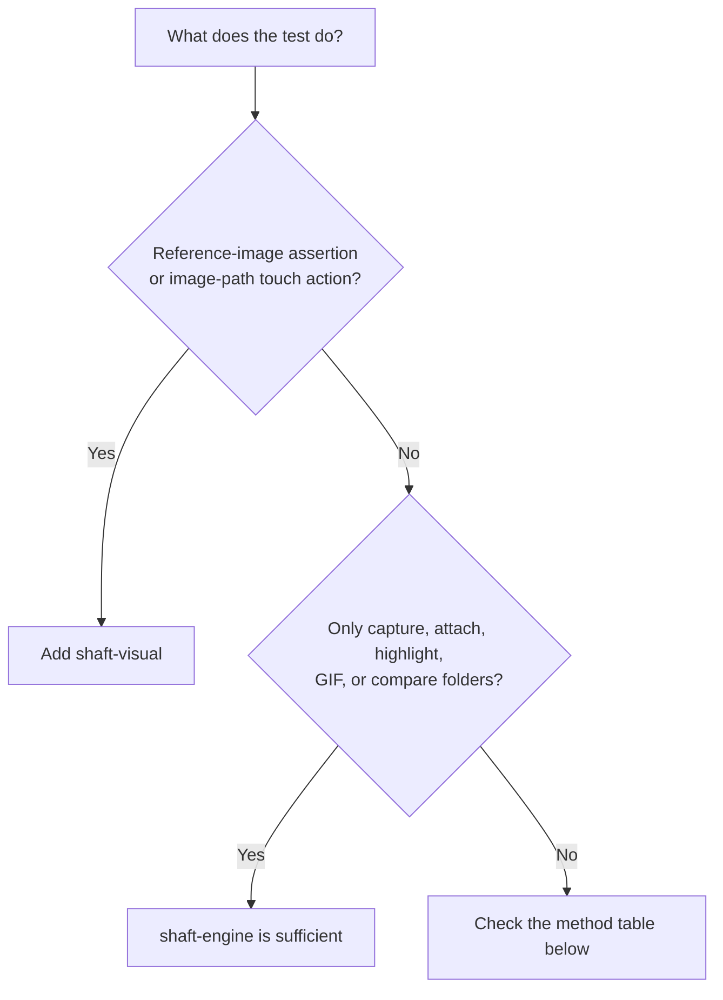

# Visual testing

`io.github.shafthq:shaft-visual` supplies the optional
`VisualProcessingProvider` implementation and its OpenCV, Applitools Eyes, and
Selenium Shutterbug dependencies.

## Add the module

```xml
<dependencyManagement>
    <dependencies>
        <dependency>
            <groupId>io.github.shafthq</groupId>
            <artifactId>shaft-bom</artifactId>
            <version>${shaft.version}</version>
            <type>pom</type>
            <scope>import</scope>
        </dependency>
    </dependencies>
</dependencyManagement>

<dependencies>
    <dependency>
        <groupId>io.github.shafthq</groupId>
        <artifactId>shaft-engine</artifactId>
    </dependency>
    <dependency>
        <groupId>io.github.shafthq</groupId>
        <artifactId>shaft-visual</artifactId>
    </dependency>
</dependencies>
```

No initialization call is required. Java `ServiceLoader` discovers the provider.

## Dependency decision


```mermaid
flowchart TD
    Start["What does the test do?"] --> Ref{"Reference-image assertion<br/>or image-path touch action?"}
    Ref -- Yes --> Visual["Add shaft-visual"]
    Ref -- No --> Core{"Only capture, attach, highlight,<br/>GIF, or compare folders?"}
    Core -- Yes --> Engine["shaft-engine is sufficient"]
    Core -- No --> Check["Check the method table below"]
```

## Requires `shaft-visual`

| API                                                            | Functionality                                                |
|----------------------------------------------------------------|--------------------------------------------------------------|
| `matchesReferenceImage()`                                      | Exact OpenCV reference-image comparison for WebDriver, Appium, and Playwright. |
| `matchesReferenceImage(VisualValidationEngine)`                | OpenCV, Shutterbug, or Eyes comparison selected by the enum. Playwright routes `Locator.screenshot()` bytes through the provider; Shutterbug requests fall back to OpenCV because Shutterbug is Selenium-backed. |
| `doesNotMatchReferenceImage()` and its overload                | Negative OpenCV/visual-engine comparison.                    |
| `TouchActions.tap(String)`                                     | Finds and taps an image inside the current screen.           |
| `TouchActions.tap(ImageTarget)`                                | Finds a typed image target and taps its mapped screenshot center. |
| `TouchActions.type(String, ...)`                               | Finds an image, taps it, then types into the active field.   |
| `TouchActions.waitUntilElementIsVisible(String)`               | Waits for an image match.                                    |
| `TouchActions.waitUntilElementIsNotVisible(String)`            | Waits until an image match disappears from the screen.       |
| `TouchActions.swipeElementIntoView(String, ...)`               | Swipes until the reference image is found.                   |
| `TouchActions.swipeElementIntoView(ImageTarget, ...)`          | Searches while scrolling up, down, left, or right. The overload with `By` restricts search and gestures to a container. |
| `ImageProcessingActions.findImageWithinCurrentPage(...)`       | Direct OpenCV-backed image lookup.                           |
| `ImageProcessingActions.compareAgainstBaseline(...)`           | Direct baseline comparison.                                  |
| `ImageProcessingActions.loadOpenCV()`                          | Explicit provider/native-library loading.                    |
| Built-in Cucumber OpenCV, Shutterbug, and Eyes assertion steps | Delegates to the same provider.                              |

Use `ImageTarget` when you need confidence, occurrence, region, or algorithm
control. SHAFT validates the encoded image before native processing, requires a
unique match unless you select an occurrence, and maps screenshot pixels to the
active viewport:

```java title="TypedImageTarget.java"
import com.shaft.gui.element.TouchActions;
import com.shaft.gui.image.ImageMatchingMode;
import com.shaft.gui.image.ImageRectangle;
import com.shaft.gui.image.ImageTarget;

var payButton = ImageTarget.fromPath(Path.of("src/test/resources/pay.png"))
        .minimumConfidence(0.94)
        .within(new ImageRectangle(0, 300, 1080, 1200))
        .matchingMode(ImageMatchingMode.AUTO);

driver.touch()
        .swipeElementIntoView(payButton, TouchActions.SwipeDirection.DOWN)
        .tap(payButton);
```

`AUTO` uses color-aware, alpha-masked, multi-scale template matching first. If
that cannot establish a match, it tries SIFT feature matching with RANSAC
homography verification for rotated or perspective-shifted targets. Choose
`TEMPLATE` or `FEATURE` to require one path. Feature matching resolves one
geometrically verified occurrence, so narrow the search region when repeated
rotated copies are present.

On Appium, SHAFT tries local OpenCV first. It can use Appium Images as a
capability fallback for an unconstrained target, temporarily applying SHAFT's
visual threshold and restoring the session setting afterward. Explicit target
confidence, region, or matching-mode constraints fail closed when the fallback
cannot enforce them.

The bundled TestNG/JUnit web samples use:

```java
driver.browser().navigateToURL(targetUrl)
        .and().element().assertThat(logo).matchesReferenceImage();
```

The bundled Cucumber sample uses:

```gherkin
Then I Assert that the element found by "xpath": "//div[contains(@class,'container_fullWidth__1H_L8')]//img", exactly matches with the expected reference image using AI OpenCV
```

Both styles require `shaft-visual`.

`SHAFT.GUI.Playwright` supports the same element visual assertion surface. The
Playwright backend captures `Locator.screenshot()` bytes and compares them
through `shaft-visual`:

```java title="PlaywrightVisualValidation.java"
driver.assertThat().element(By.id("logo"))
      .matchesReferenceImage(ValidationEnums.VisualValidationEngine.EXACT_OPENCV);
```

The no-argument overload uses `EXACT_OPENCV` on every backend. Applitools Eyes engines
also receive Playwright screenshot bytes. Selenium Shutterbug remains available
for WebDriver/Appium visual checks.

## Remains in `shaft-engine`

| API/functionality                                                 | Implementation                        |
|-------------------------------------------------------------------|---------------------------------------|
| WebDriver/Appium screenshots and report attachments               | Selenium/Appium plus SHAFT reporting. |
| `ImageProcessingActions.highlightElementInScreenshot(...)`        | JDK `BufferedImage`/`Graphics2D`.     |
| `ImageProcessingActions.compareImageFolders(...)`                 | JDK `ImageIO` and data buffers.       |
| `formatElementLocatorToImagePath(...)`                            | Baseline naming only.                 |
| `getReferenceImage(...)` and `getShutterbugDifferencesImage(...)` | Baseline file reads only.             |
| Animated GIF generation                                           | Core image/reporting implementation.  |
| Locator-based touch methods such as `tap(By)`                     | Selenium/Appium locator execution.    |
| Healenium                                                         | Independent integration.              |

Without `shaft-visual`, provider-dependent methods throw an
`IllegalStateException` that names the missing Maven coordinate. Core screenshot
and image-file operations continue to work.

## Comparison engines

`shaft-visual` supports the visual validation engines in the `VisualValidationEngine` enum:

| Engine | Description | Best for |
|---|---|---|
| `EXACT_EYES` | Pixel-perfect comparison | Static assets, logos, icons |
| `STRICT_EYES` | High-sensitivity comparison with minor tolerance | UI components |
| `CONTENT_EYES` | Compares content while ignoring minor rendering differences | Text-heavy pages |
| `LAYOUT_EYES` | Compares layout structure, ignores content changes | Page layout regression |
| `EXACT_OPENCV` | Uses OpenCV for image comparison | OpenCV-based visual checks |

```java title="VisualTesting.java"
import com.shaft.validation.ValidationEnums;

// Assert element matches a reference image (stores baseline on first run)
driver.element().assertThat(By.id("logo")).matchesReferenceImage();

// Layout comparison — ignores content, checks structure
driver.element().assertThat(By.id("productCard"))
      .matchesReferenceImage(ValidationEnums.VisualValidationEngine.LAYOUT_EYES);
```

When an intentional UI change is made, delete the relevant baseline image from `src/test/resources/DynamicObjectRepository/` and run the test once to regenerate it. Run visual tests in a consistent environment (same OS, browser version, screen resolution) to avoid false positives, and avoid mixing headless and headed baselines.

## matchesScreenshot()

`matchesScreenshot()` is an OpenCV-only pixel-diff assertion built into `shaft-engine`, so it does not require `shaft-visual`. It runs when you call it. Pass a `VisualComparisonOptions` object to tune the diff budget and masks, mirroring Playwright's `toHaveScreenshot()` options:

```java title="ScreenshotBaseline.java"
driver.element().assertThat(By.id("logo"))
      .matchesScreenshot(VisualComparisonOptions.create()
          .maxDiffPixelRatio(0.01)
          .mask(By.id("timestamp")));
```

For a straight comparison with default settings, call `matchesScreenshot()` with no arguments.

### Per-browser/OS baseline naming

Baselines are stored per browser and platform, with a sanitized `_<browser>_<platform>` suffix appended to the hashed baseline file name (for example, `<hash>_chrome_windows.png`). The suffix is built from `SHAFT.Properties.web.targetBrowserName()` and `SHAFT.Properties.platform.targetPlatform()`, lowercased with non-alphanumeric characters stripped, so cross-browser and cross-OS runs no longer share (and fight over) a single baseline image.

If no per-browser/OS baseline exists yet, SHAFT falls back to a legacy unsuffixed baseline when one is present, logging a one-line notice, so baselines captured before this change keep working. New baselines — and any run with `-Dshaft.updateSnapshots=true` — always write to the new per-browser/OS path.

The IntelliJ plugin's **Visual Baselines** panel lists pending `*_diff.png` comparisons and lets you Accept or Reject each one without leaving the IDE — see the [IntelliJ IDEA plugin](/docs/agentic/intellij) guide.

## Related

- [Modules](/docs/features/modules)
- [Upgrade](/docs/start/upgrade)
- [BrowserStack](/docs/integrations/browserstack)
- [Desktop and video](/docs/integrations/desktop-and-video#video-recording)
