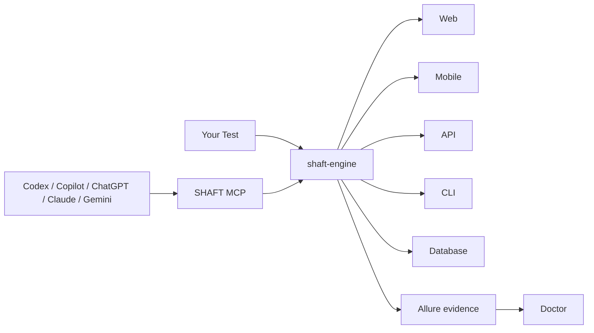

import Link from '@docusaurus/Link';
import {ProjectCommand, ReleaseFacts} from '@site/src/components/DocSnippets';

# One engine. Every test surface.

SHAFT is a Maven-published Java automation framework that combines browser,
mobile, API, terminal, database, validation, evidence, and reporting workflows
behind one fluent API.

<div className="doc-card-grid">
  <Link className="doc-card" to="/docs/testing/web"><strong>Web</strong><span>Selenium sessions, resilient actions, assertions, screenshots, and reports.</span></Link>
  <Link className="doc-card" to="/docs/testing/mobile"><strong>Mobile</strong><span>Appium native, mobile web, Android, iOS, and Flutter workflows.</span></Link>
  <Link className="doc-card" to="/docs/testing/api"><strong>API</strong><span>REST Assured requests, authentication, extraction, schema checks, and assertions.</span></Link>
  <Link className="doc-card" to="/docs/agentic/overview"><strong>Agentic</strong><span>MCP, Capture, Doctor, Heal, and optional provider integrations.</span></Link>
</div>



## Start in 90 seconds

<ProjectCommand />

```bash
cd shaft-demo
mvn test
```

<ReleaseFacts />

## Why teams use SHAFT

- One lifecycle and reporting model across test surfaces.
- Built-in synchronization, screenshots, logging, and Allure evidence.
- TestNG, JUnit 5, and Cucumber integration.
- Optional modules are explicit; projects pay only for the capabilities they use.
- Deterministic Capture, Doctor, and Heal workflows operate without a model provider.

SHAFT is listed in the
[Selenium ecosystem](https://www.selenium.dev/ecosystem/#frameworks) and received
a [Google Open Source Peer Bonus](https://opensource.googleblog.com/2023/05/google-open-source-peer-bonus-program-announces-first-group-of-winners-2023.html).

## Choose your path

| Goal | Go directly to |
|---|---|
| Create or install a project | [Installation](/docs/start/installation) |
| Run the first test | [Quick start](/docs/start/quick-start) |
| Connect an AI coding agent | [SHAFT MCP](/docs/agentic/mcp) |
| Diagnose a failed run | [SHAFT Doctor](/docs/agentic/doctor) |
| Recover a changed locator | [SHAFT Heal](/docs/agentic/heal) |
| Upgrade a legacy project | [Upgrade guide](/docs/start/upgrade) |
