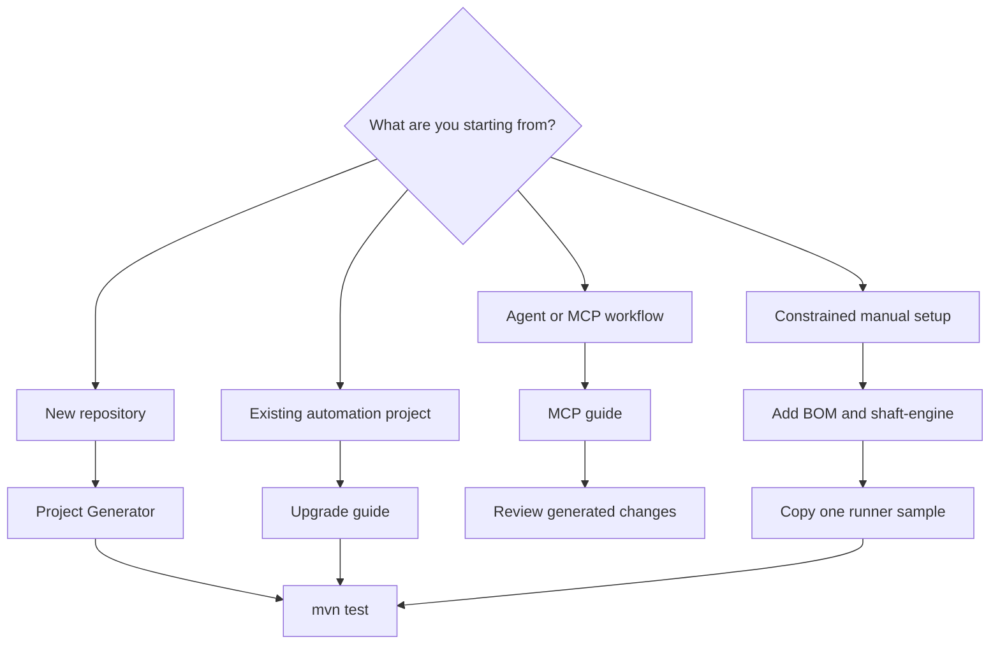

import {
  AllureReportPath,
  BrowserSelectionProperties,
  EngineDependencies,
  FirstRunCommand,
  GitHubStarLink,
} from '@site/src/components/DocSnippets';

# Quick start

Start with the path that matches your repository. New projects should be
generated, existing projects should be upgraded, MCP should be connected only
after the project runs, and manual setup is the fallback for constrained repos.

## Choose your path

<div className="doc-card-grid">
  <a className="doc-card" href="#new-project-generation">
    <strong>1. New project generation</strong>
    <span>Use the SHAFT Project Generator to create a ready-to-run Maven project.</span>
  </a>
  <a className="doc-card" href="#existing-project-upgrade">
    <strong>2. Existing project upgrade</strong>
    <span>Run the transactional upgrader for Selenium, Appium, REST Assured, Cucumber, or older SHAFT projects.</span>
  </a>
  <a className="doc-card" href="#mcp-integration">
    <strong>3. MCP integration</strong>
    <span>Connect agents, Capture, Doctor, and reviewed repair workflows after the project compiles.</span>
  </a>
  <a className="doc-card" href="#manual-creation">
    <strong>4. Manual creation</strong>
    <span>Add dependencies, create folders, and copy one runner sample when generation is not possible.</span>
  </a>
</div>

## Workflow map



## Three-minute useful test

The fastest useful evaluation is: generate a project, run the included sample,
open the evidence, then decide whether SHAFT removed enough setup work to keep.

1. Create a generated project from [Installation](/docs/start/installation).
2. Run the project from its root:

<FirstRunCommand />

3. Confirm Maven reports passing tests.
4. Open the generated evidence under <AllureReportPath />.
5. If the sample test, screenshots, logs, and report match what you expected,
   <GitHubStarLink /> so you can find the project again and track releases.

For a browser-first smoke run, keep the generated defaults or use this minimal
configuration:

<BrowserSelectionProperties />

## New project generation

Use this when you are creating a SHAFT project from scratch.

:::tip Default path
The [SHAFT Project Generator](/docs/start/installation) is the recommended way
to create a new project.
:::

1. Open the [Project Generator](/docs/start/installation).
2. Choose the test runner: TestNG, JUnit, or Cucumber.
3. Choose the test surface: Web, Mobile, or API.
4. Download and extract the generated project.
5. Run the first build from the project root:

<FirstRunCommand />

Generated projects include matching sample tests, reporting setup, optional
GitHub Actions and Dependabot files, and shared IntelliJ IDEA run templates
configured with `@argFiles`.

## Existing project upgrade

Use this when you already have Selenium, Appium, REST Assured, Cucumber, legacy
SHAFT, or modular SHAFT code.

:::tip Safe migration path
The [automated upgrade tool](/docs/start/upgrade) updates Maven dependencies,
validates the result, and rolls changes back if compilation fails.
:::

Open the [automated upgrade and rollback guide](/docs/start/upgrade#download-and-run)
from the existing project and run its canonical upgrade command. That page owns
the script download, OS-neutral invocation, flags, rollback behavior, and
optional repair flow.

## MCP integration

Use this after a generated, upgraded, or manual project already compiles. MCP is
for agent operations around a working SHAFT project, not a replacement for
project setup.

1. Connect your client from the [SHAFT MCP guide](/docs/agentic/mcp#applications).
2. Keep model credentials in the MCP client or provider configuration, not in
   source files.
3. Use Capture and Doctor output as evidence, then review generated code before
   committing it.

Use the [MCP command reference](/docs/agentic/mcp#mcp-command-reference) for
Capture, Doctor, and remote-server commands. Use the
[manual configuration section](/docs/agentic/mcp#manual-configuration) only
when the installer cannot update your selected client.

## Manual creation

Use this only when the Project Generator or upgrader cannot be used, such as a
locked enterprise repository where you must edit files by hand.

### Add SHAFT dependencies

Add the BOM and required engine dependency to `pom.xml`:

<EngineDependencies />

Add optional modules only when a test uses that capability. For example,
reference-image assertions need `shaft-visual`; ordinary browser, mobile, API,
database, CLI, screenshots, reporting, and test data workflows use
`shaft-engine`.

### Create the test skeleton

1. Create `src/test/java/testPackage`.
2. Create `src/test/resources/testDataFiles/simpleJSON.json`.
3. Copy this test data:

```json
{
  "searchQuery": "SHAFT_Engine",
  "expectedTitle": "DuckDuckGo",
  "expectedResultTitle": "SHAFT Engine",
  "expectedResultText": "SHAFT Engine"
}
```

4. Pick one runner sample below.
5. Run the selected test from your IDE or with Maven.

On the first test run, SHAFT creates `src/main/resources/properties`, generates
default properties, runs in `minimalistic test run` mode, and self-configures
listeners under `src/test/resources/META-INF/services`. On later runs, the
Allure execution report opens automatically in your default browser.

:::note IDE run templates
Project Generator projects already include shared IntelliJ IDEA run templates.
For older or manually created projects, open **Run > Edit Configurations > Edit
configuration templates** and set **Shorten command line** to
`@argFiles (Java 9+)` for the Java, JUnit, TestNG, and Cucumber Java templates
you use. Delete stale temporary runs created before changing the template.
:::

<details>
<summary>TestNG sample</summary>

Create `src/test/java/testPackage/TestClass.java`:

```java
package testPackage;

import com.shaft.driver.SHAFT;
import com.shaft.gui.internal.locator.Locator;
import org.openqa.selenium.By;
import org.openqa.selenium.Keys;
import org.testng.annotations.AfterMethod;
import org.testng.annotations.BeforeClass;
import org.testng.annotations.BeforeMethod;
import org.testng.annotations.Test;

public class TestClass {
  SHAFT.GUI.WebDriver driver;
  SHAFT.TestData.JSON testData;

  String targetUrl = "https://duckduckgo.com/";

  By logo = By.xpath("//div[contains(@class,'container_fullWidth__1H_L8')]//img");
  By searchBox = Locator.hasAnyTagName().hasAttribute("name", "q").build();
  By firstSearchResult = By.xpath(
          "(//article[@data-testid='result'])[1]//a[@data-testid='result-title-a']");

  @Test
  public void navigateToDuckDuckGoAndAssertBrowserTitleIsDisplayedCorrectly() {
    driver.browser().navigateToURL(targetUrl)
            .and().assertThat().title().contains(testData.get("expectedTitle"));
  }

  @Test
  public void navigateToDuckDuckGoAndAssertLogoIsDisplayedCorrectly() {
    driver.browser().navigateToURL(targetUrl)
            .and().element().assertThat(logo).isVisible();
  }

  @Test
  public void searchForQueryAndOpenFirstResultAndAssertTitleAndText() {
    driver.browser().navigateToURL(targetUrl)
            .and().element().type(searchBox, testData.get("searchQuery") + Keys.ENTER)
            .and().element().click(firstSearchResult)
            .and().assertThat().title().contains(testData.get("expectedResultTitle"))
            .and().element().assertThat(By.tagName("body")).text().contains(testData.get("expectedResultText"));
  }

  @BeforeClass
  public void beforeClass() {
    testData = new SHAFT.TestData.JSON("simpleJSON.json");
  }

  @BeforeMethod
  public void beforeMethod() {
    driver = new SHAFT.GUI.WebDriver();
  }

  @AfterMethod
  public void afterMethod() {
    driver.quit();
  }
}
```

</details>

<details>
<summary>JUnit sample</summary>

Generated JUnit projects enable the SHAFT listener and extension through
`src/test/resources/junit-platform.properties`. Existing projects should keep
`junit.jupiter.extensions.autodetection.enabled=true` in that file.

Create `src/test/java/testPackage/TestClass.java`:

```java
package testPackage;

import com.shaft.driver.SHAFT;
import com.shaft.gui.internal.locator.Locator;
import org.junit.jupiter.api.AfterEach;
import org.junit.jupiter.api.BeforeAll;
import org.junit.jupiter.api.BeforeEach;
import org.junit.jupiter.api.Test;
import org.openqa.selenium.By;
import org.openqa.selenium.Keys;

public class TestClass {
  private SHAFT.GUI.WebDriver driver;
  private static SHAFT.TestData.JSON testData;

  String targetUrl = "https://duckduckgo.com/";

  By logo = By.xpath("//div[contains(@class,'container_fullWidth__1H_L8')]//img");
  By searchBox = Locator.hasAnyTagName().hasAttribute("name", "q").build();
  By firstSearchResult = By.xpath(
          "(//article[@data-testid='result'])[1]//a[@data-testid='result-title-a']");

  @Test
  public void navigateToDuckDuckGoAndAssertBrowserTitleIsDisplayedCorrectly() {
    driver.browser().navigateToURL(targetUrl)
            .and().assertThat().title().contains(testData.get("expectedTitle"));
  }

  @Test
  public void navigateToDuckDuckGoAndAssertLogoIsDisplayedCorrectly() {
    driver.browser().navigateToURL(targetUrl)
            .and().element().assertThat(logo).isVisible();
  }

  @Test
  public void searchForQueryAndOpenFirstResultAndAssertTitleAndText() {
    driver.browser().navigateToURL(targetUrl)
            .and().element().type(searchBox, testData.get("searchQuery") + Keys.ENTER)
            .and().element().click(firstSearchResult)
            .and().assertThat().title().contains(testData.get("expectedResultTitle"))
            .and().element().assertThat(By.tagName("body")).text().contains(testData.get("expectedResultText"));
  }

  @BeforeAll
  public static void beforeAll() {
    testData = new SHAFT.TestData.JSON("simpleJSON.json");
  }

  @BeforeEach
  public void beforeEach() {
    driver = new SHAFT.GUI.WebDriver();
  }

  @AfterEach
  public void afterEach() {
    driver.quit();
  }
}
```

</details>

<details>
<summary>Cucumber sample</summary>

Create `src/test/java/cucumberTestRunner/CucumberTests.java`:

```java
package cucumberTestRunner;

import io.cucumber.testng.AbstractTestNGCucumberTests;
import org.testng.annotations.Listeners;

@Listeners({com.shaft.listeners.TestNGListener.class})
public class CucumberTests extends AbstractTestNGCucumberTests {
}
```

Create `src/test/java/customCucumberSteps/StepDefinitions.java`:

```java
package customCucumberSteps;

import com.shaft.driver.SHAFT;
import io.cucumber.java.en.Given;
import io.cucumber.java.en.Then;
import io.cucumber.java.en.When;
import org.openqa.selenium.By;
import org.openqa.selenium.Keys;

public class StepDefinitions {
  private SHAFT.GUI.WebDriver driver;
  private SHAFT.TestData.JSON testData;

  @Given("I open the target browser")
  public void i_open_the_target_browser() {
    driver = new SHAFT.GUI.WebDriver();
    testData = new SHAFT.TestData.JSON("simpleJSON.json");
  }

  @When("I navigate to {string}")
  public void i_navigate_to(String url) {
    driver.browser().navigateToURL(url);
  }

  @When("I search for {string}")
  public void i_search_for(String query) {
    By searchBox = By.name("q");
    driver.element().type(searchBox, query + Keys.ENTER);
  }

  @Then("I should see the page title contains {string}")
  public void i_should_see_the_page_title_contains(String expectedTitle) {
    driver.assertThat().browser().title().contains(expectedTitle);
  }

  @Then("I open the first result")
  public void i_open_the_first_result() {
    driver.element().click(
            By.xpath("(//article[@data-testid='result'])[1]//a[@data-testid='result-title-a']"));
  }

  @Then("I should see the page text contains {string}")
  public void i_should_see_the_page_text_contains(String expectedText) {
    driver.element().assertThat(By.tagName("body")).text().contains(expectedText);
  }

  @Then("I close the browser")
  public void i_close_the_browser() {
    driver.quit();
  }
}
```

Create `src/test/resources/features/search.feature`:

```gherkin
Feature: Search functionality

  Scenario: Verify DuckDuckGo search
    Given I open the target browser
    When I navigate to "https://duckduckgo.com/"
    Then I should see the page title contains "DuckDuckGo"
    When I search for "SHAFT_Engine"
    Then I open the first result
    Then I should see the page title contains "SHAFT Engine"
    And I should see the page text contains "SHAFT Engine"
    Then I close the browser
```

For manually created Cucumber projects, edit the Cucumber Java run configuration
template and add:

```bash
--plugin com.shaft.listeners.CucumberFeatureListener
```

</details>

### Run and configure

Use the [properties reference](/docs/reference/properties/PropertiesList) to
configure SHAFT. After upgrading to a new major release, it is sometimes
recommended to delete `src/main/resources/properties` and allow SHAFT to
regenerate the defaults by running any test method.

Join our 
to get notified by email when a new release is pushed out.

## Optional modular integrations

Use `shaft-engine` first. Add optional modules only when a test calls their
capability.

| Capability | Add this module |
|---|---|
| Reference-image assertions, negative reference-image assertions, image-path touch actions | `shaft-visual` |
| BrowserStack SDK interception and YAML orchestration | `shaft-browserstack` |
| Local non-headless desktop recording | `shaft-video` |
| SikuliX image-based desktop automation | `shaft-sikulix` |
| Deterministic web locator recovery | `shaft-heal` plus `healing.strategy=shaft-heal` |

Reference-image assertions require `shaft-visual`:

```java
driver.browser().navigateToURL(targetUrl)
        .and().element().assertThat(logo).matchesReferenceImage();
```

Ordinary screenshots, highlighted report screenshots, API tests, Appium locator
actions, database tests, CLI tests, direct BrowserStack sessions, and
Appium-native recording need only `shaft-engine`.

Windows desktop Appium sessions also stay in `shaft-engine`; use
`shaft-sikulix` only when the test needs SikuliX image matching.

Use the [module selection and migration guide](/docs/start/upgrade) for the
complete method matrix.

## Related

- [Installation](/docs/start/installation)
- [Upgrade](/docs/start/upgrade)
- [SHAFT MCP](/docs/agentic/mcp)
- [Modules](/docs/features/modules)
