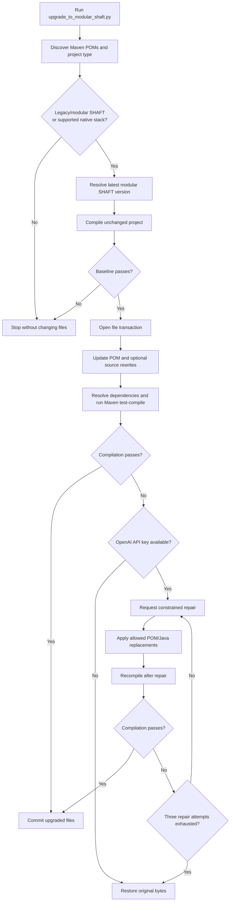
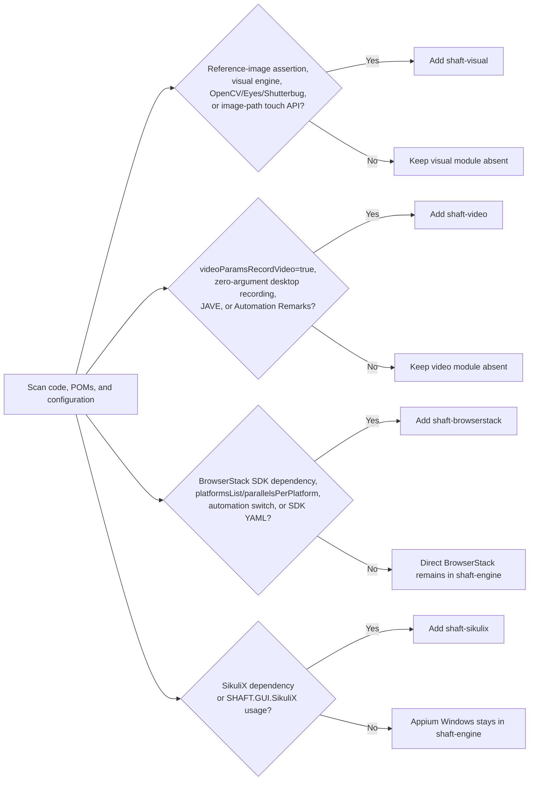
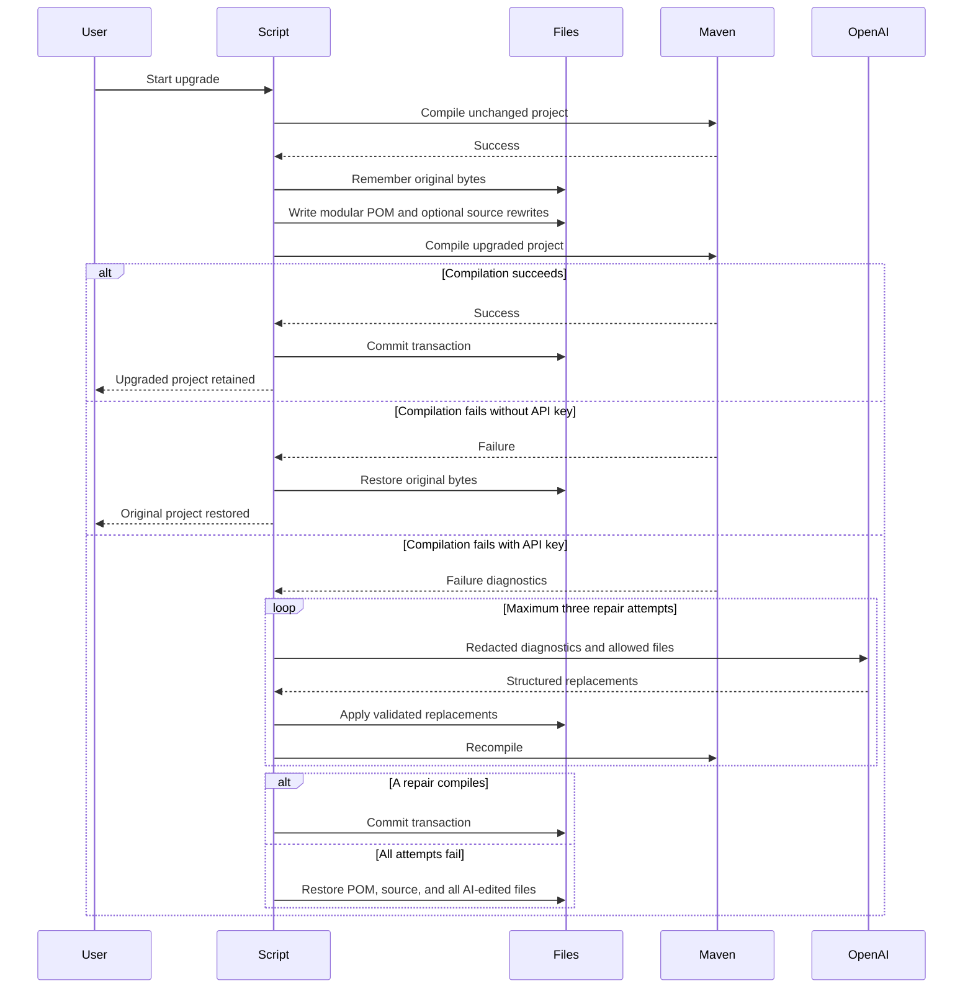

# How the modular SHAFT upgrade works

This page explains what the upgrader decides and why. To run it, follow
[Run the upgrade](/docs/start/upgrade/run). For command options and module
boundaries, see the [upgrade reference](/docs/start/upgrade/reference).

## What the script guarantees

1. Finds supported Maven POMs without scanning generated `target`, `build`,
   `.git`, IDE, or report directories.
2. Resolves the latest published `shaft-engine` release from Maven Central,
   unless `--shaft-version` is supplied.
3. Compiles the unchanged project first. A broken baseline stops the migration
   before any file is changed.
4. Parses `pom.xml` as XML, imports `shaft-bom`, adds `shaft-engine`, and removes
   the legacy `SHAFT_ENGINE` dependency without copying BOM `pom`/`import`
   metadata onto runtime dependencies.
5. Adds only the optional modules supported by project evidence.
6. For Selenium/Appium source upgrades, applies conservative Java rewrites in
   the same transaction as the POM migration.
7. Runs Maven `dependency:go-offline test-compile` so dependencies resolve into
   the local Maven repository and both main and test source are compiled.
8. Commits the file transaction only after compilation passes.
9. Restores every touched file byte-for-byte when validation fails.
10. Optionally uses the OpenAI Responses API for exactly three repair attempts
   before rollback.



## Project detection

The script supports projects when it detects one of these shapes:

| Project shape | Detection |
| --- | --- |
| Legacy SHAFT | `io.github.shafthq:SHAFT_ENGINE` in a POM. |
| Modular SHAFT | `shaft-engine`, `shaft-bom`, or an optional SHAFT module in a POM. |
| Native Selenium | Selenium dependency/import plus TestNG or JUnit dependency/import. |
| Native Appium | Appium dependency/import plus TestNG or JUnit dependency/import. |
| Native REST Assured | Any `io.rest-assured:*` dependency/import plus TestNG or JUnit dependency/import. |
| Cucumber | Cucumber dependency/import. |

For multi-module builds, POMs that directly declare SHAFT or a supported native
stack/runner pair are updated. A child module with a supported native stack is
also updated when the test runner is declared in a parent POM or detected from
source imports. Other reactor POMs are left unchanged.

JUnit detection includes JUnit 4, JUnit Jupiter, and JUnit Platform coordinates
or imports, including suite-style projects that depend on
`org.junit.platform:junit-platform-suite-api`.

## Optional-module scan

For legacy and existing modular SHAFT projects, optional modules are inferred
from existing POMs, Java source, properties, JSON, XML, and YAML. File contents
are not printed; the report records only paths and detection reasons. Native
projects receive `shaft-engine` only because native third-party integrations do
not prove that the corresponding SHAFT provider API is used.

POM evidence is read as Maven dependency coordinates, so compact XML and
formatted XML are treated the same. For example, a legacy project that already
declares `com.browserstack:browserstack-java-sdk`,
`com.automation-remarks:video-recorder-*`, `org.openpnp:opencv`, or
`com.sikulix:sikulixapi` selects the
matching SHAFT optional module during migration.



Existing modular optional dependencies are preserved even when no additional
scan evidence is found.

### BrowserStack evidence

The BrowserStack module is selected for BrowserStack Java SDK behavior, not for
ordinary remote sessions. Evidence includes:

- `com.browserstack:browserstack-java-sdk`.
- `SHAFT.Properties.browserStack.set().platformsList(...)`.
- `SHAFT.Properties.browserStack.set().parallelsPerPlatform(...)`.
- `SHAFT.Properties.browserStack.set().browserstackAutomation(...)`.
- `SHAFT.Properties.browserStack.set().customBrowserStackYmlPath(...)`.
- `browserStack.platformsList`.
- `browserStack.parallelsPerPlatform`.
- `browserStack.browserstackAutomation`.
- `browserStack.customBrowserStackYmlPath`.
- A BrowserStack YAML file with SDK `platforms` or `parallelsPerPlatform`.

Direct BrowserStack WebDriver/Appium execution still requires only
`shaft-engine`. Direct settings such as
`SHAFT.Properties.browserStack.set().deviceName(...)` do not select
`shaft-browserstack` by themselves.

### Visual evidence

The visual module is selected for reference-image or image-engine behavior,
including:

- `matchesReferenceImage(...)` and `doesNotMatchReferenceImage(...)`.
- `VisualValidationEngine`.
- `findImageWithinCurrentPage(...)`, `compareAgainstBaseline(...)`, or
  `loadOpenCV()`.
- Image-path touch/wait/swipe APIs.
- Explicit OpenCV, Applitools Eyes, Selenium Shutterbug, or `shaft-visual`
  dependencies.

Ordinary screenshots, highlighting, GIF generation, and folder comparison do
not select `shaft-visual`.

### Video evidence

The video module is selected for local desktop recording:

- `videoParamsRecordVideo=true`.
- `videoParams_recordVideo=true`.
- `SHAFT.Properties.visuals.set().videoParamsRecordVideo(true)`.
- A zero-argument `startVideoRecording()` call.
- Explicit Automation Remarks, JAVE/FFmpeg, or `shaft-video` dependencies.

Appium driver-native recording and cloud-provider video do not select
`shaft-video`.

### SikuliX evidence

The SikuliX module is selected for image-based desktop automation:

- `SHAFT.GUI.SikuliX`, `SikuliActions`, or `SikuliDriver`.
- Explicit `com.sikulix:sikulixapi` or `shaft-sikulix` dependencies.

Appium Windows desktop sessions do not select `shaft-sikulix`; they remain in
`shaft-engine`.

## Compilation and rollback

The default validation command is:

```bash
mvn dependency:go-offline test-compile -DskipTests -Dgpg.skip
```

`dependency:go-offline` resolves project dependencies and build plugins into
the local Maven repository. `test-compile` compiles both production and test
source without executing tests. The same command runs before and after
migration. Use `--compile-command` only when the project requires a profile,
settings file, module selector, or another project-specific compile entry
point.

The transaction records original bytes and file permissions immediately before
the first write to each file. A normal success discards that in-memory
snapshot. A failure, invalid AI response, path-policy violation, interruption,
or exhausted retry budget restores the originals.



The rollback guarantee covers failures handled by the running process. An
operating-system kill, power loss, or hardware failure can terminate any
program before cleanup runs, which is another reason to use version control.

## Optional OpenAI compile repair

OpenAI repair is disabled unless a key is supplied. The safest interactive
setup avoids shell history:

```bash
python upgrade_to_modular_shaft.py \
  --project . \
  --prompt-for-openai-key
```

For CI or an existing secret manager, set `OPENAI_API_KEY` and run the normal
command:

```bash
export OPENAI_API_KEY="..."
python upgrade_to_modular_shaft.py --project . --yes
```

Do not paste a real API key into the script, `pom.xml`, source code, or a
checked-in properties file.

When the upgraded compile fails, the script uses the
[OpenAI Responses API](https://developers.openai.com/api/docs/guides/text) with
[Structured Outputs](https://developers.openai.com/api/docs/guides/structured-outputs).
The default model is `gpt-5.5`; override it with `--openai-model` when required.

Each request is constrained as follows:

- Compiler output is redacted for common tokens, passwords, bearer headers, and
  private keys.
- Only candidate POMs and Java files named by compiler diagnostics are
  considered.
- A file containing a detected secret is excluded from editable context.
- The model can replace only existing, non-symlink `pom.xml` and `.java` files
  that were supplied in the request.
- Absolute paths, parent traversal, new files, unrelated extensions, invalid
  XML, oversized output, and changes outside the supplied context are rejected.
- The modular BOM/version contract is revalidated after every accepted repair.
- The project is recompiled after each of the three repair attempts.
- If no attempt passes, the POM and every AI-edited file are rolled back.

Use `--no-ai` to force deterministic rollback even when the environment already
contains an API key.

## Selenium source migration

Source migration is opt-in and compile-validated. `basic` keeps source intact.
`session` and `full` are rejected for REST Assured-only, Cucumber-only, and
other non-Selenium/Appium projects.

### Session upgrade rewrites

`--upgrade-type session` performs the POM upgrade, then rewrites supported
driver session code:

- `WebDriver` type declarations, simple return types, parameters, and
  `ThreadLocal<WebDriver>` holders become `SHAFT.GUI.WebDriver`.
- `new ChromeDriver(...)`, `new FirefoxDriver(...)`, `new EdgeDriver(...)`,
  `new SafariDriver(...)`, `new RemoteWebDriver(...)`, `new AndroidDriver(...)`,
  `new IOSDriver(...)`, and `new AppiumDriver(...)` are wrapped as
  `new SHAFT.GUI.WebDriver(new ...Driver(...))`.
- `driver.close()` becomes `driver.quit()` when the variable was migrated to
  `SHAFT.GUI.WebDriver`.

Example:

```java
// Selenium before
private WebDriver driver;

@BeforeMethod
public void startDriver() {
    driver = new ChromeDriver();
}

@AfterMethod
public void stopDriver() {
    driver.close();
}

// SHAFT after session upgrade
private SHAFT.GUI.WebDriver driver;

@BeforeMethod
public void startDriver() {
    driver = new SHAFT.GUI.WebDriver(new ChromeDriver());
}

@AfterMethod
public void stopDriver() {
    driver.quit();
}
```

### Full upgrade rewrites

`--upgrade-type full` runs the session upgrade, then rewrites simple
one-statement browser and element actions:

```java
// Selenium
driver.get("https://example.com");
driver.findElement(By.id("login")).click();
driver.findElement(By.id("username")).sendKeys("demo");

// SHAFT
driver.browser().navigateToURL("https://example.com");
driver.element().click(By.id("login"));
driver.element().type(By.id("username"), "demo");
```

The automatic full upgrade currently targets:

- `driver.get(url)` and `driver.navigate().to(url)`.
- `driver.findElement(locator).click()`.
- `driver.findElement(locator).sendKeys(text)`.
- `driver.findElement(locator).getText()`.
- `driver.findElement(locator).isDisplayed()`.
- `driver.findElement(locator).getAttribute(name)`.

The report lists files changed by source migration and records unsupported
patterns that need manual review. Risky cases remain manual: chained Selenium
`Actions`, JavaScript execution, custom waits, reused `WebElement` instances,
`findElements` collection handling, exception-driven control flow, and
assertions whose message or soft/hard behavior matters.

After a full upgrade, migrate element and browser assertions manually so their
intent remains clear:

```java
// Selenium/TestNG assertion
Assert.assertTrue(driver.findElement(By.id("banner")).isDisplayed());

// SHAFT assertion
driver.element().assertThat(By.id("banner")).isVisible();
```

## Related

- [Installation](/docs/start/installation)
- [Quick Start](/docs/start/quick-start)
- [Modules](/docs/features/modules)
- [Upgrade overview](/docs/start/upgrade)
