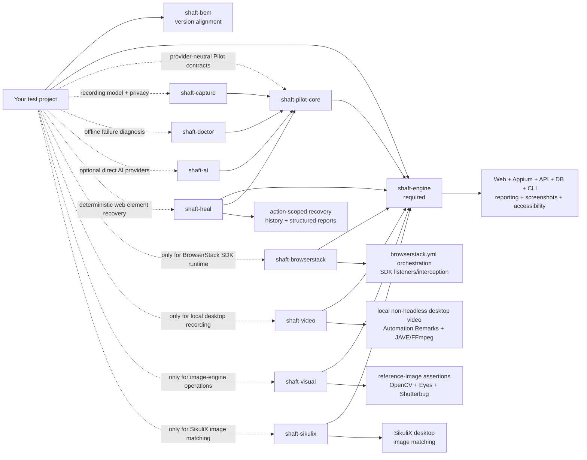

import {MigrationDependencies} from '@site/src/components/DocSnippets';

# Modular SHAFT upgrade reference

These sections describe the exact command surface and Maven result produced by
the upgrader. They remain useful for review, unusual project layouts, and
troubleshooting; they are not an alternative migration path. To perform an
upgrade, follow [Run the upgrade](/docs/start/upgrade/run).

## Command reference

| Option | Purpose |
| --- | --- |
| `--project PATH` | Project root. Defaults to the current directory. |
| `--shaft-version VERSION` | Use a controlled version instead of Maven Central's latest release. Useful for local/offline repositories. |
| `--compile-command COMMAND` | Override the default Maven `dependency:go-offline test-compile -DskipTests -Dgpg.skip` command. |
| `--compile-timeout SECONDS` | Set the timeout for each compile invocation. Default: 900 seconds. |
| `--upgrade-type TYPE` | Select `basic`, `session`, or `full`. `basic` is the default; `session` and `full` require Selenium/Appium. |
| `--agent-plan` | Print the three upgrade choices as JSON for AI agents, then exit without writing or compiling. |
| `--skip-baseline-compile` | Skip the unchanged-project compile. This weakens failure attribution and is not recommended. |
| `--dry-run` | Print POM and optional source diffs without writing or compiling. |
| `--yes` | Do not prompt before applying changes. |
| `--report PATH` | Write an optional JSON result report. |
| `--prompt-for-openai-key` | Securely prompt for an optional API key. |
| `--openai-key-env NAME` | Read the API key from another environment variable. Default: `OPENAI_API_KEY`. |
| `--openai-model MODEL` | Select another Responses API model. |
| `--no-ai` | Disable AI repair even if an API key is present. |

## Migration outcome

A completed migration has:

- `shaft-bom` managing one SHAFT version.
- `shaft-engine` replacing the old uppercase artifact.
- Only the optional modules used by the project.
- No mixture of `SHAFT_ENGINE` and modular JARs in the dependency tree.
- Passing compile/tests with a populated Allure result set when SHAFT tests run.

## Coordinates: before and after

<MigrationDependencies />

The shared version above is updated by the release workflow. Verify availability
through the
[canonical Maven Central artifact](https://central.sonatype.com/artifact/io.github.shafthq/shaft-engine)
before changing a production build.

## Module map

Importing `shaft-bom` aligns versions; it does not add runtime code.



## Select dependencies by functionality

| Functionality                                                                | Required artifact    | Do not add an optional module for                                                |
|------------------------------------------------------------------------------|----------------------|----------------------------------------------------------------------------------|
| WebDriver browser actions, element actions, locators, screenshots, reporting | `shaft-engine`       | Normal local, Docker, Selenium Grid, LambdaTest, or direct BrowserStack sessions |
| Appium native/mobile web/Flutter actions and Appium screen recording         | `shaft-engine`       | Driver-native Android/iOS recording                                              |
| REST Assured API, database, CLI, test data, accessibility, Cucumber steps    | `shaft-engine`       | Any of these capabilities by themselves                                          |
| Provider-neutral Pilot requests, approval, redaction, and deterministic fallback | `shaft-pilot-core` | Direct provider HTTP calls                                                        |
| Versioned browser recording, privacy classification, and capture JSON        | `shaft-capture`      | Ordinary engine screenshots or desktop video                                     |
| Portable evidence bundles and deterministic offline failure diagnosis         | `shaft-doctor`       | Allure report rendering or direct AI provider calls                               |
| Direct OpenAI, Anthropic, Gemini, or Ollama provider calls                    | `shaft-ai`           | Deterministic Capture creation, validation, migration, or replay data             |
| Deterministic explainable web element recovery                                | `shaft-heal`         | Normal element actions when locator recovery is not explicitly enabled            |
| BrowserStack SDK interception and `browserstack.yml` orchestration           | `shaft-browserstack` | Direct BrowserStack WebDriver/Appium sessions built by SHAFT                     |
| Local, non-headless desktop recording managed by SHAFT                       | `shaft-video`        | Remote-provider video or Appium `startRecordingScreen()`                         |
| Reference-image assertions and image-based touch lookup                      | `shaft-visual`       | Ordinary screenshots, screenshot highlighting, GIFs, or folder comparison        |
| SikuliX image-based desktop automation                                       | `shaft-sikulix`      | Appium Windows desktop sessions through `shaft-engine`                           |

Add optional modules beside `shaft-engine`; their versions come from the BOM:

```xml
<dependency>
    <groupId>io.github.shafthq</groupId>
    <artifactId>shaft-visual</artifactId>
</dependency>
```

Use the same shape for `shaft-pilot-core`, `shaft-capture`, `shaft-doctor`,
`shaft-ai`, `shaft-heal`, `shaft-browserstack`, `shaft-video`, or
`shaft-sikulix`, but add only the artifacts selected by the tables below.

## SHAFT Heal dependency boundary

Add `shaft-heal` only when WebDriver locator recovery is required, then opt in
with `healing.strategy=shaft-heal`. The module is disabled by default and does
not alter native mobile execution. Use `healing.strategy=composite` only when
both SHAFT Heal and Healenium are intentionally required; legacy
`heal-enabled=true` continues to select Healenium when no explicit SHAFT Heal
strategy is configured.

Visual evidence remains local and requires both `shaft-visual` and
`healing.visual.enabled=true`. AI candidate reranking requires
`healing.ai.enabled=true` plus the normal Pilot approval/provider controls.
Neither optional score can bypass deterministic confidence and ambiguity
checks. See the [SHAFT Heal guide](/docs/agentic/heal).

## Capture dependency boundary

Add `shaft-capture` when a project creates, validates, migrates, reviews, or
persists SHAFT Capture recording JSON. It transitively uses
`shaft-pilot-core` for provider-neutral security contracts but does not resolve
`shaft-ai`. Recording and privacy enforcement remain deterministic with
`pilot.ai.enabled=false`.

See the [SHAFT Capture format guide](/docs/agentic/capture).

## Doctor dependency boundary

Add `shaft-doctor` when a project needs allowlisted local evidence collection,
portable redacted bundles, deterministic root-cause classification, or
JSON/Markdown diagnosis reports. It uses `shaft-pilot-core` security helpers
but does not resolve `shaft-ai` or make network calls. See the
[SHAFT Doctor guide](/docs/agentic/doctor).

## Visual dependency boundary

`shaft-visual` is required when execution reaches the optional
`VisualProcessingProvider`. Merely taking or attaching a screenshot does not
reach that provider.

### Methods that require `shaft-visual`

| Public API or behavior                                                                 | Why it needs the module                                                                                                            |
|----------------------------------------------------------------------------------------|------------------------------------------------------------------------------------------------------------------------------------|
| `matchesReferenceImage()`                                                              | Defaults to `EXACT_SHUTTERBUG`; all reference-image engines are implemented by the provider.                                       |
| `matchesReferenceImage(VisualValidationEngine)`                                        | `EXACT_SHUTTERBUG`, `EXACT_OPENCV`, `EXACT_EYES`, `STRICT_EYES`, `CONTENT_EYES`, and `LAYOUT_EYES` all delegate to `shaft-visual`. |
| `doesNotMatchReferenceImage()` and its engine overload                                 | The default is `EXACT_OPENCV`; every overload delegates to the provider.                                                           |
| Cucumber reference-image assertion steps                                               | The built-in OpenCV, Shutterbug, and Eyes steps invoke the same validation path.                                                   |
| `TouchActions.tap(String)`                                                             | Locates the reference image inside the current screenshot using OpenCV.                                                            |
| `TouchActions.waitUntilElementIsVisible(String)`                                       | Uses OpenCV to find the supplied image.                                                                                            |
| `TouchActions.swipeElementIntoView(String, ...)` and the scrollable-container overload | Uses image matching after each swipe.                                                                                              |
| `ImageProcessingActions.findImageWithinCurrentPage(...)`                               | Direct provider operation.                                                                                                         |
| `ImageProcessingActions.compareAgainstBaseline(...)`                                   | Direct provider operation for every visual engine.                                                                                 |
| `ImageProcessingActions.loadOpenCV()`                                                  | Explicitly loads the optional provider.                                                                                            |

The TestNG and JUnit web samples contain this visual assertion:

```java
@Test
public void navigateToDuckDuckGoAndAssertLogoIsDisplayedCorrectly() {
    driver.browser().navigateToURL(targetUrl)
            .and().element().assertThat(logo).matchesReferenceImage();
}
```

Their POMs therefore include `shaft-visual`. Removing the visual test allows
those projects to return to `shaft-engine` only.

### Functionality that remains in `shaft-engine`

| Method or behavior                                                                                     | Why no visual module is needed                             |
|--------------------------------------------------------------------------------------------------------|------------------------------------------------------------|
| Selenium/Appium screenshot capture and Allure attachments                                              | Uses WebDriver/Appium screenshot APIs and SHAFT reporting. |
| `ImageProcessingActions.highlightElementInScreenshot(...)`                                             | Uses JDK `BufferedImage` and `Graphics2D`.                 |
| `ImageProcessingActions.compareImageFolders(...)`                                                      | Uses JDK `ImageIO` and image data buffers.                 |
| `formatElementLocatorToImagePath(...)`, `getReferenceImage(...)`, `getShutterbugDifferencesImage(...)` | Performs naming and file access only.                      |
| Animated GIF creation                                                                                  | Does not invoke the visual provider.                       |
| Healenium integration                                                                                  | Independent of OpenCV.                                     |
| Normal locator-based `tap(By)`, `waitUntilElementIsVisible(By)`, and `swipeElementIntoView(By, ...)`   | Uses Selenium/Appium locators, not reference images.       |

See the detailed [visual module guide](/docs/integrations/visual).

## BrowserStack dependency boundary

`shaft-browserstack` does not add a new SHAFT facade method. It adds the
BrowserStack Java SDK runtime. The ordinary BrowserStack driver path remains in
`shaft-engine`.

### Works with `shaft-engine` only

The standard web sample remains unchanged when a direct BrowserStack session is
selected:

```java
@BeforeMethod
public void beforeMethod() {
    driver = new SHAFT.GUI.WebDriver();
}

@Test
public void searchForQueryAndAssert() {
    driver.browser().navigateToURL(targetUrl)
            .and().element().type(searchBox, testData.get("searchQuery") + Keys.ENTER)
            .and().element().click(firstSearchResult)
            .and().assertThat().title().contains(testData.get("expectedResultTitle"))
            .and().element().assertThat(By.tagName("body")).text()
            .contains(testData.get("expectedResultText"));
}
```

With `executionAddress=browserstack`, `shaft-engine` performs all of the
following without `shaft-browserstack`:

- `new SHAFT.GUI.WebDriver()` and `DriverFactory` BrowserStack routing.
- Desktop web, mobile web, and native Appium session creation.
- W3C `bstack:options` capability construction.
- BrowserStack app upload when `browserStack.appRelativeFilePath` is used.
- Credentials, device/browser/OS selection, local flag, debug/network logs,
  Selenium/Appium version, geolocation, and custom capability handling.
- Generation or copying of `browserstack.yml` through
  `BrowserStackSdkHelper.generateBrowserStackYml()`.

The generated YAML is harmless but has no SDK orchestration effect when the SDK
runtime is absent.

### Requires `shaft-browserstack`

Add the module when BrowserStack's SDK must consume `browserstack.yml` and
intercept/orchestrate the test runtime:

```xml
<dependency>
    <groupId>io.github.shafthq</groupId>
    <artifactId>shaft-browserstack</artifactId>
</dependency>
```

These SHAFT properties configure SDK-only behavior:

```java
SHAFT.Properties.browserStack.set()
        .platformsList("""
                [
                  {"os":"Windows","osVersion":"11","browserName":"Chrome"},
                  {"os":"OS X","osVersion":"Sonoma","browserName":"Safari"}
                ]
                """)
        .parallelsPerPlatform(2)
        .browserstackAutomation(true);
```

| SDK-dependent configuration/functionality                                     | Without `shaft-browserstack`                                                     |
|-------------------------------------------------------------------------------|----------------------------------------------------------------------------------|
| `browserStack.platformsList` multi-platform expansion                         | The value is written to YAML, but no SDK consumes it.                            |
| `browserStack.parallelsPerPlatform` SDK parallel orchestration                | Direct SHAFT session creation still follows the test runner's own parallelism.   |
| `browserStack.browserstackAutomation` interception switch                     | No BrowserStack SDK is present to intercept WebDriver creation.                  |
| `browserStack.customBrowserStackYmlPath` as SDK configuration                 | SHAFT can copy the file, but only the SDK interprets its orchestration settings. |
| SDK listeners, automatic capability override, and SDK reporting/orchestration | Unavailable; the direct SHAFT BrowserStack session still works.                  |

See the [BrowserStack module guide](/docs/integrations/browserstack) and
[BrowserStack's SDK architecture](https://www.browserstack.com/docs/automate/selenium/how-sdk-works).

## Video dependency boundary

`shaft-video` is required only when
`videoParamsRecordVideo=true` starts local, non-headless desktop recording.
`RecordManager.startVideoRecording()` then discovers the desktop provider and
fails with an actionable message when it is absent.

Appium native recording through `RecordManager.startVideoRecording(WebDriver)`
and Android/iOS `startRecordingScreen()` remains in `shaft-engine`. Remote cloud
video configured through provider capabilities also does not use
`shaft-video`.

See the [video module guide](/docs/integrations/desktop-and-video#video-recording).

## Legacy relocation and support window

The old `io.github.shafthq:SHAFT_ENGINE` coordinate is a relocation POM pointing
to `io.github.shafthq:shaft-engine` for the modular release line. It contains no
classes and selects only `shaft-engine`. Maven cannot infer whether a project
needs BrowserStack SDK orchestration, desktop recording, or image-engine
operations, so relocation never adds optional modules.

Use relocation only as a temporary compatibility bridge. Do not declare the
legacy coordinate together with modular artifacts.

## Verified cold-cache download measurements

The table records compressed classpath JAR bytes from isolated Maven
repositories. The monolithic graph is the committed `10.2.20260605` baseline at
commit `570a836`; the modular graph is `shaft-engine` only. MiB uses 1,048,576
bytes.

| Supported platform | Before: `SHAFT_ENGINE` | After: `shaft-engine` only | Saved |
| --- | ---: | ---: | ---: |
| Linux x64 | 352,001,986 (335.70 MiB) | 169,941,464 (162.07 MiB) | 182,060,522 (173.63 MiB / 51.7%) |
| Linux ARM64 | 348,005,291 (331.88 MiB) | 169,941,464 (162.07 MiB) | 178,063,827 (169.81 MiB / 51.2%) |
| Windows x64 | 350,617,708 (334.38 MiB) | 169,941,464 (162.07 MiB) | 180,676,244 (172.31 MiB / 51.5%) |
| macOS x64 | 344,700,722 (328.73 MiB) | 169,941,464 (162.07 MiB) | 174,759,258 (166.66 MiB / 50.7%) |
| macOS ARM64 | 341,487,898 (325.67 MiB) | 169,941,464 (162.07 MiB) | 171,546,434 (163.60 MiB / 50.2%) |

Reproduce the current modular graph after a reactor build:

```bash
mvn clean install -DskipTests -Dgpg.skip
python3 scripts/ci/measure_consumer_dependencies.py \
  --fixture api \
  --output target/modular-measurement
```

The platform totals substitute the exact JAVE native JAR selected by the old
POM: Linux x64 28,201,169 bytes, Linux ARM64 24,204,474 bytes, Windows x64
26,816,891 bytes, macOS x64 20,899,905 bytes, and macOS ARM64 17,687,081 bytes.

## Related

- [Installation](/docs/start/installation)
- [Quick Start](/docs/start/quick-start)
- [Modules](/docs/features/modules)
- [Upgrade overview](/docs/start/upgrade)
