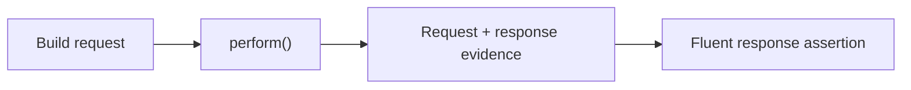

import {AllureReportPath, FirstRunCommand} from '@site/src/components/DocSnippets';

# API testing

Start here when you want one REST call, one assertion, and request/response
evidence in the same report as your browser and mobile tests.

```java
import com.shaft.driver.SHAFT;
import org.testng.annotations.Test;

public class CountryApiTest {
    @Test
    public void getCountryByCapital() {
        SHAFT.API api = new SHAFT.API("https://restcountries.com/v3.1/");

        api.get("capital/Cairo");
        api.assertThatResponse()
                .extractedJsonValue("[0].name.common")
                .isEqualTo("Egypt");
    }
}
```



Continue with [request building](/docs/reference/actions/API/Request_Builder),
[authentication](/docs/reference/actions/API/API_Authentication), and
[response assertions](/docs/reference/actions/API/Response_Validations). When
the API is part of a browser journey, use
[UI and API contract replay](/docs/testing/contracts) to record the exchanged
traffic once and assert or replay it later.

## Run and inspect evidence

Run the test from the project root:

<FirstRunCommand />

SHAFT attaches request, response, status, headers, body, and assertion evidence
under <AllureReportPath />. If the request fails before assertions, check the
base URI, proxy settings, authentication, and whether automatic `2xx` status
assertion is appropriate for the scenario.

## First useful next steps

| Need | Start with |
|---|---|
| Add headers, query parameters, or body | [Request Builder](/docs/reference/actions/API/Request_Builder) |
| Reuse tokens or basic auth | [API Authentication](/docs/reference/actions/API/API_Authentication) |
| Validate JSON fields or schemas | [Response Validations](/docs/reference/actions/API/Response_Validations) |
| Record and replay UI/API traffic | [UI and API contract replay](/docs/testing/contracts) |
| Track OpenAPI coverage | [API configuration](/docs/reference/configuration/basicConfig3) |

## Related

- [Request Builder](/docs/reference/actions/API/Request_Builder)
- [Response Validations](/docs/reference/actions/API/Response_Validations)
- [API Authentication](/docs/reference/actions/API/API_Authentication)
- [UI and API contract replay](/docs/testing/contracts)
