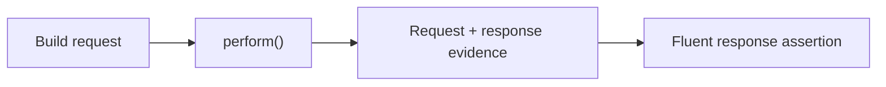

# API testing

```java
import com.shaft.driver.SHAFT;
import org.testng.annotations.Test;

public class CountryApiTest {
    @Test
    public void getCountryByCapital() {
        SHAFT.API api = new SHAFT.API("https://restcountries.com/v3.1/");

        api.get("capital/Cairo").perform();
        api.assertThatResponse()
                .extractedJsonValue("[0].name.common")
                .isEqualTo("Egypt");
    }
}
```



Continue with [request building](/docs/reference/actions/API/Request_Builder),
[authentication](/docs/reference/actions/API/API_Authentication), and
[response assertions](/docs/reference/actions/API/Response_Validations).

## Related

- [Request Builder](/docs/reference/actions/API/Request_Builder)
- [Response Validations](/docs/reference/actions/API/Response_Validations)
- [API Authentication](/docs/reference/actions/API/API_Authentication)
