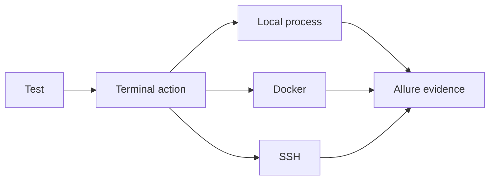

# CLI testing

SHAFT provides terminal, Docker, SSH, and file actions with the same reporting
model used by browser and API tests.



Open the [terminal actions reference](/docs/reference/actions/CLI/Terminal_Actions)
for executable examples and result handling.

## First useful command test

Use CLI actions when the product behavior depends on a process, file, Docker
command, deployment script, or remote shell state. Start with a harmless local
command and assert on the captured output:

```java
SHAFT.CLI terminal = new SHAFT.CLI();
String output = terminal.performTerminalCommand("echo Hello SHAFT");

SHAFT.Validations.assertThat().object(output).contains("Hello SHAFT");
```

Run the test with Maven:

```bash
mvn test
```

The command, output, and validation status are attached to the same Allure
evidence flow as the rest of the suite.

## Troubleshooting

| Symptom | Check |
|---|---|
| Command works locally but fails in CI | Use absolute paths or set the working directory explicitly. |
| Docker command times out | Verify Docker is running before tuning command timeout properties. |
| SSH command cannot connect | Validate host, user, key, network route, and CI secret injection. |
| File assertion fails on Windows | Prefer forward slashes in Java paths; Java resolves them on Windows. |

## Related

- [Terminal Actions](/docs/reference/actions/CLI/Terminal_Actions)
- [File Actions](/docs/reference/actions/CLI/File_Actions)
- [Docker Terminal](/docs/reference/actions/CLI/Docker_Terminal)
