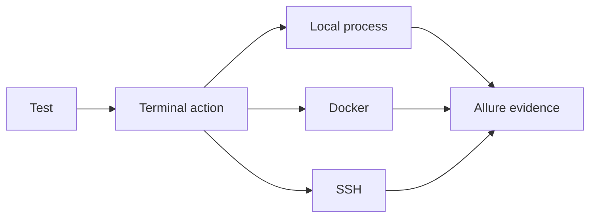

# CLI testing

SHAFT provides terminal, Docker, SSH, and file actions with the same reporting
model used by browser and API tests.

Open the [terminal actions reference](/docs/reference/actions/CLI/Terminal_Actions)
for executable examples and result handling.
