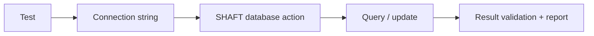

# Database testing

Use SHAFT database actions to open a JDBC connection, execute statements, and
attach query evidence to the test report.

See [database actions](/docs/reference/actions/DB/DB_Actions),
[connection strings](/docs/reference/actions/DB/Connection_Strings), and the
[Oracle setup](/docs/reference/actions/DB/Oracle_JDBC_Setup).
