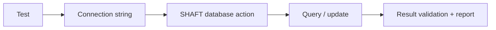

# Database testing

Use SHAFT database actions to open a JDBC connection, execute statements, and
attach query evidence to the test report.



See [database actions](/docs/reference/actions/DB/DB_Actions),
[connection strings](/docs/reference/actions/DB/Connection_Strings), and the
[Oracle setup](/docs/reference/actions/DB/Oracle_JDBC_Setup).

## First useful query test

Start with a read-only query against a disposable schema, containerized
database, or in-memory database. Keep credentials outside source control and
validate a small result before adding write operations.

```java
SHAFT.DB database = new SHAFT.DB("jdbc:h2:mem:test");
ResultSet rows = database.executeSelectQuery("SELECT 1");

SHAFT.Validations.assertThat().object(rows).isNotNull();
```

Run the test with Maven:

```bash
mvn test
```

The query, connection target, and validation result are attached to the test
report. If the connection fails, verify the JDBC URL, driver dependency,
network route, schema permissions, and whether CI has the required secret
values.

## Choose the next reference

| Need | Start with |
|---|---|
| Build a JDBC URL | [Connection Strings](/docs/reference/actions/DB/Connection_Strings) |
| Run selects, updates, or result validation | [DB Actions](/docs/reference/actions/DB/DB_Actions) |
| Connect to Oracle | [Oracle JDBC Setup](/docs/reference/actions/DB/Oracle_JDBC_Setup) |

## Related

- [DB Actions](/docs/reference/actions/DB/DB_Actions)
- [Connection Strings](/docs/reference/actions/DB/Connection_Strings)
- [Oracle Jdbc Setup](/docs/reference/actions/DB/Oracle_JDBC_Setup)
