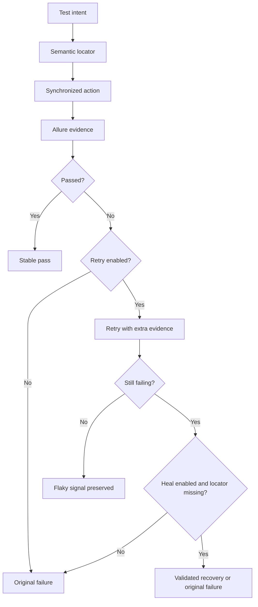

# How SHAFT reduces flakiness

SHAFT reduces flakiness by moving timing, locator, retry, and evidence capture
out of individual tests and into the engine. It does not make every failure
pass: product defects, broken test data, and real environment outages should
still fail. The difference is that common UI timing and locator churn have one
configured path instead of many hand-written sleeps and custom retry loops.



## Semantic Locators

Raw Selenium locators often bind tests to implementation details: generated
IDs, CSS classes, absolute XPath, or DOM depth. SHAFT gives tests a higher
level locator vocabulary:

- `SHAFT.GUI.Locator.inputField("Email")` resolves inputs by user-facing
  signals such as placeholders, ARIA labels, IDs, adjacent labels, and nearby
  text.
- `SHAFT.GUI.Locator.clickableField("Sign in")` resolves buttons, links,
  submit inputs, ARIA-labelled controls, role-based controls, and visible text.
- `driver.element().type("Email", value)` and
  `driver.element().click("Sign in")` are intent-shaped overloads that route
  through those Smart Locators.
- ARIA role locators let tests target semantic roles and text instead of
  brittle markup structure.
- `driver.act(...)` can express a guarded workflow intent, then SHAFT plans it
  into ordinary browser, element, and touch actions only when natural actions
  are enabled and the plan passes the configured trust threshold.

```java title="SemanticLocators.java"
driver.element()
        .type("Email", "qa@example.com")
        .type("Search", "invoice 1001")
        .click("Apply filter");

By search = SHAFT.GUI.Locator.inputField("Search");
By save = SHAFT.GUI.Locator.clickableField("Save");

driver.element()
        .type(search, "invoice 1001")
        .click(save);
```

The practical effect is simple: when a team renames a CSS class or wraps a
button in a new container, the test can keep describing what the user sees.
When the user-facing label itself changes, the failing test points to a real
product or requirements change instead of a hidden selector detail.

## Automatic Synchronization

Most flaky UI tests fail because they click before the browser is ready. SHAFT
element actions use a configured fluent wait, poll for retriable Selenium
states, scroll the element into view, and then perform the action. Browser and
element actions also call lazy-loading synchronization where applicable: SHAFT
waits for document readiness, active `fetch`/XHR quiet time, jQuery activity,
and Angular readiness when those signals exist on the page.

The default element lookup budget comes from
`defaultElementIdentificationTimeout`; condition-specific waits use
`waitForUiStateTimeout` unless you pass a shorter `Duration`.

```java title="ExplicitStateWait.java"
driver.browser().navigateToURL("https://example.test/orders")
        .and().element().click("Refresh orders")
        .waitUntil(webDriver ->
                webDriver.findElement(By.id("order-count")).getText().equals("25"));
```

Use explicit waits for business states the browser cannot infer: a queue
finishing, a toast disappearing, a calculated value appearing, or a backend job
reaching a terminal state. Do not add sleeps around SHAFT actions by default;
that duplicates the engine wait and makes failures slower without making them
more accurate.

## Retry With Evidence

Retry is a diagnostic boundary, not a cure. By default,
`retryMaximumNumberOfAttempts=0`, so SHAFT does not hide failures unless you opt
in. When retries are enabled, SHAFT's TestNG retry analyzer and JUnit extension
use the same retry budget. If `forceCaptureSupportingEvidenceOnRetry=true`,
the retry attempt turns on richer evidence such as video, animated GIF,
WebDriver logs, page source on failure, and Playwright tracing when retry-only
tracing is enabled.

```properties title="src/main/resources/properties/custom.properties"
retryMaximumNumberOfAttempts=1
forceCaptureSupportingEvidenceOnRetry=true
playwright.tracing.onRetryOnly=true
```

Keep the retry budget small. A pass-after-retry is still a flaky signal that
should be reviewed; the value is that the retry attempt carries enough evidence
to tell timing, locator, environment, and product failures apart.

## Flake Profiler

The flake profiler is disabled by default. Enable it when you need a run-level
and per-test view of where time is going during element actions, assertions,
wait polling, retries, and evidence capture.

```properties title="src/main/resources/properties/custom.properties"
shaft.flakeProfiler.enabled=true
shaft.flakeProfiler.attachPerTest=true
shaft.flakeProfiler.failOnSevereFlakeRisk=false
shaft.flakeProfiler.slowActionThresholdMs=2000
```

The Allure attachments show slow actions, wait-heavy actions, locator lookup
counts, match counts, stale element retries, healing attempts, retry history,
and evidence costs. Element action duration excludes screenshot capture and
report attachment time, while assertion and verification duration is measured
around the validation step itself.

Leave `shaft.flakeProfiler.failOnSevereFlakeRisk=false` during investigation.
Use the JSON profile to set a realistic `shaft.flakeProfiler.slowActionThresholdMs`
before making severe flake risk fail the run.

## Optional Self Healing

For web locator churn that survives the locator strategy above, SHAFT Heal can
recover eligible locator-not-found failures. It is optional, disabled by
default, and provided by the separate `io.github.shafthq:shaft-heal` artifact.

```properties title="src/main/resources/properties/custom.properties"
healing.strategy=shaft-heal
healing.minimumTrustPercentage=85
healing.ambiguityMargin=0.10
```

SHAFT first tries the original locator. Recovery runs only after a web
locator-not-found result, and the action proceeds only when the provider returns
exactly one validated element. The provider scores deterministic evidence such
as accessibility names, labels, configured test IDs, stable IDs/names,
semantic attributes, DOM fingerprints, native state, ancestor context, and
bounded local history. Low trust, ties, changed frame locators, and changed
shadow-host locators preserve the original failure.

Use healing as a safety net while updating locators, not as a reason to ignore
broken tests. Reports under `target/shaft-heal/reports` and Allure attachments
show why a candidate was accepted or rejected.

## What To Use First

| Flakiness source | First SHAFT feature to use | Why |
| --- | --- | --- |
| Generated IDs, wrapper markup, or CSS churn | Smart Locators and ARIA locators | Tests follow user-facing meaning instead of DOM implementation. |
| Clicks before render, XHR, or framework settling | Built-in synchronization and explicit waits | Timing policy lives in one engine path. |
| Unknown action or assertion slowdown | Flake profiler | Allure shows action, wait, retry, and evidence timings separately. |
| Intermittent CI browser or infrastructure blips | Small retry budget with retry evidence | The suite can classify a transient failure without losing the original signal. |
| A known web locator changed after a release | SHAFT Heal | Recovery is bounded, trust-gated, and reported. |
| Hard-to-triage failures | Allure evidence, Doctor, and retry diagnostics | The failure carries screenshots, logs, source snapshots, and retry context. |

## Related

- [Web testing](/docs/testing/web)
- [Smart Locators](/docs/reference/actions/GUI/didYouKnow/Smart_Locators)
- [ARIA Locators](/docs/reference/actions/GUI/didYouKnow/ARIA_Locators)
- [Explicit Waits](/docs/reference/actions/GUI/didYouKnow/Explicit_Waits)
- [Natural Language Actions](/docs/reference/actions/GUI/Natural_Language_Actions)
- [SHAFT Heal](/docs/agentic/heal)
- [Reporting](/docs/reference/reporting/)
- [Properties Reference](/docs/reference/properties/PropertiesList)
