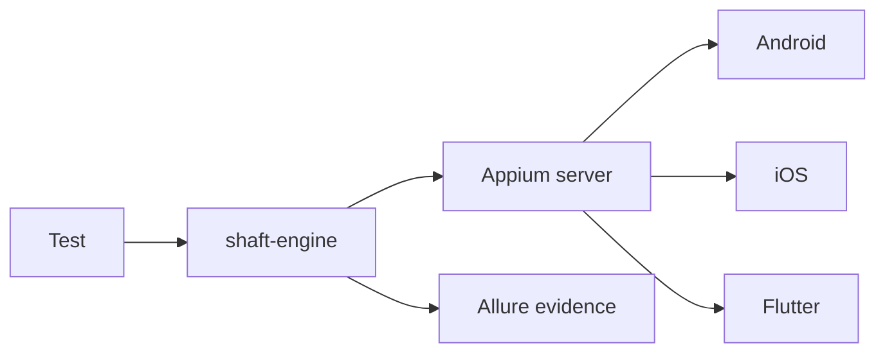

# Mobile and Flutter testing

SHAFT uses the same `SHAFT.GUI.WebDriver` facade for browser and Appium
sessions. Configure the Appium endpoint, platform, automation name, and app,
then create the driver normally.

```java
SHAFT.GUI.WebDriver driver = new SHAFT.GUI.WebDriver();

driver.element().touch()
        .tap(SHAFT.GUI.Locator.accessibilityId("Views"))
        .and()
        .assertThat(SHAFT.GUI.Locator.accessibilityId("Expandable Lists"))
        .exists();

driver.quit();
```



## Windows desktop apps

Windows desktop automation uses the existing Appium dependency in
`shaft-engine`; no optional module is required for locator-based Appium
sessions.

```java
SHAFT.Properties.platform.set()
        .targetPlatform("Windows")
        .executionAddress("http://127.0.0.1:4723");
SHAFT.Properties.web.set()
        .targetBrowserName("WindowsApp")
        .headlessExecution(false);
SHAFT.Properties.mobile.set()
        .browserName("")
        .automationName("Windows")
        .app("C:\\Windows\\System32\\notepad.exe");

new DriverFactory().getHelper(DriverFactory.DriverType.APPIUM_WINDOWS);
```

Install and start Appium with the Windows driver before running the test. Add
`shaft-sikulix` only when the test needs SikuliX image matching instead of
Appium locators.

## SHAFT MCP mobile automation

`shaft-mcp` can drive mobile sessions when an MCP client needs browser-style automation over Android or iOS targets:

- Use `driver_initialize` with `engine=mobile_web` for mobile web checks in a resized desktop browser, or `engine=mobile_native` for Appium-backed native Android or iOS execution. Both take a nested `mobileOptions` request (absorbing the former separate `mobile_initialize_web_emulation`/`mobile_initialize_native` tools) configuring `appiumServerUrl`, `platformName`, `automationName`, `deviceName`, and either `app`, Android `appPackage`/`appActivity`, or iOS `bundleId`.
- Use `mobile_get_contexts`, `mobile_switch_context`, `mobile_take_screenshot`, and `mobile_get_accessibility_tree` to inspect the live device screen before deciding what action to take.
- Use `element_click`, `element_type`, `element_clear`, `mobile_swipe`, rotation, keyboard, background, and app activation tools to perform actions through SHAFT Engine touch/mobile APIs -- these unified tools dispatch to the active mobile session and absorb the former `mobile_tap`, `mobile_type`, `mobile_clear`, `mobile_double_tap`, `mobile_long_tap`, `mobile_swipe_by_offset`, `mobile_swipe_coordinates`, `mobile_swipe_element_into_view`, and `mobile_swipe_text_into_view` tools. `mobile_tap_coordinates` and `mobile_swipe`'s coordinate escape hatch (`startX`/`startY`/`endX`/`endY`) are fallback-only actions; generated recordings warn that coordinate replay will probably fail when a locator cannot be resolved.
- Use `capture_start`, `capture_stop`, `capture_generate_replay`, `capture_code_blocks`, and `capture_record_at_target_code_blocks` to record, replay, and generate Java snippets that can be pasted into a SHAFT test or existing mobile page object -- these dispatch to the active mobile session, absorbing the former `mobile_record_start`/`mobile_record_stop`/`mobile_replay_recording`/`mobile_recording_code_blocks`/`mobile_record_at_target_code_blocks` tools. With `includeSensitiveValues=false` (the safe default), typed values are classified per field using the same deterministic privacy policy as web capture: password/token-like locators are redacted, while ordinary fields such as search boxes keep their values and remain replayable.
- Use `mobile_toolchain_status` before Inspector setup when the agent needs exact readiness details. The response keeps the quick availability booleans and adds structured dependency diagnostics with a stable dependency id, detected path or version when available, a failure cause, and repair guidance for Node.js, npm, Appium, the Appium Inspector plugin, Android SDK tools, emulator support, and iOS host constraints.
- Use `mobile_inspector_record_start` when the agent should launch a wrapped Appium Inspector recording session -- it now prepares and starts the session in one call, absorbing the former separate `mobile_inspector_record_prepare` tool. It lists connected Android devices from `adb devices -l`, reports cached Android emulators, surfaces the relevant toolchain diagnostic warnings and fixes, returns suggested capabilities, and includes a confirmation token. `mobile_inspector_record_status` returns the live recording status and, with an optional `action` (pause|resume|checkpoint|stop|discard), performs that control first -- absorbing the former separate `mobile_inspector_record_control` tool.

Generated mobile snippets use only SHAFT facade syntax: locators are emitted as
`SHAFT.GUI.Locator.*`, touch gestures are emitted through
`driver.element().touch()`, and assertions are emitted through
`driver.element().assertThat(...)`. `capture_code_blocks` returns the
replay method plus ranked mobile Page Object handoff blocks: locator inventory,
action sequence, and a draft Page Object. `capture_record_at_target_code_blocks`
adds focused locator fields and an action snippet for an existing Java source
anchor, so agents can merge a recording into the current page object instead of
pasting a generated class. The wrapped Appium Inspector recorder reads the
current accessibility tree/source and prefers Appium-style locators such as
accessibility id, id/resource-id, Android UiAutomator, and XPath before falling
back to coordinates.

For native execution, either connect a real Appium target or let `mobile_inspector_record_start` guide the agent through local setup. If no Android device is connected, SHAFT MCP can use a cached AVD or, after confirmation, install the user-cache Android command-line tools, Appium server, Inspector plugin, and Android driver, then create a Pixel 8 API 36 Google APIs emulator with the proposed RAM and CPU settings. When the recording stops, SHAFT-managed emulator and Appium processes are stopped and the same JSON recording plus replay-code flow used by `capture_stop` is returned. iOS recording attaches to an existing Appium/Xcode-capable target; SHAFT MCP does not create iOS simulators.

## Mobile failure trace evidence

Failed Appium touch actions are included in `shaft-trace.json` as `touch`
events. When available, SHAFT records the action name, locator or text target,
gesture parameters, platform, automation name, app package/activity or bundle
id, current context, orientation, and window size. If
`shaft.trace.includeNativePageSource=true`, failed native actions also include a
bounded, redacted native page-source excerpt.

```java
SHAFT.Properties.reporting.set()
        .traceEnabled(true)
        .traceIncludeNativePageSource(true);

driver.element().touch()
        .swipeElementIntoView("Pay now", "VERTICAL")
        .rotate("LANDSCAPE");
```

Context transitions are trace events too. A call such as
`driver.browser().setContext("WEBVIEW_checkout")` records the previous context,
requested context, and resulting context when the Appium provider supports
context inspection.

## Flutter applications

SHAFT Engine now supports automated testing of Flutter applications using the Appium Flutter Driver. This integration allows you to seamlessly test Flutter apps on both Android and iOS platforms.

## Prerequisites

### 1. Install Appium Server
First, install Appium with the Flutter driver plugin:

```bash
# Install Appium globally
npm install -g appium

# Install the Flutter driver plugin
appium driver install --source npm appium-flutter-driver
```

### 2. Verify Installation
Verify that the Flutter driver is installed:

```bash
appium driver list --installed
```

You should see `flutter` in the list of installed drivers.

### 3. Prepare Your Flutter App
Your Flutter app must be built in either **debug** or **profile** mode. The Appium Flutter Driver does **not** support release mode.

To enable Flutter driver integration in your app, add the following to your `main.dart`:

```dart
import 'package:flutter/material.dart';
import 'package:flutter_driver/driver_extension.dart';

void main() {
  // Enable Flutter Driver extension before calling runApp
  enableFlutterDriverExtension();
  
  runApp(MyApp());
}
```

Then build your app:

```bash
# For Android
flutter build apk --debug

# For iOS
flutter build ios --debug
```

## Usage in SHAFT Engine

### Basic Setup

To test a Flutter app using SHAFT Engine, you need to:

1. Set the automation name to `FlutterIntegration` (this automatically enables Flutter driver support)
2. Specify the app path or URL
3. Set up your Appium server connection

### Example Test Class

Here's a complete example of a Flutter test using SHAFT Engine with TestNG and FlutterFinder:

```java
package com.example.tests;

import com.shaft.driver.SHAFT;
import io.appium.java_client.remote.AutomationName;
import io.github.ashwith.flutter.FlutterFinder;
import org.openqa.selenium.Platform;
import org.openqa.selenium.WebElement;
import org.openqa.selenium.remote.RemoteWebDriver;
import org.testng.Assert;
import org.testng.annotations.AfterMethod;
import org.testng.annotations.BeforeMethod;
import org.testng.annotations.Test;

public class FlutterAppTest {
    private SHAFT.GUI.WebDriver driver;
    private FlutterFinder finder;

    @BeforeMethod
    public void setup() {
        // Set platform and automation name (Flutter driver is automatically enabled)
        SHAFT.Properties.platform.set().targetPlatform(Platform.ANDROID.name());
        SHAFT.Properties.mobile.set().automationName(AutomationName.FLUTTER_INTEGRATION);
        
        // Configure Appium server
        SHAFT.Properties.platform.set().executionAddress("localhost:4723");
        
        // Set app path (local file)
        SHAFT.Properties.mobile.set().app("path/to/your/app-debug.apk");
        
        // Initialize driver
        driver = new SHAFT.GUI.WebDriver();
        
        // Initialize FlutterFinder (requires RemoteWebDriver)
        finder = new FlutterFinder((RemoteWebDriver) driver.getDriver());
    }

    @Test
    public void testFlutterApp() {
        // Find element by ValueKey
        WebElement loginButton = finder.byValueKey("loginButton");
        loginButton.click();
        
        // Find element by text
        WebElement welcomeMessage = finder.byText("Welcome!");
        Assert.assertNotNull(welcomeMessage, "Welcome message should be displayed");
        
        // Find element by Type
        WebElement textField = finder.byType("TextField");
        Assert.assertNotNull(textField, "TextField should be found");
    }

    @AfterMethod
    public void teardown() {
        driver.quit();
    }
}
```

### Configuration Properties

You can configure Flutter testing using properties file or programmatically:

#### Properties File (custom.properties)
```properties
# Platform configuration
targetOperatingSystem=Android

# Automation name - setting this to FlutterIntegration automatically enables Flutter driver
mobile_automationName=FlutterIntegration

# Appium server
executionAddress=localhost:4723

# App configuration
mobile_app=src/test/resources/apps/my-flutter-app.apk

# Optional: Device configuration
mobile_deviceName=Android Emulator
mobile_platformVersion=13.0
```

#### Programmatic Configuration
```java
// Platform and automation - setting automationName to FLUTTER_INTEGRATION enables Flutter driver
SHAFT.Properties.platform.set().targetPlatform(Platform.ANDROID.name());
SHAFT.Properties.mobile.set().automationName(AutomationName.FLUTTER_INTEGRATION);

// Appium server
SHAFT.Properties.platform.set().executionAddress("localhost:4723");

// App path
SHAFT.Properties.mobile.set().app("path/to/app.apk");

// Optional device settings
SHAFT.Properties.mobile.set().deviceName("Android Emulator");
SHAFT.Properties.mobile.set().platformVersion("13.0");
```

## Locating Flutter Elements

When testing Flutter apps, you can use the FlutterFinder library to locate widgets. SHAFT Engine includes the `appium_flutterfinder_java` dependency (version 1.0.12) automatically.

### Common Flutter Locator Strategies

```java
import io.github.ashwith.flutter.FlutterFinder;
import org.openqa.selenium.WebElement;
import org.openqa.selenium.remote.RemoteWebDriver;

// Create a FlutterFinder instance (requires RemoteWebDriver)
FlutterFinder finder = new FlutterFinder((RemoteWebDriver) driver.getDriver());

// By value key (String)
WebElement element = finder.byValueKey("myButton");

// By value key (int)
WebElement element = finder.byValueKey(123);

// By text
WebElement element = finder.byText("Submit");

// By type (widget class name)
WebElement element = finder.byType("TextField");

// By tooltip
WebElement element = finder.byToolTip("Increment");

// By semantics label
WebElement element = finder.bySemanticsLabel("Login Button");

// Note: Refer to the FlutterFinder documentation for the complete list of available methods
// https://github.com/ashwithpoojary98/javaflutterfinder
```

### Working with FlutterFinder Elements

Once you have located an element using FlutterFinder, you can interact with it directly:

```java
import org.openqa.selenium.remote.RemoteWebDriver;

// Initialize FlutterFinder (requires RemoteWebDriver)
FlutterFinder finder = new FlutterFinder((RemoteWebDriver) driver.getDriver());

// Find and click a button
WebElement incrementButton = finder.byValueKey("increment");
incrementButton.click();

// Find and get text from an element
WebElement counterText = finder.byValueKey("counterDisplay");
String text = counterText.getText();

// Find by tooltip and interact
WebElement submitButton = finder.byToolTip("Submit");
submitButton.click();
```

### Using with SHAFT's Fluent API

You can integrate Flutter finders with SHAFT's fluent API:

```java
// Build a SHAFT locator
By loginButton = SHAFT.GUI.Locator.accessibilityId("loginButton");
By welcomeMessage = SHAFT.GUI.Locator.accessibilityId("welcomeMessage");

// Use with SHAFT's fluent element actions
driver.element()
      .type(SHAFT.GUI.Locator.accessibilityId("usernameField"), "username")
      .and().click(loginButton)
      .and().assertThat(welcomeMessage).text().contains("Welcome");
```

## Working with Flutter Widgets

### Text Input
```java
By usernameField = SHAFT.GUI.Locator.accessibilityId("usernameField");
driver.element().type(usernameField, "testuser");
```

### Button Clicks
```java
By loginButton = SHAFT.GUI.Locator.accessibilityId("loginButton");
driver.element().click(loginButton);
```

### Scrolling
```java
driver.element().touch().swipeElementIntoView(
    SHAFT.GUI.Locator.accessibilityId("targetWidget"),
    "DOWN"
);
```

### Assertions
```java
// Text assertion
driver.element()
      .assertThat(SHAFT.GUI.Locator.accessibilityId("statusMessage"))
      .text()
      .isEqualTo("Success");

// Visibility assertion
driver.element()
      .assertThat(SHAFT.GUI.Locator.accessibilityId("errorDialog"))
      .exists();
```

## Cloud Execution

SHAFT Engine's Flutter integration works seamlessly with cloud providers:

### BrowserStack

This direct SHAFT Appium path requires only `shaft-engine`. Add
`shaft-browserstack` only when the BrowserStack Java SDK must consume
`browserstack.yml` for SDK interception or orchestration.

```java
SHAFT.Properties.platform.set().executionAddress("browserstack");
SHAFT.Properties.browserStack.set().platformVersion("13.0");
SHAFT.Properties.browserStack.set().deviceName("Google Pixel 7");
SHAFT.Properties.browserStack.set().appRelativeFilePath("path/to/app.apk");
SHAFT.Properties.mobile.set().automationName(AutomationName.FLUTTER_INTEGRATION);
```

### LambdaTest
```java
SHAFT.Properties.platform.set().executionAddress("lambdatest");
SHAFT.Properties.lambdaTest.set().platformVersion("13.0");
SHAFT.Properties.lambdaTest.set().deviceName("Galaxy S21");
SHAFT.Properties.mobile.set().automationName(AutomationName.FLUTTER_INTEGRATION);
```

## Troubleshooting

### Common Issues

1. **"Could not find Flutter driver"**
   - Ensure the Flutter driver is installed: `appium driver install --source npm appium-flutter-driver`
   - Verify with: `appium driver list --installed`

2. **"Flutter driver extension not found"**
   - Make sure your app includes `enableFlutterDriverExtension()` in `main.dart`
   - App must be built in debug or profile mode, not release mode

3. **"Cannot find element"**
   - Ensure Flutter widgets have proper keys or accessibility labels
   - Use Flutter's `Key` widget: `Key('myButton')`
   - Add semantics: `Semantics(label: 'Submit Button', child: MyWidget())`

4. **Session creation fails**
   - Check that Appium server is running: `appium`
   - Verify the server address matches your configuration
   - Ensure the app path is correct and accessible

### Debug Mode

Enable debug logging to troubleshoot issues:

```properties
# In custom.properties
log4j_logLevel=DEBUG
```

Or programmatically:
```java
SHAFT.Properties.log4j.set().logLevel("DEBUG");
```

## Best Practices

1. **Use Meaningful Keys**: Always add keys to important Flutter widgets for easier element identification:
   ```dart
   ElevatedButton(
     key: Key('submitButton'),
     onPressed: () {},
     child: Text('Submit'),
   )
   ```

2. **Add Semantics**: Use semantics for better accessibility and test automation:
   ```dart
   Semantics(
     label: 'User Login Form',
     child: Form(...)
   )
   ```

3. **Wait for Elements**: SHAFT automatically handles waits, but you can configure timeout:
   ```java
   SHAFT.Properties.timeouts.set().elementIdentificationTimeout(30);
   ```

4. **Use Fluent API**: Leverage SHAFT's fluent API for readable tests:
   ```java
   driver.element()
         .type(usernameField, "user")
         .and().type(passwordField, "pass")
         .and().click(loginButton)
         .and().assertThat(dashboard).exists();
   ```

5. **Clean Up Resources**: Always quit the driver in teardown:
   ```java
   @AfterMethod(alwaysRun = true)
   public void teardown() {
       driver.quit();
   }
   ```

## Example Test Suite

Complete example with multiple tests using FlutterFinder:

```java
package com.example.tests;

import com.shaft.driver.SHAFT;
import io.appium.java_client.remote.AutomationName;
import io.github.ashwith.flutter.FlutterFinder;
import org.openqa.selenium.Platform;
import org.openqa.selenium.WebElement;
import org.openqa.selenium.remote.RemoteWebDriver;
import org.testng.Assert;
import org.testng.annotations.*;

public class FlutterAppTestSuite {
    private static SHAFT.GUI.WebDriver driver;
    private static FlutterFinder finder;

    @BeforeClass
    public void setupClass() {
        // Configure Flutter testing (automationName automatically enables Flutter driver)
        SHAFT.Properties.platform.set().targetPlatform(Platform.ANDROID.name());
        SHAFT.Properties.mobile.set().automationName(AutomationName.FLUTTER_INTEGRATION);
        SHAFT.Properties.platform.set().executionAddress("localhost:4723");
        SHAFT.Properties.mobile.set().app("src/test/resources/apps/flutter-demo.apk");
    }

    @BeforeMethod
    public void setup() {
        driver = new SHAFT.GUI.WebDriver();
        // Initialize FlutterFinder with RemoteWebDriver
        finder = new FlutterFinder((RemoteWebDriver) driver.getDriver());
    }

    @Test(description = "Verify successful login with valid credentials")
    public void testValidLogin() {
        // Find and interact with Flutter widgets using FlutterFinder
        WebElement usernameField = finder.byValueKey("usernameField");
        WebElement passwordField = finder.byValueKey("passwordField");
        WebElement loginButton = finder.byValueKey("loginButton");
        
        usernameField.sendKeys("testuser");
        passwordField.sendKeys("testpass");
        loginButton.click();
        
        // Verify navigation to dashboard
        WebElement dashboardTitle = finder.byText("Dashboard");
        Assert.assertNotNull(dashboardTitle, "Dashboard should be displayed");
    }

    @Test(description = "Verify error message with invalid credentials")
    public void testInvalidLogin() {
        WebElement usernameField = finder.byValueKey("usernameField");
        WebElement passwordField = finder.byValueKey("passwordField");
        WebElement loginButton = finder.byValueKey("loginButton");
        
        usernameField.sendKeys("wronguser");
        passwordField.sendKeys("wrongpass");
        loginButton.click();
        
        // Verify error message is displayed
        WebElement errorMessage = finder.byText("Invalid credentials");
        Assert.assertNotNull(errorMessage, "Error message should be displayed");
    }

    @Test(description = "Verify counter increment functionality")
    public void testCounterIncrement() {
        // Find the increment button by tooltip or value key
        WebElement incrementButton = finder.byToolTip("Increment");
        
        // Click the button
        incrementButton.click();
        
        // Verify button was clicked (counter should increment)
        // Note: Actual verification would check the counter text value
        Assert.assertNotNull(incrementButton, "Increment button should be functional");
    }

    @AfterMethod(alwaysRun = true)
    public void teardown() {
        if (driver != null) {
            driver.quit();
        }
    }
}
```

## Additional Resources

- [Appium Flutter Driver Documentation](https://github.com/appium-userland/appium-flutter-driver)
- [Flutter Testing Guide](https://flutter.dev/docs/testing)
- [SHAFT Engine Documentation](https://ShaftHQ.github.io/)
- [Flutter Finder Java Library](https://github.com/ashwithpoojary98/javaflutterfinder) - Package: `io.github.ashwithpoojary98`

## Support

For issues or questions:
- Open an issue on [GitHub](https://github.com/ShaftHQ/SHAFT_ENGINE/issues)
- Join our [Slack community](https://join.slack.com/t/shaft-engine/shared_invite/zt-oii5i2gg-0ZGnih_Y34NjK7QqDn01Dw)
- Check our [documentation](https://ShaftHQ.github.io/)

## Related

- [Testing overview](/docs/start/overview)
- [Features](/docs/features/modules)
