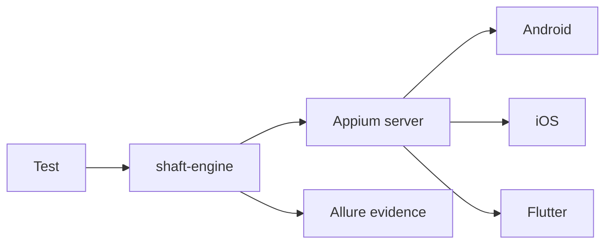

# Mobile and Flutter testing

SHAFT uses the same `SHAFT.GUI.WebDriver` facade for browser and Appium
sessions. Configure the Appium endpoint, platform, automation name, and app,
then create the driver normally.

```java
SHAFT.GUI.WebDriver driver = new SHAFT.GUI.WebDriver();

driver.element().touch()
        .tap(SHAFT.GUI.Locator.accessibilityId("Views"))
        .and()
        .assertThat(SHAFT.GUI.Locator.accessibilityId("Expandable Lists"))
        .exists();

driver.quit();
```


```mermaid
flowchart LR
    Test --> SHAFT["shaft-engine"]
    SHAFT --> Appium["Appium server"]
    Appium --> Android
    Appium --> iOS
    Appium --> Flutter
    SHAFT --> Report["Allure evidence"]
```

## Windows desktop apps

Windows desktop automation uses the existing Appium dependency in
`shaft-engine`; no optional module is required for locator-based Appium
sessions.

```java
SHAFT.Properties.platform.set()
        .targetPlatform("Windows")
        .executionAddress("http://127.0.0.1:4723");
SHAFT.Properties.web.set()
        .targetBrowserName("WindowsApp")
        .headlessExecution(false);
SHAFT.Properties.mobile.set()
        .browserName("")
        .automationName("Windows")
        .app("C:\\Windows\\System32\\notepad.exe");

new DriverFactory().getHelper(DriverFactory.DriverType.APPIUM_WINDOWS);
```

Install and start Appium with the Windows driver before running the test. Add
`shaft-sikulix` only when the test needs SikuliX image matching instead of
Appium locators.

## SHAFT MCP mobile automation

`shaft-mcp` can drive mobile sessions when an MCP client needs browser-style automation over Android or iOS targets:

- Use `driver_initialize` with `engine=mobile_web` for mobile web checks in a resized desktop browser, or `engine=mobile_native` for Appium-backed native Android or iOS execution. Both take a nested `mobileOptions` request (absorbing the former separate `mobile_initialize_web_emulation`/`mobile_initialize_native` tools) configuring `appiumServerUrl`, `platformName`, `automationName`, `deviceName`, and either `app`, Android `appPackage`/`appActivity`, or iOS `bundleId`.
- Use `mobile_get_contexts`, `mobile_switch_context`, `mobile_take_screenshot`, and `mobile_get_accessibility_tree` to inspect the live device screen before deciding what action to take.
- Use `element_click`, `element_type`, `element_clear`, `mobile_swipe`, rotation, keyboard, background, and app activation tools to perform actions through SHAFT Engine touch/mobile APIs -- these unified tools dispatch to the active mobile session and absorb the former `mobile_tap`, `mobile_type`, `mobile_clear`, `mobile_double_tap`, `mobile_long_tap`, `mobile_swipe_by_offset`, `mobile_swipe_coordinates`, `mobile_swipe_element_into_view`, and `mobile_swipe_text_into_view` tools. `mobile_tap_coordinates` and `mobile_swipe`'s coordinate escape hatch (`startX`/`startY`/`endX`/`endY`) are fallback-only actions; generated recordings warn that coordinate replay will probably fail when a locator cannot be resolved.
- Use `capture_start`, `capture_stop`, `capture_generate_replay`, `capture_code_blocks`, and `capture_record_at_target_code_blocks` to record, replay, and generate Java snippets that can be pasted into a SHAFT test or existing mobile page object -- these dispatch to the active mobile session, absorbing the former `mobile_record_start`/`mobile_record_stop`/`mobile_replay_recording`/`mobile_recording_code_blocks`/`mobile_record_at_target_code_blocks` tools. With `includeSensitiveValues=false` (the safe default), typed values are classified per field using the same deterministic privacy policy as web capture: password/token-like locators are redacted, while ordinary fields such as search boxes keep their values and remain replayable.
- Use `mobile_toolchain_status` before Inspector setup when the agent needs exact readiness details. The response keeps the quick availability booleans and adds structured dependency diagnostics with a stable dependency id, detected path or version when available, a failure cause, and repair guidance for Node.js, npm, Appium, the Appium Inspector plugin, Android SDK tools, emulator support, and iOS host constraints.
- Use `mobile_inspector_record_start` when the agent should launch a wrapped Appium Inspector recording session -- it now prepares and starts the session in one call, absorbing the former separate `mobile_inspector_record_prepare` tool. It lists connected Android devices from `adb devices -l`, reports cached Android emulators, surfaces the relevant toolchain diagnostic warnings and fixes, returns suggested capabilities, and includes a confirmation token. `mobile_inspector_record_status` returns the live recording status and, with an optional `action` (pause|resume|checkpoint|stop|discard), performs that control first -- absorbing the former separate `mobile_inspector_record_control` tool.

Generated mobile snippets use only SHAFT facade syntax: locators are emitted as
`SHAFT.GUI.Locator.*`, touch gestures are emitted through
`driver.element().touch()`, and assertions are emitted through
`driver.element().assertThat(...)`. `capture_code_blocks` returns the
replay method plus ranked mobile Page Object handoff blocks: locator inventory,
action sequence, and a draft Page Object. `capture_record_at_target_code_blocks`
adds focused locator fields and an action snippet for an existing Java source
anchor, so agents can merge a recording into the current page object instead of
pasting a generated class. The wrapped Appium Inspector recorder reads the
current accessibility tree/source and prefers Appium-style locators such as
accessibility id, id/resource-id, Android UiAutomator, and XPath before falling
back to coordinates.

For native execution, either connect a real Appium target or let `mobile_inspector_record_start` guide the agent through local setup. If no Android device is connected, SHAFT MCP can use a cached AVD or, after confirmation, install the user-cache Android command-line tools, Appium server, Inspector plugin, and Android driver, then create a Pixel 8 API 36 Google APIs emulator with the proposed RAM and CPU settings. When the recording stops, SHAFT-managed emulator and Appium processes are stopped and the same JSON recording plus replay-code flow used by `capture_stop` is returned. iOS recording attaches to an existing Appium/Xcode-capable target; SHAFT MCP does not create iOS simulators.

## Mobile failure trace evidence

Failed Appium touch actions are included in `shaft-trace.json` as `touch`
events. When available, SHAFT records the action name, locator or text target,
gesture parameters, platform, automation name, app package/activity or bundle
id, current context, orientation, and window size. If
`shaft.trace.includeNativePageSource=true`, failed native actions also include a
bounded, redacted native page-source excerpt.

```java
SHAFT.Properties.reporting.set()
        .traceEnabled(true)
        .traceIncludeNativePageSource(true);

driver.element().touch()
        .swipeElementIntoView("Pay now", "VERTICAL")
        .rotate("LANDSCAPE");
```

Context transitions are trace events too. A call such as
`driver.browser().setContext("WEBVIEW_checkout")` records the previous context,
requested context, and resulting context when the Appium provider supports
context inspection.

## Scroll to screenshot or OCR targets

CI jobs that use OCR should prewarm the exact model set through `shaft-cli setup plan/install/verify --profile OCR`, then run tests without relying on first-use network access. Repeat selected languages for readiness checks; install recovers them from the reviewed plan.

Use typed targets when native accessibility identifiers are unavailable. SHAFT
checks the current screenshot before every gesture and supports vertical and
horizontal searches in either direction:

```java
var image = ImageTarget.fromPath(Path.of("src/test/resources/pay.png"));
var text = OcrTarget.exact("Pay now");

driver.touch()
        .swipeElementIntoView(image, TouchActions.SwipeDirection.DOWN)
        .tap(image)
        .swipeElementIntoView(text, TouchActions.SwipeDirection.LEFT)
        .tap(text);
```

Pass a container locator first when the target is inside a nested list or
carousel:

```java
driver.touch().swipeElementIntoView(
        AppiumBy.id("checkout_carousel"),
        image,
        TouchActions.SwipeDirection.RIGHT);
```

Android uses Appium's `mobile: scrollGesture` boundary result. iOS and generic
touch sessions stop after the searched screenshot region remains unchanged.
SHAFT maps native screenshot pixels directly to touch coordinates and scales
mobile-web screenshots to the browser viewport.

## Read Android performance data

Use `driver.mobile().performance()` when the live Appium driver exposes its
performance-data interface. Check the provider's advertised types, then request
one tabular sample for the application package and type you need.

```java
var performance = driver.mobile().performance();

if (performance.supportedTypes().contains("memoryinfo")) {
    var sample = performance.sample("com.example.app", "memoryinfo");

    System.out.println(sample.columns());
    System.out.println(sample.rows());
}

performance.clear();
```

Each `MobilePerformanceSample` contains its capture time, application ID, data
type, columns, and rows. The model copies the provider table and exposes
immutable lists. `history()` returns an immutable snapshot of the newest 100
successful samples for that driver identity; `clear()` removes that session's
history.

:::warning
Performance data is available only when the live Appium driver implements the
exact performance-data interface. Android drivers normally expose it. iOS,
Windows, Mac2, generic, closed, and custom drivers without that interface fail
with `UnsupportedOperationException` instead of inferring support from a
platform name.
:::

When failure tracing is enabled and the call is not under nested trace
suppression, SHAFT records one backend-only `mobile/performance` event for each
operation. Events include counts, not the application ID, requested type,
columns, rows, or provider payload. Submitted and returned values are registered
with the failure-trace redactor before later reports are rendered.

## Record the mobile screen

Use `driver.mobile().recording()` when the live Appium driver supports screen
recording. Start one bounded recording, then stop it for decoded media bytes or
publish it to an exact local path.

```java
import com.shaft.gui.driver.MobileRecordingOptions;

import java.nio.file.Path;
import java.time.Duration;

var recording = driver.mobile().recording();
var options = new MobileRecordingOptions(
        Duration.ofSeconds(30),
        32L * 1024 * 1024);

recording.start(options);
// Exercise the mobile application.
Path saved = recording.stopAndSave(Path.of("artifacts", "mobile-recording.mp4"));
System.out.println(saved);
```

`start()` uses a three-minute provider limit and a 64 MiB decoded-result limit.
Explicit options accept one second through 30 minutes and one byte through 256
MiB. `stop()` returns a fresh byte array. `stopAndSave()` uses SHAFT's safe
exact-target publisher and returns the normalized target path.

Recording state belongs to the driver session and is shared with SHAFT's
automatic failure-video recorder. One owner cannot start over or stop the
other owner's recording. A failed provider start returns the session to idle;
a provider stop failure keeps ownership active so the same caller can retry.
Driver teardown closes the recording state without issuing another provider
command.

:::warning
The Appium Java interface does not guarantee that a remote provider implements
the screen-recording command. BrowserStack App Automate rejected the command on
the tested Android and iOS real-device paths, including Appium 3.3.0. Keep the
positive recording flow for a compatible Appium server; do not substitute a
provider's session-video feature for these returned bytes.
:::

When failure tracing is enabled and the call is not under nested trace
suppression, SHAFT records one backend-only `mobile/recording` event for each
public operation. Metadata contains only configured seconds or decoded byte
counts. Media, target paths, provider payloads, DOM, and screenshots are not
attached; target paths and provider failures are registered with the
failure-trace redactor before later reports are rendered.

## Capture a bounded mobile evidence archive

Use `driver.mobile().evidence()` to publish one bounded, redaction-aware
snapshot of the current live Appium session. Supply the exact ZIP target and
keep the returned immutable descriptor for typed log, performance, metadata,
omission, and artifact-reference access.

```java
import java.nio.file.Path;

var evidence = driver.mobile().evidence();
var bundle = evidence.capture(Path.of("artifacts", "mobile-evidence.zip"));

System.out.println(bundle.archive());
for (var artifact : bundle.artifacts()) {
    System.out.printf("%s: %s%n", artifact.kind(),
            artifact.omitted() ? "omitted" : artifact.path());
}
```

The archive contains `mobile-evidence.json` plus stable entries for the
current screenshot, current-context source, and the latest retained recording.
Each artifact reference resolves to content or to an explicit omission marker.
The descriptor also exposes immutable, redacted snapshots of SHAFT-owned mobile
logs and performance history. `omissions()` distinguishes unsupported,
not-started, empty, sensitive, oversized, provider-failed, active, missing, and
changed components, including changes during capture and the absence of a
retained recording, without copying provider messages.

Capture does not switch context, start or clear log collection, clear
performance history, or stop an active recording. A recording is eligible only
after `stopAndSave()` publishes it successfully. If the context changes during
capture, SHAFT discards the inconsistent screenshot and source. Capture and
driver teardown share one lifecycle boundary; once teardown wins that boundary,
the closed session cannot publish a stale archive.

The existing `shaft.trace.maxArtifactMb` setting is one aggregate limit for the
manifest and every archive entry. Text is UTF-8 byte-bounded, saved recordings
are verified by size and SHA-256 before copying, and the exact target uses
SHAFT's recoverable, symlink-safe publisher. Screenshot and source collection
also follow the existing sensitive-evidence suppression policy.

:::danger
Capture can replace the exact target you provide. The ZIP can contain
application screenshots, source, logs, performance values, and recording
bytes. Store and share it as sensitive test evidence. Use a test-specific
artifact path, and treat an omitted artifact as unavailable rather than reading
a provider-managed session video or another external file.
:::

When failure tracing is enabled and the call is not under nested trace
suppression, SHAFT records one backend-only `mobile/evidence` event for each
capture. Success metadata contains counts only. Archive paths, screenshot
pixels, source, logs, performance values, recording bytes, DOM, URLs,
attachments, and provider messages do not enter the event.

## Flutter applications

SHAFT Engine now supports automated testing of Flutter applications using the Appium Flutter Driver. This integration lets you test Flutter apps on both Android and iOS platforms.

## Prerequisites

### 1. Install Appium Server
First, install Appium with the Flutter driver plugin:

```bash
# Install Appium globally
npm install -g appium

# Install the Flutter driver plugin
appium driver install --source npm appium-flutter-driver
```

### 2. Verify Installation
Verify that the Flutter driver is installed:

```bash
appium driver list --installed
```

You should see `flutter` in the list of installed drivers.

### 3. Prepare Your Flutter App
Your Flutter app must be built in either **debug** or **profile** mode. The Appium Flutter Driver does **not** support release mode.

To enable Flutter driver integration in your app, add the following to your `main.dart`:

```dart
import 'package:flutter/material.dart';
import 'package:flutter_driver/driver_extension.dart';

void main() {
  // Enable Flutter Driver extension before calling runApp
  enableFlutterDriverExtension();
  
  runApp(MyApp());
}
```

Then build your app:

```bash
# For Android
flutter build apk --debug

# For iOS
flutter build ios --debug
```

## Usage in SHAFT Engine

### Basic Setup

To test a Flutter app using SHAFT Engine, you need to:

1. Set the automation name to `FlutterIntegration` (this automatically enables Flutter driver support)
2. Specify the app path or URL
3. Set up your Appium server connection

### Example Test Class

Use this complete Flutter example with TestNG and java-client's native Flutter
locators:

```java
package com.example.tests;

import com.shaft.driver.SHAFT;
import io.appium.java_client.AppiumBy;
import io.appium.java_client.remote.AutomationName;
import org.openqa.selenium.Platform;
import org.testng.annotations.AfterMethod;
import org.testng.annotations.BeforeMethod;
import org.testng.annotations.Test;

public class FlutterAppTest {
    private SHAFT.GUI.WebDriver driver;

    @BeforeMethod
    public void setup() {
        // Set platform and automation name (Flutter driver is automatically enabled)
        SHAFT.Properties.platform.set().targetPlatform(Platform.ANDROID.name());
        SHAFT.Properties.mobile.set().automationName(AutomationName.FLUTTER_INTEGRATION);
        
        // Configure Appium server
        SHAFT.Properties.platform.set().executionAddress("localhost:4723");
        
        // Set app path (local file)
        SHAFT.Properties.mobile.set().app("path/to/your/app-debug.apk");
        
        // Initialize driver. With automationName set to FLUTTER_INTEGRATION, SHAFT
        // constructs a FlutterAndroidDriver/FlutterIOSDriver under the hood, so
        // AppiumBy's native flutter* locators can be used directly via findElement().
        driver = new SHAFT.GUI.WebDriver();
    }

    @Test
    public void testFlutterApp() {
        driver.element().click(AppiumBy.flutterKey("loginButton"));
        
        driver.element().assertThat(AppiumBy.flutterText("Welcome!"))
                .exists();
        
        driver.element().assertThat(AppiumBy.flutterType("TextField"))
                .exists();
    }

    @AfterMethod
    public void teardown() {
        driver.quit();
    }
}
```

### Configuration Properties

You can configure Flutter testing using properties file or programmatically:

#### Properties File (custom.properties)
```properties
# Platform configuration
targetOperatingSystem=Android

# Automation name - setting this to FlutterIntegration automatically enables Flutter driver
mobile_automationName=FlutterIntegration

# Appium server
executionAddress=localhost:4723

# App configuration
mobile_app=src/test/resources/apps/my-flutter-app.apk

# Optional: Device configuration
mobile_deviceName=Android Emulator
mobile_platformVersion=13.0
```

#### Programmatic Configuration
```java
// Platform and automation - setting automationName to FLUTTER_INTEGRATION enables Flutter driver
SHAFT.Properties.platform.set().targetPlatform(Platform.ANDROID.name());
SHAFT.Properties.mobile.set().automationName(AutomationName.FLUTTER_INTEGRATION);

// Appium server
SHAFT.Properties.platform.set().executionAddress("localhost:4723");

// App path
SHAFT.Properties.mobile.set().app("path/to/app.apk");

// Optional device settings
SHAFT.Properties.mobile.set().deviceName("Android Emulator");
SHAFT.Properties.mobile.set().platformVersion("13.0");
```

## Locating Flutter Elements

When testing Flutter apps, use java-client's native `AppiumBy` `flutter*` factory
methods to locate widgets. They ship with the Appium dependency SHAFT Engine
already declares, so no additional dependency is required.

### Common Flutter Locator Strategies

```java
import io.appium.java_client.AppiumBy;
import org.openqa.selenium.WebElement;

// By value key
WebElement element = driver.getDriver().findElement(AppiumBy.flutterKey("myButton"));

// By text
WebElement element = driver.getDriver().findElement(AppiumBy.flutterText("Submit"));

// By type (widget class name)
WebElement element = driver.getDriver().findElement(AppiumBy.flutterType("TextField"));

// By semantics label (also covers what Flutter's Tooltip widget exposes as its
// tooltip message - there is no separate "by tooltip" locator)
WebElement element = driver.getDriver().findElement(AppiumBy.flutterSemanticsLabel("Login Button"));

// Note: Refer to the java-client AppiumBy documentation for the complete list of
// available flutter* factory methods.
// https://github.com/appium/java-client
```

### Working with Located Elements

Once you have located an element using a native `flutter*` locator, you can
interact with it directly - it is a standard Selenium `WebElement`:

```java
import io.appium.java_client.AppiumBy;

// Find and click a button
WebElement incrementButton = driver.getDriver().findElement(AppiumBy.flutterKey("increment"));
incrementButton.click();

// Find and get text from an element
WebElement counterText = driver.getDriver().findElement(AppiumBy.flutterKey("counterDisplay"));
String text = counterText.getText();

// Find by semantics label and interact
WebElement submitButton = driver.getDriver().findElement(AppiumBy.flutterSemanticsLabel("Submit"));
submitButton.click();
```

### Using with SHAFT's Fluent API

You can integrate Flutter finders with SHAFT's fluent API:

```java
// Build a SHAFT locator
By loginButton = SHAFT.GUI.Locator.accessibilityId("loginButton");
By welcomeMessage = SHAFT.GUI.Locator.accessibilityId("welcomeMessage");

// Use with SHAFT's fluent element actions
driver.element()
      .type(SHAFT.GUI.Locator.accessibilityId("usernameField"), "username")
      .and().click(loginButton)
      .and().assertThat(welcomeMessage).text().contains("Welcome");
```

## Working with Flutter Widgets

### Text Input
```java
By usernameField = SHAFT.GUI.Locator.accessibilityId("usernameField");
driver.element().type(usernameField, "testuser");
```

### Button Clicks
```java
By loginButton = SHAFT.GUI.Locator.accessibilityId("loginButton");
driver.element().click(loginButton);
```

### Scrolling
```java
driver.element().touch().swipeElementIntoView(
    SHAFT.GUI.Locator.accessibilityId("targetWidget"),
    "DOWN"
);
```

### Assertions
```java
// Text assertion
driver.element()
      .assertThat(SHAFT.GUI.Locator.accessibilityId("statusMessage"))
      .text()
      .isEqualTo("Success");

// Visibility assertion
driver.element()
      .assertThat(SHAFT.GUI.Locator.accessibilityId("errorDialog"))
      .exists();
```

## Cloud Execution

SHAFT Engine's Flutter integration works with these cloud providers:

### BrowserStack

This direct SHAFT Appium path requires only `shaft-engine`. Add
`shaft-browserstack` only when the BrowserStack Java SDK must consume
`browserstack.yml` for SDK interception or orchestration.

```java
SHAFT.Properties.platform.set().executionAddress("browserstack");
SHAFT.Properties.browserStack.set().platformVersion("13.0");
SHAFT.Properties.browserStack.set().deviceName("Google Pixel 7");
SHAFT.Properties.browserStack.set().appRelativeFilePath("path/to/app.apk");
SHAFT.Properties.mobile.set().automationName(AutomationName.FLUTTER_INTEGRATION);
```

### LambdaTest
```java
SHAFT.Properties.platform.set().executionAddress("lambdatest");
SHAFT.Properties.lambdaTest.set().platformVersion("13.0");
SHAFT.Properties.lambdaTest.set().deviceName("Galaxy S21");
SHAFT.Properties.mobile.set().automationName(AutomationName.FLUTTER_INTEGRATION);
```

## Troubleshooting

### Common Issues

1. **"Could not find Flutter driver"**
   - Ensure the Flutter driver is installed: `appium driver install --source npm appium-flutter-driver`
   - Verify with: `appium driver list --installed`

2. **"Flutter driver extension not found"**
   - Make sure your app includes `enableFlutterDriverExtension()` in `main.dart`
   - App must be built in debug or profile mode, not release mode

3. **"Cannot find element"**
   - Ensure Flutter widgets have proper keys or accessibility labels
   - Use Flutter's `Key` widget: `Key('myButton')`
   - Add semantics: `Semantics(label: 'Submit Button', child: MyWidget())`

4. **Session creation fails**
   - Check that Appium server is running: `appium`
   - Verify the server address matches your configuration
   - Ensure the app path is correct and accessible

### Debug Mode

Enable debug logging to troubleshoot issues:

```properties
# In src/main/resources/properties/log4j2.properties
logger.app.level=DEBUG
```

`logger.app.level` is a Log4j2 file setting. Keep it in the Log4j2 properties
file; it is not a typed `SHAFT.Properties` setting.

## Best Practices

1. **Use Meaningful Keys**: Always add keys to important Flutter widgets for easier element identification:
   ```dart
   ElevatedButton(
     key: Key('submitButton'),
     onPressed: () {},
     child: Text('Submit'),
   )
   ```

2. **Add Semantics**: Use semantics for better accessibility and test automation:
   ```dart
   Semantics(
     label: 'User Login Form',
     child: Form(...)
   )
   ```

3. **Wait for Elements**: SHAFT automatically handles waits, but you can configure timeout:
   ```java
   SHAFT.Properties.timeouts.set().defaultElementIdentificationTimeout(30);
   ```

4. **Use Fluent API**: SHAFT's fluent API makes tests more readable:
   ```java
   driver.element()
         .type(usernameField, "user")
         .and().type(passwordField, "pass")
         .and().click(loginButton)
         .and().assertThat(dashboard).exists();
   ```

5. **Clean Up Resources**: Always quit the driver in teardown:
   ```java
   @AfterMethod(alwaysRun = true)
   public void teardown() {
       driver.quit();
   }
   ```

## Example Test Suite

Complete example with multiple tests using native `AppiumBy` `flutter*` locators:

```java
package com.example.tests;

import com.shaft.driver.SHAFT;
import io.appium.java_client.AppiumBy;
import io.appium.java_client.remote.AutomationName;
import org.openqa.selenium.Platform;
import org.testng.annotations.*;

public class FlutterAppTestSuite {
    private static SHAFT.GUI.WebDriver driver;

    @BeforeClass
    public void setupClass() {
        // Configure Flutter testing (automationName automatically enables Flutter driver)
        SHAFT.Properties.platform.set().targetPlatform(Platform.ANDROID.name());
        SHAFT.Properties.mobile.set().automationName(AutomationName.FLUTTER_INTEGRATION);
        SHAFT.Properties.platform.set().executionAddress("localhost:4723");
        SHAFT.Properties.mobile.set().app("src/test/resources/apps/flutter-demo.apk");
    }

    @BeforeMethod
    public void setup() {
        driver = new SHAFT.GUI.WebDriver();
    }

    @Test(description = "Verify successful login with valid credentials")
    public void testValidLogin() {
        // Find and interact with Flutter widgets using native flutter* locators
        driver.element()
                .type(AppiumBy.flutterKey("usernameField"), "testuser")
                .type(AppiumBy.flutterKey("passwordField"), "testpass")
                .click(AppiumBy.flutterKey("loginButton"));
        
        driver.element().assertThat(AppiumBy.flutterText("Dashboard"))
                .exists();
    }

    @Test(description = "Verify error message with invalid credentials")
    public void testInvalidLogin() {
        driver.element()
                .type(AppiumBy.flutterKey("usernameField"), "wronguser")
                .type(AppiumBy.flutterKey("passwordField"), "wrongpass")
                .click(AppiumBy.flutterKey("loginButton"));
        
        driver.element().assertThat(AppiumBy.flutterText("Invalid credentials"))
                .exists();
    }

    @Test(description = "Verify counter increment functionality")
    public void testCounterIncrement() {
        // Find the increment button by its semantics label (Flutter's Tooltip
        // widget registers its message as a semantics label)
        driver.element().click(AppiumBy.flutterSemanticsLabel("Increment"));

        driver.element().assertThat(AppiumBy.flutterText("1"))
                .exists();
    }

    @AfterMethod(alwaysRun = true)
    public void teardown() {
        if (driver != null) {
            driver.quit();
        }
    }
}
```

## Related

- [Testing overview](/docs/start/overview)
- [Features](/docs/features/modules)
- [Appium Flutter Driver documentation](https://github.com/appium-userland/appium-flutter-driver)
- [Flutter testing guide](https://flutter.dev/docs/testing)
- [Appium Java client](https://github.com/appium/java-client) for native `AppiumBy.flutter*` locators
- [SHAFT Engine issues](https://github.com/ShaftHQ/SHAFT_ENGINE/issues)
- [SHAFT community Slack](https://join.slack.com/t/shaft-engine/shared_invite/zt-oii5i2gg-0ZGnih_Y34NjK7QqDn01Dw)
