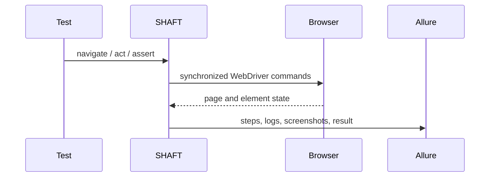

# Web testing

```java
import com.shaft.driver.SHAFT;
import org.openqa.selenium.By;
import org.testng.annotations.*;

public class SearchTest {
    private SHAFT.GUI.WebDriver driver;

    @BeforeMethod
    public void openBrowser() {
        driver = new SHAFT.GUI.WebDriver();
    }

    @Test
    public void search() {
        driver.browser().navigateToURL("https://duckduckgo.com/")
                .and().element().type(By.name("q"), "SHAFT Engine")
                .and().assertThat().title().contains("DuckDuckGo");
    }

    @AfterMethod(alwaysRun = true)
    public void closeBrowser() {
        driver.quit();
    }
}
```



Use the [GUI actions reference](/docs/reference/actions/GUI/Browser_Actions) for
locators, browser actions, elements, waits, validations, accessibility, and
network mocking.

## Playwright backend

Use `SHAFT.GUI.PlayWright` when a test should run through Microsoft Playwright
instead of Selenium/Appium WebDriver. Both backends implement
`SHAFT.GUI.Driver`, so setup code can choose the backend per test class.

```java
private SHAFT.GUI.Driver driver;

@BeforeMethod
public void openBrowser() {
    driver = new SHAFT.GUI.PlayWright();
}
```

See the [Playwright Backend](/docs/reference/actions/GUI/Playwright_Backend)
reference for configuration, native Playwright access, tracing, and the
WebDriver-to-Playwright mapping tree.

## Related

- [Browser Actions](/docs/reference/actions/GUI/Browser_Actions)
- [Element Actions](/docs/reference/actions/GUI/Element_Actions)
- [Playwright Backend](/docs/reference/actions/GUI/Playwright_Backend)
- [Overview](/docs/reference/actions/Validations/Overview)
