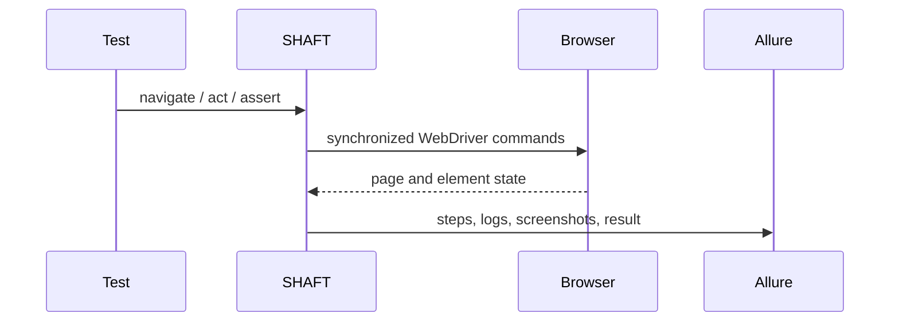

# Web testing

```java
import com.shaft.driver.SHAFT;
import org.openqa.selenium.By;
import org.testng.annotations.*;

public class SearchTest {
    private SHAFT.GUI.WebDriver driver;

    @BeforeMethod
    public void openBrowser() {
        driver = new SHAFT.GUI.WebDriver();
    }

    @Test
    public void search() {
        driver.browser().navigateToURL("https://duckduckgo.com/")
                .and().element().type(By.name("q"), "SHAFT Engine")
                .and().assertThat().title().contains("DuckDuckGo");
    }

    @AfterMethod(alwaysRun = true)
    public void closeBrowser() {
        driver.quit();
    }
}
```



Use the [GUI actions reference](/docs/reference/actions/GUI/Browser_Actions) for
locators, browser actions, elements, waits, validations, accessibility, and
network mocking.
