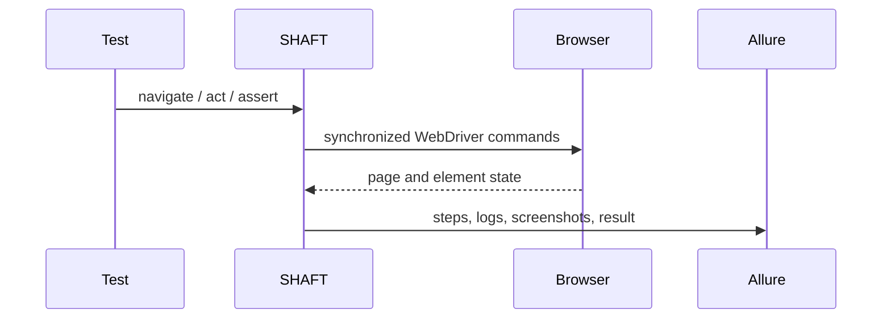

import {AllureReportPath, FirstRunCommand} from '@site/src/components/DocSnippets';

# Web testing

Start here when you want one browser test that opens a page, performs an
action, asserts a result, and leaves screenshot/report evidence.

```java
import com.shaft.driver.SHAFT;
import org.openqa.selenium.By;
import org.testng.annotations.*;

public class SearchTest {
    private SHAFT.GUI.WebDriver driver;

    @BeforeMethod
    public void openBrowser() {
        driver = new SHAFT.GUI.WebDriver();
    }

    @Test
    public void search() {
        driver.browser().navigateToURL("https://duckduckgo.com/")
                .and().element().type(By.name("q"), "SHAFT Engine")
                .and().assertThat().title().contains("DuckDuckGo");
    }

    @AfterMethod(alwaysRun = true)
    public void closeBrowser() {
        driver.quit();
    }
}
```



Use the [GUI actions reference](/docs/reference/actions/GUI/Browser_Actions) for
locators, browser actions, elements, waits, validations, accessibility, and
network mocking. For browser traffic that should be captured and replayed
later, see [UI and API contract replay](/docs/testing/contracts).

## Run and inspect evidence

Run the generated or copied test from the project root:

<FirstRunCommand />

The report includes browser steps, screenshots, logs, and assertion results
under <AllureReportPath />. If the browser never opens, check Java/Maven first,
then browser installation, then `targetBrowserName` and `headlessExecution`.

## Locator strategy

Use the most user-facing locator that is stable enough for the product:

1. Prefer semantic locators such as visible text, labels, placeholders, and ARIA
   names.
2. Use `SHAFT.GUI.Locator` when you need a precise composed locator.
3. Keep waits and retries as evidence-backed safety nets, not as a substitute
   for a stable locator.
4. Use [SHAFT Heal](/docs/agentic/heal) only after deterministic locator
   strategies cannot survive expected UI changes.

## Playwright backend

Use `SHAFT.GUI.Playwright` when a test should run through Microsoft Playwright
instead of Selenium/Appium WebDriver. Both backends implement
`SHAFT.GUI.Driver`, so setup code can choose the backend per test class.

```java
private SHAFT.GUI.Driver driver;

@BeforeMethod
public void openBrowser() {
    driver = new SHAFT.GUI.Playwright();
}
```

See the [Playwright Backend](/docs/reference/actions/GUI/Playwright_Backend)
reference for configuration, native Playwright access, tracing, and the
WebDriver-to-Playwright mapping tree.

## Related

- [Browser Actions](/docs/reference/actions/GUI/Browser_Actions)
- [Element Actions](/docs/reference/actions/GUI/Element_Actions)
- [Playwright Backend](/docs/reference/actions/GUI/Playwright_Backend)
- [UI and API contract replay](/docs/testing/contracts)
- [Overview](/docs/reference/actions/Validations/Overview)
