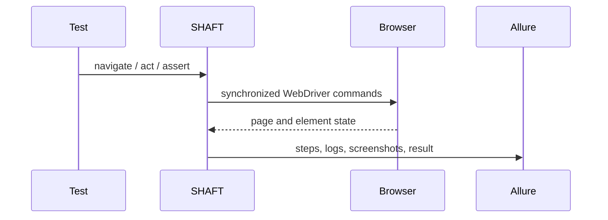

import {AllureReportPath, FirstRunCommand} from '@site/src/components/DocSnippets';

# Web testing

Start here when you want one browser test that opens a page, performs an
action, asserts a result, and leaves screenshot/report evidence.

```java
import com.shaft.driver.SHAFT;
import org.openqa.selenium.By;
import org.testng.annotations.*;

public class SearchTest {
    private SHAFT.GUI.WebDriver driver;

    @BeforeMethod
    public void openBrowser() {
        driver = new SHAFT.GUI.WebDriver();
    }

    @Test
    public void search() {
        driver.browser().navigateToURL("https://duckduckgo.com/")
                .and().element().type(By.name("q"), "SHAFT Engine")
                .and().assertThat().title().contains("DuckDuckGo");
    }

    @AfterMethod(alwaysRun = true)
    public void closeBrowser() {
        driver.quit();
    }
}
```


```mermaid
sequenceDiagram
    participant Test
    participant SHAFT
    participant Browser
    participant Allure
    Test->>SHAFT: navigate / act / assert
    SHAFT->>Browser: synchronized WebDriver commands
    Browser-->>SHAFT: page and element state
    SHAFT->>Allure: steps, logs, screenshots, result
```

Use the [GUI actions reference](/docs/reference/actions/GUI/Browser_Actions) for
locators, browser actions, elements, waits, validations, accessibility, and
network mocking. For browser traffic that should be captured and replayed
later, see [UI and API contract replay](/docs/testing/contracts).

## Run and inspect evidence

Run the generated or copied test from the project root:

<FirstRunCommand />

The report includes browser steps, screenshots, logs, and assertion results
under <AllureReportPath />. If the browser never opens, check Java/Maven first,
then browser installation, then `targetBrowserName` and `headlessExecution`.

## Locator strategy

Stop at the first unique match. Generated and repository web code uses this
ladder:

1. A unique, author-written `id` through the SHAFT locator builder:
   `SHAFT.GUI.Locator.hasAnyTagName().hasId("checkout-submit").build()`.
   Never a framework-recycled id such as `:r1:`, `mat-input-3`,
   `cdk-overlay-0`, `ember1234`, `j_idt42`, `ctl00_...`, or `sc-bdVaJa`.
2. The same builder's ARIA role, chained until unique:
   `SHAFT.GUI.Locator.hasRole(Role.BUTTON).hasNormalizedText("Create Account").build()`.
3. Native relative `By.xpath(...)` only when the element has neither an
   eligible id nor a usable role.

Never generate `SHAFT.GUI.Locator.xpath(...)`, the raw
`SHAFT.GUI.Locator.id/name/cssSelector/className/tagName(...)` factories, or a
Smart Locator (`inputField` / `clickableField`) in generated or repository
code. Smart Locators stay legitimate only for a human's throwaway exploration
snippet. See [Locators and self-healing](/docs/reference/actions/GUI/Locators_And_Self_Healing#generated-locator-policy).

Keep waits and retries as evidence-backed safety nets, not as a substitute
for a stable locator. Use [SHAFT Heal](/docs/agentic/heal) only after
deterministic locator strategies cannot survive expected UI changes.

## Playwright backend

Use `SHAFT.GUI.Playwright` when a test should run through Microsoft Playwright
instead of Selenium/Appium WebDriver. Both backends implement
`SHAFT.GUI.Driver`, so setup code can choose the backend per test class.

```java
private SHAFT.GUI.Driver driver;

@BeforeMethod
public void openBrowser() {
    driver = new SHAFT.GUI.Playwright();
}
```

See the [Playwright Backend](/docs/reference/actions/GUI/Playwright_Backend)
reference for configuration, native Playwright access, tracing, and the
WebDriver-to-Playwright mapping tree.

## Click and type by control kind

`element().click(...)` and `element().type(...)` keep the same fluent API, but
SHAFT now classifies the target control and picks a safer recipe automatically
(Selenium, Playwright, Appium mobile, and Windows/UIA desktop).

You do not opt in. Public calls stay unchanged. Typical routing:

- Text-like inputs and textareas: clear strategy (see `clearBeforeTypingMode`) then type; Playwright prefers `fill`, and uses sequential keys when masks/debounce need key events
- Checkbox / radio / switch: click or toggle, never type
- Select / listbox / combobox: option or expand → filter → confirm — not blind `sendKeys` of the label alone
- File inputs: set files via the file path API
- Overlay / interception: scroll and retry before optional JS click (`clickUsingJavascriptWhenWebDriverClickFails`)
- Mobile: focus → `sendKeys` / `mobile: type` / hide-keyboard helpers; Compose/Flutter need focus (and tags/semantics) before type
- Windows desktop (WinAppDriver): UIA control-type map for Edit, Button, CheckBox, ComboBox, and related kinds

Flags such as `attemptToClickBeforeTyping`, `clearBeforeTypingMode`, and
`clickUsingJavascriptWhenWebDriverClickFails` still apply when you need to tune
the defaults. Maintainer detail lives in
`com.shaft.gui.element.internal.interaction` (`ElementClassifier`,
`ClickStrategies`, `TypeStrategies`) from epic
[#5732](https://github.com/ShaftHQ/SHAFT_ENGINE/issues/5732).

## Related

- [Browser Actions](/docs/reference/actions/GUI/Browser_Actions)
- [Element Actions](/docs/reference/actions/GUI/Element_Actions)
- [Playwright Backend](/docs/reference/actions/GUI/Playwright_Backend)
- [UI and API contract replay](/docs/testing/contracts)
- [Validations](/docs/reference/actions/Validations)
