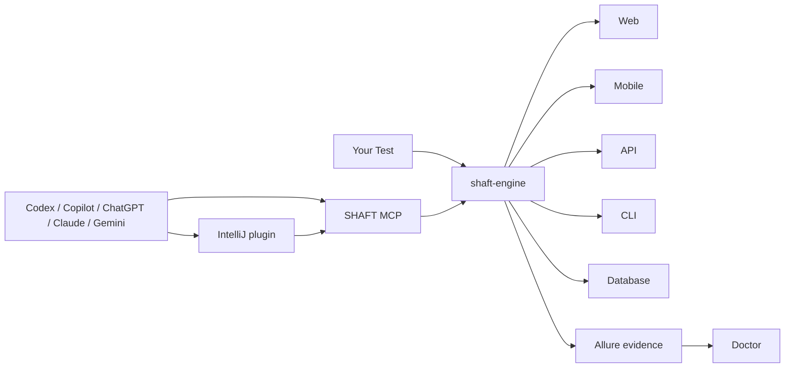

# SHAFT at a glance

One Java automation engine for Web, Mobile, API, CLI, and Database testing.

Canonical HTML: https://shafthq.github.io/docs/start/overview
Guide index: https://shafthq.github.io/llms.txt

# One engine. Every test surface.

SHAFT is a Maven-published Java automation framework that combines browser,
mobile, API, terminal, database, validation, evidence, and reporting workflows
behind one fluent API.

 
 Web Selenium sessions, resilient actions, assertions, screenshots, and reports. 
 Mobile Appium native, mobile web, Android, iOS, and Flutter workflows. 
 API REST Assured requests, authentication, extraction, schema checks, and assertions. 
 IntelliJ coding partner Record, refactor, reuse Page Objects, diagnose failures, and call MCP from the IDE. 
 



## Watch SHAFT in 100 seconds

Why teams choose SHAFT for new Java test automation, and how an existing
Selenium suite adopts it without a rewrite. English captions are on by default;
the video never plays until you start it.

 
 
 
 

- **0:00** Red build: bug or flaky test?
- **0:20** One engine on proven tools
- **0:36** Waits, reports and scale built in
- **0:57** Upgrade an existing suite
- **1:16** Open source, and how to start

The narration uses a synthetic voice. A 9:16 cut, full-quality masters,
captions, and a source for every number are on the
[SHAFT feature video release](https://github.com/ShaftHQ/SHAFT_ENGINE/releases/tag/shaft-feature-video-v2-20261009).

## Start in 90 seconds

Use the [SHAFT Project Generator](/docs/start/installation) to choose your test
runner and testing surfaces, then download a ready-to-run project. Run it from
the project root:

 

A SHAFT web step reads like this:

```java
SHAFT.GUI.WebDriver driver = new SHAFT.GUI.WebDriver();
driver.browser().navigateToURL("https://example.com");
driver.element().click(By.id("submit"));
```

 

If the generated sample runs and the report gives you the evidence you expected,
 before you leave the guide.

## Why teams use SHAFT

- One lifecycle and reporting model across test surfaces.
- Built-in synchronization, screenshots, logging, and Allure evidence.
- TestNG, JUnit, and Cucumber integration.
- Optional modules are explicit; projects pay only for the capabilities they use.
- Deterministic Capture, Doctor, and Heal workflows operate without a model provider.

SHAFT is listed in the
[Selenium ecosystem](https://www.selenium.dev/ecosystem/#frameworks) and received
a [Google Open Source Peer Bonus](https://opensource.googleblog.com/2023/05/google-open-source-peer-bonus-program-announces-first-group-of-winners-2023.html).

## Choose your path

The guide home is [Choose a path](/docs/journeys). Use that list. The table below matches the same jobs.

| Goal | Go directly to |
|---|---|
| Create a new project | [Project Generator](/docs/start/installation) |
| Find features added since modularization | [What's new](/docs/features/whats-new) |
| Run the first test | [Quick start](/docs/start/quick-start) |
| See where the evidence and reports come from | [Reporting and evidence](/docs/features/reporting) |
| Run the suite in a pipeline | [CI/CD Integration](/docs/reference/guides/CI_CD_Integration) |
| Use SHAFT from IntelliJ | [IntelliJ IDEA plugin](/docs/agentic/intellij) |
| Connect another AI coding agent | [SHAFT MCP](/docs/agentic/mcp) |
| Diagnose a failed run | [SHAFT Doctor](/docs/agentic/doctor) |
| Recover a changed locator | [SHAFT Heal](/docs/agentic/heal) |
| Upgrade a Selenium, Appium, REST Assured, or older SHAFT project | [Automated upgrade tool](/docs/start/upgrade) |

## Related

- [Installation](/docs/start/installation)
- [Quick Start](/docs/start/quick-start)
- [Reporting and evidence](/docs/features/reporting)
- [CI/CD Integration](/docs/reference/guides/CI_CD_Integration)
- [Upgrade](/docs/start/upgrade)
- [Modules](/docs/features/modules)
- [What's new](/docs/features/whats-new)
